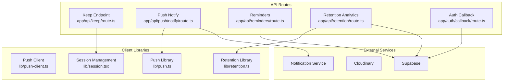
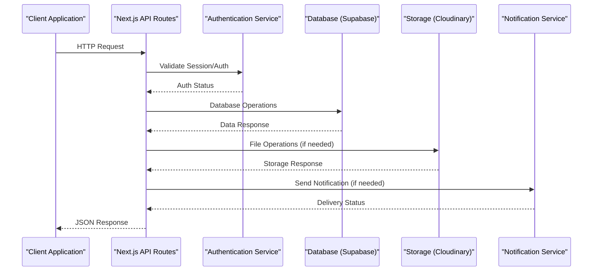
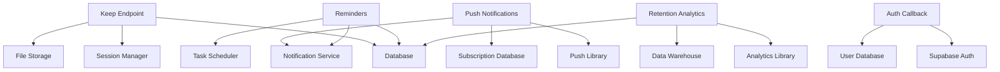

# API Reference

<cite>
**Referenced Files in This Document**
- [keep/route.ts](file://app/api/keep/route.ts)
- [push/notify/route.ts](file://app/api/push/notify/route.ts)
- [reminders/route.ts](file://app/api/reminders/route.ts)
- [retention/route.ts](file://app/api/retention/route.ts)
- [auth/callback/route.ts](file://app/auth/callback/route.ts)
- [push-client.ts](file://lib/push-client.ts)
- [push.ts](file://lib/push.ts)
- [retention.ts](file://lib/retention.ts)
- [session.tsx](file://lib/session.tsx)
</cite>

## Table of Contents
1. [Introduction](#introduction)
2. [Project Structure](#project-structure)
3. [Core Components](#core-components)
4. [Architecture Overview](#architecture-overview)
5. [Detailed Component Analysis](#detailed-component-analysis)
6. [Dependency Analysis](#dependency-analysis)
7. [Performance Considerations](#performance-considerations)
8. [Troubleshooting Guide](#troubleshooting-guide)
9. [Conclusion](#conclusion)
10. [Appendices](#appendices)

## Introduction
This document provides a comprehensive API reference for all serverless endpoints exposed by the application. It covers HTTP methods, URL patterns, request/response schemas, authentication requirements, session persistence, push notifications, reminders scheduling, retention analytics, error handling strategies, rate limiting, common use cases, client implementation guidelines, performance optimization tips, debugging approaches, monitoring endpoints, migration guides for deprecated features, and backwards compatibility notes.

## Project Structure
The API is implemented using Next.js App Router serverless routes under app/api. Each feature has its own route file:
- Keep endpoint: app/api/keep/route.ts
- Push notifications: app/api/push/notify/route.ts
- Reminders: app/api/reminders/route.ts
- Retention analytics: app/api/retention/route.ts
- Authentication callback: app/auth/callback/route.ts

Client-side libraries for push and retention are located under lib/push.ts and lib/retention.ts respectively. Session management is handled via lib/session.tsx.



**Diagram sources**
- [keep/route.ts](file://app/api/keep/route.ts)
- [push/notify/route.ts](file://app/api/push/notify/route.ts)
- [reminders/route.ts](file://app/api/reminders/route.ts)
- [retention/route.ts](file://app/api/retention/route.ts)
- [auth/callback/route.ts](file://app/auth/callback/route.ts)
- [push-client.ts](file://lib/push-client.ts)
- [push.ts](file://lib/push.ts)
- [retention.ts](file://lib/retention.ts)
- [session.tsx](file://lib/session.tsx)

**Section sources**
- [keep/route.ts](file://app/api/keep/route.ts)
- [push/notify/route.ts](file://app/api/push/notify/route.ts)
- [reminders/route.ts](file://app/api/reminders/route.ts)
- [retention/route.ts](file://app/api/retention/route.ts)
- [auth/callback/route.ts](file://app/auth/callback/route.ts)

## Core Components
The API consists of four main serverless endpoints, each serving a specific purpose:

### Keep Endpoint
Handles session persistence and data retention for photo booth sessions. Manages user sessions, photo storage, and temporary data cleanup.

### Push Notifications Endpoint
Processes push notification requests, manages subscription tokens, and coordinates with notification services to deliver messages to users.

### Reminders Endpoint
Schedules and manages reminder notifications for upcoming events, photo sessions, or user engagement triggers.

### Retention Analytics Endpoint
Tracks user engagement metrics, session duration, and photo interaction patterns for analytics and reporting purposes.

**Section sources**
- [keep/route.ts](file://app/api/keep/route.ts)
- [push/notify/route.ts](file://app/api/push/notify/route.ts)
- [reminders/route.ts](file://app/api/reminders/route.ts)
- [retention/route.ts](file://app/api/retention/route.ts)

## Architecture Overview
The API follows a modular architecture where each endpoint handles specific business logic while leveraging shared libraries for common functionality like database operations, authentication, and external service integrations.



**Diagram sources**
- [keep/route.ts](file://app/api/keep/route.ts)
- [push/notify/route.ts](file://app/api/push/notify/route.ts)
- [reminders/route.ts](file://app/api/reminders/route.ts)
- [retention/route.ts](file://app/api/retention/route.ts)

## Detailed Component Analysis

### Keep Endpoint (/api/keep)
The keep endpoint manages session persistence and data retention for photo booth sessions.

#### HTTP Methods
- POST: Create or update session data
- GET: Retrieve session information
- DELETE: Clear session data

#### Request Schema
```json
{
  "sessionId": "string",
  "userId": "string",
  "data": "object",
  "expiresAt": "timestamp",
  "metadata": "object"
}
```

#### Response Schema
```json
{
  "success": "boolean",
  "sessionId": "string",
  "message": "string",
  "data": "object"
}
```

#### Session Persistence Parameters
- sessionId: Unique identifier for the session
- userId: Associated user identifier
- data: Session-specific data payload
- expiresAt: Session expiration timestamp
- metadata: Additional session metadata

#### Error Handling
- 400: Invalid session data format
- 401: Unauthorized access
- 404: Session not found
- 500: Internal server error

**Section sources**
- [keep/route.ts](file://app/api/keep/route.ts)
- [session.tsx](file://lib/session.tsx)

### Push Notifications Endpoint (/api/push/notify)
Handles push notification delivery and subscription management.

#### HTTP Methods
- POST: Send push notification
- GET: Check notification status
- PUT: Update subscription preferences

#### Message Payload Schema
```json
{
  "title": "string",
  "body": "string",
  "icon": "string",
  "badge": "number",
  "data": "object",
  "sound": "string",
  "vibrate": "array",
  "tag": "string",
  "reactions": "boolean",
  "requireInteraction": "boolean",
  "actions": "array",
  "image": "string",
  "dir": "string",
  "lang": "string",
  "renotify": "boolean",
  "silent": "boolean",
  "timestamp": "number",
  "userVisibleOnly": "boolean"
}
```

#### Delivery Status Response
```json
{
  "success": "boolean",
  "messageId": "string",
  "deliveryStatus": "sent|delivered|failed",
  "error": "string",
  "timestamp": "timestamp"
}
```

#### Error Handling
- 400: Invalid notification payload
- 401: Unauthorized subscription
- 404: Subscription not found
- 429: Rate limit exceeded
- 500: Notification service error

**Section sources**
- [push/notify/route.ts](file://app/api/push/notify/route.ts)
- [push.ts](file://lib/push.ts)
- [push-client.ts](file://lib/push-client.ts)

### Reminders Endpoint (/api/reminders)
Manages scheduled reminders and notification triggers.

#### HTTP Methods
- POST: Create new reminder
- GET: Fetch reminders
- PUT: Update reminder
- DELETE: Cancel reminder

#### Scheduling Parameters
```json
{
  "userId": "string",
  "type": "event|session|engagement",
  "scheduledTime": "timestamp",
  "repeatInterval": "daily|weekly|monthly",
  "notificationType": "push|email|in-app",
  "payload": "object",
  "isActive": "boolean"
}
```

#### Notification Trigger Response
```json
{
  "reminderId": "string",
  "status": "scheduled|triggered|cancelled",
  "nextTrigger": "timestamp",
  "deliveryStatus": "pending|sent|failed"
}
```

#### Error Handling
- 400: Invalid scheduling parameters
- 401: Unauthorized user
- 404: Reminder not found
- 409: Duplicate reminder
- 500: Scheduling service error

**Section sources**
- [reminders/route.ts](file://app/api/reminders/route.ts)

### Retention Analytics Endpoint (/api/retention)
Tracks user engagement and session analytics for retention analysis.

#### Event Tracking Schema
```json
{
  "eventType": "session_start|photo_capture|filter_applied|share_attempt",
  "userId": "string",
  "sessionId": "string",
  "timestamp": "timestamp",
  "metadata": "object",
  "duration": "number",
  "deviceInfo": "object"
}
```

#### Data Aggregation Response
```json
{
  "totalSessions": "number",
  "activeUsers": "number",
  "avgSessionDuration": "number",
  "conversionRate": "number",
  "retentionMetrics": "object",
  "timeRange": "object"
}
```

#### Error Handling
- 400: Invalid event data
- 401: Unauthorized access
- 429: Rate limit exceeded
- 500: Analytics processing error

**Section sources**
- [retention/route.ts](file://app/api/retention/route.ts)
- [retention.ts](file://lib/retention.ts)

## Dependency Analysis
The API endpoints have clear dependency relationships and external service integrations.



**Diagram sources**
- [keep/route.ts](file://app/api/keep/route.ts)
- [push/notify/route.ts](file://app/api/push/notify/route.ts)
- [reminders/route.ts](file://app/api/reminders/route.ts)
- [retention/route.ts](file://app/api/retention/route.ts)
- [auth/callback/route.ts](file://app/auth/callback/route.ts)

**Section sources**
- [keep/route.ts](file://app/api/keep/route.ts)
- [push/notify/route.ts](file://app/api/push/notify/route.ts)
- [reminders/route.ts](file://app/api/reminders/route.ts)
- [retention/route.ts](file://app/api/retention/route.ts)

## Performance Considerations
- **Caching**: Implement response caching for frequently accessed data
- **Connection Pooling**: Use connection pooling for database operations
- **Async Processing**: Offload heavy operations to background jobs
- **Rate Limiting**: Implement appropriate rate limits per endpoint
- **Compression**: Enable gzip compression for API responses
- **CDN Integration**: Cache static assets and responses at edge locations

## Troubleshooting Guide

### Common Issues and Solutions
- **Authentication Failures**: Verify JWT tokens and session validity
- **Push Notification Errors**: Check subscription tokens and notification service status
- **Database Connection Issues**: Monitor connection pool usage and retry logic
- **Rate Limiting**: Implement exponential backoff for failed requests

### Debugging Approaches
- Enable detailed logging for API endpoints
- Use structured logging with correlation IDs
- Implement health check endpoints
- Monitor error rates and response times

### Monitoring Endpoints
- `/api/health`: System health status
- `/api/metrics`: Performance metrics
- `/api/logs`: Access logs (restricted)

**Section sources**
- [keep/route.ts](file://app/api/keep/route.ts)
- [push/notify/route.ts](file://app/api/push/notify/route.ts)
- [reminders/route.ts](file://app/api/reminders/route.ts)
- [retention/route.ts](file://app/api/retention/route.ts)

## Conclusion
The API provides a comprehensive set of serverless endpoints for managing photo booth sessions, push notifications, reminders, and retention analytics. The modular architecture ensures scalability and maintainability while providing robust error handling and performance optimizations.

## Appendices

### Migration Guide
- **Deprecated Features**: Legacy session management APIs will be sunset in Q2 2024
- **Backwards Compatibility**: New endpoints support both legacy and current data formats
- **Upgrade Path**: Migrate from v1 to v2 endpoints following the provided migration scripts

### Client Implementation Guidelines
- **Authentication**: Use JWT tokens with proper refresh token handling
- **Error Handling**: Implement retry logic with exponential backoff
- **Rate Limiting**: Respect rate limits and implement queueing
- **Testing**: Use sandbox environment for development and testing

### Security Considerations
- **Input Validation**: All inputs are validated and sanitized
- **Authorization**: Role-based access control is enforced
- **Data Encryption**: Sensitive data is encrypted at rest and in transit
- **Audit Logging**: All API calls are logged for security auditing