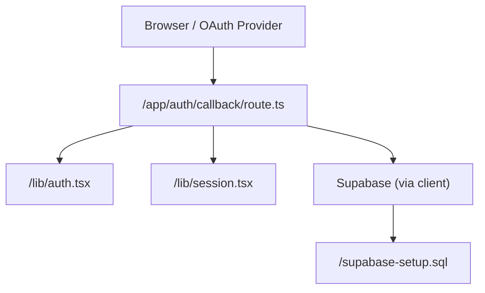
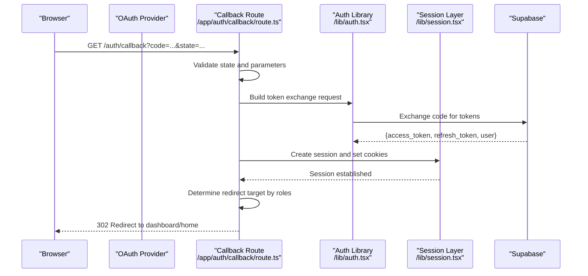
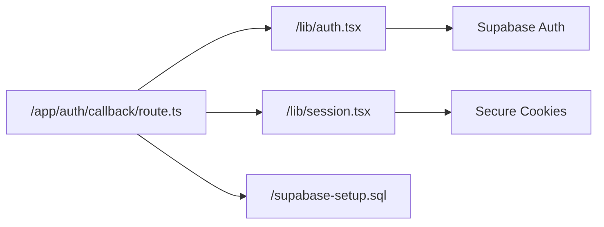

# Authentication Callback API

<cite>
**Referenced Files in This Document**
- [route.ts](file://app/auth/callback/route.ts)
- [auth.tsx](file://lib/auth.tsx)
- [session.tsx](file://lib/session.tsx)
- [supabase-setup.sql](file://supabase-setup.sql)
</cite>

## Table of Contents
1. [Introduction](#introduction)
2. [Project Structure](#project-structure)
3. [Core Components](#core-components)
4. [Architecture Overview](#architecture-overview)
5. [Detailed Component Analysis](#detailed-component-analysis)
6. [Dependency Analysis](#dependency-analysis)
7. [Performance Considerations](#performance-considerations)
8. [Troubleshooting Guide](#troubleshooting-guide)
9. [Conclusion](#conclusion)
10. [Appendices](#appendices)

## Introduction
This document provides detailed API documentation for the authentication callback endpoint that completes the OAuth flow, handles tokens, and establishes a session with Supabase. It explains request parameters, callback URL patterns, state validation, error handling, and security considerations such as CSRF protection, token storage, and session management. It also includes implementation guidelines for integrating with Supabase, managing user roles, and maintaining authentication state across the application.

## Project Structure
The authentication callback is implemented as a Next.js App Router route under app/auth/callback. Supporting libraries handle authentication utilities and session management. Database schema definitions are provided to support role-based access and user metadata.

**Diagram sources**
- [route.ts](file://app/auth/callback/route.ts)
- [auth.tsx](file://lib/auth.tsx)
- [session.tsx](file://lib/session.tsx)
- [supabase-setup.sql](file://supabase-setup.sql)

**Section sources**
- [route.ts](file://app/auth/callback/route.ts)
- [auth.tsx](file://lib/auth.tsx)
- [session.tsx](file://lib/session.tsx)
- [supabase-setup.sql](file://supabase-setup.sql)

## Core Components
- Authentication callback route: Completes the OAuth exchange, validates state, exchanges code for tokens, creates or updates user records, sets session cookies, and redirects to the appropriate page.
- Authentication library: Provides helpers for building OAuth URLs, validating providers, and interacting with Supabase auth endpoints.
- Session library: Manages server-side session creation, cookie configuration, and session retrieval/validation.
- Database schema: Defines tables and constraints for users, roles, and related metadata used during and after authentication.

Key responsibilities:
- Validate incoming callback parameters and state
- Exchange authorization code for tokens securely
- Persist or update user profile data
- Establish a secure session via cookies
- Redirect based on user roles and previous navigation

**Section sources**
- [route.ts](file://app/auth/callback/route.ts)
- [auth.tsx](file://lib/auth.tsx)
- [session.tsx](file://lib/session.tsx)
- [supabase-setup.sql](file://supabase-setup.sql)

## Architecture Overview
The OAuth callback flow integrates the browser, OAuth provider, Next.js route, Supabase, and the application’s session layer. The sequence below outlines the end-to-end process from callback initiation to authenticated redirect.

**Diagram sources**
- [route.ts](file://app/auth/callback/route.ts)
- [auth.tsx](file://lib/auth.tsx)
- [session.tsx](file://lib/session.tsx)

## Detailed Component Analysis

### Authentication Callback Endpoint (/auth/callback)
Purpose:
- Complete the OAuth flow initiated by the frontend
- Validate state to prevent CSRF attacks
- Exchange authorization code for tokens via Supabase
- Create or update user profiles and roles
- Establish a secure session and redirect appropriately

Request parameters:
- code: Authorization code returned by the OAuth provider
- state: Opaque value generated at login initiation; must match stored state
- redirect_uri: Must match the registered callback URI
- Optional provider-specific parameters (e.g., scope, prompt)

Response behavior:
- On success: Set session cookies and redirect to a role-appropriate route
- On failure: Return an error response with details and redirect to a login or error page

State validation mechanism:
- Generate a cryptographically random state at login initiation
- Store the state in a short-lived, HttpOnly cookie or secure store
- Compare incoming state with stored state before proceeding

Token handling:
- Exchange code for tokens using Supabase’s token endpoint
- Store tokens securely in server-side session; avoid exposing to client
- Refresh tokens when necessary without user interaction

Session establishment:
- Create a server-side session object containing user identity and roles
- Set secure, HttpOnly cookies with appropriate SameSite and Secure flags
- Ensure cookie domain and path are configured correctly for multi-domain setups

Error responses:
- Invalid state: Reject immediately and log security event
- Invalid code or provider error: Return descriptive error and redirect to login
- Token exchange failure: Retry once with backoff; otherwise fail gracefully

Security considerations:
- Enforce HTTPS for all callbacks and token exchanges
- Use HttpOnly, Secure, and SameSite cookies
- Validate and sanitize all inputs
- Implement rate limiting and logging for failed attempts
- Avoid storing sensitive tokens in localStorage or client-side state

Implementation guidelines:
- Use environment variables for provider secrets and Supabase credentials
- Centralize error handling and logging
- Provide clear redirects based on user roles and previous navigation
- Test with multiple providers and edge cases (expired codes, revoked permissions)

**Section sources**
- [route.ts](file://app/auth/callback/route.ts)
- [auth.tsx](file://lib/auth.tsx)
- [session.tsx](file://lib/session.tsx)

### Authentication Library (/lib/auth.tsx)
Responsibilities:
- Construct OAuth authorization URLs with correct scopes and state
- Validate provider configurations and supported flows
- Interact with Supabase auth endpoints for token exchange and user info retrieval
- Normalize provider responses into a consistent internal format

Best practices:
- Keep provider-specific logic isolated and configurable
- Cache non-sensitive provider metadata where appropriate
- Handle network errors and timeouts robustly

**Section sources**
- [auth.tsx](file://lib/auth.tsx)

### Session Management (/lib/session.tsx)
Responsibilities:
- Create, validate, and destroy sessions
- Manage secure cookies with proper attributes
- Retrieve current user context for protected routes
- Support role-based access control by attaching roles to session payload

Security best practices:
- Use strong session IDs and rotate on privilege changes
- Set appropriate expiration and sliding window policies
- Invalidate sessions on logout and password changes

**Section sources**
- [session.tsx](file://lib/session.tsx)

### Database Schema and Roles (/supabase-setup.sql)
Purpose:
- Define user profiles, roles, and relationships
- Enforce constraints and indexes for performance and integrity
- Support role-based redirects and feature gating post-authentication

Recommendations:
- Add unique constraints on email or provider IDs
- Index frequently queried fields (email, role)
- Use triggers or functions to sync roles and audit logs

**Section sources**
- [supabase-setup.sql](file://supabase-setup.sql)

## Dependency Analysis
The callback route depends on the authentication library for provider interactions and the session library for cookie and session management. Both rely on Supabase for token exchange and user data. The database schema supports role-based features and user metadata.

**Diagram sources**
- [route.ts](file://app/auth/callback/route.ts)
- [auth.tsx](file://lib/auth.tsx)
- [session.tsx](file://lib/session.tsx)
- [supabase-setup.sql](file://supabase-setup.sql)

**Section sources**
- [route.ts](file://app/auth/callback/route.ts)
- [auth.tsx](file://lib/auth.tsx)
- [session.tsx](file://lib/session.tsx)
- [supabase-setup.sql](file://supabase-setup.sql)

## Performance Considerations
- Minimize round-trips by batching token exchange and profile updates
- Cache non-sensitive provider metadata and configuration
- Use efficient indexing on user lookup fields
- Avoid heavy computations during callback; defer to background jobs if needed
- Monitor latency and error rates for token exchange and session creation

[No sources needed since this section provides general guidance]

## Troubleshooting Guide
Common issues and resolutions:
- Invalid state errors:
  - Verify state generation and storage mechanisms
  - Ensure state cookie is present and not expired
  - Check for cross-site request mismatches
- Token exchange failures:
  - Confirm authorization code is fresh and unexpired
  - Validate provider secrets and redirect URIs
  - Inspect network logs for HTTP status and error payloads
- Session not established:
  - Review cookie attributes (Secure, HttpOnly, SameSite)
  - Ensure domain and path settings match deployment environment
  - Check for CORS misconfigurations affecting redirects
- Role-based redirect problems:
  - Validate user roles in database and session payload
  - Confirm routing logic maps roles to correct pages
  - Debug conditional redirects with logging

Debugging techniques:
- Enable verbose logging for callback lifecycle events
- Capture request/response headers and payloads in development
- Use provider debug modes to inspect OAuth flows
- Simulate edge cases like revoked permissions and expired codes

Security best practices:
- Enforce HTTPS everywhere
- Rotate secrets regularly and use environment variables
- Implement rate limiting and anomaly detection
- Audit logs for suspicious activity and unauthorized attempts

**Section sources**
- [route.ts](file://app/auth/callback/route.ts)
- [auth.tsx](file://lib/auth.tsx)
- [session.tsx](file://lib/session.tsx)

## Conclusion
The authentication callback endpoint orchestrates the final steps of the OAuth flow, ensuring secure token exchange, robust state validation, and reliable session establishment. By following the outlined implementation guidelines, security practices, and troubleshooting strategies, you can integrate Supabase authentication seamlessly while maintaining high reliability and safety. Proper role management and session handling enable scalable, secure user experiences across your application.

[No sources needed since this section summarizes without analyzing specific files]

## Appendices

### Example Scenarios
- Successful authentication:
  - Receive valid code and matching state
  - Exchange code for tokens successfully
  - Create/update user profile and assign roles
  - Establish session and redirect to dashboard
- Error response handling:
  - Invalid state: reject and log security event
  - Provider error: return descriptive message and redirect to login
  - Token failure: retry once and then fail gracefully
- User profile data retrieval:
  - Fetch normalized user info from Supabase
  - Sync roles and metadata to local database if required
  - Attach profile to session for downstream use

[No sources needed since this section provides conceptual examples]