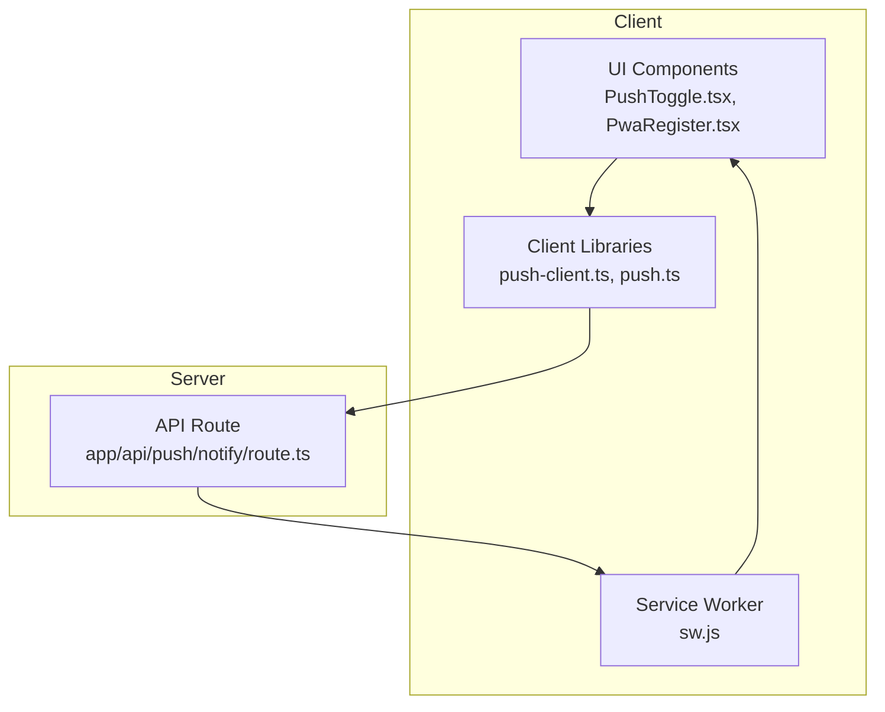
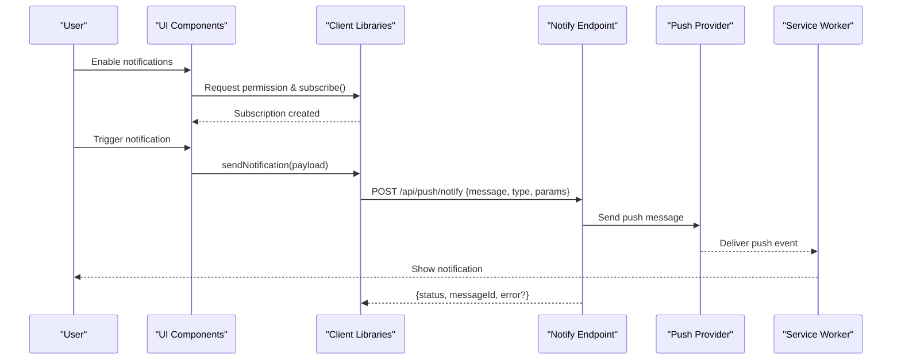
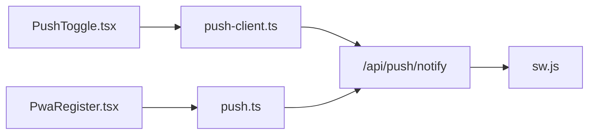

# Push Notifications API

<cite>
**Referenced Files in This Document**
- [route.ts](file://app/api/push/notify/route.ts)
- [push-client.ts](file://lib/push-client.ts)
- [push.ts](file://lib/push.ts)
- [PushToggle.tsx](file://components/PushToggle.tsx)
- [PwaRegister.tsx](file://components/PwaRegister.tsx)
- [sw.js](file://public/sw.js)
</cite>

## Table of Contents
1. [Introduction](#introduction)
2. [Project Structure](#project-structure)
3. [Core Components](#core-components)
4. [Architecture Overview](#architecture-overview)
5. [Detailed Component Analysis](#detailed-component-analysis)
6. [Dependency Analysis](#dependency-analysis)
7. [Performance Considerations](#performance-considerations)
8. [Troubleshooting Guide](#troubleshooting-guide)
9. [Conclusion](#conclusion)
10. [Appendices](#appendices)

## Introduction
This document provides comprehensive API documentation for the push notifications endpoint used to send browser push notifications. It covers HTTP methods, URL patterns, authentication requirements, message payload schemas, notification types, delivery parameters, response formats, delivery status tracking, error handling strategies, client implementation guidelines (subscription management and notification handling), security considerations, rate limiting, and debugging approaches.

## Project Structure
The push notification feature spans server-side route handlers and client-side libraries/components:
- Server-side endpoint: app/api/push/notify/route.ts
- Client push utilities: lib/push-client.ts, lib/push.ts
- UI components for subscription toggling and registration: components/PushToggle.tsx, components/PwaRegister.tsx
- Service worker for background handling: public/sw.js

**Diagram sources**
- [route.ts](file://app/api/push/notify/route.ts)
- [push-client.ts](file://lib/push-client.ts)
- [push.ts](file://lib/push.ts)
- [PushToggle.tsx](file://components/PushToggle.tsx)
- [PwaRegister.tsx](file://components/PwaRegister.tsx)
- [sw.js](file://public/sw.js)

**Section sources**
- [route.ts](file://app/api/push/notify/route.ts)
- [push-client.ts](file://lib/push-client.ts)
- [push.ts](file://lib/push.ts)
- [PushToggle.tsx](file://components/PushToggle.tsx)
- [PwaRegister.tsx](file://components/PwaRegister.tsx)
- [sw.js](file://public/sw.js)

## Core Components
- API Endpoint: The notify endpoint is implemented as a Next.js App Router route handler under app/api/push/notify/route.ts. It receives POST requests with a JSON payload describing the notification to be sent.
- Client Library: lib/push-client.ts and lib/push.ts provide functions to request permission, subscribe/unsubscribe from push notifications, and call the notify endpoint.
- UI Components: PushToggle.tsx and PwaRegister.tsx expose user-facing controls to enable/disable push notifications and handle registration flows.
- Service Worker: public/sw.js handles incoming push events and displays notifications when the app is not in focus.

Key responsibilities:
- Validate and parse incoming payloads
- Enforce authentication and authorization
- Queue or immediately send push messages via a provider
- Return standardized responses with delivery status
- Expose client APIs for subscription lifecycle

**Section sources**
- [route.ts](file://app/api/push/notify/route.ts)
- [push-client.ts](file://lib/push-client.ts)
- [push.ts](file://lib/push.ts)
- [PushToggle.tsx](file://components/PushToggle.tsx)
- [PwaRegister.tsx](file://components/PwaRegister.tsx)
- [sw.js](file://public/sw.js)

## Architecture Overview
The push notification flow involves the client requesting permission, subscribing to push, and sending messages through the notify endpoint. The service worker receives and displays notifications.

**Diagram sources**
- [route.ts](file://app/api/push/notify/route.ts)
- [push-client.ts](file://lib/push-client.ts)
- [push.ts](file://lib/push.ts)
- [sw.js](file://public/sw.js)

## Detailed Component Analysis

### Notify Endpoint (/api/push/notify)
- Method: POST
- URL Pattern: /api/push/notify
- Authentication: Requires valid session or token as enforced by the route handler; ensure headers are set per your auth strategy.
- Content-Type: application/json
- Request Body Schema:
  - title: string (required)
  - body: string (required)
  - type: enum ["reminder", "alert", "update"] (required)
  - data: object (optional) — custom key-value pairs forwarded to the client
  - target: object (optional) — audience targeting (e.g., userId, groupId)
  - options: object (optional) — browser push options (icon, badge, tag, renotify, actions)
- Response Body:
  - status: "success" | "error"
  - messageId?: string — unique identifier for tracking
  - delivered?: boolean — whether the provider accepted the message
  - error?: string — human-readable error description
- Status Codes:
  - 200 OK on successful submission
  - 400 Bad Request for invalid payloads
  - 401 Unauthorized if authentication fails
  - 403 Forbidden if unauthorized to send to target
  - 429 Too Many Requests for rate limit exceeded
  - 500 Internal Server Error for unexpected failures

Example payloads:
- Reminder:
  - type: "reminder"
  - title: "Session starting soon"
  - body: "Your photo booth session begins in 5 minutes."
  - data: { sessionId: "abc123" }
- Alert:
  - type: "alert"
  - title: "System maintenance"
  - body: "Scheduled downtime tonight at 2 AM UTC."
  - options: { icon: "/icons/alert.png" }
- Update:
  - type: "update"
  - title: "New photos available"
  - body: "Check out the latest captures from your event."
  - data: { albumId: "xyz789" }

Delivery parameters:
- options.icon: URL to an image for the notification
- options.badge: URL to a badge image
- options.tag: Grouping identifier for coalescing notifications
- options.renotify: Whether to re-notify if already shown
- options.actions: Array of action buttons with labels and identifiers

Response format examples:
- Success:
  - { status: "success", messageId: "msg_123", delivered: true }
- Error:
  - { status: "error", error: "Invalid subscription" }

Error handling strategies:
- Validate required fields and enums before processing
- Reject malformed payloads with 400 and descriptive errors
- Handle provider errors gracefully and return consistent error responses
- Log detailed diagnostics while avoiding sensitive data exposure

Rate limiting:
- Implement per-user or global rate limits to prevent abuse
- Return 429 with retry-after guidance when limits are exceeded

Security considerations:
- Enforce authentication and authorization checks
- Validate and sanitize all input fields
- Restrict allowed origins and enforce CORS policies
- Avoid including secrets in payloads or logs

**Section sources**
- [route.ts](file://app/api/push/notify/route.ts)

### Client Libraries (push-client.ts, push.ts)
Responsibilities:
- Request push notification permission
- Subscribe/unsubscribe using the PushManager
- Call the notify endpoint with validated payloads
- Handle responses and propagate errors to UI

Subscription management:
- Check current permission state
- Prompt user for permission if needed
- Create subscription and store it securely
- Provide functions to refresh or remove subscriptions

Notification handling:
- Listen for push events in the service worker
- Display notifications with provided options
- Handle click actions and route users appropriately

Implementation guidelines:
- Always check permissions before attempting operations
- Retry failed subscriptions with exponential backoff
- Cache subscription state locally and sync with server
- Use structured logging for debugging

**Section sources**
- [push-client.ts](file://lib/push-client.ts)
- [push.ts](file://lib/push.ts)

### UI Components (PushToggle.tsx, PwaRegister.tsx)
- PushToggle.tsx: Toggle switch to enable/disable push notifications; integrates with client library to manage subscriptions.
- PwaRegister.tsx: Handles PWA registration and prompts users to install the app, which can improve push reliability.

User interactions:
- On enable: request permission, subscribe, and update UI state
- On disable: unsubscribe and clear local state
- Provide feedback for success, failure, and permission denial

Accessibility:
- Ensure keyboard navigation and screen reader support
- Provide clear labels and instructions

**Section sources**
- [PushToggle.tsx](file://components/PushToggle.tsx)
- [PwaRegister.tsx](file://components/PwaRegister.tsx)

### Service Worker (sw.js)
Responsibilities:
- Register and manage push event listeners
- Display notifications based on incoming push payloads
- Handle notification clicks and actions
- Manage background sync if applicable

Best practices:
- Keep logic minimal and fast
- Avoid blocking operations
- Use appropriate icons and badges
- Support multiple notification types via data fields

**Section sources**
- [sw.js](file://public/sw.js)

## Dependency Analysis
The notify endpoint depends on client libraries for subscription management and the service worker for delivery. UI components orchestrate user interactions and trigger client functions.

**Diagram sources**
- [PushToggle.tsx](file://components/PushToggle.tsx)
- [PwaRegister.tsx](file://components/PwaRegister.tsx)
- [push-client.ts](file://lib/push-client.ts)
- [push.ts](file://lib/push.ts)
- [route.ts](file://app/api/push/notify/route.ts)
- [sw.js](file://public/sw.js)

**Section sources**
- [PushToggle.tsx](file://components/PushToggle.tsx)
- [PwaRegister.tsx](file://components/PwaRegister.tsx)
- [push-client.ts](file://lib/push-client.ts)
- [push.ts](file://lib/push.ts)
- [route.ts](file://app/api/push/notify/route.ts)
- [sw.js](file://public/sw.js)

## Performance Considerations
- Minimize payload size to reduce network overhead
- Batch notifications where possible to avoid excessive calls
- Use caching for static assets like icons and badges
- Implement retries with backoff for transient failures
- Monitor provider latency and adjust timeouts accordingly

[No sources needed since this section provides general guidance]

## Troubleshooting Guide
Common issues and resolutions:
- Permission denied:
  - Ensure HTTPS context and user-initiated prompt
  - Verify browser settings allow notifications
- Subscription not working:
  - Re-subscribe after clearing storage
  - Check for expired or revoked subscriptions
- Notifications not showing:
  - Confirm service worker is registered and active
  - Validate payload structure and options
- Rate limited:
  - Reduce frequency or implement queuing
  - Respect retry-after headers

Debugging steps:
- Inspect network requests to /api/push/notify
- Check console logs in both main thread and service worker
- Use browser DevTools to inspect push subscriptions
- Add structured logging in the endpoint and client libraries

**Section sources**
- [route.ts](file://app/api/push/notify/route.ts)
- [push-client.ts](file://lib/push-client.ts)
- [push.ts](file://lib/push.ts)
- [sw.js](file://public/sw.js)

## Conclusion
The push notifications API provides a robust mechanism for delivering timely updates to users. By following the documented payload schemas, authentication requirements, and best practices, developers can implement reliable and secure push notification features. Proper subscription management, error handling, and debugging strategies ensure a smooth user experience across devices and browsers.

[No sources needed since this section summarizes without analyzing specific files]

## Appendices

### API Reference Summary
- Endpoint: POST /api/push/notify
- Authentication: Required (session/token)
- Payload keys: title, body, type, data, target, options
- Response keys: status, messageId, delivered, error
- Status codes: 200, 400, 401, 403, 429, 500

### Security Checklist
- Enforce HTTPS
- Validate and sanitize inputs
- Limit payload sizes
- Rotate secrets and tokens regularly
- Audit logs for sensitive data

### Rate Limiting Guidelines
- Define per-user and global limits
- Return informative 429 responses
- Implement exponential backoff on clients

[No sources needed since this section provides general guidance]