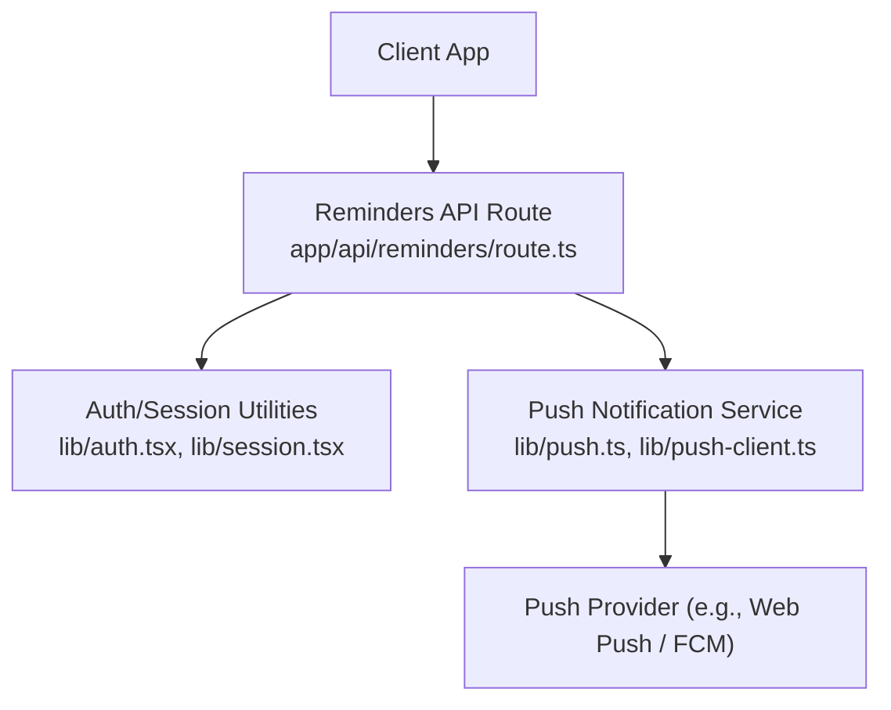
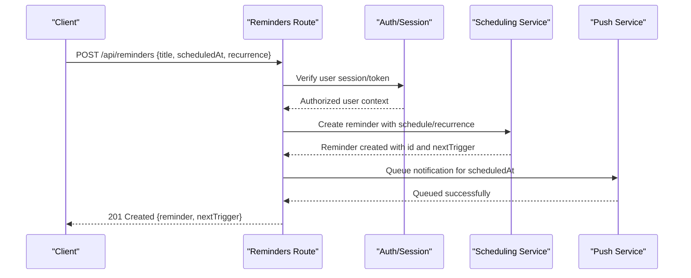
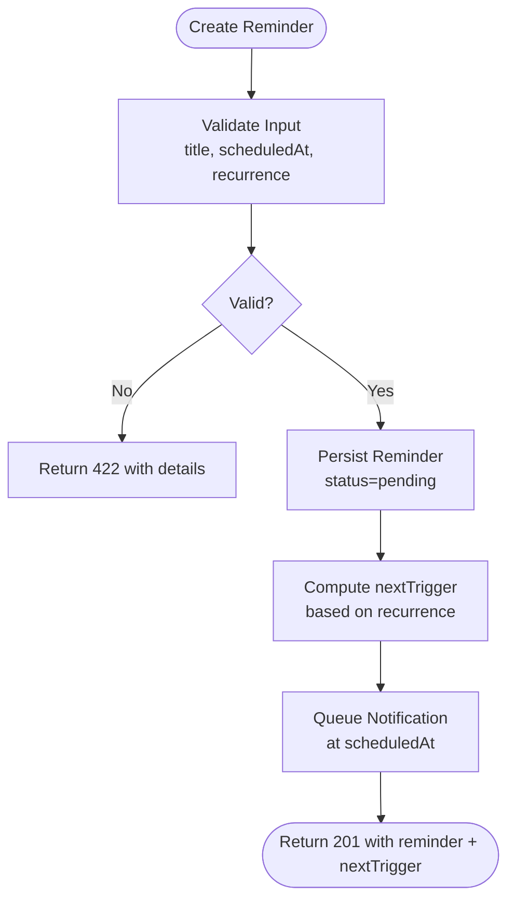
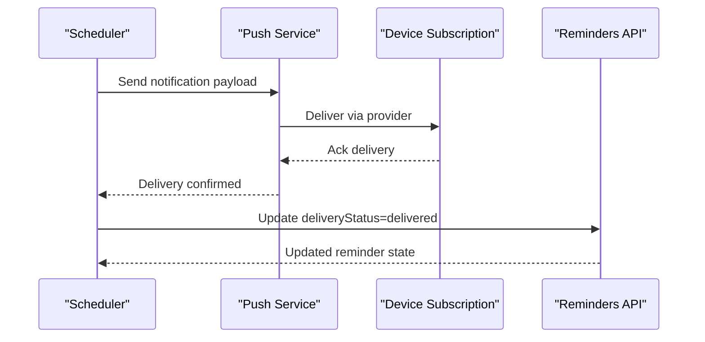
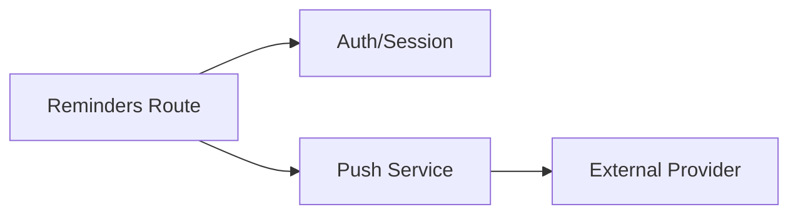

# Reminders API

<cite>
**Referenced Files in This Document**
- [route.ts](file://app/api/reminders/route.ts)
- [push.ts](file://lib/push.ts)
- [push-client.ts](file://lib/push-client.ts)
- [auth.tsx](file://lib/auth.tsx)
- [session.tsx](file://lib/session.tsx)
</cite>

## Table of Contents
1. [Introduction](#introduction)
2. [Project Structure](#project-structure)
3. [Core Components](#core-components)
4. [Architecture Overview](#architecture-overview)
5. [Detailed Component Analysis](#detailed-component-analysis)
6. [Dependency Analysis](#dependency-analysis)
7. [Performance Considerations](#performance-considerations)
8. [Troubleshooting Guide](#troubleshooting-guide)
9. [Conclusion](#conclusion)

## Introduction
This document provides detailed API documentation for the Reminders endpoint implemented as a Next.js App Router handler. It covers HTTP methods, URL patterns, authentication requirements, scheduling parameters, notification triggers, recurrence options, request/response schemas, error handling, timezone considerations, and delivery failure scenarios. It also includes implementation guidelines for reminder scheduling, user preferences, and notification timing.

## Project Structure
The reminders functionality is exposed via a Next.js App Router API route under app/api/reminders. The backend integrates with push notification services and may rely on session or authentication utilities for user context.

**Diagram sources**
- [route.ts](file://app/api/reminders/route.ts)
- [push.ts](file://lib/push.ts)
- [push-client.ts](file://lib/push-client.ts)
- [auth.tsx](file://lib/auth.tsx)
- [session.tsx](file://lib/session.tsx)

**Section sources**
- [route.ts](file://app/api/reminders/route.ts)
- [push.ts](file://lib/push.ts)
- [push-client.ts](file://lib/push-client.ts)
- [auth.tsx](file://lib/auth.tsx)
- [session.tsx](file://lib/session.tsx)

## Core Components
- Reminders API Route: Handles CRUD operations for reminders, validates inputs, enforces authentication, schedules notifications, and returns standardized responses.
- Push Integration: Sends push notifications based on scheduled reminders and manages device subscriptions.
- Authentication/Session: Validates user identity and scopes required for reminder management.

Key responsibilities:
- Input validation and sanitization
- User authorization checks
- Scheduling and recurrence logic
- Delivery confirmation and status tracking
- Error handling and consistent error responses

**Section sources**
- [route.ts](file://app/api/reminders/route.ts)
- [push.ts](file://lib/push.ts)
- [push-client.ts](file://lib/push-client.ts)
- [auth.tsx](file://lib/auth.tsx)
- [session.tsx](file://lib/session.tsx)

## Architecture Overview
The Reminders API follows a layered approach:
- API Layer: Accepts requests, validates payloads, and delegates to service logic.
- Business Logic: Manages reminder lifecycle, scheduling, and recurrence.
- Notification Layer: Integrates with push providers to deliver reminders.
- Persistence: Stores reminders and delivery statuses (implementation-dependent).

**Diagram sources**
- [route.ts](file://app/api/reminders/route.ts)
- [push.ts](file://lib/push.ts)
- [push-client.ts](file://lib/push-client.ts)
- [auth.tsx](file://lib/auth.tsx)
- [session.tsx](file://lib/session.tsx)

## Detailed Component Analysis

### Reminders Endpoint Specification
- Base path: /api/reminders
- Methods:
  - POST /api/reminders: Create a new reminder
  - GET /api/reminders: List reminders (supports filtering by status, date range)
  - GET /api/reminders/{id}: Retrieve a specific reminder
  - PATCH /api/reminders/{id}: Update reminder fields (title, scheduledAt, recurrence, enabled)
  - DELETE /api/reminders/{id}: Delete a reminder
- Authentication: Requires valid user session or token; all endpoints enforce authorization.

Request body schema (POST/PATCH):
- title: string, required, max length enforced
- scheduledAt: ISO-8601 datetime string with timezone offset (e.g., 2025-01-01T10:00:00+00:00)
- recurrence: object or null
  - type: "none" | "daily" | "weekly" | "monthly" | "yearly"
  - interval: number (default 1)
  - daysOfWeek: array of integers 0–6 (Sunday=0), used when type is weekly
  - monthDay: integer 1–31, used when type is monthly
  - endDate: ISO-8601 datetime string (optional)
- message: string, optional, overrides default reminder message
- enabled: boolean, default true
- metadata: object, optional, arbitrary key-value pairs

Response schemas:
- Success (201/200):
  - id: string
  - title: string
  - scheduledAt: ISO-8601 datetime
  - nextTrigger: ISO-8601 datetime (next scheduled trigger)
  - recurrence: object or null
  - enabled: boolean
  - createdAt: ISO-8601 datetime
  - updatedAt: ISO-8601 datetime
  - status: "pending" | "scheduled" | "delivered" | "failed" | "cancelled"
  - deliveryStatus: "queued" | "sent" | "delivered" | "failed"
- Error (4xx/5xx):
  - code: string error code
  - message: human-readable message
  - details: object with field-level errors (optional)

Examples:
- Create a daily reminder at 9 AM local time:
  - POST /api/reminders
  - Body: { "title": "Morning Standup", "scheduledAt": "2025-01-01T09:00:00+02:00", "recurrence": { "type": "daily", "interval": 1 } }
- Update a reminder to disable it:
  - PATCH /api/reminders/{id}
  - Body: { "enabled": false }
- Delete a reminder:
  - DELETE /api/reminders/{id}

Notes on date/time formatting:
- All datetimes must be ISO-8601 with explicit timezone offsets.
- Server converts to UTC for storage and scheduling; responses include original timezone-aware values.
- Invalid or ambiguous times are rejected with clear error messages.

Recurrence behavior:
- nextTrigger is computed based on scheduledAt and recurrence rules.
- Recurrence respects endDate if provided; otherwise, continues indefinitely until cancelled.
- Weekly/monthly boundaries are handled according to calendar rules.

Delivery confirmation:
- deliveryStatus transitions through queued → sent → delivered or failed.
- Failed deliveries retry with exponential backoff up to a configured limit.
- Clients can poll or subscribe to delivery events for updates.

Authentication requirements:
- All endpoints require a valid session or bearer token.
- Unauthorized requests receive 401 with error code "UNAUTHORIZED".
- Forbidden actions (e.g., accessing another user's reminder) return 403 with "FORBIDDEN".

Error handling:
- Validation errors return 422 with field-specific details.
- Timezone parsing failures return 422 with guidance on expected format.
- Delivery failures return 502/503 with retry-after hints when applicable.

Implementation guidelines:
- Use server-side scheduling to ensure reliability across client disconnections.
- Persist reminder state changes with timestamps and audit fields.
- Enforce rate limits per user to prevent abuse.
- Provide idempotency keys for create/update operations where appropriate.

**Section sources**
- [route.ts](file://app/api/reminders/route.ts)
- [push.ts](file://lib/push.ts)
- [push-client.ts](file://lib/push-client.ts)
- [auth.tsx](file://lib/auth.tsx)
- [session.tsx](file://lib/session.tsx)

### Scheduling and Recurrence Flow

**Diagram sources**
- [route.ts](file://app/api/reminders/route.ts)
- [push.ts](file://lib/push.ts)

**Section sources**
- [route.ts](file://app/api/reminders/route.ts)
- [push.ts](file://lib/push.ts)

### Push Notification Delivery Flow

**Diagram sources**
- [push.ts](file://lib/push.ts)
- [push-client.ts](file://lib/push-client.ts)
- [route.ts](file://app/api/reminders/route.ts)

**Section sources**
- [push.ts](file://lib/push.ts)
- [push-client.ts](file://lib/push-client.ts)
- [route.ts](file://app/api/reminders/route.ts)

## Dependency Analysis
The Reminders API depends on authentication/session utilities and push notification services. Proper separation ensures testability and resilience.

**Diagram sources**
- [route.ts](file://app/api/reminders/route.ts)
- [auth.tsx](file://lib/auth.tsx)
- [push.ts](file://lib/push.ts)
- [push-client.ts](file://lib/push-client.ts)

**Section sources**
- [route.ts](file://app/api/reminders/route.ts)
- [auth.tsx](file://lib/auth.tsx)
- [push.ts](file://lib/push.ts)
- [push-client.ts](file://lib/push-client.ts)

## Performance Considerations
- Batch processing for recurring reminders to reduce scheduler load.
- Cache frequently accessed reminder lists with short TTLs.
- Use background jobs for heavy tasks like computing nextTrigger for large recurrence sets.
- Implement pagination for list endpoints to avoid large payloads.
- Monitor queue depths and adjust concurrency settings dynamically.

[No sources needed since this section provides general guidance]

## Troubleshooting Guide
Common issues and resolutions:
- Invalid date/time: Ensure ISO-8601 with timezone offset; reject ambiguous times.
- Timezone mismatches: Confirm client sends correct offset; server normalizes to UTC.
- Delivery failures: Check provider health, subscription validity, and retry policies.
- Authorization errors: Validate session/token presence and scope permissions.
- Rate limiting: Respect retry-after headers and implement client-side backoff.

Diagnostic steps:
- Inspect reminder status and deliveryStatus fields.
- Review logs for scheduling and push delivery events.
- Validate recurrence rules against calendar edge cases (month boundaries, leap years).
- Test with known-good payloads before integrating complex recurrences.

**Section sources**
- [route.ts](file://app/api/reminders/route.ts)
- [push.ts](file://lib/push.ts)

## Conclusion
The Reminders API provides a robust, secure, and scalable interface for managing user reminders with precise scheduling, flexible recurrence, and reliable delivery confirmation. By adhering to the documented schemas, authentication requirements, and error handling practices, clients can integrate seamlessly and build responsive reminder experiences.

[No sources needed since this section summarizes without analyzing specific files]