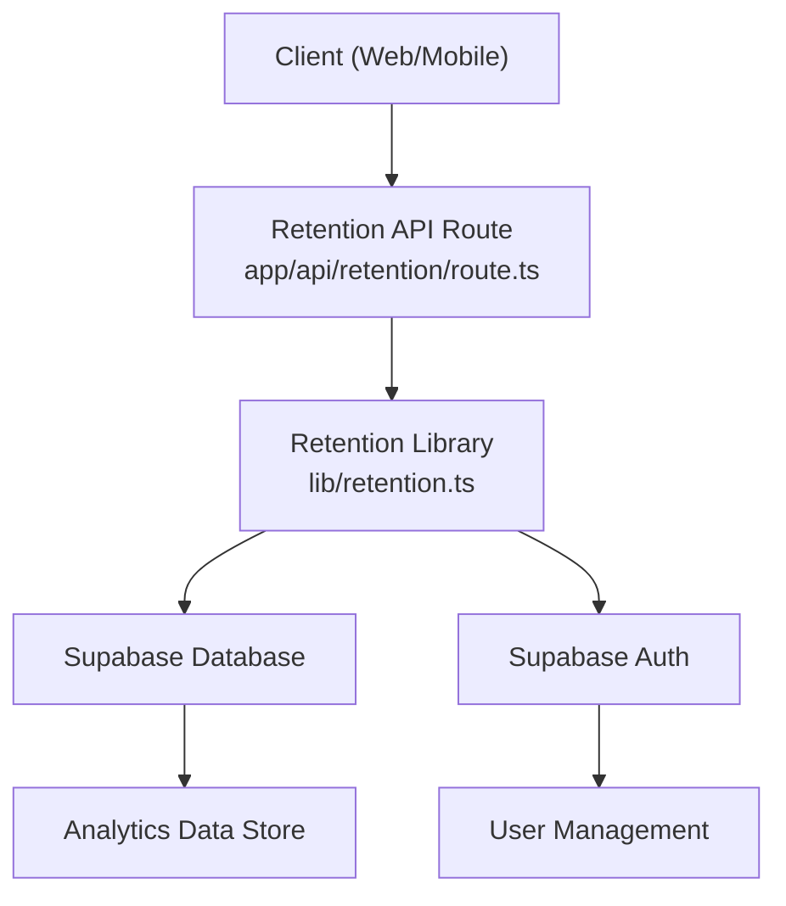
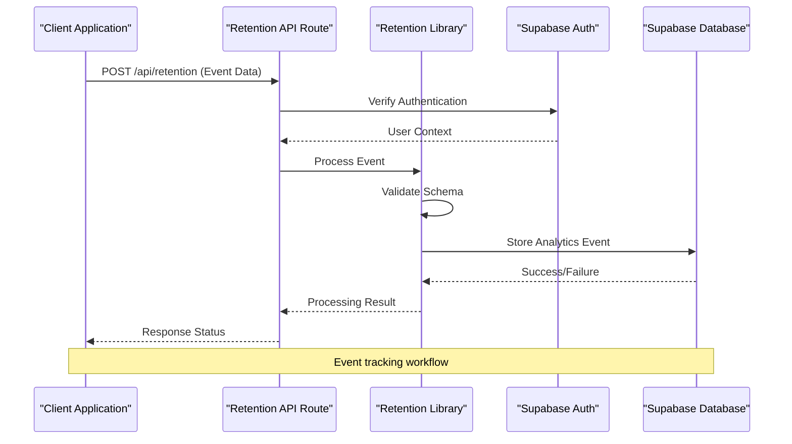
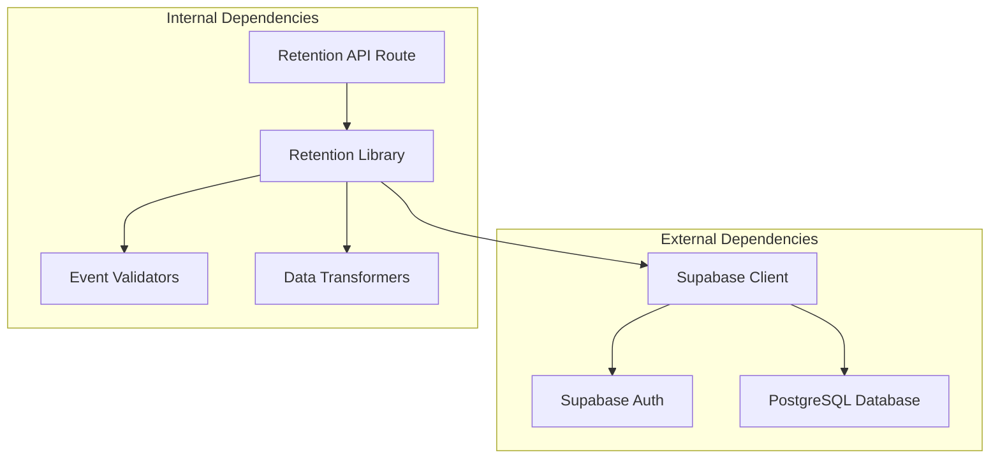

# Retention Analytics API

<cite>
**Referenced Files in This Document**
- [app/api/retention/route.ts](file://app/api/retention/route.ts)
- [lib/retention.ts](file://lib/retention.ts)
- [package.json](file://package.json)
- [supabase-setup.sql](file://supabase-setup.sql)
</cite>

## Table of Contents
1. [Introduction](#introduction)
2. [Project Structure](#project-structure)
3. [Core Components](#core-components)
4. [Architecture Overview](#architecture-overview)
5. [Detailed Component Analysis](#detailed-component-analysis)
6. [Dependency Analysis](#dependency-analysis)
7. [Performance Considerations](#performance-considerations)
8. [Troubleshooting Guide](#troubleshooting-guide)
9. [Conclusion](#conclusion)
10. [Appendices](#appendices)

## Introduction
This document provides comprehensive API documentation for the retention analytics endpoint used to track user events and collect analytics data. It covers HTTP methods, URL patterns, authentication requirements, event schemas, user activity tracking parameters, data aggregation methods, response formats, best practices, privacy considerations, performance optimization, data retention policies, query optimization, and monitoring approaches.

## Project Structure
The retention analytics functionality is implemented as a Next.js App Router API route under app/api/retention/route.ts, with supporting logic in lib/retention.ts. The project uses Supabase for storage and authentication, and includes SQL setup scripts for schema definitions.



**Diagram sources**
- [app/api/retention/route.ts](file://app/api/retention/route.ts)
- [lib/retention.ts](file://lib/retention.ts)

**Section sources**
- [package.json](file://package.json)
- [supabase-setup.sql](file://supabase-setup.sql)

## Core Components
The retention analytics system consists of two primary components:

### API Route Handler
The main entry point for analytics events is the retention API route that handles incoming HTTP requests for event tracking and analytics collection.

### Retention Library
The core business logic for processing analytics events, validating data, and interacting with the database layer through Supabase.

**Section sources**
- [app/api/retention/route.ts](file://app/api/retention/route.ts)
- [lib/retention.ts](file://lib/retention.ts)

## Architecture Overview
The retention analytics architecture follows a layered approach with clear separation of concerns between request handling, business logic, and data persistence.



**Diagram sources**
- [app/api/retention/route.ts](file://app/api/retention/route.ts)
- [lib/retention.ts](file://lib/retention.ts)

## Detailed Component Analysis

### Retention API Route
The retention API route serves as the primary interface for client applications to submit analytics events. It handles HTTP request parsing, authentication verification, and delegates event processing to the retention library.

#### HTTP Methods and Endpoints
- **POST /api/retention**: Submit analytics events for processing
- **GET /api/retention**: Query analytics data (if implemented)

#### Request Schema
Events submitted to the retention endpoint should follow a consistent schema structure:

| Field | Type | Required | Description |
|-------|------|----------|-------------|
| event_type | string | Yes | Type of analytics event (e.g., "user_login", "photo_capture") |
| user_id | string | Yes | Unique identifier for the authenticated user |
| timestamp | number | Yes | Unix timestamp when the event occurred |
| metadata | object | No | Additional context-specific data about the event |
| session_id | string | No | Session identifier for grouping related events |
| device_info | object | No | Device and browser information |

#### Response Format
Successful event submission returns a standardized response format:

```json
{
  "success": true,
  "event_id": "unique_event_identifier",
  "timestamp": "server_timestamp",
  "message": "Event processed successfully"
}
```

Error responses include appropriate HTTP status codes and error messages:

```json
{
  "success": false,
  "error_code": "VALIDATION_ERROR",
  "message": "Invalid event schema",
  "details": {}
}
```

**Section sources**
- [app/api/retention/route.ts](file://app/api/retention/route.ts)

### Retention Library
The retention library contains the core business logic for processing analytics events, including validation, transformation, and database operations.

#### Event Processing Pipeline
The library implements a structured pipeline for event processing:

1. **Input Validation**: Validates event schema and required fields
2. **Data Transformation**: Normalizes and enriches event data
3. **Business Logic**: Applies retention-specific rules and calculations
4. **Database Operations**: Persists events and updates aggregations
5. **Response Generation**: Creates standardized responses

#### Data Aggregation Methods
The library supports various aggregation methods for analytics queries:

- **Time-based Aggregation**: Events grouped by hour, day, week, or month
- **User-based Aggregation**: Metrics calculated per user or user segment
- **Event-type Aggregation**: Counts and statistics by event type
- **Session-based Aggregation**: Metrics within user sessions

**Section sources**
- [lib/retention.ts](file://lib/retention.ts)

### Authentication and Authorization
The retention analytics system integrates with Supabase authentication to ensure secure access to analytics endpoints.

#### Authentication Requirements
- All analytics events require valid authentication tokens
- User context is extracted from JWT tokens
- Role-based access control for different types of analytics operations

#### Security Measures
- Input sanitization and validation
- Rate limiting to prevent abuse
- Audit logging for security-sensitive operations
- Data encryption at rest and in transit

**Section sources**
- [app/api/retention/route.ts](file://app/api/retention/route.ts)
- [lib/retention.ts](file://lib/retention.ts)

## Dependency Analysis
The retention analytics system has well-defined dependencies on external services and internal modules.



**Diagram sources**
- [app/api/retention/route.ts](file://app/api/retention/route.ts)
- [lib/retention.ts](file://lib/retention.ts)

**Section sources**
- [package.json](file://package.json)

## Performance Considerations
Optimizing the retention analytics system for high-volume event processing requires careful attention to several key areas.

### Database Optimization
- Implement efficient indexing strategies for frequently queried fields
- Use batch operations for bulk event insertion
- Partition large tables by time ranges for better query performance
- Implement connection pooling for database connections

### Caching Strategies
- Cache frequently accessed analytics aggregates
- Implement Redis caching for real-time metrics
- Use CDN caching for static analytics reports
- Apply cache invalidation strategies for updated data

### Request Processing
- Implement async processing for non-critical analytics events
- Use message queues for high-volume event ingestion
- Apply rate limiting and throttling mechanisms
- Optimize JSON serialization/deserialization

### Monitoring and Observability
- Track API latency and throughput metrics
- Monitor database query performance
- Implement distributed tracing for complex workflows
- Set up alerts for performance degradation

## Troubleshooting Guide
Common issues and their solutions when working with the retention analytics API.

### Authentication Issues
- **Problem**: Invalid token errors
- **Solution**: Ensure proper JWT token generation and expiration handling
- **Debug**: Check token validity and user permissions

### Data Validation Errors
- **Problem**: Schema validation failures
- **Solution**: Verify event schema matches expected format
- **Debug**: Log detailed validation error messages

### Performance Issues
- **Problem**: Slow API response times
- **Solution**: Optimize database queries and implement caching
- **Debug**: Monitor query execution plans and slow logs

### Data Consistency
- **Problem**: Missing or duplicate events
- **Solution**: Implement idempotency keys and retry logic
- **Debug**: Track event IDs and deduplicate on server side

**Section sources**
- [app/api/retention/route.ts](file://app/api/retention/route.ts)
- [lib/retention.ts](file://lib/retention.ts)

## Conclusion
The retention analytics API provides a robust foundation for tracking user interactions and collecting valuable analytics data. By following the implementation guidelines, security best practices, and performance optimizations outlined in this document, developers can build reliable and scalable analytics systems that support data-driven decision making.

## Appendices

### A. Event Schema Examples
Common event types and their typical payload structures for different user interactions.

### B. Query Patterns
Standard query patterns for common analytics use cases and reporting requirements.

### C. Monitoring Setup
Recommended monitoring and alerting configurations for production deployments.

### D. Migration Guide
Step-by-step guide for migrating existing analytics implementations to the new API.