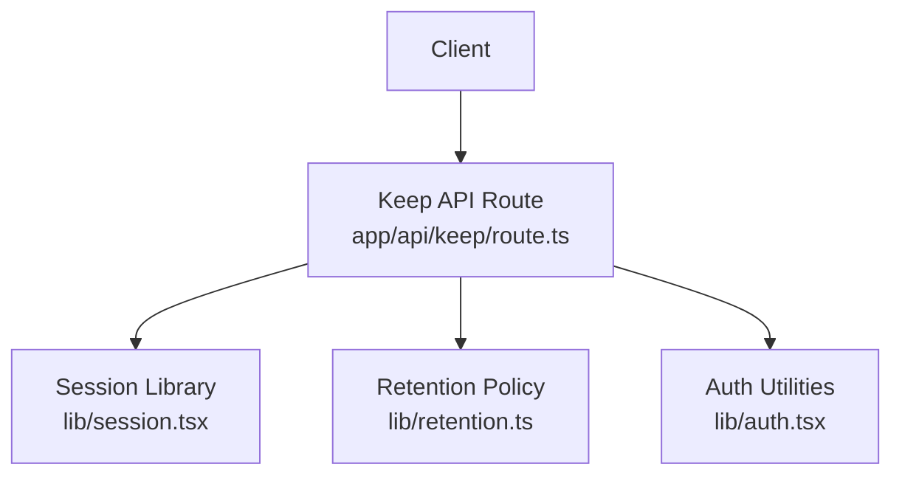
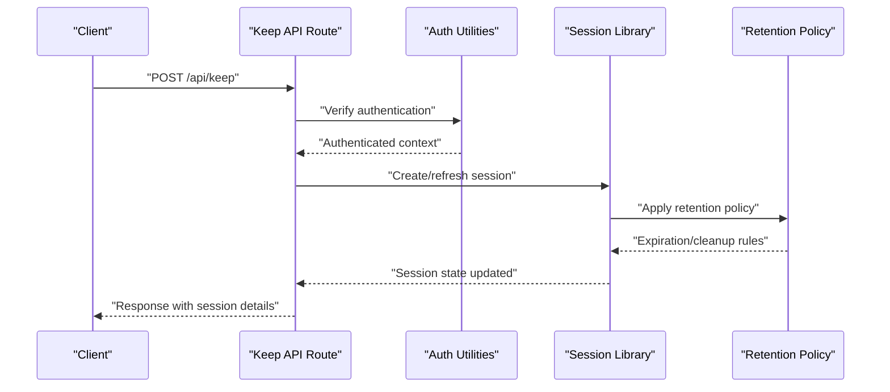
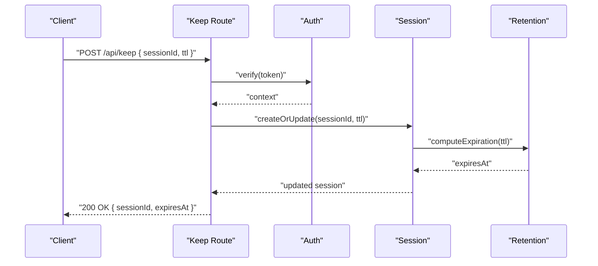
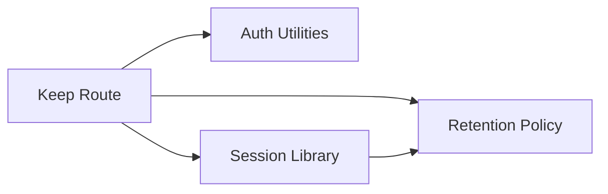

# Session Management API

<cite>
**Referenced Files in This Document**
- [route.ts](file://app/api/keep/route.ts)
- [session.tsx](file://lib/session.tsx)
- [retention.ts](file://lib/retention.ts)
- [auth.tsx](file://lib/auth.tsx)
</cite>

## Table of Contents
1. [Introduction](#introduction)
2. [Project Structure](#project-structure)
3. [Core Components](#core-components)
4. [Architecture Overview](#architecture-overview)
5. [Detailed Component Analysis](#detailed-component-analysis)
6. [Dependency Analysis](#dependency-analysis)
7. [Performance Considerations](#performance-considerations)
8. [Troubleshooting Guide](#troubleshooting-guide)
9. [Conclusion](#conclusion)
10. [Appendices](#appendices)

## Introduction
This document provides detailed API documentation for the session management endpoint focused on the keep operation. It explains HTTP methods, URL patterns, authentication requirements, session persistence parameters, request/response schemas, and data structures. It also includes concrete examples for session creation, retrieval, and cleanup operations, along with error handling strategies, status codes, common use cases, client implementation guidelines with TypeScript examples, integration patterns, security considerations, rate limiting, and performance optimization tips.

## Project Structure
The session management functionality is implemented as a Next.js App Router API route under app/api/keep. The keep endpoint coordinates session lifecycle operations by leveraging shared libraries for session state, retention policies, and authentication.

**Diagram sources**
- [route.ts](file://app/api/keep/route.ts)
- [session.tsx](file://lib/session.tsx)
- [retention.ts](file://lib/retention.ts)
- [auth.tsx](file://lib/auth.tsx)

**Section sources**
- [route.ts](file://app/api/keep/route.ts)
- [session.tsx](file://lib/session.tsx)
- [retention.ts](file://lib/retention.ts)
- [auth.tsx](file://lib/auth.tsx)

## Core Components
- Keep API Route: Implements the HTTP handler for session keep operations, including validation, authentication checks, and coordination with session and retention libraries.
- Session Library: Provides utilities to create, update, retrieve, and clean up sessions, including TTL handling and persistence logic.
- Retention Library: Encapsulates retention policies, expiration rules, and cleanup routines for session data.
- Auth Utilities: Handles authentication verification, token parsing, and user context resolution required by the keep endpoint.

Key responsibilities:
- Validate incoming requests and enforce authentication.
- Persist or refresh session state based on keep requests.
- Apply retention policies to determine expiration and cleanup behavior.
- Return standardized responses and errors.

**Section sources**
- [route.ts](file://app/api/keep/route.ts)
- [session.tsx](file://lib/session.tsx)
- [retention.ts](file://lib/retention.ts)
- [auth.tsx](file://lib/auth.tsx)

## Architecture Overview
The keep endpoint follows a layered architecture:
- Client sends an HTTP request to the keep route.
- The route validates the request and authenticates the caller.
- The route interacts with the session library to persist or refresh session state.
- Retention policies are applied to manage expiration and cleanup.
- A standardized response is returned to the client.

**Diagram sources**
- [route.ts](file://app/api/keep/route.ts)
- [auth.tsx](file://lib/auth.tsx)
- [session.tsx](file://lib/session.tsx)
- [retention.ts](file://lib/retention.ts)

## Detailed Component Analysis

### Keep Endpoint (HTTP Handler)
- Method: POST
- URL Pattern: /api/keep
- Authentication: Required; validated via auth utilities before processing.
- Request Body: Contains session identifiers and optional persistence parameters such as TTL or metadata.
- Response: Returns session state, expiration time, and status indicators.

Behavior highlights:
- Validates presence of required fields.
- Verifies authentication context.
- Persists or refreshes session using session library.
- Applies retention policies for expiration and cleanup.
- Returns appropriate status codes and structured error messages.

**Section sources**
- [route.ts](file://app/api/keep/route.ts)

### Session Library
Responsibilities:
- Create new sessions with unique identifiers.
- Update existing sessions with refreshed TTLs or metadata.
- Retrieve session state by ID.
- Clean up expired sessions based on retention policies.

Data structures:
- Session object includes identifier, timestamps, TTL, and metadata.
- Persistence layer stores session state with expiration attributes.

Complexity considerations:
- Lookup operations are O(1) when indexed by session ID.
- Cleanup operations iterate over expired entries; efficiency depends on indexing and scheduled tasks.

**Section sources**
- [session.tsx](file://lib/session.tsx)

### Retention Library
Responsibilities:
- Define retention policies (e.g., max TTL, grace periods).
- Determine expiration times and cleanup schedules.
- Provide functions to mark sessions for deletion or archival.

Policy inputs:
- Default TTL values.
- Environment-specific overrides.
- Per-session overrides if supported.

**Section sources**
- [retention.ts](file://lib/retention.ts)

### Auth Utilities
Responsibilities:
- Parse and validate authentication tokens.
- Resolve user context and permissions.
- Enforce access control for session operations.

Integration points:
- Called by the keep endpoint to ensure only authenticated users can create or refresh sessions.
- Returns error responses for invalid or missing credentials.

**Section sources**
- [auth.tsx](file://lib/auth.tsx)

#### Sequence Diagram: Keep Operation Flow

**Diagram sources**
- [route.ts](file://app/api/keep/route.ts)
- [auth.tsx](file://lib/auth.tsx)
- [session.tsx](file://lib/session.tsx)
- [retention.ts](file://lib/retention.ts)

## Dependency Analysis
The keep endpoint depends on authentication, session management, and retention policy modules. Coupling is minimized through clear interfaces between the route and libraries.

**Diagram sources**
- [route.ts](file://app/api/keep/route.ts)
- [auth.tsx](file://lib/auth.tsx)
- [session.tsx](file://lib/session.tsx)
- [retention.ts](file://lib/retention.ts)

**Section sources**
- [route.ts](file://app/api/keep/route.ts)
- [auth.tsx](file://lib/auth.tsx)
- [session.tsx](file://lib/session.tsx)
- [retention.ts](file://lib/retention.ts)

## Performance Considerations
- Minimize payload size: Send only necessary fields in keep requests.
- Use efficient TTL values: Avoid excessively short TTLs that cause frequent refreshes.
- Index session IDs: Ensure fast lookups and updates.
- Batch cleanup: Schedule periodic cleanup jobs rather than per-request deletions.
- Cache frequently accessed session states: Reduce database load where appropriate.

[No sources needed since this section provides general guidance]

## Troubleshooting Guide
Common issues and resolutions:
- Authentication failures: Verify token validity and headers. Check auth utility logs for parse errors.
- Missing session ID: Ensure the request body contains a valid sessionId.
- Expiration too short: Adjust TTL to meet application needs; review retention policy defaults.
- Cleanup not occurring: Confirm scheduled tasks are running and retention policies are correctly configured.

Error handling strategy:
- Return consistent error objects with status codes and messages.
- Log errors with contextual information for debugging.
- Distinguish between client errors (4xx) and server errors (5xx).

**Section sources**
- [route.ts](file://app/api/keep/route.ts)
- [auth.tsx](file://lib/auth.tsx)

## Conclusion
The session management keep endpoint provides a robust mechanism for creating, refreshing, and managing session lifecycles. By integrating authentication, session persistence, and retention policies, it ensures secure and efficient session handling. Following the provided client guidelines and best practices will help achieve reliable integration and optimal performance.

[No sources needed since this section summarizes without analyzing specific files]

## Appendices

### API Definition
- Endpoint: POST /api/keep
- Authentication: Required (token-based)
- Request Schema:
  - sessionId: string (required)
  - ttl: number (optional; seconds)
  - metadata: object (optional; key-value pairs)
- Response Schema:
  - sessionId: string
  - expiresAt: timestamp
  - status: string
- Status Codes:
  - 200 OK: Success
  - 400 Bad Request: Invalid input
  - 401 Unauthorized: Authentication failed
  - 404 Not Found: Session not found
  - 500 Internal Server Error: Server-side failure

### Concrete Examples
- Session Creation:
  - Send POST /api/keep with sessionId and ttl.
  - Receive 200 OK with expiresAt indicating expiration time.
- Session Retrieval:
  - Use sessionId to query session state via client-side storage or additional endpoints if available.
- Session Cleanup:
  - Rely on retention policies to automatically expire and remove sessions.
  - Optionally trigger cleanup via admin endpoints if implemented.

### Client Implementation Guidelines (TypeScript)
- Use fetch or axios to send POST requests to /api/keep.
- Include authentication headers as required by the auth utilities.
- Handle responses and errors according to status codes.
- Implement retry logic for transient failures.
- Store sessionId and expiresAt locally for UI updates and background tasks.

### Security Considerations
- Enforce HTTPS for all requests.
- Validate and sanitize all inputs.
- Rotate and securely store authentication tokens.
- Limit request rates to prevent abuse.

### Rate Limiting
- Implement per-user or per-IP rate limits on the keep endpoint.
- Return 429 Too Many Requests when limits are exceeded.
- Configure backoff strategies on the client side.

### Integration Patterns
- Background refresh: Periodically call keep to maintain active sessions.
- Event-driven updates: Trigger keep on user interactions or state changes.
- Graceful degradation: Handle offline scenarios by caching session state.

[No sources needed since this section provides general guidance]