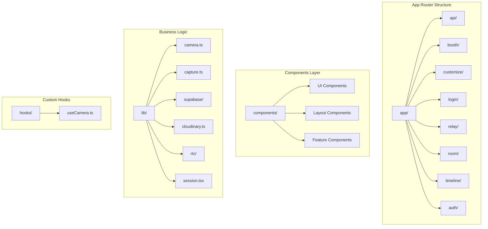
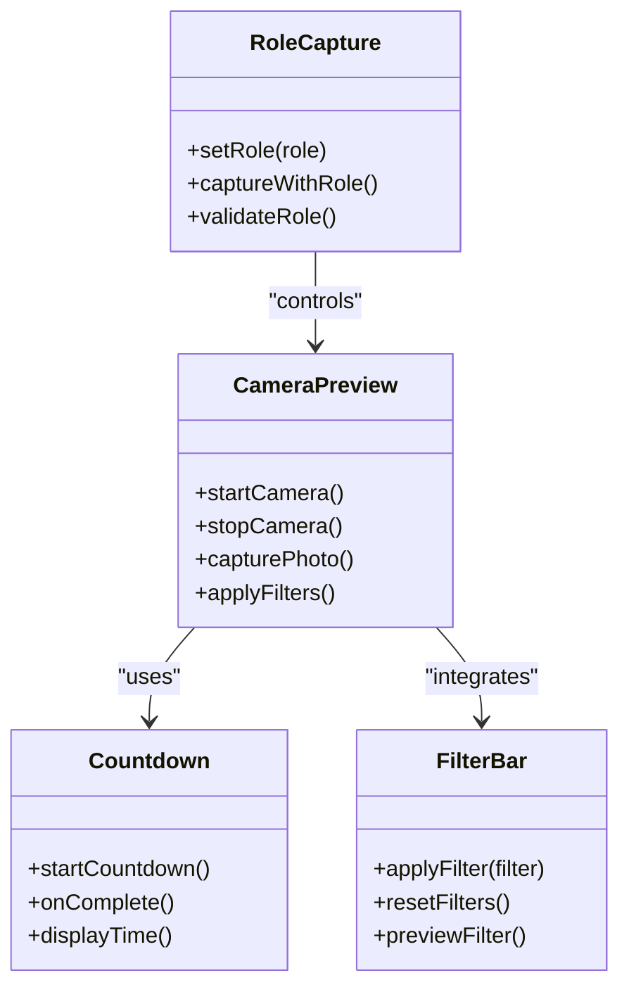
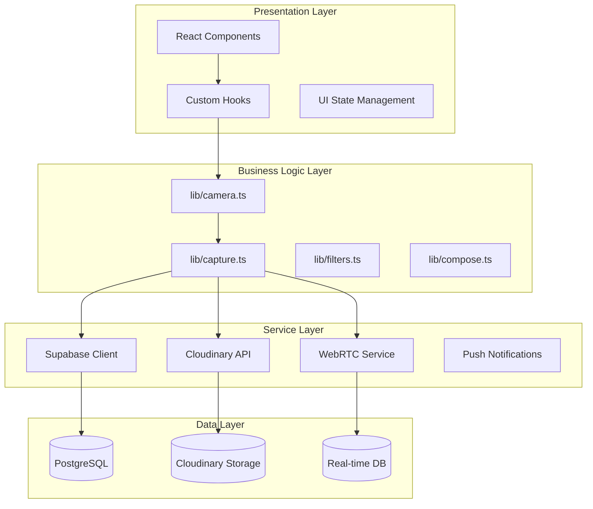
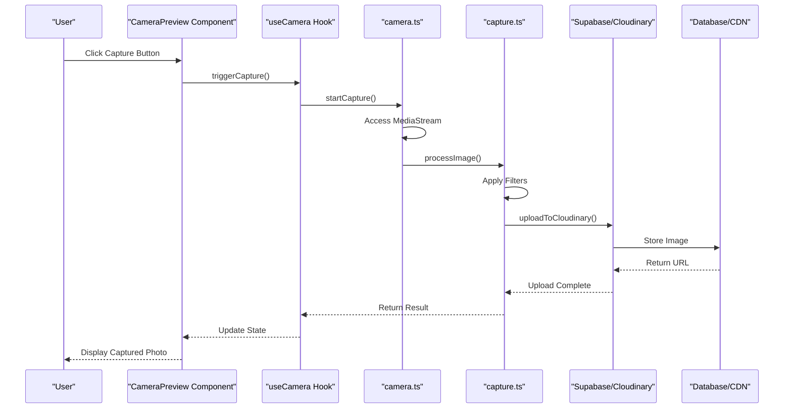
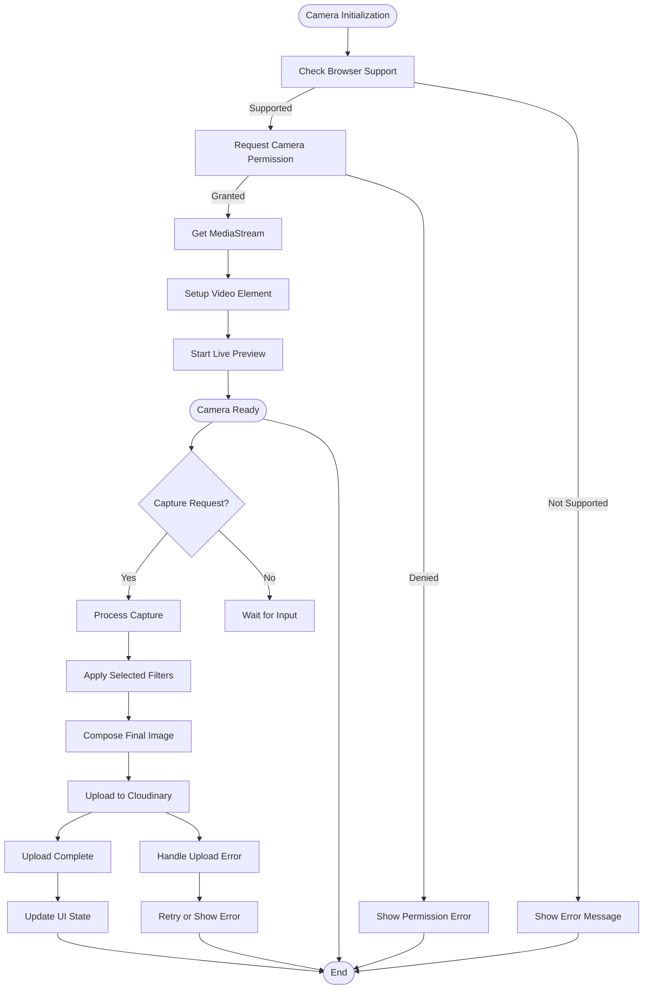
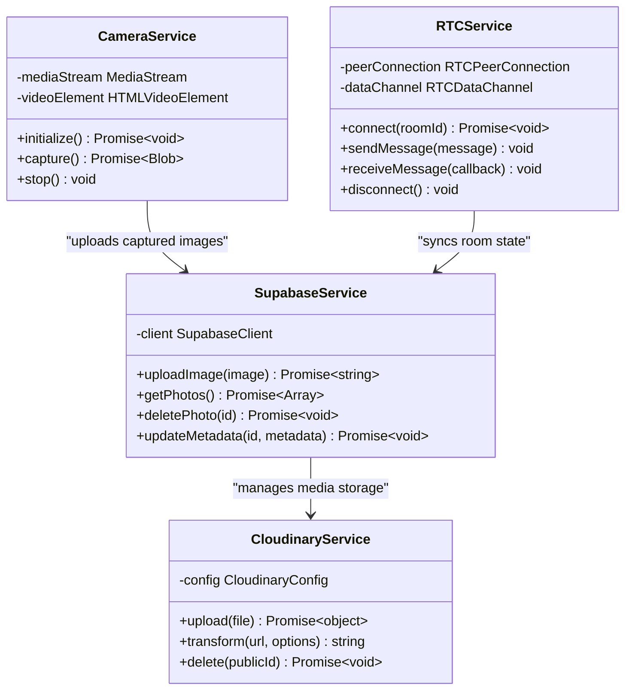
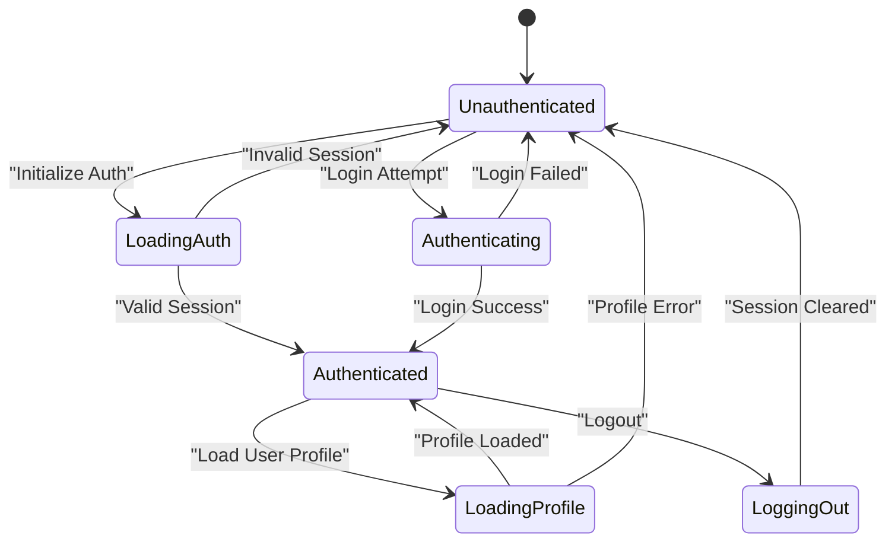
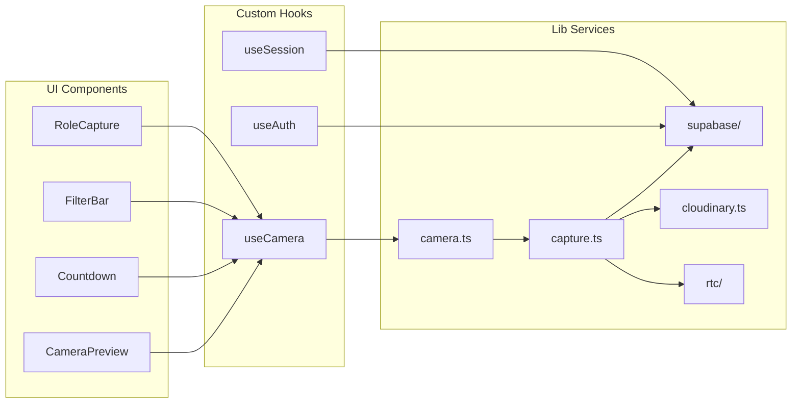

# Architecture Overview

<cite>
**Referenced Files in This Document**
- [layout.tsx](file://app/layout.tsx)
- [page.tsx](file://app/page.tsx)
- [booth/page.tsx](file://app/booth/page.tsx)
- [auth/callback/route.ts](file://app/auth/callback/route.ts)
- [camera.ts](file://lib/camera.ts)
- [capture.ts](file://lib/capture.ts)
- [supabase/index.ts](file://lib/supabase/index.ts)
- [cloudinary.ts](file://lib/cloudinary.ts)
- [rtc/index.ts](file://lib/rtc/index.ts)
- [useCamera.ts](file://hooks/useCamera.ts)
- [CameraPreview.tsx](file://components/CameraPreview.tsx)
- [sw.js](file://public/sw.js)
- [manifest.ts](file://app/manifest.ts)
</cite>

## Table of Contents
1. [Introduction](#introduction)
2. [Project Structure](#project-structure)
3. [Core Components](#core-components)
4. [Architecture Overview](#architecture-overview)
5. [Detailed Component Analysis](#detailed-component-analysis)
6. [Dependency Analysis](#dependency-analysis)
7. [Performance Considerations](#performance-considerations)
8. [Troubleshooting Guide](#troubleshooting-guide)
9. [Conclusion](#conclusion)

## Introduction

The Zuychin Photobooth system is a modern web-based photobooth application built with Next.js App Router architecture. It provides a comprehensive photo capture, editing, and sharing experience with real-time collaboration features. The system leverages cutting-edge web technologies including WebRTC for real-time communication, Supabase for backend services, and Cloudinary for media management.

The application follows a component-based architecture with clear separation between UI components, custom hooks, and business logic. It implements a service layer pattern for external integrations and supports Progressive Web App (PWA) capabilities for offline functionality.

## Project Structure

The Zuychin Photobooth system follows Next.js App Router conventions with a well-organized directory structure:

**Diagram sources**
- [layout.tsx](file://app/layout.tsx)
- [page.tsx](file://app/page.tsx)
- [booth/page.tsx](file://app/booth/page.tsx)

**Section sources**
- [layout.tsx](file://app/layout.tsx)
- [page.tsx](file://app/page.tsx)

## Core Components

### Application Layout and Root Structure

The root layout component establishes the foundation for the entire application, providing global context providers, authentication state management, and PWA configuration.

### Page Routes and Navigation

The application uses Next.js App Router for file-based routing with dedicated pages for different features:
- **Booth**: Main photobooth interface
- **Customize**: Photo customization and editing
- **Login**: Authentication flow
- **Relay**: Real-time collaboration features
- **Room**: Collaborative sessions
- **Timeline**: Photo history and gallery

### Component Architecture

The component hierarchy follows a modular approach with reusable UI elements:

**Diagram sources**
- [CameraPreview.tsx](file://components/CameraPreview.tsx)

**Section sources**
- [CameraPreview.tsx](file://components/CameraPreview.tsx)
- [Countdown.tsx](file://components/Countdown.tsx)
- [FilterBar.tsx](file://components/FilterBar.tsx)
- [RoleCapture.tsx](file://components/RoleCapture.tsx)

## Architecture Overview

The Zuychin Photobooth system implements a layered architecture with clear separation of concerns:

**Diagram sources**
- [camera.ts](file://lib/camera.ts)
- [capture.ts](file://lib/capture.ts)
- [supabase/index.ts](file://lib/supabase/index.ts)
- [cloudinary.ts](file://lib/cloudinary.ts)
- [rtc/index.ts](file://lib/rtc/index.ts)

### Data Flow Architecture

The system implements a unidirectional data flow pattern:

**Diagram sources**
- [useCamera.ts](file://hooks/useCamera.ts)
- [camera.ts](file://lib/camera.ts)
- [capture.ts](file://lib/capture.ts)

**Section sources**
- [camera.ts](file://lib/camera.ts)
- [capture.ts](file://lib/capture.ts)
- [useCamera.ts](file://hooks/useCamera.ts)

## Detailed Component Analysis

### Camera System Architecture

The camera system provides a robust abstraction over browser media APIs with error handling and state management:

**Diagram sources**
- [camera.ts](file://lib/camera.ts)
- [capture.ts](file://lib/capture.ts)

### Service Layer Pattern

The service layer abstracts external integrations behind clean interfaces:

**Diagram sources**
- [camera.ts](file://lib/camera.ts)
- [supabase/index.ts](file://lib/supabase/index.ts)
- [cloudinary.ts](file://lib/cloudinary.ts)
- [rtc/index.ts](file://lib/rtc/index.ts)

### Authentication and Session Management

The authentication system provides secure user management with session persistence:

**Diagram sources**
- [auth.tsx](file://lib/auth.tsx)
- [session.tsx](file://lib/session.tsx)

**Section sources**
- [camera.ts](file://lib/camera.ts)
- [capture.ts](file://lib/capture.ts)
- [auth.tsx](file://lib/auth.tsx)
- [session.tsx](file://lib/session.tsx)

## Dependency Analysis

The system maintains clear dependency boundaries with minimal coupling between components:

**Diagram sources**
- [useCamera.ts](file://hooks/useCamera.ts)
- [camera.ts](file://lib/camera.ts)
- [capture.ts](file://lib/capture.ts)

### External Dependencies

The system integrates with several external services:

| Service | Purpose | Integration Method |
|---------|---------|-------------------|
| Supabase | Database, Auth, Real-time | REST API + WebSocket |
| Cloudinary | Image Storage & Processing | REST API |
| WebRTC | Real-time Communication | Browser Native API |
| MediaPipe | AI-powered Features | WASM Module |

**Section sources**
- [supabase/index.ts](file://lib/supabase/index.ts)
- [cloudinary.ts](file://lib/cloudinary.ts)
- [rtc/index.ts](file://lib/rtc/index.ts)

## Performance Considerations

### Image Processing Optimization

The system implements several performance optimizations:
- **Lazy Loading**: Images and heavy components load on demand
- **Caching Strategy**: Browser cache and CDN caching for static assets
- **Memory Management**: Proper cleanup of media streams and event listeners
- **Compression**: Image compression before upload to reduce bandwidth usage

### Real-time Collaboration

Real-time features use efficient synchronization patterns:
- **Optimistic Updates**: Immediate UI updates with background sync
- **Conflict Resolution**: Last-write-wins strategy for concurrent edits
- **Bandwidth Optimization**: Delta updates instead of full state sync

### Progressive Web App Features

The PWA implementation includes:
- **Service Worker**: Background sync and offline caching
- **App Shell**: Fast initial load with cached core assets
- **Install Prompt**: Native app-like installation experience
- **Background Sync**: Queue operations when offline

**Section sources**
- [sw.js](file://public/sw.js)
- [manifest.ts](file://app/manifest.ts)

## Troubleshooting Guide

### Common Issues and Solutions

#### Camera Access Problems
- **Permission Denied**: Ensure HTTPS and explicit user gesture
- **MediaStream Errors**: Check browser compatibility and device availability
- **Performance Issues**: Monitor memory usage and stream cleanup

#### Authentication Issues
- **Session Expiration**: Implement automatic token refresh
- **Cross-origin Errors**: Configure CORS policies correctly
- **State Synchronization**: Use optimistic updates with rollback

#### Real-time Collaboration
- **Connection Drops**: Implement reconnection logic with exponential backoff
- **Message Ordering**: Use sequence numbers for message ordering
- **Conflict Resolution**: Implement proper conflict detection and resolution

### Debugging Strategies

1. **Network Monitoring**: Use browser dev tools to monitor API calls
2. **Performance Profiling**: Identify bottlenecks in image processing
3. **Error Boundaries**: Wrap components with error boundaries
4. **Logging Strategy**: Structured logging with appropriate log levels

**Section sources**
- [camera.ts](file://lib/camera.ts)
- [auth.tsx](file://lib/auth.tsx)
- [rtc/index.ts](file://lib/rtc/index.ts)

## Conclusion

The Zuychin Photobooth system demonstrates a well-architected modern web application that effectively separates concerns across UI components, business logic, and service layers. The implementation follows best practices for React applications with clear data flow patterns and robust error handling.

Key architectural strengths include:
- **Modular Design**: Clear separation between presentation, business logic, and services
- **Scalable Architecture**: Service layer pattern enables easy integration of new features
- **Performance Optimized**: Comprehensive caching and optimization strategies
- **User Experience**: Real-time collaboration and offline capabilities enhance usability

The system provides a solid foundation for future enhancements while maintaining code quality and maintainability through its well-defined architectural boundaries.