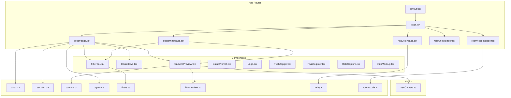
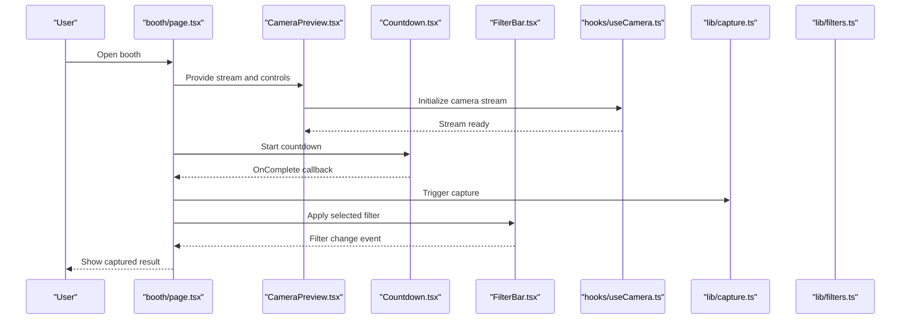
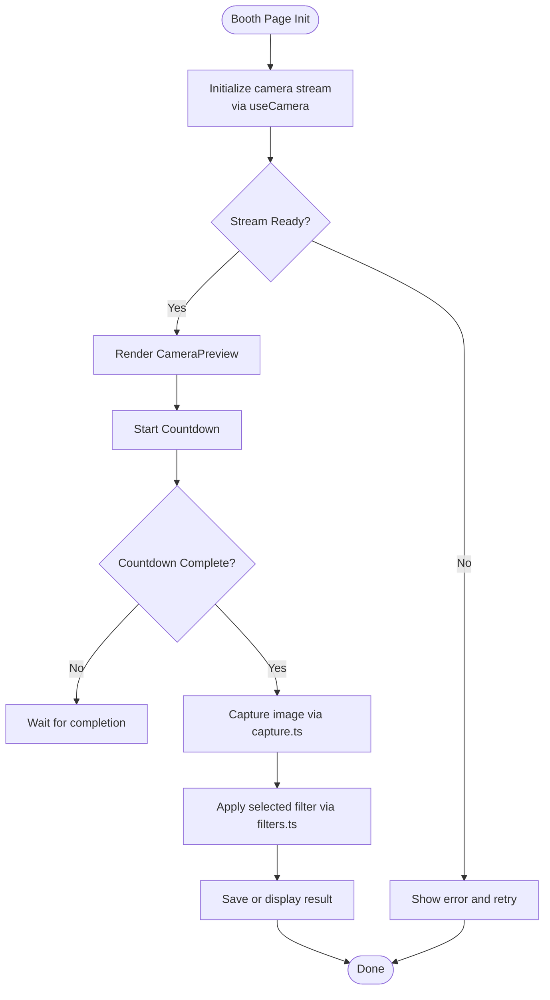
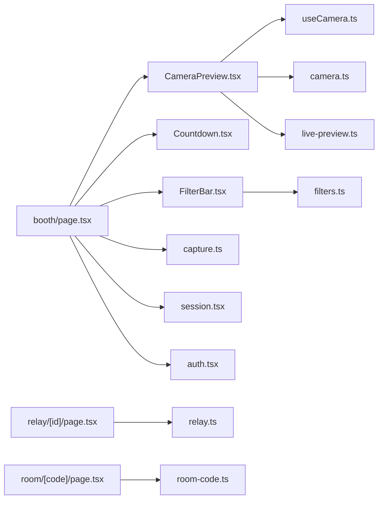

# Component Architecture

<cite>
**Referenced Files in This Document**
- [layout.tsx](file://app/layout.tsx)
- [page.tsx](file://app/page.tsx)
- [booth/page.tsx](file://app/booth/page.tsx)
- [customize/page.tsx](file://app/customize/page.tsx)
- [relay/[id]/page.tsx](file://app/relay/[id]/page.tsx)
- [relay/new/page.tsx](file://app/relay/new/page.tsx)
- [room/[code]/page.tsx](file://app/room/[code]/page.tsx)
- [CameraPreview.tsx](file://components/CameraPreview.tsx)
- [Countdown.tsx](file://components/Countdown.tsx)
- [FilterBar.tsx](file://components/FilterBar.tsx)
- [InstallPrompt.tsx](file://components/InstallPrompt.tsx)
- [Logo.tsx](file://components/Logo.tsx)
- [PushToggle.tsx](file://components/PushToggle.tsx)
- [PwaRegister.tsx](file://components/PwaRegister.tsx)
- [RoleCapture.tsx](file://components/RoleCapture.tsx)
- [StripMockup.tsx](file://components/StripMockup.tsx)
- [useCamera.ts](file://hooks/useCamera.ts)
- [auth.tsx](file://lib/auth.tsx)
- [session.tsx](file://lib/session.tsx)
- [camera.ts](file://lib/camera.ts)
- [capture.ts](file://lib/capture.ts)
- [filters.ts](file://lib/filters.ts)
- [live-preview.ts](file://lib/live-preview.ts)
- [relay.ts](file://lib/relay.ts)
- [room-code.ts](file://lib/room-code.ts)
</cite>

## Table of Contents
1. Introduction
2. Project Structure
3. Core Components
4. Architecture Overview
5. Detailed Component Analysis
6. Dependency Analysis
7. Performance Considerations
8. Troubleshooting Guide
9. Conclusion

## Introduction
This document explains the component architecture of Zuychin Photobooth, focusing on the Next.js App Router structure with page-based routing and server components. It details the component hierarchy from the root layout to specialized UI components such as CameraPreview, Countdown, and FilterBar. The guide clarifies the separation between presentational and container components, how features are organized (booth, customize, relay), and how shared components are reused across the application. It also covers component composition patterns, prop interfaces, event handling strategies, and the relationship between React components and custom hooks for state management.

## Project Structure
Zuychin Photobooth uses the Next.js App Router with a feature-oriented directory layout:
- app/: Defines routes via files and directories. Each route can be a client or server component depending on usage.
- components/: Reusable UI components used across pages and features.
- hooks/: Custom hooks encapsulating stateful logic and side effects.
- lib/: Utility modules for camera, capture, filters, session, auth, relay, and other domain logic.

Key routing surfaces:
- Root layout and home page at app/layout.tsx and app/page.tsx.
- Feature routes: booth, customize, relay, room, timeline, login.
- API routes under app/api for backend endpoints.

**Diagram sources**
- [layout.tsx](file://app/layout.tsx)
- [page.tsx](file://app/page.tsx)
- [booth/page.tsx](file://app/booth/page.tsx)
- [customize/page.tsx](file://app/customize/page.tsx)
- [relay/[id]/page.tsx](file://app/relay/[id]/page.tsx)
- [relay/new/page.tsx](file://app/relay/new/page.tsx)
- [room/[code]/page.tsx](file://app/room/[code]/page.tsx)
- [CameraPreview.tsx](file://components/CameraPreview.tsx)
- [Countdown.tsx](file://components/Countdown.tsx)
- [FilterBar.tsx](file://components/FilterBar.tsx)
- [InstallPrompt.tsx](file://components/InstallPrompt.tsx)
- [Logo.tsx](file://components/Logo.tsx)
- [PushToggle.tsx](file://components/PushToggle.tsx)
- [PwaRegister.tsx](file://components/PwaRegister.tsx)
- [RoleCapture.tsx](file://components/RoleCapture.tsx)
- [StripMockup.tsx](file://components/StripMockup.tsx)
- [useCamera.ts](file://hooks/useCamera.ts)
- [camera.ts](file://lib/camera.ts)
- [capture.ts](file://lib/capture.ts)
- [filters.ts](file://lib/filters.ts)
- [live-preview.ts](file://lib/live-preview.ts)
- [relay.ts](file://lib/relay.ts)
- [room-code.ts](file://lib/room-code.ts)

**Section sources**
- [layout.tsx](file://app/layout.tsx)
- [page.tsx](file://app/page.tsx)
- [booth/page.tsx](file://app/booth/page.tsx)
- [customize/page.tsx](file://app/customize/page.tsx)
- [relay/[id]/page.tsx](file://app/relay/[id]/page.tsx)
- [relay/new/page.tsx](file://app/relay/new/page.tsx)
- [room/[code]/page.tsx](file://app/room/[code]/page.tsx)

## Core Components
The core UI is composed of small, focused components that are reused across features:
- CameraPreview: Renders live camera feed and overlays. Manages media stream lifecycle and integrates with capture and live preview utilities.
- Countdown: Displays countdown animations and triggers actions when complete.
- FilterBar: Presents available filters and emits selection events to parent containers.
- InstallPrompt, PushToggle, PwaRegister: Progressive Web App helpers for installation and push notifications.
- Logo, StripMockup, RoleCapture: Presentational assets and role-specific capture UI.

These components are primarily presentational and receive data via props and emit events through callbacks. Stateful behavior is delegated to custom hooks and lib modules.

**Section sources**
- [CameraPreview.tsx](file://components/CameraPreview.tsx)
- [Countdown.tsx](file://components/Countdown.tsx)
- [FilterBar.tsx](file://components/FilterBar.tsx)
- [InstallPrompt.tsx](file://components/InstallPrompt.tsx)
- [PushToggle.tsx](file://components/PushToggle.tsx)
- [PwaRegister.tsx](file://components/PwaRegister.tsx)
- [Logo.tsx](file://components/Logo.tsx)
- [StripMockup.tsx](file://components/StripMockup.tsx)
- [RoleCapture.tsx](file://components/RoleCapture.tsx)

## Architecture Overview
The application follows a clear separation of concerns:
- Layout and pages orchestrate routing and compose feature-specific containers.
- Container components manage state, side effects, and business logic using custom hooks and lib modules.
- Presentational components render UI based on props and emit events upward.

**Diagram sources**
- [booth/page.tsx](file://app/booth/page.tsx)
- [CameraPreview.tsx](file://components/CameraPreview.tsx)
- [Countdown.tsx](file://components/Countdown.tsx)
- [FilterBar.tsx](file://components/FilterBar.tsx)
- [useCamera.ts](file://hooks/useCamera.ts)
- [capture.ts](file://lib/capture.ts)
- [filters.ts](file://lib/filters.ts)

## Detailed Component Analysis

### Root Layout and Pages
- app/layout.tsx defines the global shell, metadata, and providers. It may include PWA registration and authentication context providers.
- app/page.tsx serves as the landing entry point and typically redirects or composes initial feature views.

Responsibilities:
- Global styles and theme setup.
- Providers for auth and session contexts.
- Routing decisions and initial data fetching where appropriate.

**Section sources**
- [layout.tsx](file://app/layout.tsx)
- [page.tsx](file://app/page.tsx)

### Feature: Booth
The booth page orchestrates the photo capture flow:
- Composes CameraPreview, Countdown, and FilterBar.
- Uses useCamera hook to manage media streams and permissions.
- Integrates capture and filter utilities to produce final images.
- Handles user interactions like starting countdown, applying filters, and saving results.

**Diagram sources**
- [booth/page.tsx](file://app/booth/page.tsx)
- [useCamera.ts](file://hooks/useCamera.ts)
- [capture.ts](file://lib/capture.ts)
- [filters.ts](file://lib/filters.ts)

**Section sources**
- [booth/page.tsx](file://app/booth/page.tsx)

### Feature: Customize
The customize page focuses on editing and previewing photos:
- Uses CameraPreview for live adjustments and FilterBar for selecting visual effects.
- May integrate additional editing utilities from lib (e.g., segmentation, layouts).
- Emits save or export events to persist changes.

**Section sources**
- [customize/page.tsx](file://app/customize/page.tsx)

### Feature: Relay
Relay routes enable real-time sharing and collaboration:
- relay/[id]/page.tsx displays an active relay session.
- relay/new/page.tsx creates a new relay session.
- Integrates with lib/relay.ts for signaling and media distribution.

**Section sources**
- [relay/[id]/page.tsx](file://app/relay/[id]/page.tsx)
- [relay/new/page.tsx](file://app/relay/new/page.tsx)

### Room Code Flow
Room-based access uses dynamic segments:
- room/[code]/page.tsx resolves room code and joins a session.
- Uses lib/room-code.ts to validate and manage codes.

**Section sources**
- [room/[code]/page.tsx](file://app/room/[code]/page.tsx)
- [room-code.ts](file://lib/room-code.ts)

### Presentational vs Container Components
- Presentational components (e.g., CameraPreview, Countdown, FilterBar) focus on rendering and user interaction without owning complex state. They accept props and emit events via callbacks.
- Container components (feature pages) own state, orchestrate side effects, and coordinate multiple presentational components.

Composition patterns:
- Props interface-driven contracts for predictable data flow.
- Event-driven communication using callbacks and custom events.
- Context providers for cross-cutting concerns like auth and session.

**Section sources**
- [CameraPreview.tsx](file://components/CameraPreview.tsx)
- [Countdown.tsx](file://components/Countdown.tsx)
- [FilterBar.tsx](file://components/FilterBar.tsx)

### Relationship Between Components and Custom Hooks
Custom hooks encapsulate stateful logic and side effects:
- useCamera.ts manages camera initialization, stream lifecycle, and permission handling.
- Other hooks (if any) would similarly abstract browser APIs and async operations.

Benefits:
- Reusability across components.
- Testability by isolating logic from UI.
- Clear separation of concerns.

**Section sources**
- [useCamera.ts](file://hooks/useCamera.ts)

### Prop Interfaces and Event Handling Strategies
- Props interfaces define required and optional fields for each component, ensuring type safety and clarity.
- Event handling strategies rely on callback props (e.g., onCountdownComplete, onFilterChange) to propagate user actions upward.
- For complex flows, components may emit structured events containing payloads (e.g., captured image blob, filter metadata).

Best practices:
- Keep props minimal and explicit.
- Use stable callback references to avoid unnecessary re-renders.
- Validate inputs at boundaries (e.g., permissions, stream availability).

[No sources needed since this section provides general guidance]

## Dependency Analysis
The following diagram maps key dependencies among components, hooks, and libraries:

**Diagram sources**
- [booth/page.tsx](file://app/booth/page.tsx)
- [CameraPreview.tsx](file://components/CameraPreview.tsx)
- [Countdown.tsx](file://components/Countdown.tsx)
- [FilterBar.tsx](file://components/FilterBar.tsx)
- [useCamera.ts](file://hooks/useCamera.ts)
- [camera.ts](file://lib/camera.ts)
- [live-preview.ts](file://lib/live-preview.ts)
- [capture.ts](file://lib/capture.ts)
- [filters.ts](file://lib/filters.ts)
- [session.tsx](file://lib/session.tsx)
- [auth.tsx](file://lib/auth.tsx)
- [relay/[id]/page.tsx](file://app/relay/[id]/page.tsx)
- [relay.ts](file://lib/relay.ts)
- [room/[code]/page.tsx](file://app/room/[code]/page.tsx)
- [room-code.ts](file://lib/room-code.ts)

**Section sources**
- [booth/page.tsx](file://app/booth/page.tsx)
- [CameraPreview.tsx](file://components/CameraPreview.tsx)
- [Countdown.tsx](file://components/Countdown.tsx)
- [FilterBar.tsx](file://components/FilterBar.tsx)
- [useCamera.ts](file://hooks/useCamera.ts)
- [camera.ts](file://lib/camera.ts)
- [live-preview.ts](file://lib/live-preview.ts)
- [capture.ts](file://lib/capture.ts)
- [filters.ts](file://lib/filters.ts)
- [session.tsx](file://lib/session.tsx)
- [auth.tsx](file://lib/auth.tsx)
- [relay/[id]/page.tsx](file://app/relay/[id]/page.tsx)
- [relay.ts](file://lib/relay.ts)
- [room/[code]/page.tsx](file://app/room/[code]/page.tsx)
- [room-code.ts](file://lib/room-code.ts)

## Performance Considerations
- Prefer client components only where interactivity is necessary; keep heavy rendering in server components when possible.
- Memoize expensive computations and callbacks to reduce re-renders.
- Defer non-critical tasks (e.g., analytics, PWA registration) until after initial paint.
- Optimize camera stream resolution and frame rate based on device capabilities.
- Batch state updates and avoid frequent re-renders in hot paths like live preview.

[No sources needed since this section provides general guidance]

## Troubleshooting Guide
Common issues and resolutions:
- Camera permission denied: Ensure HTTPS and user gesture before requesting permissions. Validate stream availability before rendering CameraPreview.
- Countdown not triggering: Verify event propagation and callback wiring in booth page.
- Filters not applied: Confirm filter selection state and pipeline integration with capture utility.
- Relay connection failures: Check signaling endpoints and network connectivity; log errors from relay module.
- Room code invalid: Validate format and existence before joining; provide clear feedback to users.

**Section sources**
- [booth/page.tsx](file://app/booth/page.tsx)
- [CameraPreview.tsx](file://components/CameraPreview.tsx)
- [Countdown.tsx](file://components/Countdown.tsx)
- [FilterBar.tsx](file://components/FilterBar.tsx)
- [relay.ts](file://lib/relay.ts)
- [room-code.ts](file://lib/room-code.ts)

## Conclusion
Zuychin Photobooth’s component architecture leverages Next.js App Router for clean, feature-based routing and a clear separation between presentational and container components. Custom hooks encapsulate stateful logic, while lib modules handle domain responsibilities. This design promotes reusability, testability, and maintainability, enabling smooth photo capture, customization, and relay experiences across devices.