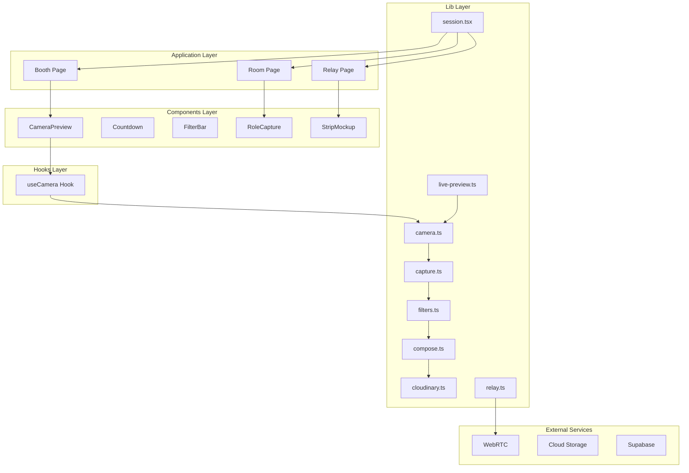
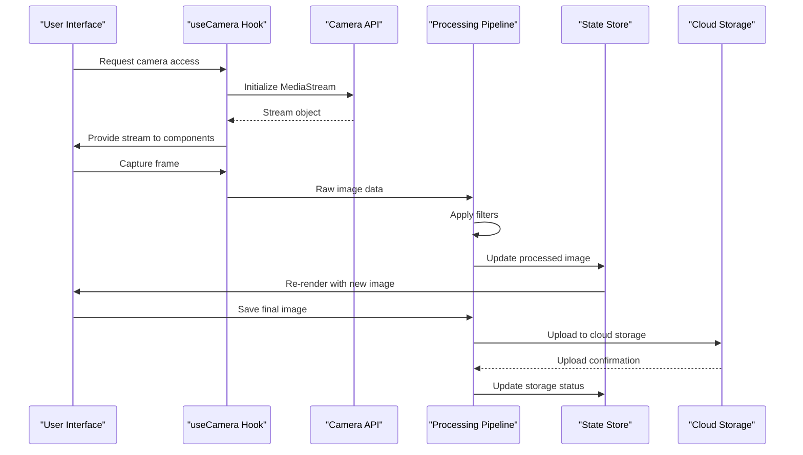
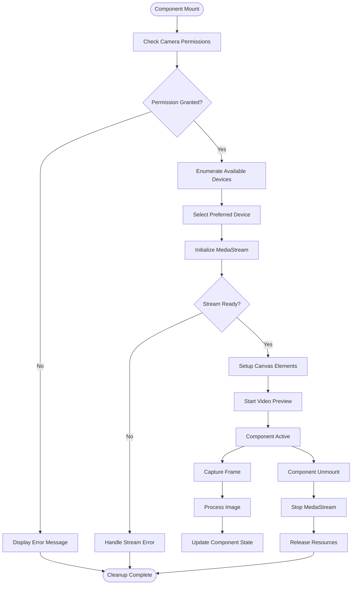
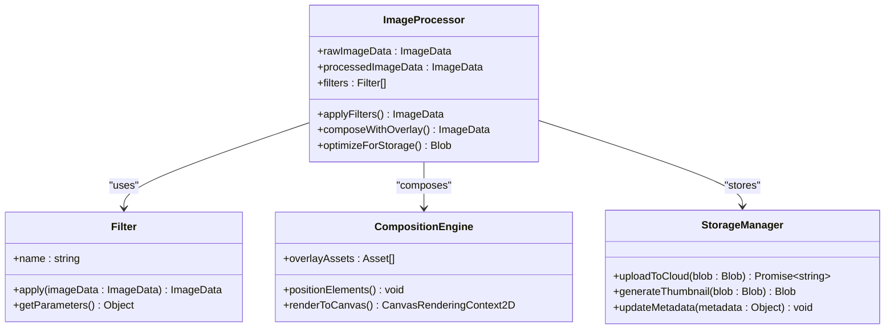
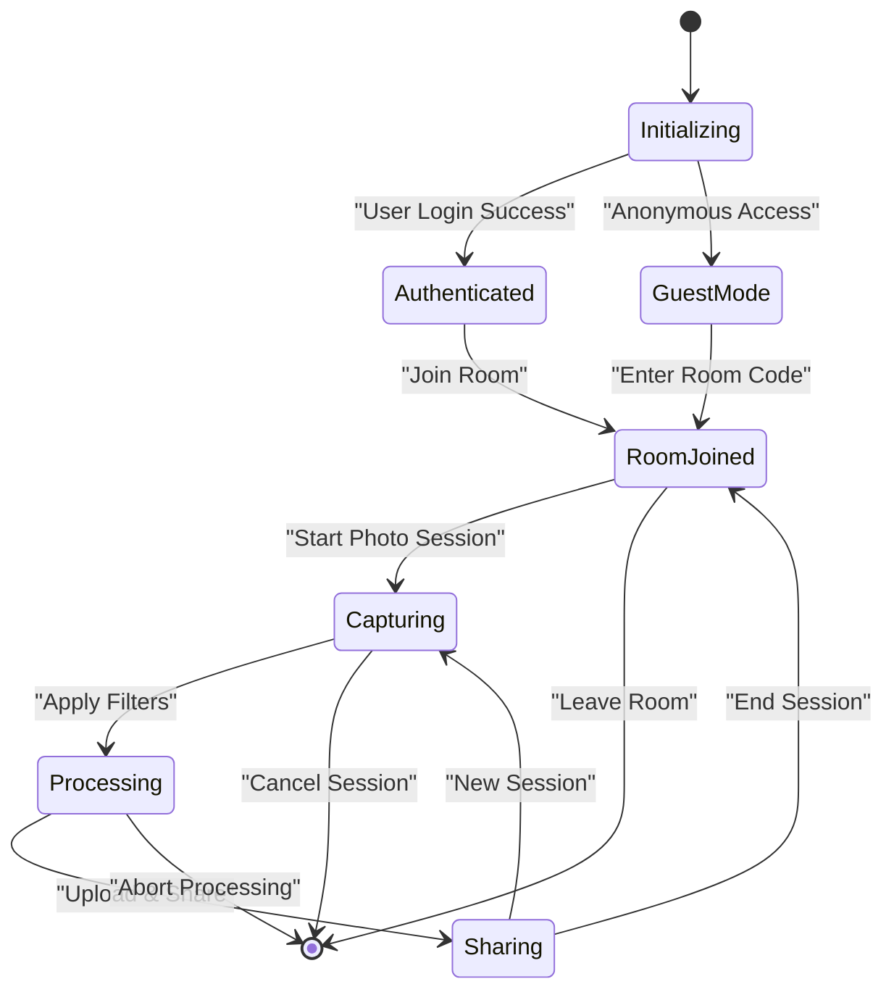
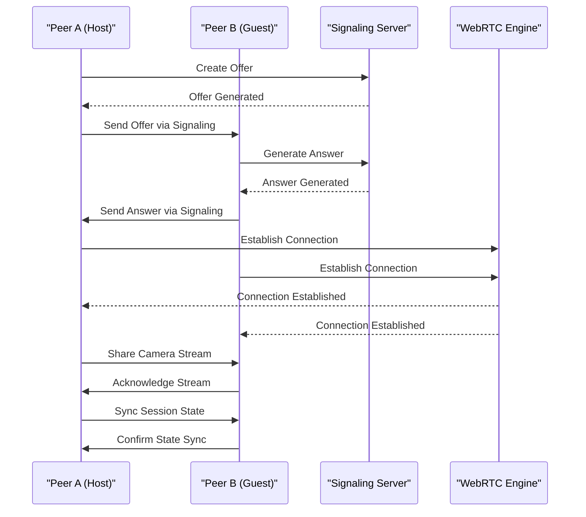
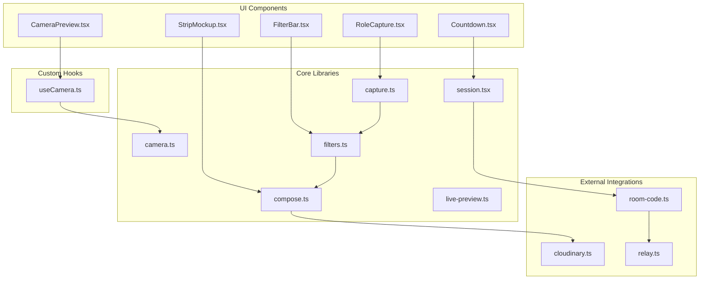

# Data Flow Patterns

<cite>
**Referenced Files in This Document**
- [useCamera.ts](file://hooks/useCamera.ts)
- [camera.ts](file://lib/camera.ts)
- [session.tsx](file://lib/session.tsx)
- [live-preview.ts](file://lib/live-preview.ts)
- [capture.ts](file://lib/capture.ts)
- [filters.ts](file://lib/filters.ts)
- [compose.ts](file://lib/compose.ts)
- [segmentation.ts](file://lib/segmentation.ts)
- [cloudinary.ts](file://lib/cloudinary.ts)
- [relay.ts](file://lib/relay.ts)
- [room-code.ts](file://lib/room-code.ts)
- [CameraPreview.tsx](file://components/CameraPreview.tsx)
- [Countdown.tsx](file://components/Countdown.tsx)
- [FilterBar.tsx](file://components/FilterBar.tsx)
- [RoleCapture.tsx](file://components/RoleCapture.tsx)
- [StripMockup.tsx](file://components/StripMockup.tsx)
- [booth/page.tsx](file://app/booth/page.tsx)
- [room/[code]/page.tsx](file://app/room/[code]/page.tsx)
- [relay/[id]/page.tsx](file://app/relay/[id]/page.tsx)
</cite>

## Table of Contents
1. [Introduction](#introduction)
2. [Project Structure](#project-structure)
3. [Core Components](#core-components)
4. [Architecture Overview](#architecture-overview)
5. [Detailed Component Analysis](#detailed-component-analysis)
6. [Dependency Analysis](#dependency-analysis)
7. [Performance Considerations](#performance-considerations)
8. [Troubleshooting Guide](#troubleshooting-guide)
9. [Conclusion](#conclusion)

## Introduction

Zuychin Photobooth is a sophisticated web-based photobooth application that implements complex data flow patterns to handle real-time camera capture, image processing, session management, and WebRTC peer-to-peer communication. The application follows modern React architecture patterns with custom hooks for state management and context providers for global state synchronization.

The core data flow encompasses bidirectional communication between camera streams, processing pipelines, storage systems, and display components, ensuring seamless user experience across multiple devices and network conditions.

## Project Structure

The application follows a modular architecture with clear separation of concerns:

**Diagram sources**
- [booth/page.tsx](file://app/booth/page.tsx)
- [room/[code]/page.tsx](file://app/room/[code]/page.tsx)
- [relay/[id]/page.tsx](file://app/relay/[id]/page.tsx)
- [CameraPreview.tsx](file://components/CameraPreview.tsx)
- [useCamera.ts](file://hooks/useCamera.ts)
- [camera.ts](file://lib/camera.ts)

**Section sources**
- [booth/page.tsx](file://app/booth/page.tsx)
- [room/[code]/page.tsx](file://app/room/[code]/page.tsx)
- [relay/[id]/page.tsx](file://app/relay/[id]/page.tsx)

## Core Components

### Camera Stream Management

The camera system is built around a custom hook that manages media stream lifecycle, error handling, and resource cleanup. The implementation follows React best practices for managing external resources and provides a clean interface for components to consume camera functionality.

### Session State Management

Global state management is implemented through context providers that maintain application-wide state including user sessions, room configurations, and shared data across components. This pattern ensures consistent state synchronization throughout the application lifecycle.

### Real-time Communication

WebRTC integration enables peer-to-peer communication for live collaboration features, allowing multiple users to share camera feeds and synchronized experiences across devices.

**Section sources**
- [useCamera.ts](file://hooks/useCamera.ts)
- [session.tsx](file://lib/session.tsx)
- [relay.ts](file://lib/relay.ts)

## Architecture Overview

The application implements a layered architecture pattern with clear separation between presentation, business logic, and data management layers.

**Diagram sources**
- [useCamera.ts](file://hooks/useCamera.ts)
- [camera.ts](file://lib/camera.ts)
- [capture.ts](file://lib/capture.ts)
- [filters.ts](file://lib/filters.ts)
- [cloudinary.ts](file://lib/cloudinary.ts)

## Detailed Component Analysis

### Camera Stream Lifecycle Management

The camera system implements a robust lifecycle management pattern that handles device enumeration, stream initialization, error recovery, and resource cleanup.

**Diagram sources**
- [useCamera.ts](file://hooks/useCamera.ts)
- [camera.ts](file://lib/camera.ts)

### Image Processing Pipeline

The processing pipeline transforms raw camera captures through multiple stages including filtering, composition, and optimization before storage.

**Diagram sources**
- [filters.ts](file://lib/filters.ts)
- [compose.ts](file://lib/compose.ts)
- [capture.ts](file://lib/capture.ts)

### Session Context Provider Pattern

The session management implements a context provider pattern that maintains global state across the application, handling authentication, room membership, and shared configuration.

**Diagram sources**
- [session.tsx](file://lib/session.tsx)

### WebRTC Real-time Synchronization

The WebRTC implementation enables real-time data synchronization between peers, supporting features like shared camera feeds, collaborative editing, and synchronized photo sessions.

**Diagram sources**
- [relay.ts](file://lib/relay.ts)
- [room-code.ts](file://lib/room-code.ts)

**Section sources**
- [useCamera.ts](file://hooks/useCamera.ts)
- [filters.ts](file://lib/filters.ts)
- [compose.ts](file://lib/compose.ts)
- [session.tsx](file://lib/session.tsx)
- [relay.ts](file://lib/relay.ts)

## Dependency Analysis

The application exhibits a well-structured dependency hierarchy with clear separation between UI components, business logic, and external integrations.

**Diagram sources**
- [CameraPreview.tsx](file://components/CameraPreview.tsx)
- [Countdown.tsx](file://components/Countdown.tsx)
- [FilterBar.tsx](file://components/FilterBar.tsx)
- [RoleCapture.tsx](file://components/RoleCapture.tsx)
- [StripMockup.tsx](file://components/StripMockup.tsx)
- [useCamera.ts](file://hooks/useCamera.ts)
- [camera.ts](file://lib/camera.ts)
- [capture.ts](file://lib/capture.ts)
- [filters.ts](file://lib/filters.ts)
- [compose.ts](file://lib/compose.ts)
- [session.tsx](file://lib/session.tsx)
- [live-preview.ts](file://lib/live-preview.ts)
- [cloudinary.ts](file://lib/cloudinary.ts)
- [relay.ts](file://lib/relay.ts)
- [room-code.ts](file://lib/room-code.ts)

**Section sources**
- [CameraPreview.tsx](file://components/CameraPreview.tsx)
- [useCamera.ts](file://hooks/useCamera.ts)
- [camera.ts](file://lib/camera.ts)
- [capture.ts](file://lib/capture.ts)
- [filters.ts](file://lib/filters.ts)
- [compose.ts](file://lib/compose.ts)
- [session.tsx](file://lib/session.tsx)
- [cloudinary.ts](file://lib/cloudinary.ts)
- [relay.ts](file://lib/relay.ts)
- [room-code.ts](file://lib/room-code.ts)

## Performance Considerations

### Large Image Data Handling

The application implements several strategies to handle large image data efficiently:

- **Lazy Loading**: Images are loaded on-demand rather than preloading all assets
- **Progressive Enhancement**: Lower resolution previews are shown while full-resolution images load
- **Memory Management**: Proper cleanup of canvas elements and blob objects to prevent memory leaks
- **Compression**: Automatic image compression before upload to reduce bandwidth usage

### Real-time Update Optimization

Real-time synchronization uses efficient update patterns:

- **Debounced Updates**: Frequent state updates are debounced to prevent excessive re-renders
- **Selective Rendering**: Only components with changed data are re-rendered
- **WebSocket Optimization**: Connection pooling and message batching for better performance
- **Caching Strategy**: Intelligent caching of frequently accessed data and computed values

### Camera Stream Optimization

Camera stream management includes performance optimizations:

- **Resolution Scaling**: Automatic resolution adjustment based on device capabilities
- **Frame Rate Control**: Dynamic frame rate adjustment based on processing load
- **Background Processing**: Heavy processing operations run in background threads
- **Resource Cleanup**: Immediate release of camera resources when not in use

## Troubleshooting Guide

### Common Camera Issues

- **Permission Denied**: Ensure browser permissions are granted for camera access
- **Stream Not Starting**: Verify camera device availability and proper initialization
- **Poor Quality**: Check network conditions and adjust stream quality settings
- **Memory Leaks**: Monitor memory usage and ensure proper cleanup of camera resources

### Session Management Problems

- **State Inconsistency**: Clear browser cache and reload the application
- **Authentication Failures**: Verify token validity and refresh authentication if needed
- **Room Connection Issues**: Check network connectivity and firewall settings

### Performance Issues

- **Slow Processing**: Reduce image resolution or disable heavy filters
- **Memory Usage**: Close unused tabs and monitor browser memory allocation
- **Network Latency**: Optimize image sizes and use CDN for asset delivery

**Section sources**
- [useCamera.ts](file://hooks/useCamera.ts)
- [session.tsx](file://lib/session.tsx)
- [camera.ts](file://lib/camera.ts)

## Conclusion

Zuychin Photobooth demonstrates sophisticated data flow patterns that effectively manage complex real-time interactions between camera streams, processing pipelines, and distributed systems. The application's architecture emphasizes modularity, performance optimization, and user experience through careful state management and efficient data transformation.

Key strengths include:

- **Modular Design**: Clear separation of concerns with well-defined interfaces
- **Performance Focus**: Optimized handling of large image data and real-time updates
- **Robust Error Handling**: Comprehensive error recovery and user feedback mechanisms
- **Scalable Architecture**: Support for multiple concurrent users and devices

The implementation serves as an excellent example of modern web application architecture patterns, particularly for applications requiring real-time multimedia processing and distribution.