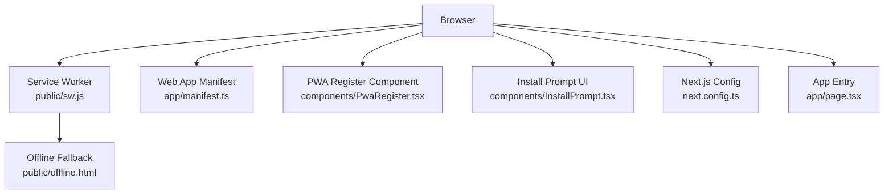
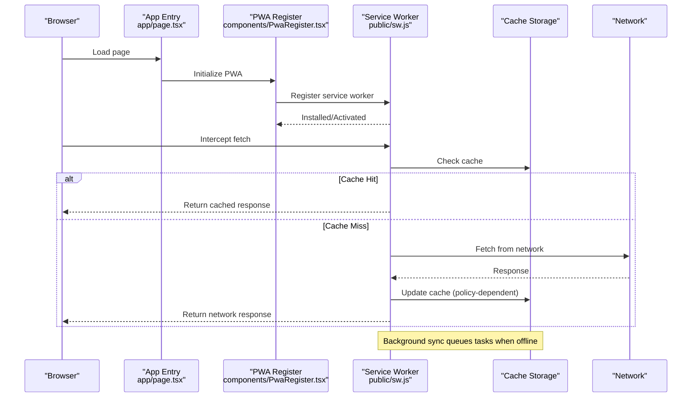
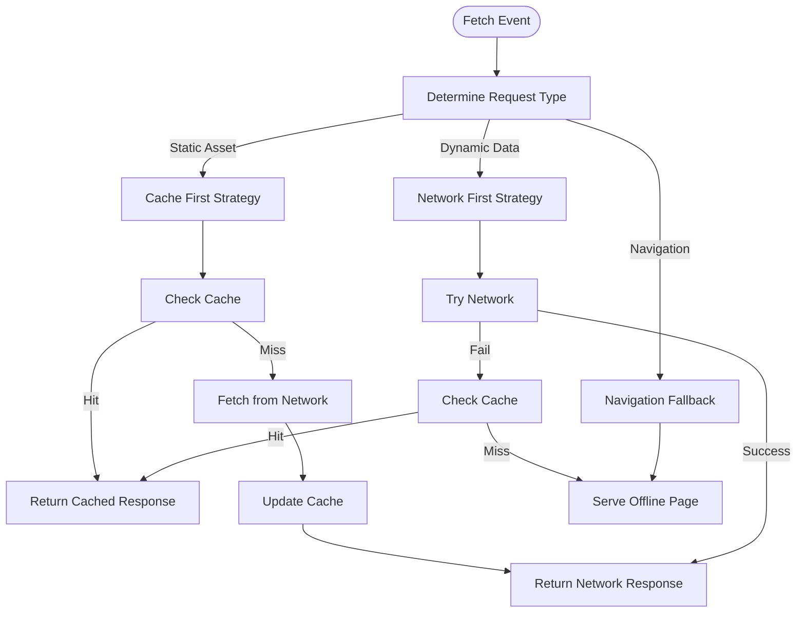
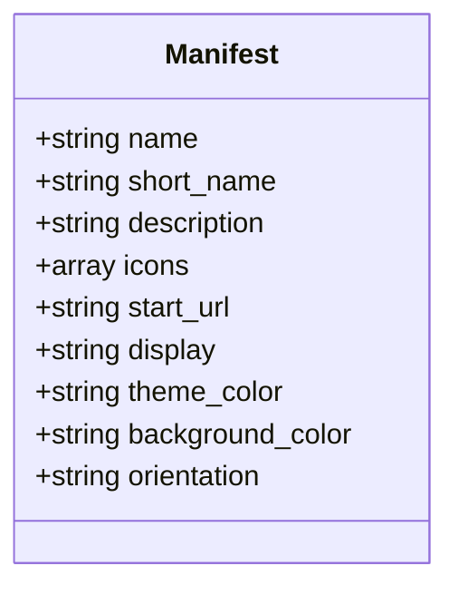
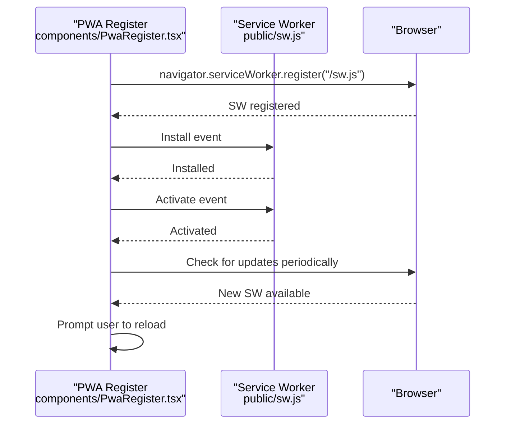
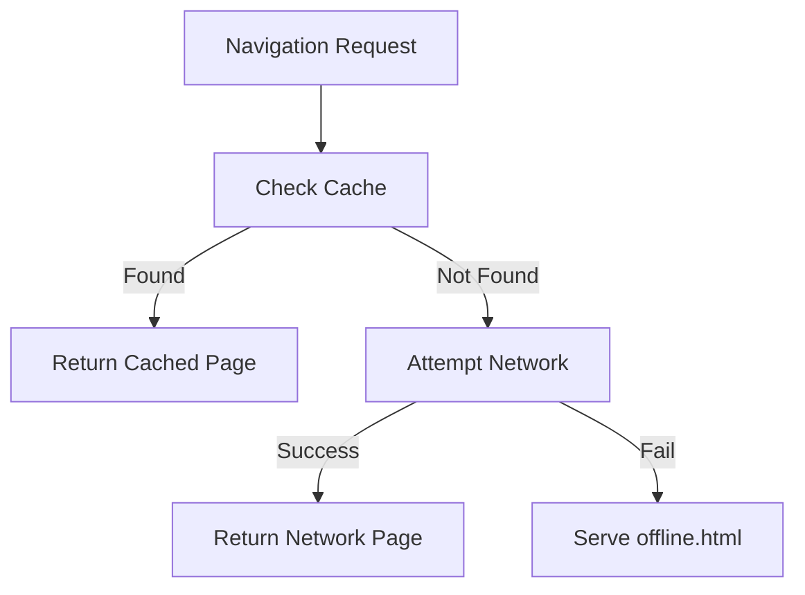
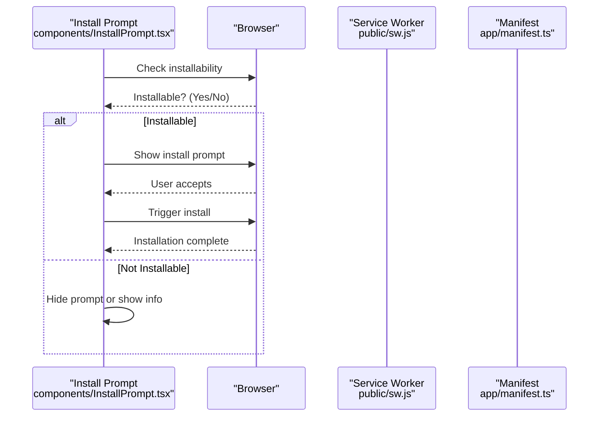
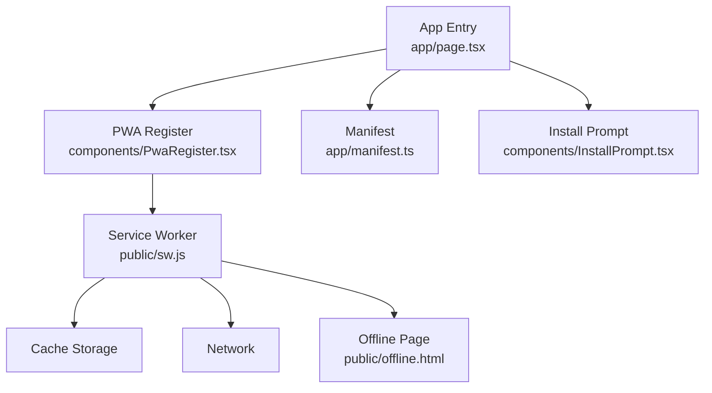

# Progressive Web App Architecture

<cite>
**Referenced Files in This Document**
- [sw.js](file://public/sw.js)
- [manifest.ts](file://app/manifest.ts)
- [PwaRegister.tsx](file://components/PwaRegister.tsx)
- [offline.html](file://public/offline.html)
- [InstallPrompt.tsx](file://components/InstallPrompt.tsx)
- [next.config.ts](file://next.config.ts)
- [page.tsx](file://app/page.tsx)
</cite>

## Table of Contents
1. [Introduction](#introduction)
2. [Project Structure](#project-structure)
3. [Core Components](#core-components)
4. [Architecture Overview](#architecture-overview)
5. [Detailed Component Analysis](#detailed-component-analysis)
6. [Dependency Analysis](#dependency-analysis)
7. [Performance Considerations](#performance-considerations)
8. [Troubleshooting Guide](#troubleshooting-guide)
9. [Conclusion](#conclusion)

## Introduction
This document explains the Progressive Web App (PWA) architecture for Zuychin Photobooth, focusing on offline capabilities, installability, caching strategies, and performance optimizations. It covers the service worker implementation, web app manifest configuration, PWA registration lifecycle, asset preloading, runtime caching policies, fallback mechanisms, and deployment-oriented optimizations such as bundle splitting and lazy loading.

## Project Structure
The PWA-related assets and logic are organized across a few key files:
- Service Worker: public/sw.js
- Web App Manifest: app/manifest.ts
- PWA Registration Component: components/PwaRegister.tsx
- Offline Fallback Page: public/offline.html
- Install Prompt UI: components/InstallPrompt.tsx
- Next.js Configuration: next.config.ts
- Application Entry Point: app/page.tsx

**Diagram sources**
- [sw.js](file://public/sw.js)
- [manifest.ts](file://app/manifest.ts)
- [PwaRegister.tsx](file://components/PwaRegister.tsx)
- [offline.html](file://public/offline.html)
- [InstallPrompt.tsx](file://components/InstallPrompt.tsx)
- [next.config.ts](file://next.config.ts)
- [page.tsx](file://app/page.tsx)

**Section sources**
- [sw.js](file://public/sw.js)
- [manifest.ts](file://app/manifest.ts)
- [PwaRegister.tsx](file://components/PwaRegister.tsx)
- [offline.html](file://public/offline.html)
- [InstallPrompt.tsx](file://components/InstallPrompt.tsx)
- [next.config.ts](file://next.config.ts)
- [page.tsx](file://app/page.tsx)

## Core Components
- Service Worker (SW): Provides offline caching, background sync, and request interception to implement cache-first and network-first strategies.
- Web App Manifest: Declares app metadata, icons, display mode, theme colors, and start URL to enable installation and immersive display.
- PWA Register Component: Registers the service worker, handles updates, and manages lifecycle events.
- Offline Fallback Page: Serves a user-friendly offline state when resources are unavailable.
- Install Prompt UI: Guides users through installing the app when supported by the browser.
- Next.js Configuration: Controls build-time and runtime behaviors relevant to PWA deployment.
- App Entry Point: Initializes PWA features and integrates with the rest of the application.

**Section sources**
- [sw.js](file://public/sw.js)
- [manifest.ts](file://app/manifest.ts)
- [PwaRegister.tsx](file://components/PwaRegister.tsx)
- [offline.html](file://public/offline.html)
- [InstallPrompt.tsx](file://components/InstallPrompt.tsx)
- [next.config.ts](file://next.config.ts)
- [page.tsx](file://app/page.tsx)

## Architecture Overview
At runtime, the browser loads the app entry point and registers the service worker via the PWA register component. The manifest is fetched automatically by the browser to support installation and display modes. The service worker intercepts network requests and applies caching strategies based on resource type. Background sync queues tasks when offline and executes them when connectivity returns.

**Diagram sources**
- [page.tsx](file://app/page.tsx)
- [PwaRegister.tsx](file://components/PwaRegister.tsx)
- [sw.js](file://public/sw.js)

## Detailed Component Analysis

### Service Worker Implementation
Responsibilities:
- Intercepts fetch events to apply caching strategies per resource type.
- Implements cache-first for static assets (HTML, CSS, JS, images) to ensure fast offline access.
- Implements network-first for dynamic data (API responses) to prioritize fresh content while falling back to cache when offline.
- Manages background sync to defer operations until connectivity is available.
- Caches critical shell resources during install or activation to bootstrap offline functionality.

Key behaviors:
- Cache-first strategy:
  - On fetch, check cache; if present, return immediately.
  - If not present, fetch from network, then optionally update cache.
- Network-first strategy:
  - On fetch, attempt network first; on failure, return cached version if available.
- Background sync:
  - Queue messages or API calls when offline; execute when online.
- Fallback handling:
  - Serve offline.html for navigation requests when no cache exists.

**Diagram sources**
- [sw.js](file://public/sw.js)
- [offline.html](file://public/offline.html)

**Section sources**
- [sw.js](file://public/sw.js)
- [offline.html](file://public/offline.html)

### Web App Manifest Configuration
Purpose:
- Defines app name, description, icons, start URL, display mode, theme color, and orientation to enable installation and immersive experience.
- Ensures the app can be installed on supported platforms and run in standalone or minimal-ui modes.

Key aspects:
- Icons: Provide multiple resolutions for various device densities.
- Display mode: Choose between standalone, fullscreen, or minimal-ui.
- Theme color: Sets status bar and UI chrome color on mobile devices.
- Start URL: Determines the initial route when launching from the home screen.

**Diagram sources**
- [manifest.ts](file://app/manifest.ts)

**Section sources**
- [manifest.ts](file://app/manifest.ts)

### PWA Register Component
Responsibilities:
- Registers the service worker with the browser.
- Handles service worker updates by detecting new versions and prompting refresh.
- Subscribes to lifecycle events (installing, installed, activating, activated).
- Integrates with push notifications and background sync APIs where applicable.

Lifecycle flow:
- On mount, register the service worker.
- Listen for updates; when a new SW is available, prompt the user to reload.
- Ensure the active SW controls the page after activation.

**Diagram sources**
- [PwaRegister.tsx](file://components/PwaRegister.tsx)
- [sw.js](file://public/sw.js)

**Section sources**
- [PwaRegister.tsx](file://components/PwaRegister.tsx)
- [sw.js](file://public/sw.js)

### Offline Fallback Mechanisms
Behavior:
- When a navigation request cannot be fulfilled due to lack of connectivity or missing cache, serve a friendly offline page.
- Provide clear messaging and actions (e.g., retry, go home) to improve user experience.

Implementation notes:
- Intercept navigation requests in the service worker.
- If cache miss and network error, respond with offline.html.
- Ensure offline.html is lightweight and self-contained.

**Diagram sources**
- [sw.js](file://public/sw.js)
- [offline.html](file://public/offline.html)

**Section sources**
- [sw.js](file://public/sw.js)
- [offline.html](file://public/offline.html)

### Install Prompt UI
Purpose:
- Detects whether the app is installable based on manifest and service worker registration.
- Presents an install button or banner to guide users through installation.
- Handles platform-specific prompts and errors gracefully.

User flow:
- Check installability on app load.
- Show install prompt when supported and user has not dismissed it.
- On install success, hide prompt and optionally show confirmation.

**Diagram sources**
- [InstallPrompt.tsx](file://components/InstallPrompt.tsx)
- [sw.js](file://public/sw.js)
- [manifest.ts](file://app/manifest.ts)

**Section sources**
- [InstallPrompt.tsx](file://components/InstallPrompt.tsx)
- [sw.js](file://public/sw.js)
- [manifest.ts](file://app/manifest.ts)

### Asset Preloading Strategies
Approach:
- Preload critical resources (icons, fonts, core scripts) using link preload tags in HTML head.
- Use manifest icons to ensure optimal selection across devices.
- Prioritize above-the-fold assets to reduce perceived load time.

Best practices:
- Avoid over-preloading; only preload essential resources.
- Combine with service worker caching to avoid redundant downloads.
- Leverage Next.js built-in optimization for static assets when possible.

**Section sources**
- [manifest.ts](file://app/manifest.ts)
- [next.config.ts](file://next.config.ts)
- [page.tsx](file://app/page.tsx)

### Runtime Caching Policies
Strategies:
- Cache-first for static assets (HTML, CSS, JS, images) to ensure instant availability offline.
- Network-first for dynamic data (API responses) to prioritize freshness with offline fallback.
- Stale-while-revalidate for resources that benefit from both speed and freshness.

Policy selection criteria:
- Resource type determines strategy (static vs dynamic).
- Frequency of updates influences policy choice.
- User context (mobile, low bandwidth) may favor cache-first.

**Section sources**
- [sw.js](file://public/sw.js)

### Performance Optimizations for PWA Deployment
Optimizations:
- Bundle splitting: Split code into chunks to reduce initial payload size.
- Lazy loading: Defer non-critical modules and routes until needed.
- Image optimization: Use modern formats and responsive sizing.
- Caching headers: Configure appropriate cache-control headers for long-lived assets.
- Service worker caching: Cache critical shell and frequently accessed resources.

Implementation tips:
- Use Next.js dynamic imports for route-level code splitting.
- Implement intersection observers for lazy loading heavy components.
- Leverage CDN caching for static assets.
- Monitor bundle sizes and optimize dependencies.

**Section sources**
- [next.config.ts](file://next.config.ts)
- [page.tsx](file://app/page.tsx)

## Dependency Analysis
The PWA components interact as follows:
- App entry initializes PWA features and integrates with the register component.
- Register component manages service worker lifecycle and updates.
- Service worker intercepts requests and applies caching strategies.
- Manifest provides metadata for installation and display.
- Offline page serves as fallback when resources are unavailable.

**Diagram sources**
- [page.tsx](file://app/page.tsx)
- [PwaRegister.tsx](file://components/PwaRegister.tsx)
- [sw.js](file://public/sw.js)
- [offline.html](file://public/offline.html)
- [manifest.ts](file://app/manifest.ts)
- [InstallPrompt.tsx](file://components/InstallPrompt.tsx)

**Section sources**
- [page.tsx](file://app/page.tsx)
- [PwaRegister.tsx](file://components/PwaRegister.tsx)
- [sw.js](file://public/sw.js)
- [offline.html](file://public/offline.html)
- [manifest.ts](file://app/manifest.ts)
- [InstallPrompt.tsx](file://components/InstallPrompt.tsx)

## Performance Considerations
- Minimize initial bundle size through code splitting and tree shaking.
- Use lazy loading for heavy components like camera preview and image processing.
- Optimize images with modern formats and responsive srcset attributes.
- Implement efficient caching strategies to reduce network requests.
- Monitor service worker performance and cache sizes.
- Use performance metrics to identify bottlenecks and optimize accordingly.

[No sources needed since this section provides general guidance]

## Troubleshooting Guide
Common issues and solutions:
- Service worker not registering:
  - Verify correct path and MIME type.
  - Check browser console for registration errors.
- Cache not updating:
  - Clear browser cache and service worker storage.
  - Implement proper cache versioning and invalidation.
- Offline page not showing:
  - Ensure offline.html is cached or accessible.
  - Verify navigation fallback logic in service worker.
- Install prompt not appearing:
  - Validate manifest configuration and service worker registration.
  - Check browser compatibility and user gesture requirements.

Debugging steps:
- Use browser DevTools to inspect service worker state and cache contents.
- Monitor network requests and responses for caching behavior.
- Test offline scenarios by disabling network in DevTools.

**Section sources**
- [sw.js](file://public/sw.js)
- [offline.html](file://public/offline.html)
- [PwaRegister.tsx](file://components/PwaRegister.tsx)
- [InstallPrompt.tsx](file://components/InstallPrompt.tsx)

## Conclusion
Zuychin Photobooth implements a robust PWA architecture with comprehensive offline support, efficient caching strategies, and seamless installation experience. The service worker provides flexible request handling, while the manifest and install prompt ensure optimal user engagement. Performance optimizations through bundle splitting and lazy loading enhance the overall user experience. Regular monitoring and testing are recommended to maintain reliability and performance across different network conditions and devices.

[No sources needed since this section summarizes without analyzing specific files]