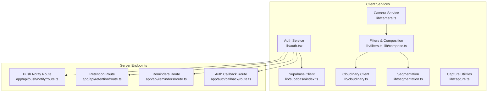
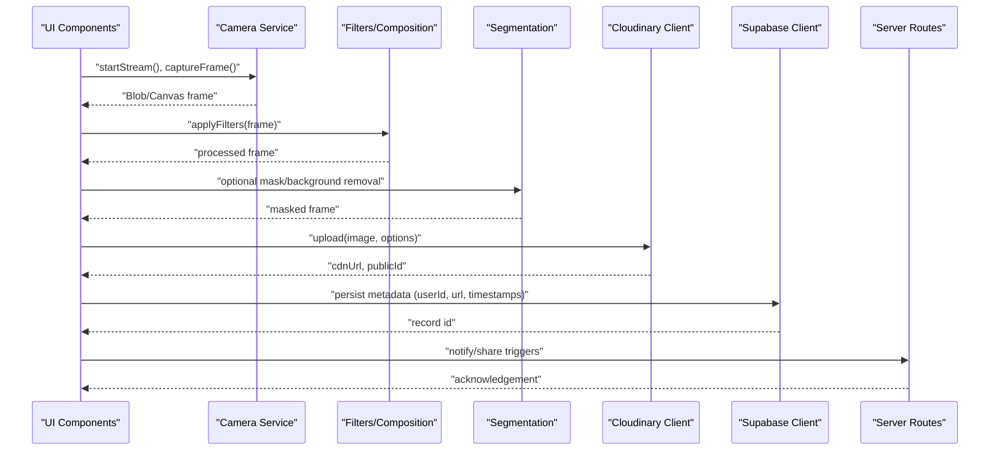
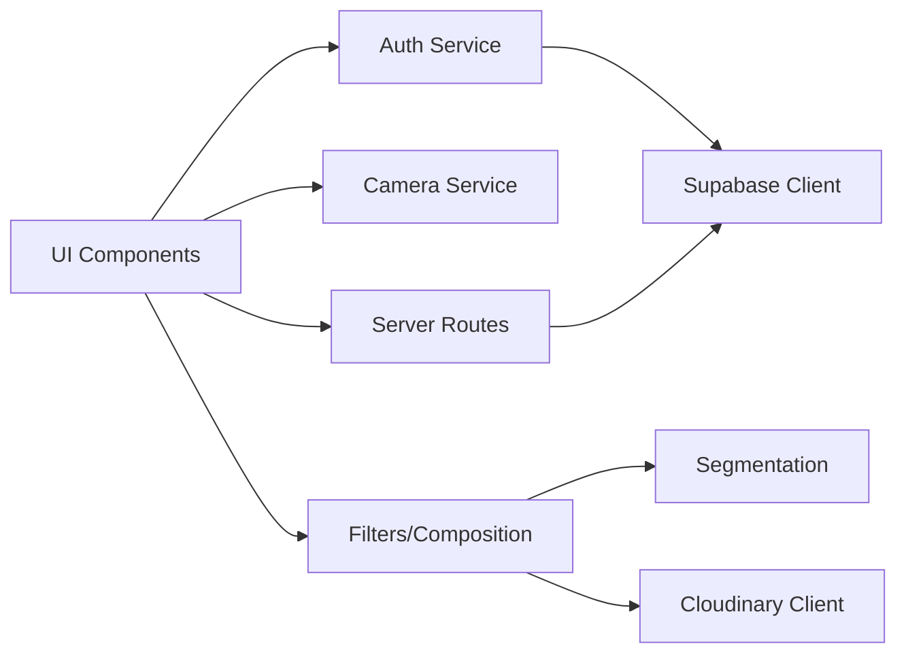

# Service Layer Design

<cite>
**Referenced Files in This Document**
- [lib/supabase/index.ts](file://lib/supabase/index.ts)
- [lib/auth.tsx](file://lib/auth.tsx)
- [lib/cloudinary.ts](file://lib/cloudinary.ts)
- [lib/camera.ts](file://lib/camera.ts)
- [hooks/useCamera.ts](file://hooks/useCamera.ts)
- [components/CameraPreview.tsx](file://components/CameraPreview.tsx)
- [lib/filters.ts](file://lib/filters.ts)
- [lib/compose.ts](file://lib/compose.ts)
- [lib/segmentation.ts](file://lib/segmentation.ts)
- [lib/capture.ts](file://lib/capture.ts)
- [app/api/push/notify/route.ts](file://app/api/push/notify/route.ts)
- [app/api/retention/route.ts](file://app/api/retention/route.ts)
- [app/api/reminders/route.ts](file://app/api/reminders/route.ts)
- [app/auth/callback/route.ts](file://app/auth/callback/route.ts)
</cite>

## Table of Contents
1. [Introduction](#introduction)
2. [Project Structure](#project-structure)
3. [Core Components](#core-components)
4. [Architecture Overview](#architecture-overview)
5. [Detailed Component Analysis](#detailed-component-analysis)
6. [Dependency Analysis](#dependency-analysis)
7. [Performance Considerations](#performance-considerations)
8. [Troubleshooting Guide](#troubleshooting-guide)
9. [Conclusion](#conclusion)

## Introduction
This document explains the service layer design in Zuychin Photobooth, focusing on how business logic is abstracted from external integrations. It covers:
- Supabase client configuration and usage for authentication and database operations
- Cloudinary integration for image upload, processing, and CDN delivery
- Camera service abstraction for browser compatibility and media stream management
- Image processing pipeline including filters, composition, and optimization
- Error handling, retry mechanisms, and caching strategies at the service layer

The goal is to provide a clear mental model of how services are structured, how they interact, and how to extend or troubleshoot them effectively.

## Project Structure
At a high level, the service layer lives under lib/ and hooks/, with API routes under app/api/. The key responsibilities:
- Authentication and session management via Supabase
- Media capture and camera control via browser APIs
- Image processing (filters, segmentation, composition)
- Upload and CDN delivery via Cloudinary
- Server-side notifications and retention hooks via Next.js API routes

**Diagram sources**
- [lib/auth.tsx](file://lib/auth.tsx)
- [lib/supabase/index.ts](file://lib/supabase/index.ts)
- [lib/camera.ts](file://lib/camera.ts)
- [lib/filters.ts](file://lib/filters.ts)
- [lib/compose.ts](file://lib/compose.ts)
- [lib/cloudinary.ts](file://lib/cloudinary.ts)
- [lib/segmentation.ts](file://lib/segmentation.ts)
- [lib/capture.ts](file://lib/capture.ts)
- [app/api/push/notify/route.ts](file://app/api/push/notify/route.ts)
- [app/api/retention/route.ts](file://app/api/retention/route.ts)
- [app/api/reminders/route.ts](file://app/api/reminders/route.ts)
- [app/auth/callback/route.ts](file://app/auth/callback/route.ts)

**Section sources**
- [lib/auth.tsx](file://lib/auth.tsx)
- [lib/supabase/index.ts](file://lib/supabase/index.ts)
- [lib/camera.ts](file://lib/camera.ts)
- [lib/filters.ts](file://lib/filters.ts)
- [lib/compose.ts](file://lib/compose.ts)
- [lib/cloudinary.ts](file://lib/cloudinary.ts)
- [lib/segmentation.ts](file://lib/segmentation.ts)
- [lib/capture.ts](file://lib/capture.ts)
- [app/api/push/notify/route.ts](file://app/api/push/notify/route.ts)
- [app/api/retention/route.ts](file://app/api/retention/route.ts)
- [app/api/reminders/route.ts](file://app/api/reminders/route.ts)
- [app/auth/callback/route.ts](file://app/auth/callback/route.ts)

## Core Components
This section outlines the primary service abstractions and their roles:
- Auth Service: Encapsulates Supabase auth flows, token handling, and user session state.
- Supabase Client: Centralized configuration and typed access to database and storage.
- Camera Service: Abstracts getUserMedia constraints, device selection, and stream lifecycle.
- Filters and Composition: Applies visual effects and composites images before upload.
- Cloudinary Client: Handles upload, transformation, and CDN URL generation.
- Segmentation: Optional background removal or masking using WebAssembly models.
- Capture Utilities: Converts canvas frames to Blob/URL and manages memory.

Key responsibilities and boundaries:
- Business logic stays in lib/ modules; UI components consume these services through hooks and functions.
- External integrations (Supabase, Cloudinary, Push endpoints) are isolated behind thin clients.
- Errors are normalized per service and surfaced consistently to callers.

**Section sources**
- [lib/auth.tsx](file://lib/auth.tsx)
- [lib/supabase/index.ts](file://lib/supabase/index.ts)
- [lib/camera.ts](file://lib/camera.ts)
- [lib/filters.ts](file://lib/filters.ts)
- [lib/compose.ts](file://lib/compose.ts)
- [lib/cloudinary.ts](file://lib/cloudinary.ts)
- [lib/segmentation.ts](file://lib/segmentation.ts)
- [lib/capture.ts](file://lib/capture.ts)

## Architecture Overview
The service layer follows an abstraction pattern where each external dependency is wrapped by a dedicated client/service module. UI layers call into these services without knowing implementation details. Data flows from camera capture through processing to upload and persistence.

**Diagram sources**
- [lib/camera.ts](file://lib/camera.ts)
- [lib/filters.ts](file://lib/filters.ts)
- [lib/compose.ts](file://lib/compose.ts)
- [lib/segmentation.ts](file://lib/segmentation.ts)
- [lib/cloudinary.ts](file://lib/cloudinary.ts)
- [lib/supabase/index.ts](file://lib/supabase/index.ts)
- [app/api/push/notify/route.ts](file://app/api/push/notify/route.ts)

## Detailed Component Analysis

### Supabase Client Configuration and Usage
Responsibilities:
- Initialize the Supabase client with environment variables
- Provide typed methods for auth and database queries
- Centralize error mapping and retries where appropriate

Usage patterns:
- Authentication: sign-in/sign-up, session management, and token refresh
- Database: CRUD operations for booth sessions, photos, and settings
- Storage: optional file storage via Supabase Storage (if used)

Error handling:
- Normalize network and auth errors
- Surface actionable messages to UI
- Retry transient failures when safe

Caching strategy:
- Cache user session and lightweight config in memory
- Use Supabase’s built-in session persistence where applicable

**Section sources**
- [lib/supabase/index.ts](file://lib/supabase/index.ts)
- [lib/auth.tsx](file://lib/auth.tsx)
- [app/auth/callback/route.ts](file://app/auth/callback/route.ts)

### Authentication Service
Responsibilities:
- Wrap Supabase auth calls (email/password, OAuth if enabled)
- Manage local session state and rehydration
- Expose simple methods like login, logout, getCurrentUser

Integration points:
- Next.js auth callback route for server-side verification
- Protected routes and data fetching guards

Error handling:
- Map provider-specific errors to common types
- Handle expired tokens and redirect to login

**Section sources**
- [lib/auth.tsx](file://lib/auth.tsx)
- [app/auth/callback/route.ts](file://app/auth/callback/route.ts)

### Camera Service Abstraction
Responsibilities:
- Abstract getUserMedia constraints and device enumeration
- Start/stop streams, handle permissions, and fallbacks
- Expose a stable interface for capturing frames and managing video elements

Browser compatibility:
- Detect supported features and degrade gracefully
- Normalize differences across Safari, Chrome, Firefox

Memory management:
- Revoke object URLs and stop tracks to prevent leaks

Usage:
- Consumed by hooks and components to render previews and trigger captures

**Section sources**
- [lib/camera.ts](file://lib/camera.ts)
- [hooks/useCamera.ts](file://hooks/useCamera.ts)
- [components/CameraPreview.tsx](file://components/CameraPreview.tsx)

### Image Processing Pipeline
Components:
- Filters: Apply color adjustments, overlays, and effects
- Composition: Combine multiple frames, stickers, and text
- Segmentation: Background removal or masking using WebAssembly models
- Capture utilities: Convert canvas frames to Blob/URL efficiently

Pipeline flow:
- Capture raw frame -> apply filters -> optional segmentation -> composite final image -> optimize for upload

Optimization:
- Downscale large canvases before upload
- Choose appropriate output format (JPEG/PNG/WebP) based on content

**Section sources**
- [lib/filters.ts](file://lib/filters.ts)
- [lib/compose.ts](file://lib/compose.ts)
- [lib/segmentation.ts](file://lib/segmentation.ts)
- [lib/capture.ts](file://lib/capture.ts)

### Cloudinary Integration
Responsibilities:
- Upload images securely (presigned or direct)
- Apply transformations (resize, crop, quality, format)
- Generate CDN URLs and manage public IDs

Security:
- Use secure upload policies and signed requests
- Validate inputs and restrict transformations server-side when possible

Error handling:
- Retries with exponential backoff for transient failures
- Fallback to alternative formats or sizes

Caching:
- Leverage Cloudinary CDN caching
- Cache generated URLs locally to avoid redundant uploads

**Section sources**
- [lib/cloudinary.ts](file://lib/cloudinary.ts)

### Server-Side Integrations
Responsibilities:
- Push notifications: notify users about new photos or reminders
- Retention hooks: track engagement and schedule follow-ups
- Reminders: send scheduled prompts to re-engage users

Reliability:
- Idempotent operations and deduplication keys
- Queueing and retries for downstream providers

**Section sources**
- [app/api/push/notify/route.ts](file://app/api/push/notify/route.ts)
- [app/api/retention/route.ts](file://app/api/retention/route.ts)
- [app/api/reminders/route.ts](file://app/api/reminders/route.ts)

## Dependency Analysis
The service layer minimizes coupling between UI and external systems. Each service encapsulates its dependencies and exposes a clean interface.

**Diagram sources**
- [lib/auth.tsx](file://lib/auth.tsx)
- [lib/camera.ts](file://lib/camera.ts)
- [lib/filters.ts](file://lib/filters.ts)
- [lib/compose.ts](file://lib/compose.ts)
- [lib/segmentation.ts](file://lib/segmentation.ts)
- [lib/cloudinary.ts](file://lib/cloudinary.ts)
- [lib/supabase/index.ts](file://lib/supabase/index.ts)
- [app/api/push/notify/route.ts](file://app/api/push/notify/route.ts)

**Section sources**
- [lib/auth.tsx](file://lib/auth.tsx)
- [lib/camera.ts](file://lib/camera.ts)
- [lib/filters.ts](file://lib/filters.ts)
- [lib/compose.ts](file://lib/compose.ts)
- [lib/segmentation.ts](file://lib/segmentation.ts)
- [lib/cloudinary.ts](file://lib/cloudinary.ts)
- [lib/supabase/index.ts](file://lib/supabase/index.ts)
- [app/api/push/notify/route.ts](file://app/api/push/notify/route.ts)

## Performance Considerations
- Avoid unnecessary re-renders by memoizing processed images and derived state
- Stream large files carefully; prefer chunked uploads when needed
- Use efficient canvas operations and limit offscreen work to web workers
- Cache CDN URLs and frequently accessed metadata
- Optimize image dimensions and quality before upload to reduce bandwidth

[No sources needed since this section provides general guidance]

## Troubleshooting Guide
Common issues and resolutions:
- Camera permission denied: Ensure HTTPS context and prompt user to grant access
- Stream not stopping: Verify all tracks are stopped and object URLs revoked
- Upload failures: Check network connectivity, Cloudinary policy validity, and retry logic
- Auth errors: Validate credentials, check token expiration, and refresh sessions
- Segmentation performance: Load WASM models lazily and reuse instances

Error handling best practices:
- Normalize errors into consistent shapes
- Log contextual information without sensitive data
- Provide user-friendly messages and recovery steps

**Section sources**
- [lib/camera.ts](file://lib/camera.ts)
- [lib/cloudinary.ts](file://lib/cloudinary.ts)
- [lib/auth.tsx](file://lib/auth.tsx)
- [lib/segmentation.ts](file://lib/segmentation.ts)

## Conclusion
The service layer in Zuychin Photobooth cleanly separates business logic from external integrations through focused modules. Supabase handles authentication and persistence, Cloudinary manages image delivery, and the camera and processing services abstract browser capabilities. Robust error handling, retries, and caching ensure reliability and performance. This design enables easy extension, testing, and maintenance while keeping the UI layer simple and responsive.

[No sources needed since this section summarizes without analyzing specific files]