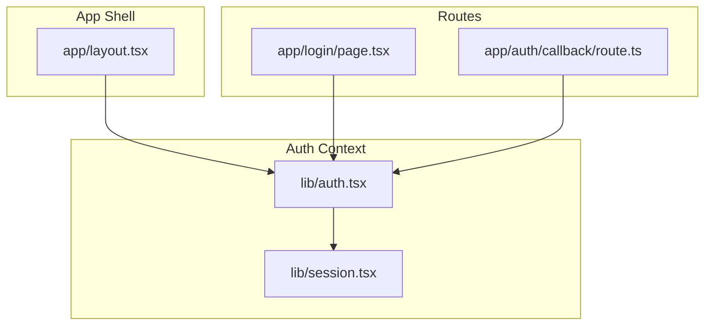
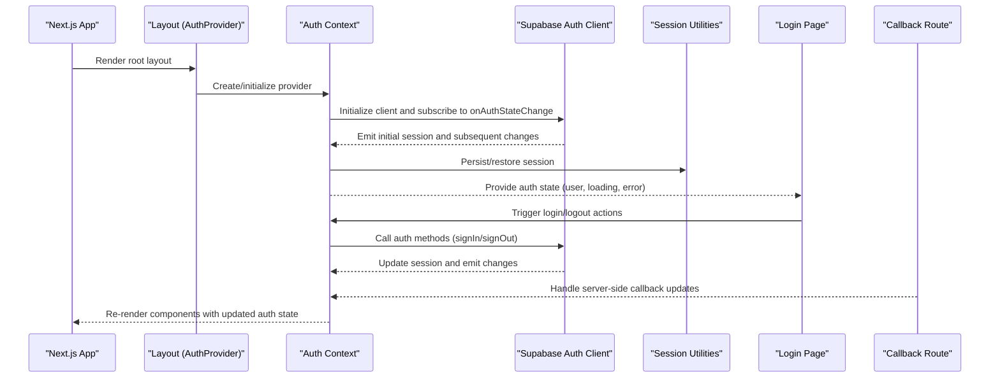
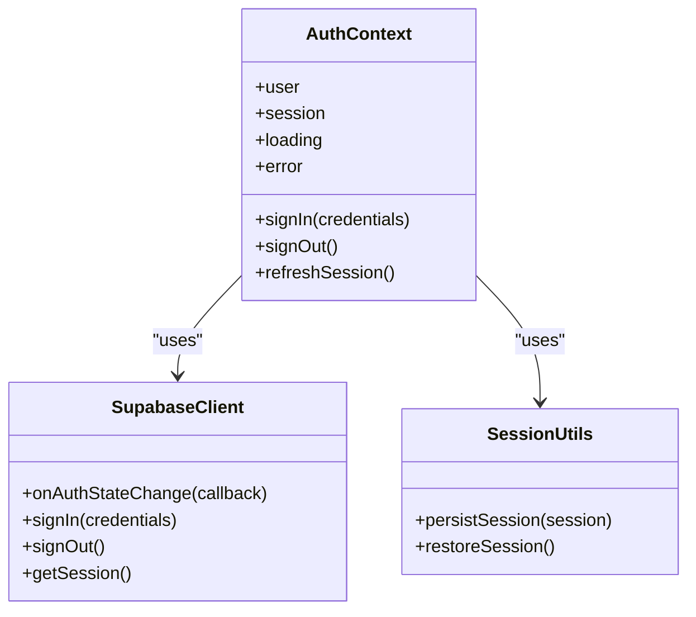
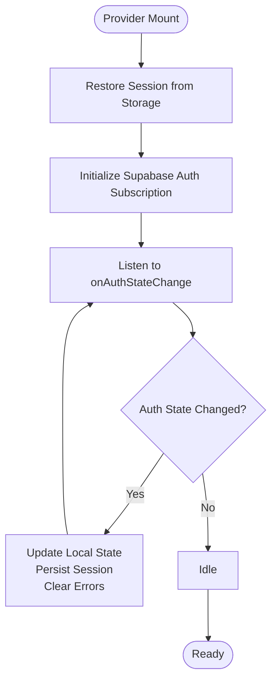
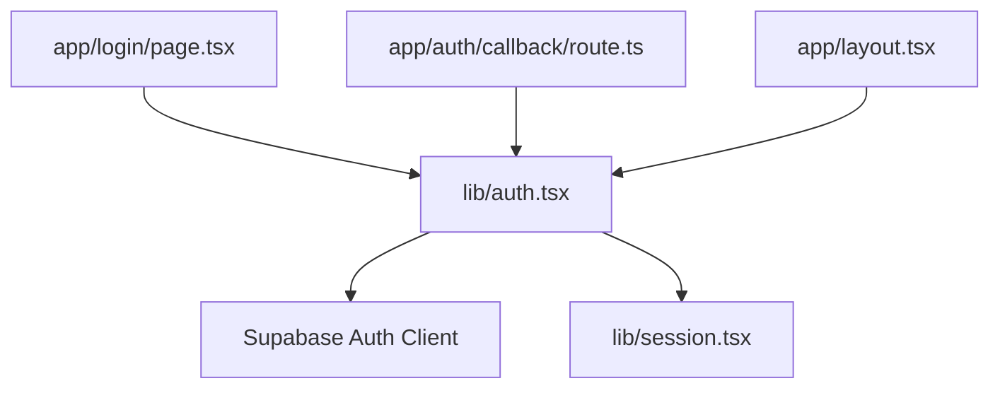

# Authentication Context Provider

<cite>
**Referenced Files in This Document**
- [auth.tsx](file://lib/auth.tsx)
- [session.tsx](file://lib/session.tsx)
- [layout.tsx](file://app/layout.tsx)
- [page.tsx](file://app/login/page.tsx)
- [route.ts](file://app/auth/callback/route.ts)
</cite>

## Table of Contents
1. [Introduction](#introduction)
2. [Project Structure](#project-structure)
3. [Core Components](#core-components)
4. [Architecture Overview](#architecture-overview)
5. [Detailed Component Analysis](#detailed-component-analysis)
6. [Dependency Analysis](#dependency-analysis)
7. [Performance Considerations](#performance-considerations)
8. [Troubleshooting Guide](#troubleshooting-guide)
9. [Conclusion](#conclusion)

## Introduction
This document explains the authentication context provider implementation that manages user session state, handles authentication lifecycle events, and exposes auth state to the application. It covers how the AuthProvider component integrates with Supabase Auth, persists sessions, refreshes tokens automatically, and how to consume the context in components, implement protected routes, and handle errors.

## Project Structure
The authentication logic is primarily implemented in a React context provider and related utilities:
- The AuthProvider and hooks live in a dedicated module for auth context.
- Session persistence and helpers are provided by a session utility.
- The Next.js layout wires up the provider at the app root.
- Login and callback routes coordinate client-side auth flows and server-side callbacks.

**Diagram sources**
- [layout.tsx](file://app/layout.tsx)
- [auth.tsx](file://lib/auth.tsx)
- [session.tsx](file://lib/session.tsx)
- [page.tsx](file://app/login/page.tsx)
- [route.ts](file://app/auth/callback/route.ts)

**Section sources**
- [layout.tsx](file://app/layout.tsx)
- [auth.tsx](file://lib/auth.tsx)
- [session.tsx](file://lib/session.tsx)
- [page.tsx](file://app/login/page.tsx)
- [route.ts](file://app/auth/callback/route.ts)

## Core Components
- AuthProvider: A React context provider that initializes Supabase Auth, subscribes to auth state changes, manages loading/error states, and exposes a typed auth state object to consumers.
- useAuth hook: A convenience hook to access the auth context safely within components.
- Session utilities: Helpers to persist and restore session data across page reloads and browser sessions.

Key responsibilities:
- Initialize Supabase client and subscribe to onAuthStateChange.
- Maintain local state for current user, session, loading, and error.
- Persist session using cookies or storage mechanisms via session utilities.
- Expose actions like login, logout, and refresh token operations.
- Provide memoized values to minimize re-renders.

**Section sources**
- [auth.tsx](file://lib/auth.tsx)
- [session.tsx](file://lib/session.tsx)

## Architecture Overview
The authentication flow integrates client-side React context with Supabase Auth and Next.js routing:

**Diagram sources**
- [layout.tsx](file://app/layout.tsx)
- [auth.tsx](file://lib/auth.tsx)
- [session.tsx](file://lib/session.tsx)
- [page.tsx](file://app/login/page.tsx)
- [route.ts](file://app/auth/callback/route.ts)

## Detailed Component Analysis

### AuthProvider Implementation
- Initializes Supabase Auth client and sets up an auth state subscription.
- Maintains state fields:
  - user: Current authenticated user object or null.
  - session: Current session metadata or null.
  - loading: Boolean indicating initialization or transition states.
  - error: Error object or null for last encountered error.
- Persists session via session utilities to survive page reloads.
- Exposes actions:
  - signIn: Initiates login flow (email/password, OAuth, etc.).
  - signOut: Ends session and clears persisted state.
  - refreshSession: Forces token refresh when needed.
- Memoizes context value to avoid unnecessary re-renders.

**Diagram sources**
- [auth.tsx](file://lib/auth.tsx)
- [session.tsx](file://lib/session.tsx)

**Section sources**
- [auth.tsx](file://lib/auth.tsx)
- [session.tsx](file://lib/session.tsx)

### Session Persistence and Automatic Token Refresh
- On mount, the provider restores any existing session from persistent storage.
- Subscribes to Supabase’s auth state changes; on each change:
  - Updates local user/session state.
  - Persists new session data.
  - Clears previous errors.
- Automatic token refresh is handled by Supabase’s client; the provider ensures local state stays in sync and can trigger explicit refresh if required by business logic.

**Diagram sources**
- [auth.tsx](file://lib/auth.tsx)
- [session.tsx](file://lib/session.tsx)

**Section sources**
- [auth.tsx](file://lib/auth.tsx)
- [session.tsx](file://lib/session.tsx)

### Consuming Auth Context in Components
- Use the provided hook to read user, session, loading, and error fields.
- Guard UI based on loading and authentication status.
- Trigger login/logout actions through exposed functions.

Example usage patterns:
- Conditional rendering: Show authenticated-only content when user is present.
- Redirects: Navigate unauthenticated users to login when accessing protected routes.
- Error display: Surface errors from auth operations to the user.

**Section sources**
- [auth.tsx](file://lib/auth.tsx)

### Protected Routes
- Implement route guards by checking auth state before rendering protected pages.
- Redirect to login when not authenticated; show loading indicators while initializing.
- Optionally integrate with Next.js navigation to enforce protection at the router level.

**Section sources**
- [page.tsx](file://app/login/page.tsx)
- [auth.tsx](file://lib/auth.tsx)

### Handling Authentication Errors
- Capture and expose errors from auth operations.
- Display user-friendly messages and allow retry where appropriate.
- Clear errors after successful operations or state transitions.

**Section sources**
- [auth.tsx](file://lib/auth.tsx)

### Integration with Supabase Auth Client
- Initialize the Supabase client once and share it across the app.
- Subscribe to auth state changes to keep local state synchronized.
- Use Supabase methods for sign-in, sign-out, and session retrieval.

**Section sources**
- [auth.tsx](file://lib/auth.tsx)

### Server-Side Callback Handling
- The callback route processes authentication results from providers (e.g., OAuth).
- Ensures session consistency between server and client by updating state and redirecting appropriately.

**Section sources**
- [route.ts](file://app/auth/callback/route.ts)

## Dependency Analysis
The authentication system has clear boundaries:
- AuthProvider depends on Supabase Auth client and session utilities.
- Components depend only on the auth context hook.
- Routes coordinate user flows but do not directly manipulate Supabase internals.

**Diagram sources**
- [auth.tsx](file://lib/auth.tsx)
- [session.tsx](file://lib/session.tsx)
- [page.tsx](file://app/login/page.tsx)
- [route.ts](file://app/auth/callback/route.ts)
- [layout.tsx](file://app/layout.tsx)

**Section sources**
- [auth.tsx](file://lib/auth.tsx)
- [session.tsx](file://lib/session.tsx)
- [page.tsx](file://app/login/page.tsx)
- [route.ts](file://app/auth/callback/route.ts)
- [layout.tsx](file://app/layout.tsx)

## Performance Considerations
- Memoization:
  - Wrap the context value with memoization to prevent unnecessary re-renders in consumers.
  - Stabilize function references for actions to avoid triggering dependent effects.
- Selective subscriptions:
  - Only subscribe to necessary auth events; avoid heavy computations inside listeners.
- Lazy initialization:
  - Defer non-critical setup until after initial render to improve perceived performance.
- Avoid storing large objects in context:
  - Keep context state minimal; fetch additional data on demand.

[No sources needed since this section provides general guidance]

## Troubleshooting Guide
Common issues and resolutions:
- Initial loading state never resolves:
  - Verify Supabase client initialization and environment variables.
  - Ensure the auth subscription is active and not blocked by CORS.
- Session not restored after reload:
  - Check session persistence logic and storage availability.
  - Confirm that the provider runs at the app root.
- OAuth callback failures:
  - Validate callback URL configuration and secret handling.
  - Inspect server logs for errors during token exchange.
- Unexpected re-renders:
  - Ensure context value is memoized and action functions are stable.
  - Avoid placing heavy logic inside component renders.

**Section sources**
- [auth.tsx](file://lib/auth.tsx)
- [session.tsx](file://lib/session.tsx)
- [route.ts](file://app/auth/callback/route.ts)

## Conclusion
The authentication context provider centralizes session management, integrates seamlessly with Supabase Auth, and offers a clean API for consuming auth state throughout the application. By following the patterns outlined here—memoization, robust error handling, and proper route protection—you can build secure, performant, and maintainable authentication flows.