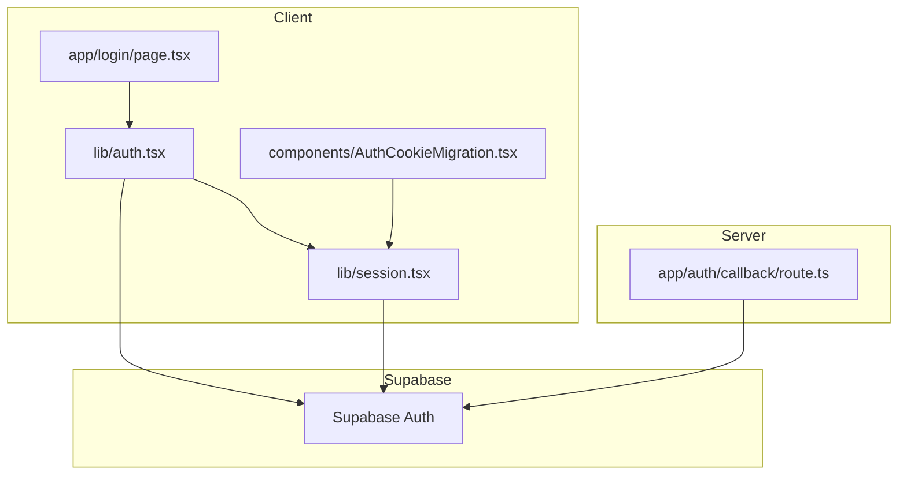
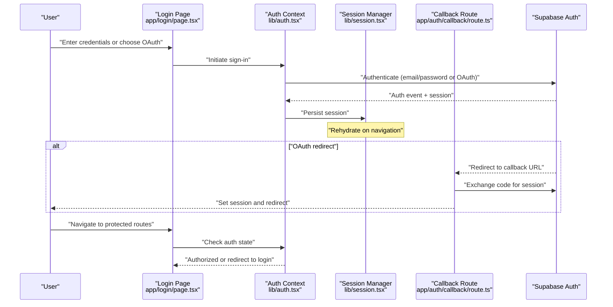
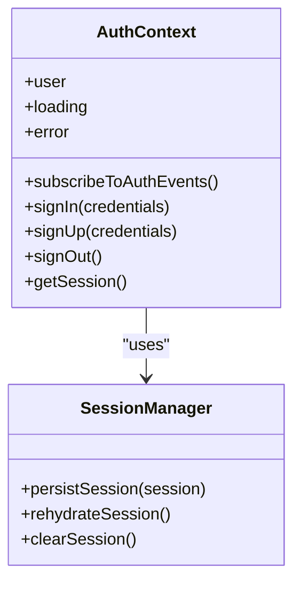
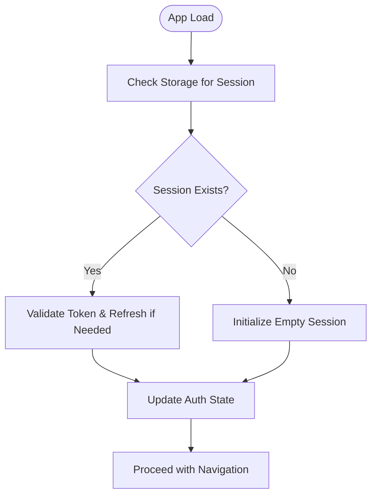
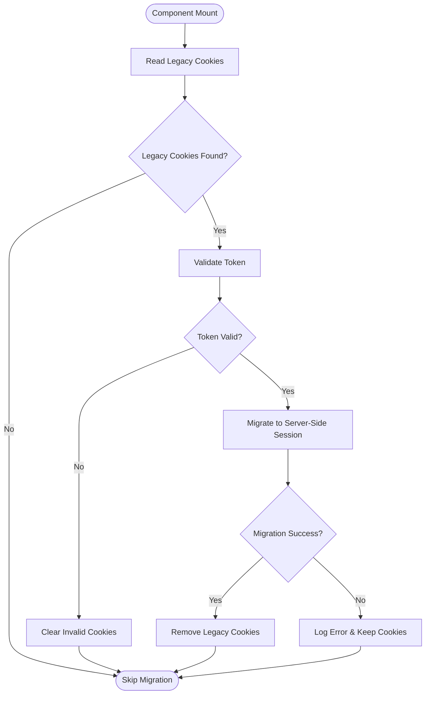
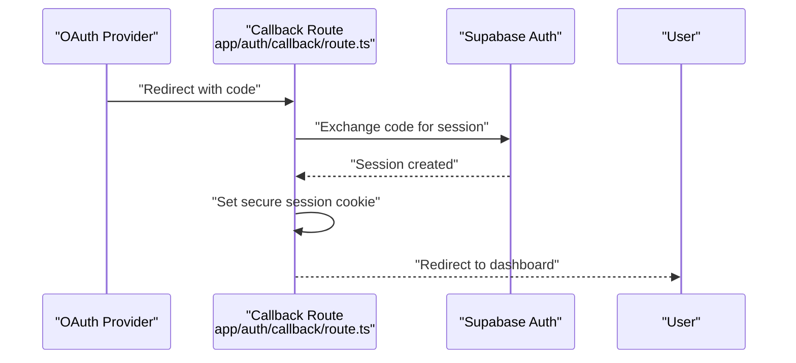
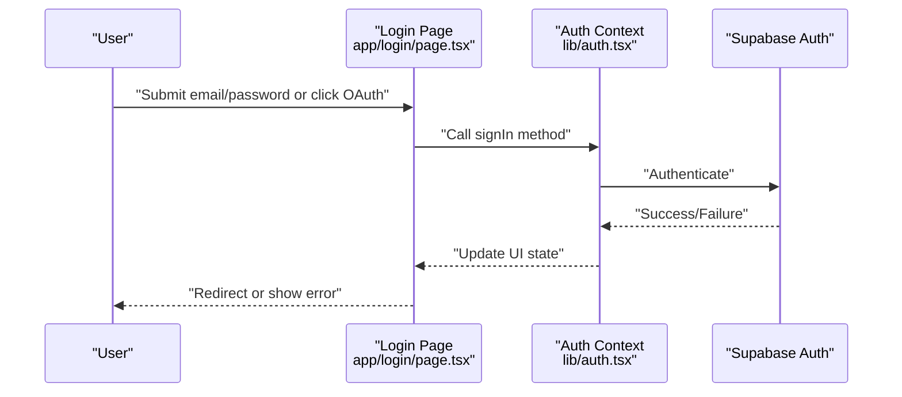
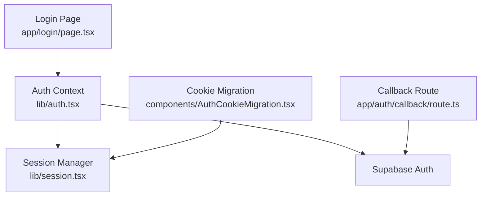

# Authentication System

<cite>
**Referenced Files in This Document**
- [auth.tsx](file://lib/auth.tsx)
- [session.tsx](file://lib/session.tsx)
- [AuthCookieMigration.tsx](file://components/AuthCookieMigration.tsx)
- [route.ts](file://app/auth/callback/route.ts)
- [page.tsx](file://app/login/page.tsx)
- [layout.tsx](file://app/layout.tsx)
</cite>

## Table of Contents
1. [Introduction](#introduction)
2. [Project Structure](#project-structure)
3. [Core Components](#core-components)
4. [Architecture Overview](#architecture-overview)
5. [Detailed Component Analysis](#detailed-component-analysis)
6. [Dependency Analysis](#dependency-analysis)
7. [Performance Considerations](#performance-considerations)
8. [Troubleshooting Guide](#troubleshooting-guide)
9. [Conclusion](#conclusion)

## Introduction
This document explains the authentication system built on Supabase Auth within a Next.js application. It covers the authentication context provider, user session management, protected route handling, login flows (email/password and OAuth), cookie migration from client-side to server-side auth, callback route handling for OAuth, and security best practices such as token management, CSRF protection, and secure storage. It also clarifies how authentication state relates to application features and provides concrete examples of guards, role management, and permission checks.

## Project Structure
The authentication implementation spans several key files:
- lib/auth.tsx: Provides the authentication context provider and hooks for managing Supabase Auth state.
- lib/session.tsx: Manages session persistence and retrieval, bridging client and server sessions.
- components/AuthCookieMigration.tsx: Handles migration from legacy client-side cookies to server-side sessions.
- app/auth/callback/route.ts: Server-side callback handler for OAuth flows.
- app/login/page.tsx: Login UI that triggers email/password or OAuth sign-in.
- app/layout.tsx: Root layout where the authentication context is typically provided.

**Diagram sources**
- [page.tsx](file://app/login/page.tsx)
- [auth.tsx](file://lib/auth.tsx)
- [session.tsx](file://lib/session.tsx)
- [AuthCookieMigration.tsx](file://components/AuthCookieMigration.tsx)
- [route.ts](file://app/auth/callback/route.ts)

**Section sources**
- [auth.tsx](file://lib/auth.tsx)
- [session.tsx](file://lib/session.tsx)
- [AuthCookieMigration.tsx](file://components/AuthCookieMigration.tsx)
- [route.ts](file://app/auth/callback/route.ts)
- [page.tsx](file://app/login/page.tsx)
- [layout.tsx](file://app/layout.tsx)

## Core Components
- Authentication Context Provider (lib/auth.tsx): Wraps the application with Supabase Auth state, exposing hooks for sign-in, sign-out, and session subscription. It centralizes auth logic and ensures consistent access to user data across components.
- Session Management (lib/session.tsx): Persists and retrieves sessions, ensuring the client stays in sync with server-side sessions. It handles token refresh and rehydration on navigation.
- Cookie Migration (components/AuthCookieMigration.tsx): Detects legacy client-side cookies and migrates them to server-side sessions, preventing auth regressions during transition.
- OAuth Callback Route (app/auth/callback/route.ts): Processes OAuth redirects, exchanges tokens, and establishes server-side sessions.
- Login Page (app/login/page.tsx): User-facing form for email/password and OAuth providers; triggers auth flows and redirects upon success.
- Layout Integration (app/layout.tsx): Ensures the authentication context is available throughout the app.

**Section sources**
- [auth.tsx](file://lib/auth.tsx)
- [session.tsx](file://lib/session.tsx)
- [AuthCookieMigration.tsx](file://components/AuthCookieMigration.tsx)
- [route.ts](file://app/auth/callback/route.ts)
- [page.tsx](file://app/login/page.tsx)
- [layout.tsx](file://app/layout.tsx)

## Architecture Overview
The authentication architecture combines client-side context with server-side session handling via Supabase Auth. The flow supports both email/password and OAuth providers, with robust session persistence and migration support.

**Diagram sources**
- [page.tsx](file://app/login/page.tsx)
- [auth.tsx](file://lib/auth.tsx)
- [session.tsx](file://lib/session.tsx)
- [route.ts](file://app/auth/callback/route.ts)

## Detailed Component Analysis

### Authentication Context Provider (lib/auth.tsx)
Responsibilities:
- Initialize Supabase Auth client and subscribe to auth state changes.
- Expose hooks for sign-in, sign-up, sign-out, and session retrieval.
- Manage loading states and error propagation to UI components.
- Ensure consistent user state across the application.

Key behaviors:
- Subscribes to Supabase Auth events to keep UI in sync.
- Centralizes error handling for network and auth failures.
- Integrates with session manager for persistence.

**Diagram sources**
- [auth.tsx](file://lib/auth.tsx)
- [session.tsx](file://lib/session.tsx)

**Section sources**
- [auth.tsx](file://lib/auth.tsx)

### Session Management (lib/session.tsx)
Responsibilities:
- Persist sessions using secure storage mechanisms.
- Rehydrate sessions on app load and navigation.
- Handle token refresh and expiration gracefully.

Key behaviors:
- Bridges client-side state with server-side sessions.
- Ensures minimal auth flicker by preloading session state.
- Supports safe clearing of sensitive data on sign-out.

**Diagram sources**
- [session.tsx](file://lib/session.tsx)

**Section sources**
- [session.tsx](file://lib/session.tsx)

### Cookie Migration (components/AuthCookieMigration.tsx)
Responsibilities:
- Detect legacy client-side cookies containing auth tokens.
- Migrate tokens to server-side sessions securely.
- Remove deprecated cookies after successful migration.

Key behaviors:
- Runs once per session to avoid redundant migrations.
- Validates token integrity before migration.
- Falls back gracefully if migration fails.

**Diagram sources**
- [AuthCookieMigration.tsx](file://components/AuthCookieMigration.tsx)

**Section sources**
- [AuthCookieMigration.tsx](file://components/AuthCookieMigration.tsx)

### OAuth Callback Route (app/auth/callback/route.ts)
Responsibilities:
- Handle OAuth provider redirects.
- Exchange authorization codes for sessions.
- Establish server-side sessions and redirect users.

Key behaviors:
- Validates incoming requests and parameters.
- Uses Supabase Auth to finalize OAuth flow.
- Sets secure cookies and redirects to appropriate routes.

**Diagram sources**
- [route.ts](file://app/auth/callback/route.ts)

**Section sources**
- [route.ts](file://app/auth/callback/route.ts)

### Login Flow (app/login/page.tsx)
Responsibilities:
- Provide UI for email/password and OAuth sign-in.
- Trigger authentication flows via the context provider.
- Redirect authenticated users to protected routes.

Key behaviors:
- Validates user input before submission.
- Displays errors and loading states.
- Integrates with OAuth providers through Supabase.

**Diagram sources**
- [page.tsx](file://app/login/page.tsx)
- [auth.tsx](file://lib/auth.tsx)

**Section sources**
- [page.tsx](file://app/login/page.tsx)
- [auth.tsx](file://lib/auth.tsx)

### Protected Routes and Guards
Protected routes rely on the authentication context to verify user sessions before rendering content. Guards can be implemented as higher-order components or custom hooks that check auth state and redirect unauthenticated users.

Example patterns:
- Route-level guard: Wrap page components with an auth check that redirects to login if unauthorized.
- Role-based guard: Extend basic auth checks to validate user roles or permissions before granting access.
- Feature flags: Tie feature availability to authentication status and user roles.

Best practices:
- Always validate sessions on both client and server sides.
- Use server-side middleware for critical API routes.
- Implement least privilege principles for role-based access.

[No sources needed since this section provides general guidance]

### Security Best Practices
- Token Management: Store tokens securely, prefer server-side sessions when possible. Avoid long-lived tokens in client storage.
- CSRF Protection: Use secure, HTTP-only cookies for session tokens. Implement CSRF tokens for state-changing operations.
- Secure Storage: Minimize use of localStorage for sensitive data. Prefer memory storage for short-lived tokens.
- Input Validation: Sanitize all user inputs and validate on both client and server.
- Error Handling: Avoid leaking sensitive information in error messages. Log errors securely for debugging.

[No sources needed since this section provides general guidance]

## Dependency Analysis
The authentication system has clear dependencies between components:
- Login Page depends on the Auth Context for initiating sign-in flows.
- Auth Context depends on Session Manager for persistence and Supabase Auth for state management.
- OAuth Callback Route depends on Supabase Auth to finalize OAuth flows.
- Cookie Migration component depends on Session Manager to migrate legacy data.

**Diagram sources**
- [page.tsx](file://app/login/page.tsx)
- [auth.tsx](file://lib/auth.tsx)
- [session.tsx](file://lib/session.tsx)
- [route.ts](file://app/auth/callback/route.ts)
- [AuthCookieMigration.tsx](file://components/AuthCookieMigration.tsx)

**Section sources**
- [auth.tsx](file://lib/auth.tsx)
- [session.tsx](file://lib/session.tsx)
- [AuthCookieMigration.tsx](file://components/AuthCookieMigration.tsx)
- [route.ts](file://app/auth/callback/route.ts)
- [page.tsx](file://app/login/page.tsx)

## Performance Considerations
- Minimize re-renders by memoizing auth state and selectors.
- Defer heavy operations until after initial auth state is resolved.
- Use optimistic updates for better UX during sign-in/sign-out.
- Cache session validation results where appropriate to reduce network calls.

[No sources needed since this section provides general guidance]

## Troubleshooting Guide
Common issues and resolutions:
- Session not persisting: Verify storage mechanisms and ensure proper cleanup on sign-out.
- OAuth callback failing: Check redirect URLs and environment variables for OAuth providers.
- Migration errors: Inspect legacy cookie format and validate token integrity before migration.
- Auth state inconsistencies: Ensure proper subscription to auth events and handle edge cases.

Debugging tips:
- Enable detailed logging for auth flows.
- Use browser dev tools to inspect cookies and storage.
- Test OAuth flows in different environments (development, staging, production).

[No sources needed since this section provides general guidance]

## Conclusion
The authentication system leverages Supabase Auth to provide a robust, secure, and scalable solution for user authentication. By combining client-side context with server-side session management, it supports multiple authentication methods while maintaining security best practices. The migration strategy ensures a smooth transition from client-side to server-side auth, and the modular design allows for easy extension and maintenance.

[No sources needed since this section summarizes without analyzing specific files]