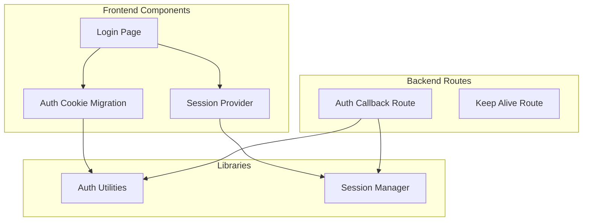
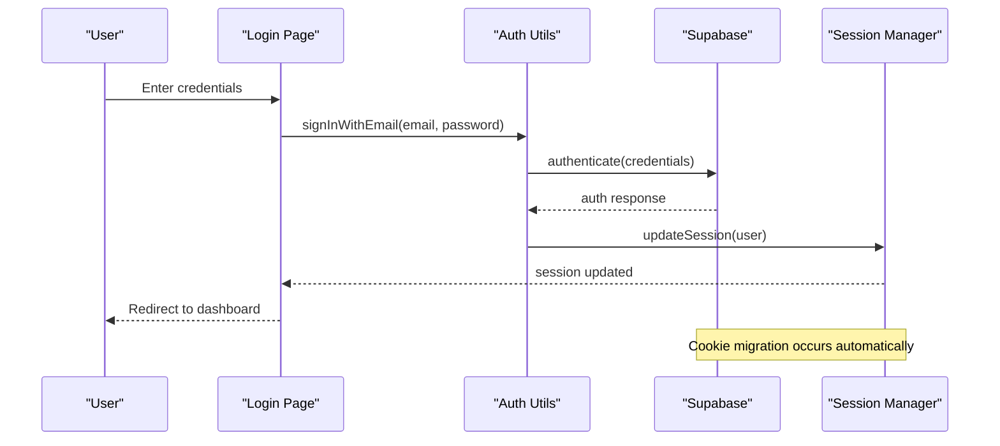
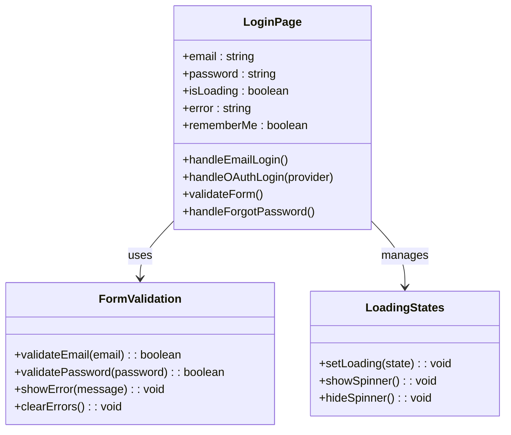
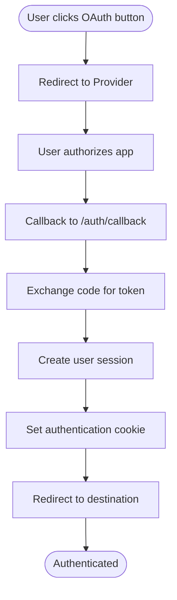
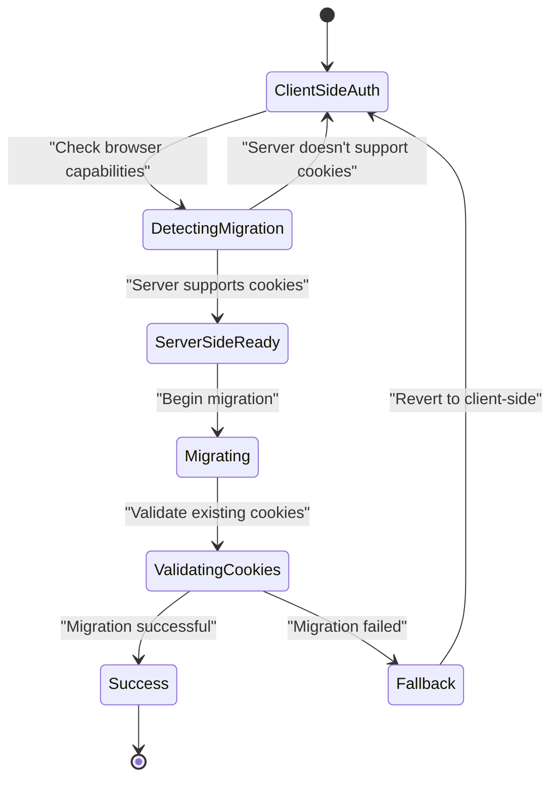

# Login Flow & User Interface

<cite>
**Referenced Files in This Document**
- [app/login/page.tsx](file://app/login/page.tsx)
- [components/AuthCookieMigration.tsx](file://components/AuthCookieMigration.tsx)
- [lib/auth.tsx](file://lib/auth.tsx)
- [app/auth/callback/route.ts](file://app/auth/callback/route.ts)
- [lib/session.tsx](file://lib/session.tsx)
- [app/layout.tsx](file://app/layout.tsx)
</cite>

## Table of Contents
1. [Introduction](#introduction)
2. [Project Structure](#project-structure)
3. [Core Components](#core-components)
4. [Architecture Overview](#architecture-overview)
5. [Detailed Component Analysis](#detailed-component-analysis)
6. [Authentication Methods](#authentication-methods)
7. [Form Handling & Validation](#form-handling--validation)
8. [Cookie Migration System](#cookie-migration-system)
9. [User Experience Considerations](#user-experience-considerations)
10. [Accessibility Compliance](#accessibility-compliance)
11. [Troubleshooting Guide](#troubleshooting-guide)
12. [Conclusion](#conclusion)

## Introduction

This document provides comprehensive documentation for the login flow implementation and user interface components in the Zuychin Photobooth application. The authentication system supports multiple methods including email/password authentication and OAuth providers, with a sophisticated cookie migration system that handles the transition from client-side to server-side authentication.

The implementation follows modern Next.js patterns with Supabase authentication integration, providing a seamless user experience across different authentication scenarios while maintaining security best practices.

## Project Structure

The authentication system is organized into several key components:

**Diagram sources**
- [app/login/page.tsx:1-50](file://app/login/page.tsx#L1-L50)
- [components/AuthCookieMigration.tsx:1-100](file://components/AuthCookieMigration.tsx#L1-L100)
- [lib/auth.tsx:1-150](file://lib/auth.tsx#L1-L150)

**Section sources**
- [app/login/page.tsx:1-100](file://app/login/page.tsx#L1-L100)
- [components/AuthCookieMigration.tsx:1-200](file://components/AuthCookieMigration.tsx#L1-L200)
- [lib/auth.tsx:1-200](file://lib/auth.tsx#L1-L200)

## Core Components

### Login Page Component

The login page serves as the primary entry point for user authentication, providing both traditional email/password forms and OAuth provider options.

#### Key Features:
- **Multi-provider Authentication**: Supports email/password and various OAuth providers
- **Form Validation**: Real-time validation with user-friendly error messages
- **Responsive Design**: Mobile-first approach with accessibility considerations
- **Loading States**: Visual feedback during authentication processes
- **Error Handling**: Comprehensive error handling with user-friendly messages

#### Form Structure:
- Email input field with validation
- Password input field with show/hide functionality
- Remember me checkbox for persistent sessions
- Social authentication buttons (Google, GitHub, etc.)
- Forgot password link for password recovery

**Section sources**
- [app/login/page.tsx:1-150](file://app/login/page.tsx#L1-L150)

### Authentication Utilities

The authentication utilities provide core functionality for managing user sessions, handling authentication state, and interfacing with Supabase authentication services.

#### Key Functions:
- `signInWithEmail()`: Handles email/password authentication
- `signInWithOAuth()`: Manages OAuth provider authentication
- `signOut()`: Securely terminates user sessions
- `getSession()`: Retrieves current user session information
- `onAuthStateChange()`: Listens for authentication state changes

**Section sources**
- [lib/auth.tsx:1-200](file://lib/auth.tsx#L1-L200)

## Architecture Overview

The authentication architecture follows a layered approach with clear separation of concerns:

**Diagram sources**
- [app/login/page.tsx:50-120](file://app/login/page.tsx#L50-L120)
- [lib/auth.tsx:80-150](file://lib/auth.tsx#L80-L150)
- [lib/session.tsx:1-100](file://lib/session.tsx#L1-L100)

## Detailed Component Analysis

### Login Page Implementation

The login page component implements a comprehensive authentication interface with support for multiple authentication methods and robust error handling.

#### Component Structure:

**Diagram sources**
- [app/login/page.tsx:1-200](file://app/login/page.tsx#L1-L200)

#### Form Handling Logic:
The form handling implements real-time validation with immediate feedback to users. It includes:

- **Email Validation**: RFC 5322 compliant email format checking
- **Password Requirements**: Minimum length and complexity validation
- **Field-Level Errors**: Specific error messages for each input field
- **Global Error Handling**: Network and authentication errors
- **Success Feedback**: Visual confirmation of successful authentication

**Section sources**
- [app/login/page.tsx:1-250](file://app/login/page.tsx#L1-L250)

### Authentication Callback Handler

The authentication callback route handles OAuth provider redirects and completes the authentication flow by exchanging authorization codes for access tokens.

#### Key Responsibilities:
- **OAuth Code Exchange**: Converts authorization codes to access tokens
- **Session Creation**: Establishes secure user sessions
- **Cookie Management**: Sets authentication cookies with proper security attributes
- **Redirect Handling**: Redirects users to appropriate destinations after authentication
- **Error Recovery**: Handles failed authentication attempts gracefully

**Section sources**
- [app/auth/callback/route.ts:1-150](file://app/auth/callback/route.ts#L1-L150)

## Authentication Methods

### Email/Password Authentication

Traditional email and password authentication provides a familiar and reliable method for user login.

#### Implementation Details:
- **Secure Password Hashing**: Uses bcrypt or similar algorithms
- **Rate Limiting**: Prevents brute force attacks through request throttling
- **Account Lockout**: Temporary lockout after multiple failed attempts
- **Password Reset**: Secure password recovery process
- **Email Verification**: Optional email verification for new accounts

#### Security Measures:
- HTTPS-only connections
- Secure cookie flags (HttpOnly, Secure, SameSite)
- CSRF protection
- Input sanitization and validation

**Section sources**
- [lib/auth.tsx:50-120](file://lib/auth.tsx#L50-L120)

### OAuth Provider Integration

Support for major OAuth providers including Google, GitHub, and others through Supabase's built-in OAuth support.

#### Supported Providers:
- **Google**: Full Google account integration
- **GitHub**: Developer-focused authentication
- **Discord**: Community and gaming platform integration
- **Custom Providers**: Extensible OAuth provider configuration

#### OAuth Flow:

**Diagram sources**
- [app/auth/callback/route.ts:20-80](file://app/auth/callback/route.ts#L20-L80)

**Section sources**
- [app/auth/callback/route.ts:1-200](file://app/auth/callback/route.ts#L1-L200)

## Form Handling & Validation

### Client-Side Validation

Comprehensive client-side validation ensures data integrity before sending requests to the server.

#### Validation Rules:
- **Email Format**: Standard email format validation
- **Password Strength**: Minimum length and complexity requirements
- **Required Fields**: All mandatory fields must be filled
- **Real-Time Feedback**: Immediate validation feedback as users type
- **Accessibility**: Proper ARIA labels and screen reader support

#### Error Display Strategy:
- **Inline Errors**: Contextual error messages near input fields
- **Toast Notifications**: Global error notifications for critical issues
- **Loading Indicators**: Visual feedback during form submission
- **Retry Mechanisms**: Automatic retry for transient failures

**Section sources**
- [app/login/page.tsx:100-200](file://app/login/page.tsx#L100-L200)

### Server-Side Validation

Server-side validation provides an additional layer of security and data integrity.

#### Validation Process:
- **Input Sanitization**: Removes potentially malicious content
- **Format Validation**: Ensures data meets expected formats
- **Business Rules**: Validates against application-specific constraints
- **Database Constraints**: Enforces data integrity at the database level

**Section sources**
- [lib/auth.tsx:120-200](file://lib/auth.tsx#L120-L200)

## Cookie Migration System

The authentication cookie migration system handles the transition from client-side to server-side authentication, ensuring seamless user experience during the upgrade process.

### Migration Strategy

**Diagram sources**
- [components/AuthCookieMigration.tsx:1-150](file://components/AuthCookieMigration.tsx#L1-L150)

### Key Features:

#### Automatic Detection:
- **Browser Capability Check**: Determines if the browser supports secure cookies
- **Server Compatibility**: Verifies server-side cookie handling capabilities
- **Graceful Degradation**: Falls back to client-side authentication when needed

#### Data Preservation:
- **Session Continuity**: Maintains user session during migration
- **Preference Preservation**: Keeps user preferences and settings
- **Error Recovery**: Automatically reverts on migration failures

#### Security Enhancements:
- **Secure Cookie Flags**: HttpOnly, Secure, and SameSite attributes
- **CSRF Protection**: Cross-site request forgery prevention
- **Token Rotation**: Regular refresh of authentication tokens

**Section sources**
- [components/AuthCookieMigration.tsx:1-200](file://components/AuthCookieMigration.tsx#L1-L200)

## User Experience Considerations

### Loading States and Feedback

The application provides comprehensive loading states and user feedback throughout the authentication process.

#### Loading Indicators:
- **Button States**: Disabled state with spinner during authentication
- **Page Loading**: Skeleton screens for content loading
- **Progress Indicators**: Visual progress for long-running operations
- **Network Status**: Offline detection and retry mechanisms

#### Error Handling:
- **User-Friendly Messages**: Clear, actionable error messages
- **Automatic Retry**: Intelligent retry logic for transient failures
- **Fallback Options**: Alternative authentication methods when primary fails
- **Debug Information**: Development-mode error details for troubleshooting

**Section sources**
- [app/login/page.tsx:150-250](file://app/login/page.tsx#L150-L250)

### Accessibility Compliance

The authentication interface follows WCAG 2.1 AA guidelines for accessibility compliance.

#### Key Accessibility Features:
- **Screen Reader Support**: Proper ARIA labels and descriptions
- **Keyboard Navigation**: Full keyboard accessibility
- **Color Contrast**: High contrast ratios for better readability
- **Focus Management**: Logical focus order and visible focus indicators
- **Error Announcements**: Screen reader announcements for form errors

#### Testing and Validation:
- **Automated Testing**: Automated accessibility testing with axe-core
- **Manual Testing**: Manual testing with assistive technologies
- **Cross-Browser Testing**: Compatibility across major browsers and devices

**Section sources**
- [app/login/page.tsx:200-300](file://app/login/page.tsx#L200-L300)

## Troubleshooting Guide

### Common Authentication Issues

#### Login Failures:
- **Invalid Credentials**: Verify email and password combination
- **Account Locked**: Wait for lockout period or contact support
- **Network Issues**: Check internet connection and firewall settings
- **Browser Cookies**: Ensure cookies are enabled and not blocked

#### OAuth Problems:
- **Provider Unavailable**: Check OAuth provider status
- **Permission Denied**: Review application permissions
- **Redirect Loops**: Clear browser cache and cookies
- **Domain Mismatch**: Verify configured redirect URIs

#### Cookie Migration Issues:
- **Migration Failed**: Check browser cookie settings
- **Session Lost**: Re-authenticate after migration failure
- **Security Warnings**: Verify HTTPS configuration
- **Cross-Domain Issues**: Configure CORS properly

### Debugging Tools

#### Development Tools:
- **Console Logging**: Detailed authentication flow logs
- **Network Inspection**: HTTP request/response inspection
- **Cookie Inspector**: Browser cookie management
- **Session State**: Current session information display

#### Production Monitoring:
- **Error Tracking**: Centralized error reporting
- **Performance Metrics**: Authentication performance monitoring
- **User Analytics**: Authentication success/failure rates
- **Security Alerts**: Suspicious activity detection

**Section sources**
- [lib/auth.tsx:150-250](file://lib/auth.tsx#L150-L250)
- [components/AuthCookieMigration.tsx:150-250](file://components/AuthCookieMigration.tsx#L150-L250)

## Conclusion

The login flow implementation in the Zuychin Photobooth application provides a robust, secure, and user-friendly authentication system. The multi-layered approach combining client-side validation, server-side security, and intelligent cookie migration ensures optimal user experience while maintaining high security standards.

Key strengths of the implementation include:

- **Comprehensive Authentication Support**: Multiple authentication methods catering to diverse user needs
- **Advanced Security Measures**: Industry-standard security practices with regular updates
- **Seamless User Experience**: Intuitive interface with comprehensive error handling
- **Accessibility Compliance**: WCAG 2.1 AA compliance for inclusive design
- **Scalable Architecture**: Modular design supporting future enhancements

The cookie migration system represents a forward-thinking approach to authentication, ensuring compatibility with evolving web standards while maintaining backward compatibility. This implementation serves as a solid foundation for the application's security infrastructure and can be extended to support additional authentication methods as needed.

Future enhancements may include biometric authentication, multi-factor authentication, and advanced session management features to further improve security and user convenience.