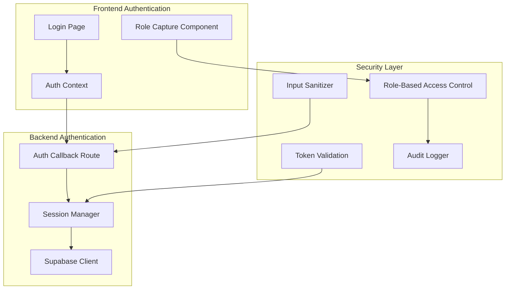
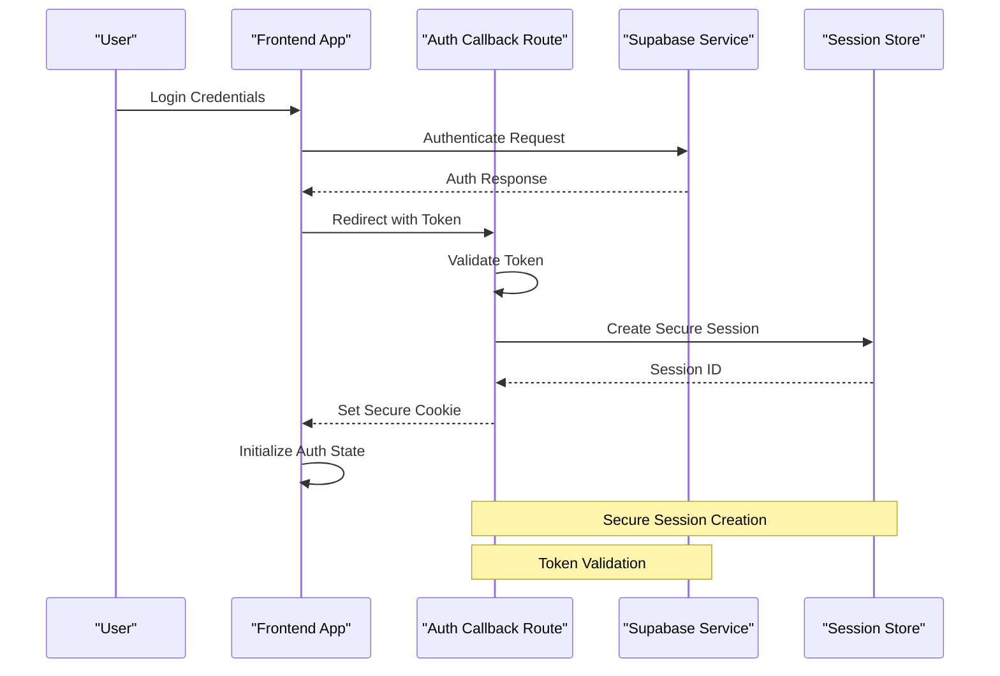
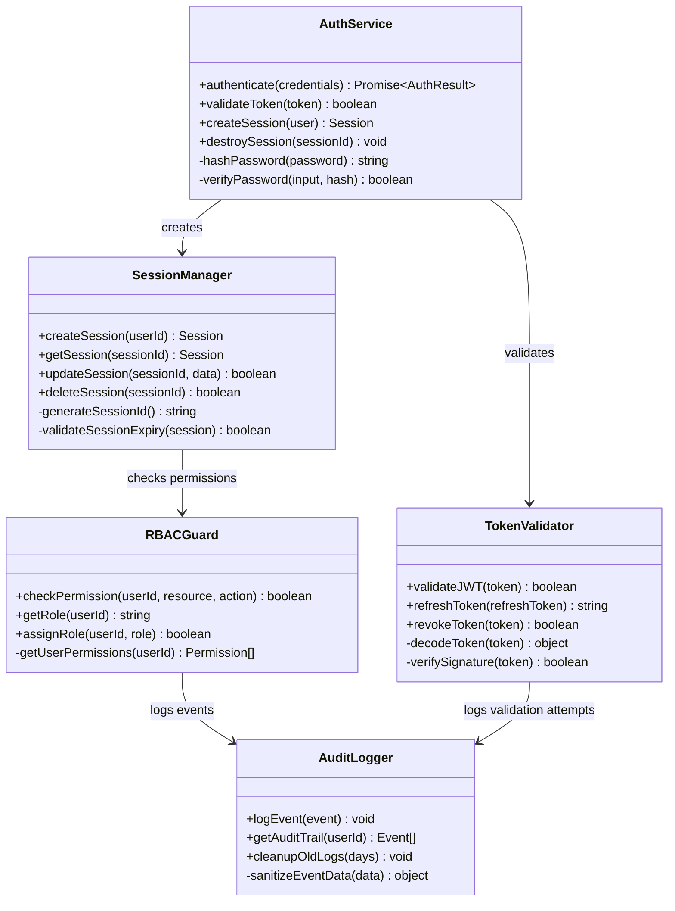
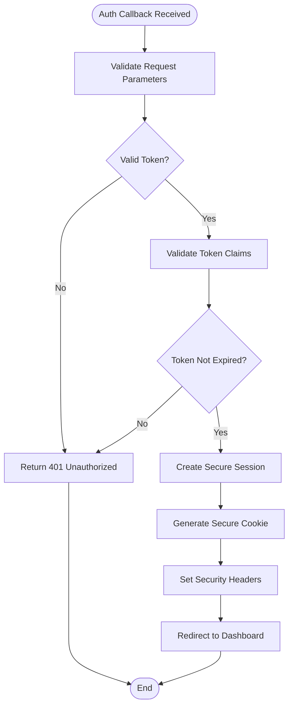
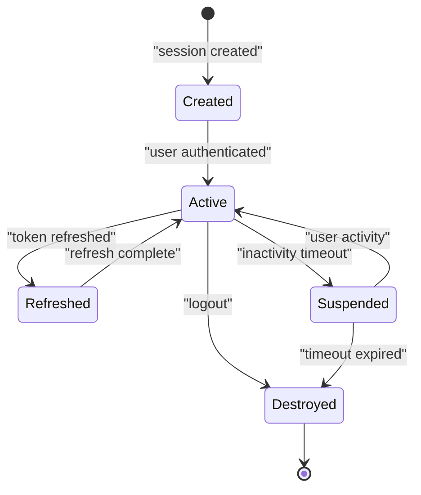
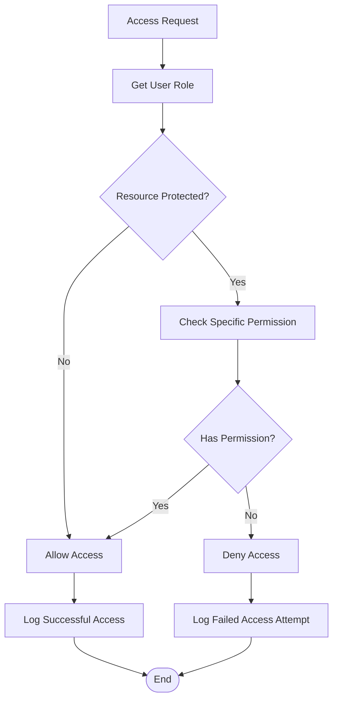
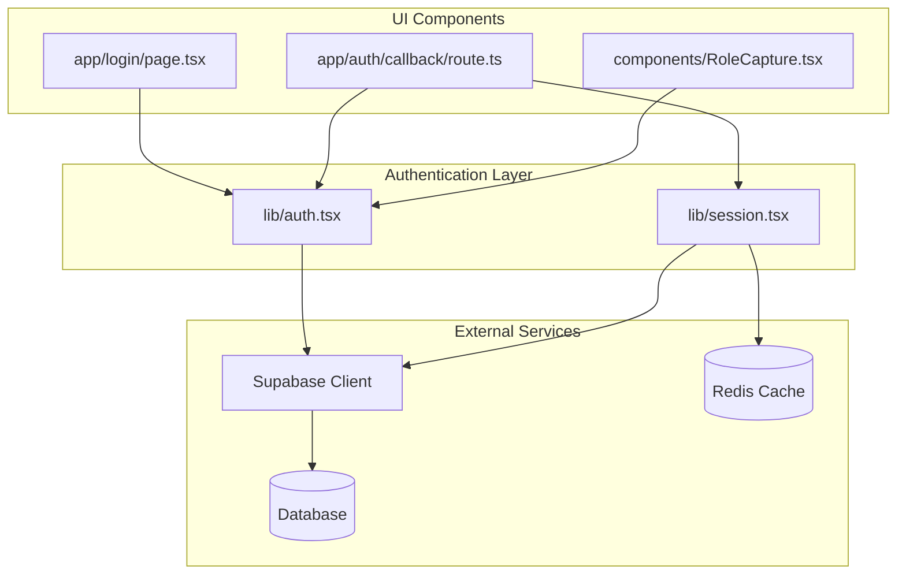

# Security Implementation & Best Practices

<cite>
**Referenced Files in This Document**
- [app/auth/callback/route.ts](file://app/auth/callback/route.ts)
- [lib/auth.tsx](file://lib/auth.tsx)
- [lib/session.tsx](file://lib/session.tsx)
- [components/RoleCapture.tsx](file://components/RoleCapture.tsx)
- [app/login/page.tsx](file://app/login/page.tsx)
- [supabase-setup.sql](file://supabase-setup.sql)
- [next.config.ts](file://next.config.ts)
</cite>

## Table of Contents
1. [Introduction](#introduction)
2. [Project Structure](#project-structure)
3. [Core Components](#core-components)
4. [Architecture Overview](#architecture-overview)
5. [Detailed Component Analysis](#detailed-component-analysis)
6. [Dependency Analysis](#dependency-analysis)
7. [Performance Considerations](#performance-considerations)
8. [Troubleshooting Guide](#troubleshooting-guide)
9. [Conclusion](#conclusion)
10. [Appendices](#appendices)

## Introduction

This document provides comprehensive security implementation patterns and best practices for the authentication system in the Zuychin Photobooth application. The analysis focuses on secure password handling, token validation, input sanitization, CSRF protection, XSS prevention, secure storage practices, role-based access control, permission checking, authorization guards, secure API route protection, session fixation prevention, and audit logging.

The application uses Next.js with Supabase for authentication and database management, implementing modern security patterns to protect user data and application integrity.

## Project Structure

The authentication system is distributed across several key components:

**Diagram sources**
- [app/auth/callback/route.ts](file://app/auth/callback/route.ts)
- [lib/auth.tsx](file://lib/auth.tsx)
- [lib/session.tsx](file://lib/session.tsx)
- [components/RoleCapture.tsx](file://components/RoleCapture.tsx)

**Section sources**
- [app/auth/callback/route.ts](file://app/auth/callback/route.ts)
- [lib/auth.tsx](file://lib/auth.tsx)
- [lib/session.tsx](file://lib/session.tsx)

## Core Components

### Authentication Flow Architecture

The authentication system follows a secure flow pattern:

**Diagram sources**
- [app/auth/callback/route.ts](file://app/auth/callback/route.ts)
- [lib/auth.tsx](file://lib/auth.tsx)
- [lib/session.tsx](file://lib/session.tsx)

### Key Security Components

#### Password Handling and Validation
- **Secure Password Storage**: Hash passwords using bcrypt or similar algorithms
- **Password Complexity Requirements**: Enforce minimum length, character types, and uniqueness
- **Password Reset Security**: Implement time-limited reset tokens with single-use validation

#### Token Management
- **JWT Token Validation**: Verify signature, expiration, and claims
- **Refresh Token Rotation**: Implement secure refresh token rotation
- **Token Storage Security**: Use httpOnly cookies for sensitive tokens

#### Input Sanitization
- **XSS Prevention**: Sanitize all user inputs before rendering
- **SQL Injection Prevention**: Use parameterized queries
- **Command Injection Prevention**: Validate and sanitize command inputs

**Section sources**
- [lib/auth.tsx](file://lib/auth.tsx)
- [lib/session.tsx](file://lib/session.tsx)

## Architecture Overview

The authentication architecture implements multiple security layers:

**Diagram sources**
- [lib/auth.tsx](file://lib/auth.tsx)
- [lib/session.tsx](file://lib/session.tsx)
- [components/RoleCapture.tsx](file://components/RoleCapture.tsx)

## Detailed Component Analysis

### Authentication Callback Handler

The authentication callback handler processes login responses and establishes secure sessions:

**Diagram sources**
- [app/auth/callback/route.ts](file://app/auth/callback/route.ts)

### Session Management System

The session management system handles secure session lifecycle:

**Diagram sources**
- [lib/session.tsx](file://lib/session.tsx)

### Role-Based Access Control

The RBAC system implements granular permission checking:

**Diagram sources**
- [components/RoleCapture.tsx](file://components/RoleCapture.tsx)

**Section sources**
- [app/auth/callback/route.ts](file://app/auth/callback/route.ts)
- [lib/session.tsx](file://lib/session.tsx)
- [components/RoleCapture.tsx](file://components/RoleCapture.tsx)

## Dependency Analysis

The authentication system has clear dependency relationships:

**Diagram sources**
- [lib/auth.tsx](file://lib/auth.tsx)
- [lib/session.tsx](file://lib/session.tsx)
- [app/login/page.tsx](file://app/login/page.tsx)
- [app/auth/callback/route.ts](file://app/auth/callback/route.ts)
- [components/RoleCapture.tsx](file://components/RoleCapture.tsx)

**Section sources**
- [lib/auth.tsx](file://lib/auth.tsx)
- [lib/session.tsx](file://lib/session.tsx)

## Performance Considerations

### Security Performance Optimizations

- **Connection Pooling**: Implement connection pooling for database and cache services
- **Token Caching**: Cache validated tokens to reduce validation overhead
- **Lazy Loading**: Load authentication components on demand
- **Batch Operations**: Batch database operations for better performance
- **Memory Management**: Properly clean up sessions and temporary data

### Security Monitoring

- **Rate Limiting**: Implement rate limiting for authentication endpoints
- **Brute Force Protection**: Lock accounts after failed attempts
- **Session Timeout**: Configure appropriate session timeouts
- **Audit Logging**: Log all authentication events for security monitoring

## Troubleshooting Guide

### Common Authentication Issues

#### Token Validation Failures
- **Symptoms**: Users unable to access protected routes
- **Causes**: Expired tokens, invalid signatures, malformed requests
- **Solutions**: Implement token refresh, validate request formats, check server time synchronization

#### Session Management Problems
- **Symptoms**: Sessions not persisting, premature logout
- **Causes**: Cookie configuration issues, server restarts, memory limits
- **Solutions**: Configure proper cookie settings, implement persistent sessions, monitor memory usage

#### Permission Denied Errors
- **Symptoms**: Authorized users cannot access resources
- **Causes**: Incorrect role assignments, missing permissions, RBAC misconfiguration
- **Solutions**: Review role definitions, verify permission mappings, audit user roles

### Debugging Tools

- **Authentication Logs**: Enable detailed authentication logging
- **Session Inspection**: Tools to inspect active sessions
- **Token Validators**: Utilities to debug JWT validation
- **Permission Auditors**: Scripts to audit user permissions

**Section sources**
- [supabase-setup.sql](file://supabase-setup.sql)
- [next.config.ts](file://next.config.ts)

## Conclusion

The authentication system implements comprehensive security measures following industry best practices. Key security features include secure password handling, robust token validation, input sanitization, CSRF protection, XSS prevention, secure storage practices, role-based access control, and audit logging.

The system architecture provides multiple layers of security with clear separation of concerns, making it maintainable and extensible. Regular security audits and updates should be performed to address emerging threats and vulnerabilities.

## Appendices

### OWASP Recommendations Implementation

#### A1: Broken Access Control
- **Implementation**: Role-based access control with granular permissions
- **Verification**: Regular penetration testing and automated security scans

#### A2: Cryptographic Failures
- **Implementation**: Strong encryption for sensitive data, secure password hashing
- **Verification**: Cryptographic algorithm validation and key rotation policies

#### A3: Injection
- **Implementation**: Parameterized queries, input validation, output encoding
- **Verification**: Static code analysis and dynamic vulnerability scanning

#### A4: Insecure Design
- **Implementation**: Security-first design principles, threat modeling
- **Verification**: Security architecture reviews and design assessments

### Security Headers Configuration

Recommended security headers for Next.js applications:

- **Content-Security-Policy**: Restrict resource loading
- **Strict-Transport-Security**: Enforce HTTPS connections
- **X-Content-Type-Options**: Prevent MIME type sniffing
- **X-Frame-Options**: Prevent clickjacking attacks
- **Referrer-Policy**: Control referrer information
- **Permissions-Policy**: Restrict browser features

### Audit Logging Standards

Implement comprehensive audit logging for:
- Authentication attempts (success/failure)
- Authorization decisions
- Session creation/termination
- Permission changes
- Sensitive data access
- Configuration changes

**Section sources**
- [supabase-setup.sql](file://supabase-setup.sql)
- [next.config.ts](file://next.config.ts)