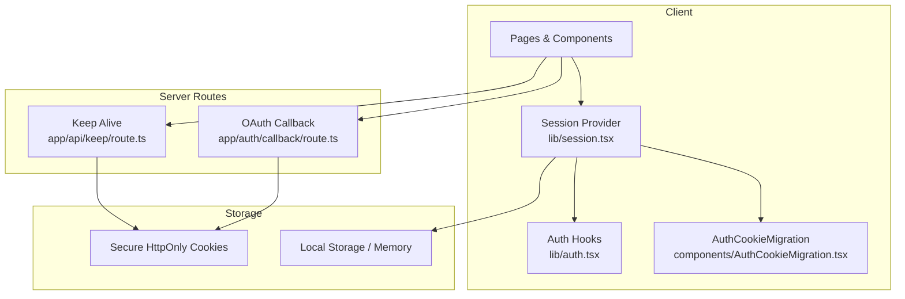
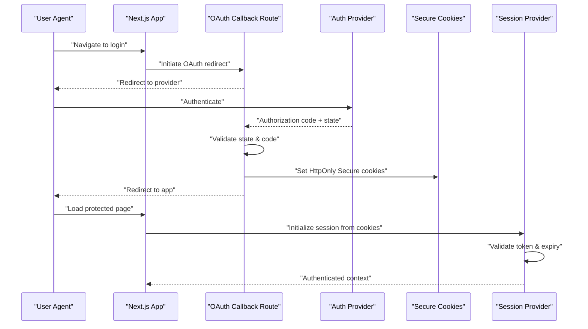
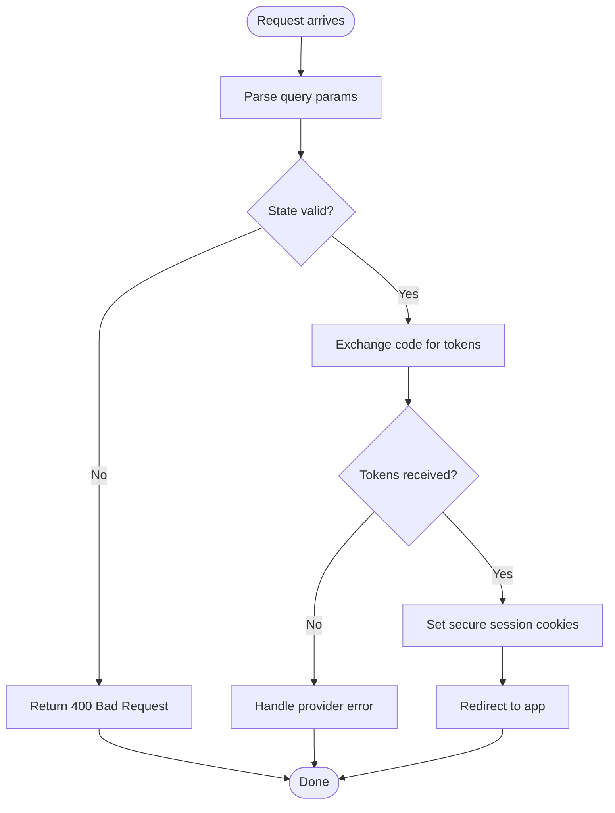
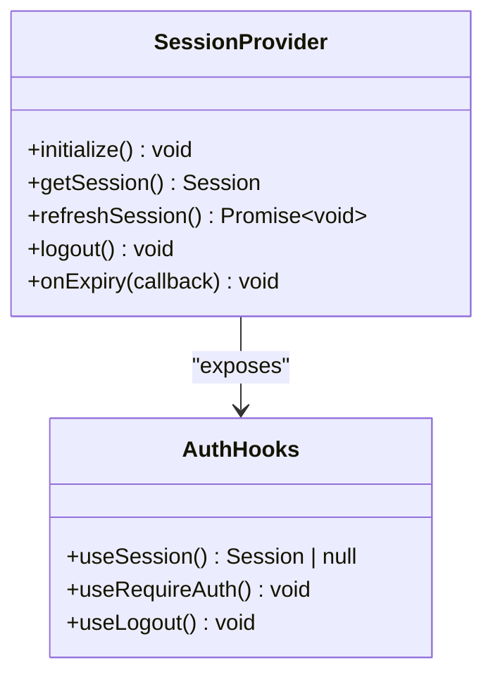
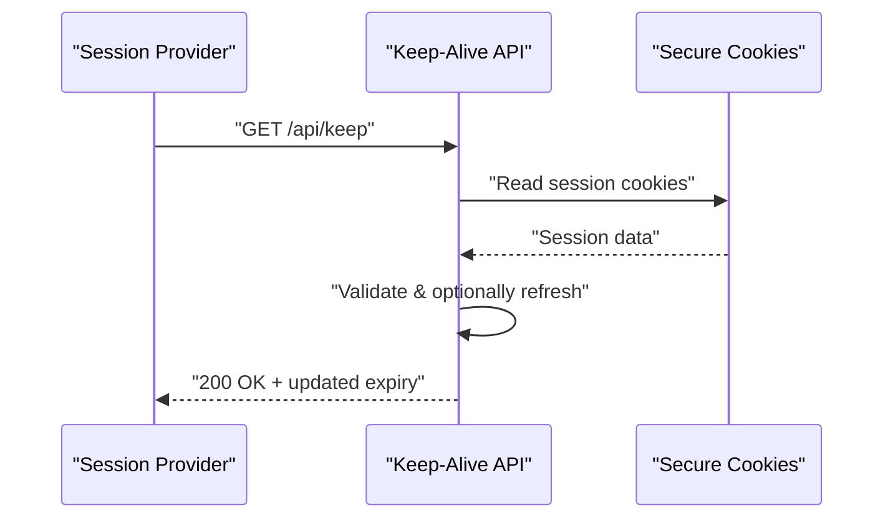
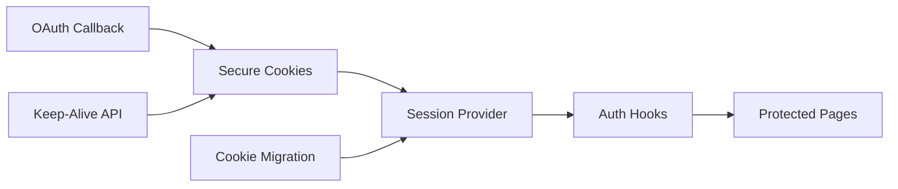

# Session Management & Persistence

<cite>
**Referenced Files in This Document**
- [app/auth/callback/route.ts](file://app/auth/callback/route.ts)
- [lib/session.tsx](file://lib/session.tsx)
- [lib/auth.tsx](file://lib/auth.tsx)
- [components/AuthCookieMigration.tsx](file://components/AuthCookieMigration.tsx)
- [app/api/keep/route.ts](file://app/api/keep/route.ts)
- [app/login/page.tsx](file://app/login/page.tsx)
- [app/layout.tsx](file://app/layout.tsx)
</cite>

## Table of Contents
1. [Introduction](#introduction)
2. [Project Structure](#project-structure)
3. [Core Components](#core-components)
4. [Architecture Overview](#architecture-overview)
5. [Detailed Component Analysis](#detailed-component-analysis)
6. [Dependency Analysis](#dependency-analysis)
7. [Performance Considerations](#performance-considerations)
8. [Troubleshooting Guide](#troubleshooting-guide)
9. [Conclusion](#conclusion)

## Introduction
This document explains how user sessions are created, maintained, and destroyed across the application lifecycle. It covers OAuth callback handling, session storage strategies, token management, automatic renewal, API route validation, expired session handling, logout flows, and security considerations such as CSRF protection, secure cookie configuration, and session hijacking prevention.

## Project Structure
The session-related functionality is primarily implemented in:
- OAuth callback route for authentication flow completion
- Session provider and utilities for client-side state and persistence
- Authentication hooks and helpers
- Cookie migration component to transition legacy cookies to modern session storage
- Keep-alive API route for proactive session renewal
- Login page entry point for initiating authentication
- Application layout that wires up providers and global behavior

**Diagram sources**
- [app/auth/callback/route.ts](file://app/auth/callback/route.ts)
- [lib/session.tsx](file://lib/session.tsx)
- [lib/auth.tsx](file://lib/auth.tsx)
- [components/AuthCookieMigration.tsx](file://components/AuthCookieMigration.tsx)
- [app/api/keep/route.ts](file://app/api/keep/route.ts)

**Section sources**
- [app/auth/callback/route.ts](file://app/auth/callback/route.ts)
- [lib/session.tsx](file://lib/session.tsx)
- [lib/auth.tsx](file://lib/auth.tsx)
- [components/AuthCookieMigration.tsx](file://components/AuthCookieMigration.tsx)
- [app/api/keep/route.ts](file://app/api/keep/route.ts)
- [app/login/page.tsx](file://app/login/page.tsx)
- [app/layout.tsx](file://app/layout.tsx)

## Core Components
- OAuth callback route: Completes the OAuth exchange, validates parameters, sets secure session cookies, and redirects to an authenticated area.
- Session provider: Manages session state on the client, persists tokens securely (e.g., via cookies), exposes getters/hooks, and handles refresh/renewal.
- Auth hooks: Provide typed access to current session, login/logout actions, and guards for protected routes.
- Cookie migration: Detects legacy auth cookies and migrates them to the new session format once per session.
- Keep-alive API: Proactively renews or validates the session at intervals to prevent unexpected expiration during active use.

**Section sources**
- [app/auth/callback/route.ts](file://app/auth/callback/route.ts)
- [lib/session.tsx](file://lib/session.tsx)
- [lib/auth.tsx](file://lib/auth.tsx)
- [components/AuthCookieMigration.tsx](file://components/AuthCookieMigration.tsx)
- [app/api/keep/route.ts](file://app/api/keep/route.ts)

## Architecture Overview
The session architecture combines server-side OAuth handling with client-side session management:

**Diagram sources**
- [app/auth/callback/route.ts](file://app/auth/callback/route.ts)
- [lib/session.tsx](file://lib/session.tsx)
- [lib/auth.tsx](file://lib/auth.tsx)

## Detailed Component Analysis

### OAuth Callback Route
Responsibilities:
- Validate incoming OAuth parameters (state, code, nonce if applicable).
- Exchange authorization code for tokens.
- Set secure, HttpOnly cookies for session persistence.
- Redirect to a safe post-auth URL after successful setup.

Security checks:
- State parameter verification to prevent CSRF in OAuth flows.
- Strict parsing and validation of query parameters.
- Secure cookie flags (HttpOnly, Secure, SameSite) and minimal scope.

**Diagram sources**
- [app/auth/callback/route.ts](file://app/auth/callback/route.ts)

**Section sources**
- [app/auth/callback/route.ts](file://app/auth/callback/route.ts)

### Session Provider and Persistence
Responsibilities:
- Initialize session state from cookies on load.
- Expose session data and actions (login, logout, refresh).
- Persist tokens securely using HttpOnly cookies where possible; fallback to memory/local storage only when necessary.
- Implement automatic renewal by polling or intercepting requests.

Key behaviors:
- On mount, read cookies and hydrate session.
- On token expiry, attempt silent refresh; if failed, clear session and redirect to login.
- Provide hooks to check authentication status and required roles.

**Diagram sources**
- [lib/session.tsx](file://lib/session.tsx)
- [lib/auth.tsx](file://lib/auth.tsx)

**Section sources**
- [lib/session.tsx](file://lib/session.tsx)
- [lib/auth.tsx](file://lib/auth.tsx)

### Cookie Migration Component
Purpose:
- Detect legacy auth cookies set by older versions of the app.
- Migrate values into the new session store once per session.
- Remove legacy cookies after successful migration.

Behavior:
- Runs once on first render in development/production.
- Validates migrated values before committing.
- Ensures no duplicate or conflicting entries.

**Section sources**
- [components/AuthCookieMigration.tsx](file://components/AuthCookieMigration.tsx)

### Keep-Alive API Route
Purpose:
- Proactively validate or renew the session without user interaction.
- Extend session lifetime while the user is active.

Flow:
- Client periodically calls this endpoint.
- Server verifies session cookies and returns updated expiry or success.
- Client updates local session state accordingly.

**Diagram sources**
- [app/api/keep/route.ts](file://app/api/keep/route.ts)

**Section sources**
- [app/api/keep/route.ts](file://app/api/keep/route.ts)

### Login Page
Responsibilities:
- Initiate OAuth flow by redirecting to the provider.
- Handle errors and display appropriate messages.
- Ensure return URLs are whitelisted.

**Section sources**
- [app/login/page.tsx](file://app/login/page.tsx)

### Application Layout
Responsibilities:
- Wrap the app with the session provider.
- Initialize global auth guards and hydration.
- Ensure consistent session availability across pages.

**Section sources**
- [app/layout.tsx](file://app/layout.tsx)

## Dependency Analysis
- The OAuth callback route depends on secure cookie setting and redirects to the client.
- The session provider reads cookies and provides hooks to components.
- The keep-alive route interacts with cookies to maintain session freshness.
- The migration component bridges old and new session formats.

**Diagram sources**
- [app/auth/callback/route.ts](file://app/auth/callback/route.ts)
- [lib/session.tsx](file://lib/session.tsx)
- [lib/auth.tsx](file://lib/auth.tsx)
- [components/AuthCookieMigration.tsx](file://components/AuthCookieMigration.tsx)
- [app/api/keep/route.ts](file://app/api/keep/route.ts)

**Section sources**
- [app/auth/callback/route.ts](file://app/auth/callback/route.ts)
- [lib/session.tsx](file://lib/session.tsx)
- [lib/auth.tsx](file://lib/auth.tsx)
- [components/AuthCookieMigration.tsx](file://components/AuthCookieMigration.tsx)
- [app/api/keep/route.ts](file://app/api/keep/route.ts)

## Performance Considerations
- Prefer server-side validation and short-lived tokens to reduce client-side overhead.
- Use HttpOnly cookies for sensitive tokens to avoid unnecessary client processing.
- Debounce keep-alive calls to minimize network churn.
- Hydrate session once on app start; avoid repeated parsing.

[No sources needed since this section provides general guidance]

## Troubleshooting Guide
Common issues and resolutions:
- Expired sessions: Ensure keep-alive is running and refresh logic is triggered on 401 responses.
- Missing cookies: Verify domain, path, Secure, and SameSite settings; ensure HTTPS in production.
- OAuth state mismatch: Check that state is generated and validated consistently; clear stale cookies.
- Migration failures: Inspect legacy cookie presence and ensure one-time migration runs correctly.

**Section sources**
- [app/auth/callback/route.ts](file://app/auth/callback/route.ts)
- [lib/session.tsx](file://lib/session.tsx)
- [components/AuthCookieMigration.tsx](file://components/AuthCookieMigration.tsx)

## Conclusion
The session system combines secure server-side OAuth handling with robust client-side session management. By validating parameters, using secure cookies, implementing proactive renewal, and providing clear hooks for protected routes, the application maintains strong security and usability. Follow the guidelines above to extend, debug, and harden session handling effectively.

[No sources needed since this section summarizes without analyzing specific files]