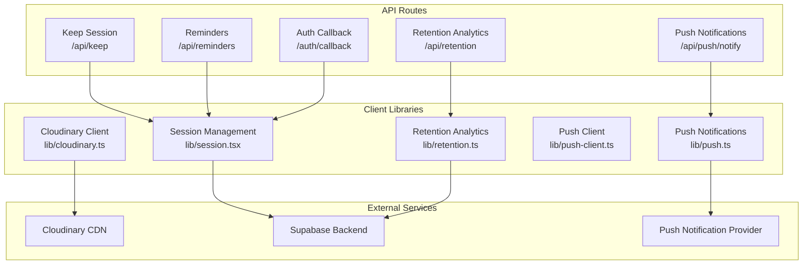
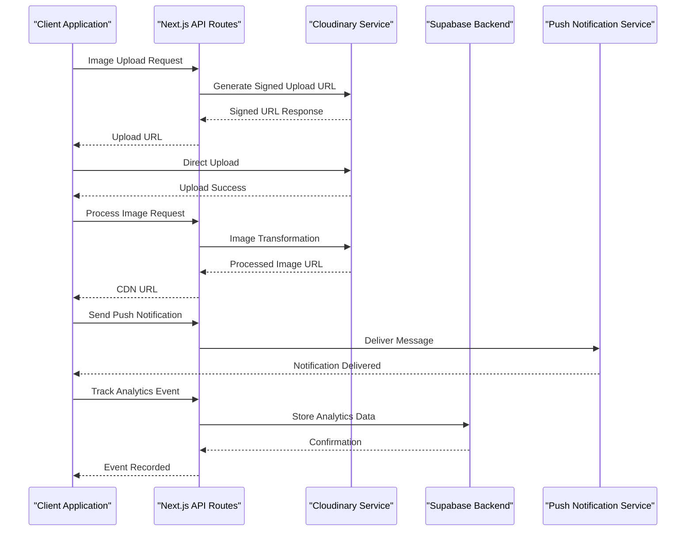
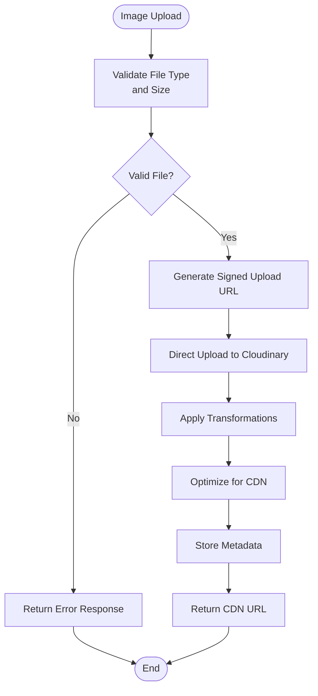
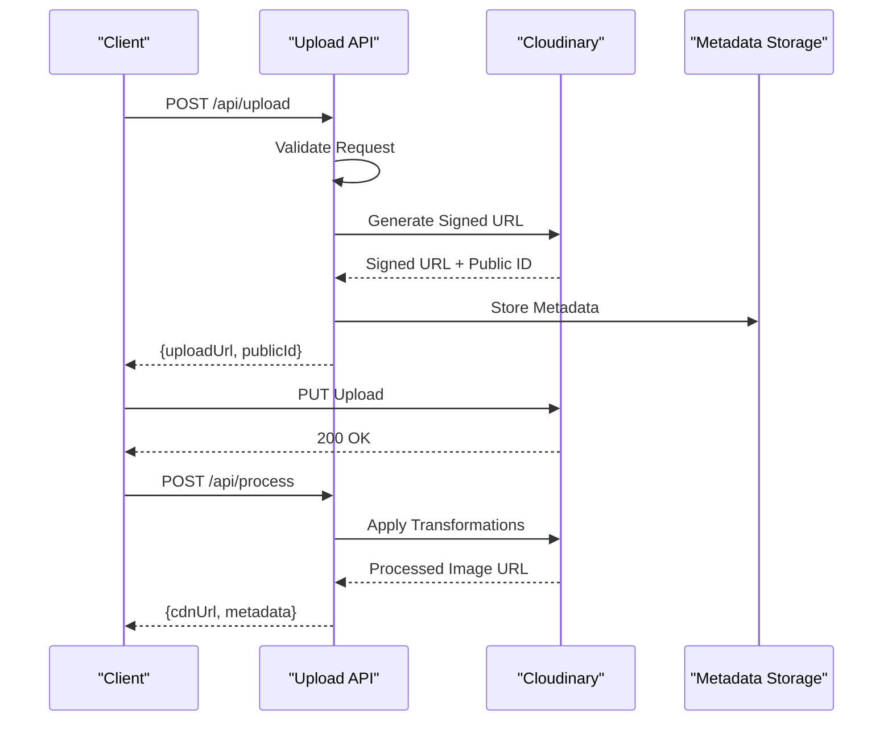
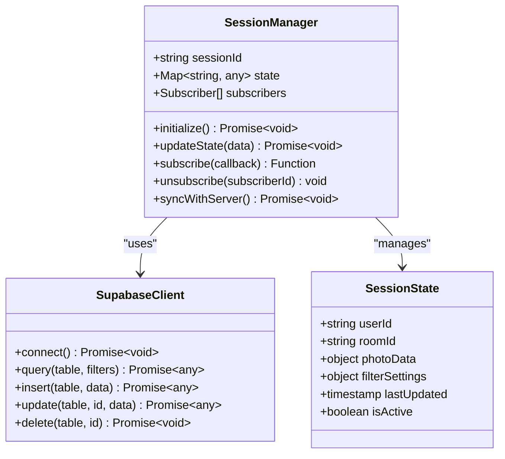
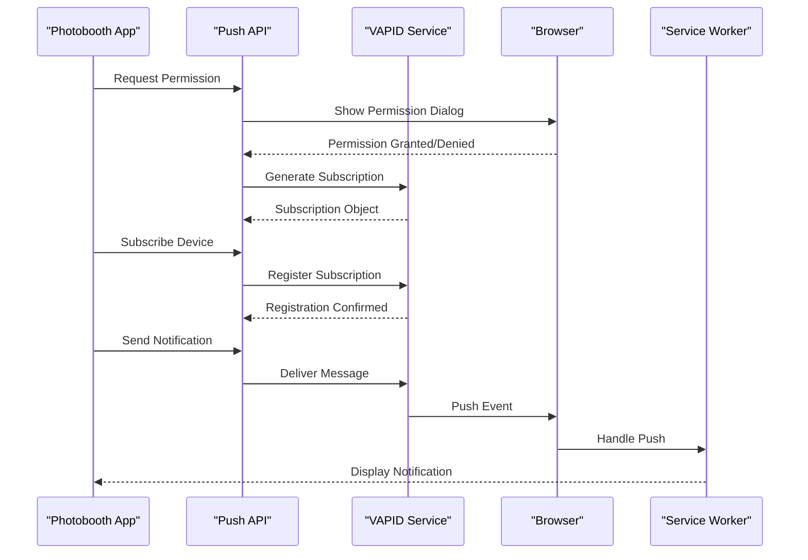
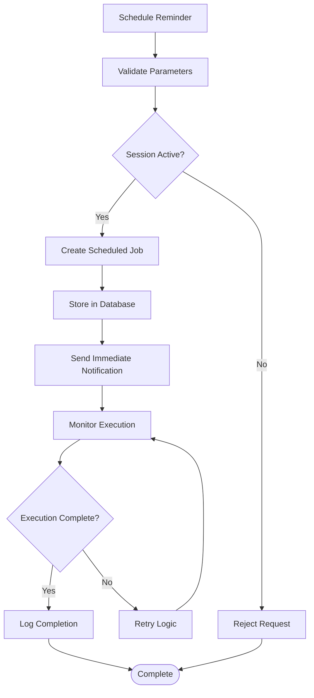
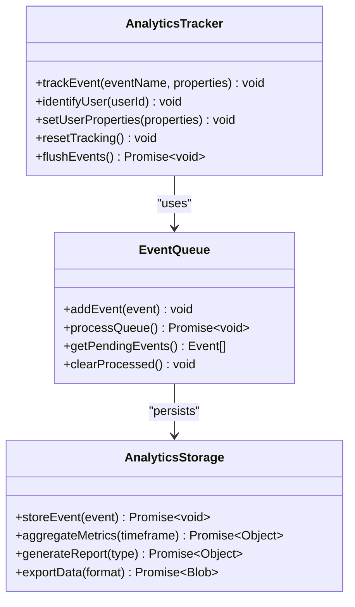
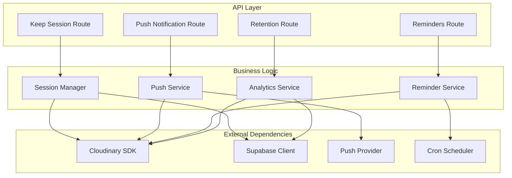

# Cloud Integration

<cite>
**Referenced Files in This Document**
- [cloudinary.ts](file://lib/cloudinary.ts)
- [keep/route.ts](file://app/api/keep/route.ts)
- [push/notify/route.ts](file://app/api/push/notify/route.ts)
- [reminders/route.ts](file://app/api/reminders/route.ts)
- [retention/route.ts](file://app/api/retention/route.ts)
- [auth/callback/route.ts](file://app/auth/callback/route.ts)
- [session.tsx](file://lib/session.tsx)
- [push.ts](file://lib/push.ts)
- [push-client.ts](file://lib/push-client.ts)
- [retention.ts](file://lib/retention.ts)
</cite>

## Table of Contents
1. [Introduction](#introduction)
2. [Project Structure](#project-structure)
3. [Core Components](#core-components)
4. [Architecture Overview](#architecture-overview)
5. [Detailed Component Analysis](#detailed-component-analysis)
6. [Dependency Analysis](#dependency-analysis)
7. [Performance Considerations](#performance-considerations)
8. [Troubleshooting Guide](#troubleshooting-guide)
9. [Security Considerations](#security-considerations)
10. [Conclusion](#conclusion)

## Introduction

This document provides comprehensive documentation for the cloud integration layer of the photobooth application. The system integrates Cloudinary for image upload, processing, and CDN delivery, along with serverless API endpoints for session persistence, push notifications, reminders, and retention analytics. The architecture follows modern Next.js patterns with TypeScript support and implements robust error handling and security measures.

## Project Structure

The cloud integration layer is organized into several key components:

**Diagram sources**
- [keep/route.ts](file://app/api/keep/route.ts)
- [push/notify/route.ts](file://app/api/push/notify/route.ts)
- [reminders/route.ts](file://app/api/reminders/route.ts)
- [retention/route.ts](file://app/api/retention/route.ts)
- [cloudinary.ts](file://lib/cloudinary.ts)
- [session.tsx](file://lib/session.tsx)
- [push.ts](file://lib/push.ts)
- [push-client.ts](file://lib/push-client.ts)
- [retention.ts](file://lib/retention.ts)

**Section sources**
- [keep/route.ts](file://app/api/keep/route.ts)
- [push/notify/route.ts](file://app/api/push/notify/route.ts)
- [reminders/route.ts](file://app/api/reminders/route.ts)
- [retention/route.ts](file://app/api/retention/route.ts)

## Core Components

### Cloudinary Integration

The Cloudinary integration handles image upload, processing, and CDN delivery through a centralized client library. Key features include:

- **Secure Uploads**: Server-side signing for secure uploads without exposing API keys
- **Image Processing**: Automatic optimization, format conversion, and transformation
- **CDN Delivery**: Global content delivery network for fast image loading
- **Metadata Management**: Custom metadata storage and retrieval

### Session Persistence

The session management system provides:

- **State Persistence**: Real-time session state synchronization across devices
- **User Authentication**: Secure user authentication with Supabase integration
- **Data Synchronization**: Automatic conflict resolution and data consistency
- **Offline Support**: Graceful handling of network interruptions

### Push Notification System

The notification system enables real-time communication:

- **Web Push API**: Browser-based push notifications
- **Service Worker Integration**: Background message handling
- **Permission Management**: User consent and preference handling
- **Message Routing**: Targeted delivery to specific users or groups

### Reminder Scheduling

The reminder system manages scheduled tasks:

- **Cron Jobs**: Time-based task execution
- **Notification Triggers**: Automated reminders based on events
- **User Preferences**: Customizable reminder settings
- **Delivery Tracking**: Status monitoring and retry logic

### Retention Analytics

Analytics collection and reporting:

- **Event Tracking**: User interaction and engagement metrics
- **Data Aggregation**: Real-time analytics processing
- **Reporting Dashboard**: Visual insights and trends
- **Privacy Compliance**: GDPR and data protection compliance

**Section sources**
- [cloudinary.ts](file://lib/cloudinary.ts)
- [session.tsx](file://lib/session.tsx)
- [push.ts](file://lib/push.ts)
- [push-client.ts](file://lib/push-client.ts)
- [retention.ts](file://lib/retention.ts)

## Architecture Overview

The cloud integration architecture follows a layered approach with clear separation of concerns:

**Diagram sources**
- [keep/route.ts](file://app/api/keep/route.ts)
- [push/notify/route.ts](file://app/api/push/notify/route.ts)
- [cloudinary.ts](file://lib/cloudinary.ts)
- [session.tsx](file://lib/session.tsx)

## Detailed Component Analysis

### Cloudinary Image Processing Pipeline

The Cloudinary integration implements a sophisticated image processing pipeline:

**Diagram sources**
- [cloudinary.ts](file://lib/cloudinary.ts)

#### Upload Flow Sequence

**Diagram sources**
- [cloudinary.ts](file://lib/cloudinary.ts)

### Session Management System

The session management system provides real-time collaboration capabilities:

**Diagram sources**
- [session.tsx](file://lib/session.tsx)

### Push Notification Architecture

The push notification system handles real-time messaging:

**Diagram sources**
- [push.ts](file://lib/push.ts)
- [push-client.ts](file://lib/push-client.ts)

### Reminder Scheduling System

The reminder system manages automated notifications:

**Diagram sources**
- [reminders/route.ts](file://app/api/reminders/route.ts)

### Retention Analytics Pipeline

The analytics system collects and processes user engagement data:

**Diagram sources**
- [retention.ts](file://lib/retention.ts)

**Section sources**
- [cloudinary.ts](file://lib/cloudinary.ts)
- [session.tsx](file://lib/session.tsx)
- [push.ts](file://lib/push.ts)
- [push-client.ts](file://lib/push-client.ts)
- [reminders/route.ts](file://app/api/reminders/route.ts)
- [retention.ts](file://lib/retention.ts)

## Dependency Analysis

The cloud integration layer has well-defined dependencies between components:

**Diagram sources**
- [keep/route.ts](file://app/api/keep/route.ts)
- [push/notify/route.ts](file://app/api/push/notify/route.ts)
- [reminders/route.ts](file://app/api/reminders/route.ts)
- [retention/route.ts](file://app/api/retention/route.ts)
- [session.tsx](file://lib/session.tsx)
- [push.ts](file://lib/push.ts)
- [retention.ts](file://lib/retention.ts)

**Section sources**
- [keep/route.ts](file://app/api/keep/route.ts)
- [push/notify/route.ts](file://app/api/push/notify/route.ts)
- [reminders/route.ts](file://app/api/reminders/route.ts)
- [retention/route.ts](file://app/api/retention/route.ts)

## Performance Considerations

### Image Optimization Strategies

- **Automatic Format Selection**: Serve WebP/AVIF formats when supported
- **Lazy Loading**: Implement progressive image loading
- **Caching Strategy**: Leverage browser and CDN caching headers
- **Compression**: Apply appropriate compression levels for different use cases

### API Performance Optimization

- **Request Batching**: Combine multiple API calls when possible
- **Response Caching**: Implement appropriate cache strategies
- **Connection Pooling**: Reuse database connections efficiently
- **Error Rate Limiting**: Prevent API abuse and ensure stability

### Storage Cost Management

- **Lifecycle Policies**: Automatically archive or delete old images
- **Storage Tiers**: Use appropriate storage classes for different data types
- **Deduplication**: Avoid storing duplicate images
- **Monitoring**: Track storage usage and costs regularly

## Troubleshooting Guide

### Common Issues and Solutions

#### Cloudinary Upload Failures

**Symptoms**: Upload timeouts, signature validation errors, or permission denied responses

**Solutions**:
- Verify Cloudinary credentials and environment variables
- Check CORS configuration for direct uploads
- Ensure proper MIME type detection
- Validate file size limits and restrictions

#### Push Notification Delivery Issues

**Symptoms**: Notifications not received, permission errors, or service worker failures

**Solutions**:
- Verify VAPID key configuration
- Check browser notification permissions
- Validate subscription object validity
- Monitor service worker registration status

#### Session Sync Problems

**Symptoms**: State inconsistencies, connection drops, or data conflicts

**Solutions**:
- Implement reconnection logic with exponential backoff
- Add conflict resolution strategies
- Monitor connection health and status
- Provide fallback mechanisms for offline scenarios

**Section sources**
- [cloudinary.ts](file://lib/cloudinary.ts)
- [push.ts](file://lib/push.ts)
- [session.tsx](file://lib/session.tsx)

## Security Considerations

### API Key Management

- **Environment Variables**: Store all sensitive credentials in environment variables
- **Secret Rotation**: Implement regular rotation of API keys and tokens
- **Access Control**: Restrict API key usage to specific domains and IP ranges
- **Audit Logging**: Monitor API key usage and detect suspicious activity

### CORS Configuration

- **Domain Whitelisting**: Configure strict CORS policies for allowed origins
- **Method Restrictions**: Limit HTTP methods to only those required
- **Header Validation**: Validate custom headers and request parameters
- **Preflight Handling**: Properly handle OPTIONS requests for cross-origin calls

### Rate Limiting and Protection

- **Request Throttling**: Implement rate limiting per user and IP address
- **Authentication Requirements**: Enforce authentication for sensitive operations
- **Input Validation**: Validate and sanitize all user inputs
- **Error Handling**: Provide generic error messages without exposing internal details

### Data Privacy and Compliance

- **Data Encryption**: Encrypt sensitive data at rest and in transit
- **GDPR Compliance**: Implement data deletion and export capabilities
- **Consent Management**: Track user consent for data processing
- **Audit Trails**: Maintain logs of data access and modifications

## Conclusion

The cloud integration layer provides a robust foundation for the photobooth application's external service interactions. The modular architecture ensures maintainability and scalability while the comprehensive security measures protect against common vulnerabilities. The performance optimizations and cost management strategies ensure efficient resource utilization.

Key strengths of the implementation include:

- **Modular Design**: Clear separation between business logic and external service integration
- **Comprehensive Error Handling**: Robust error handling and recovery mechanisms
- **Security Best Practices**: Implementation of industry-standard security measures
- **Performance Optimization**: Efficient resource usage and caching strategies
- **Scalability**: Horizontal scaling capabilities through serverless architecture

Future enhancements could include additional CDN providers, enhanced analytics capabilities, and improved monitoring and alerting systems.