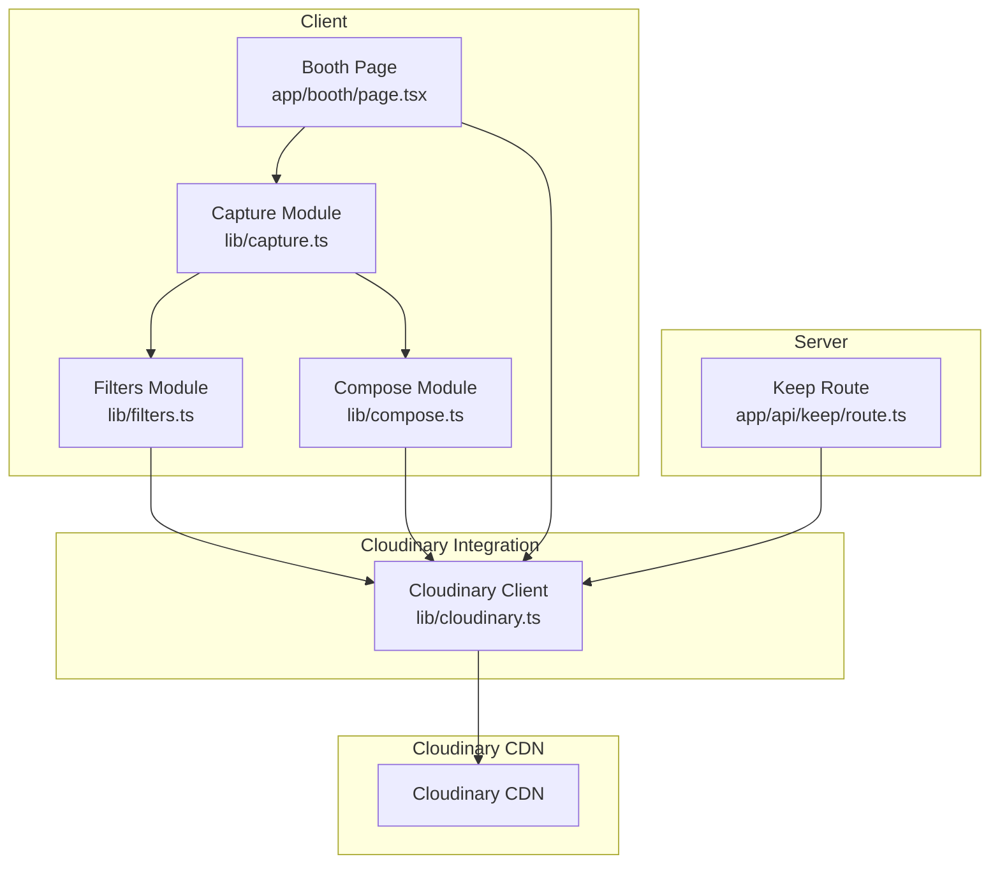
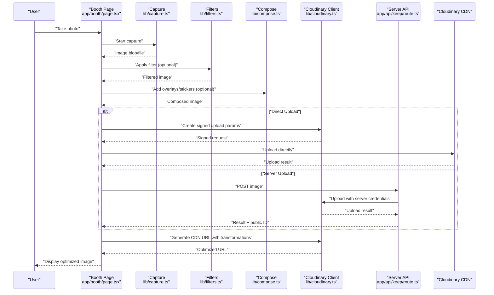
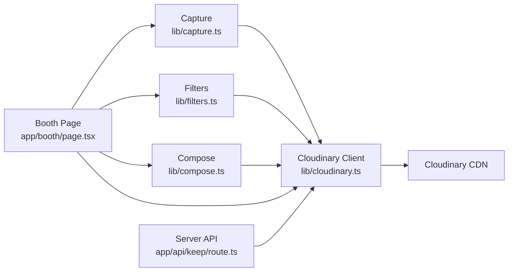

# Cloudinary Media Management

<cite>
**Referenced Files in This Document**
- [cloudinary.ts](file://lib/cloudinary.ts)
- [capture.ts](file://lib/capture.ts)
- [filters.ts](file://lib/filters.ts)
- [compose.ts](file://lib/compose.ts)
- [layout.tsx](file://app/layout.tsx)
- [page.tsx](file://app/booth/page.tsx)
- [route.ts](file://app/api/keep/route.ts)
- [package.json](file://package.json)
</cite>

## Table of Contents
1. [Introduction](#introduction)
2. [Project Structure](#project-structure)
3. [Core Components](#core-components)
4. [Architecture Overview](#architecture-overview)
5. [Detailed Component Analysis](#detailed-component-analysis)
6. [Dependency Analysis](#dependency-analysis)
7. [Performance Considerations](#performance-considerations)
8. [Troubleshooting Guide](#troubleshooting-guide)
9. [Conclusion](#conclusion)
10. [Appendices](#appendices)

## Introduction
This document explains the Cloudinary integration layer for the photobooth application. It covers how images are captured, uploaded (both direct from the browser and via server-side processing), transformed, and served through Cloudinary’s CDN. It also documents configuration setup, API key management, security best practices, transformation capabilities, dynamic URL generation for responsive images, error handling, retries, performance optimization, storage cost management, and caching strategies.

## Project Structure
The Cloudinary integration is primarily implemented in a dedicated library module and consumed by capture and UI components. Key files:
- lib/cloudinary.ts: Cloudinary client configuration, upload helpers, and URL generation utilities
- lib/capture.ts: Captures media from the camera and prepares blobs/files for upload
- lib/filters.ts: Applies visual filters to images before upload or transformation
- lib/compose.ts: Composes overlays/stickers with photos prior to upload
- app/booth/page.tsx: Photobooth UI that orchestrates capture, preview, and upload flows
- app/layout.tsx: Application layout where environment variables are typically accessed
- app/api/keep/route.ts: Example server route that can be extended for secure server-side uploads or metadata operations
- package.json: Dependencies including Cloudinary SDK

**Diagram sources**
- [cloudinary.ts](file://lib/cloudinary.ts)
- [capture.ts](file://lib/capture.ts)
- [filters.ts](file://lib/filters.ts)
- [compose.ts](file://lib/compose.ts)
- [page.tsx](file://app/booth/page.tsx)
- [route.ts](file://app/api/keep/route.ts)

**Section sources**
- [cloudinary.ts](file://lib/cloudinary.ts)
- [capture.ts](file://lib/capture.ts)
- [filters.ts](file://lib/filters.ts)
- [compose.ts](file://lib/compose.ts)
- [page.tsx](file://app/booth/page.tsx)
- [route.ts](file://app/api/keep/route.ts)
- [layout.tsx](file://app/layout.tsx)
- [package.json](file://package.json)

## Core Components
- Cloudinary client and helpers: Centralizes configuration, upload methods, and URL generation for transformations and responsive delivery.
- Capture pipeline: Captures frames, converts to appropriate formats, and optionally applies filters or composes overlays before upload.
- Server-side endpoints: Optional routes for secure uploads or metadata operations when needed.

Key responsibilities:
- Secure configuration using environment variables
- Direct browser uploads with signed requests
- Server-side fallbacks for large files or restricted environments
- Transformation pipelines for resizing, cropping, filters, and format optimization
- Dynamic CDN URLs for responsive images

**Section sources**
- [cloudinary.ts](file://lib/cloudinary.ts)
- [capture.ts](file://lib/capture.ts)
- [filters.ts](file://lib/filters.ts)
- [compose.ts](file://lib/compose.ts)

## Architecture Overview
The system supports two primary upload paths:
- Direct browser upload: The client constructs a signed upload request and sends it directly to Cloudinary, minimizing server load and latency.
- Server-side upload: The client sends the image to an internal API endpoint, which then uploads to Cloudinary securely using server-side credentials.

After upload, the client generates optimized CDN URLs with dynamic parameters for responsive delivery and on-the-fly transformations.

**Diagram sources**
- [page.tsx](file://app/booth/page.tsx)
- [capture.ts](file://lib/capture.ts)
- [filters.ts](file://lib/filters.ts)
- [compose.ts](file://lib/compose.ts)
- [cloudinary.ts](file://lib/cloudinary.ts)
- [route.ts](file://app/api/keep/route.ts)

## Detailed Component Analysis

### Cloudinary Client and Configuration
Responsibilities:
- Initialize the Cloudinary client using environment variables
- Provide functions for generating signed upload parameters
- Offer helpers to build transformation URLs with dynamic parameters
- Expose utilities for format optimization and responsive delivery

Security considerations:
- Never expose secret keys in the browser; use signed uploads generated server-side or via secure client-side signing endpoints
- Validate and sanitize all transformation parameters
- Use least-privilege API keys with upload-only permissions where possible

Configuration setup:
- Store Cloudinary cloud name, API key, and API secret in environment variables
- Ensure environment variables are loaded at runtime in both client and server contexts appropriately

URL generation:
- Build CDN URLs with width, height, crop mode, quality, and format parameters
- Use fetch_format and auto for automatic format selection
- Apply responsive breakpoints via width scaling and density descriptors

Error handling:
- Wrap network calls with try/catch blocks
- Return structured errors with actionable messages
- Implement retry logic with exponential backoff for transient failures

**Section sources**
- [cloudinary.ts](file://lib/cloudinary.ts)

### Capture Pipeline
Responsibilities:
- Access device camera and capture frames
- Convert captured data to Blob/File objects suitable for upload
- Optionally apply filters or compose overlays before upload

Processing flow:
- Start camera stream
- Capture frame into canvas or video element
- Export to desired format (e.g., JPEG/WebP)
- Pass to upload helper

Performance tips:
- Limit resolution for previews vs final uploads
- Use Web Workers for heavy image processing if necessary
- Debounce rapid captures to avoid excessive uploads

**Section sources**
- [capture.ts](file://lib/capture.ts)

### Filters and Composition
Responsibilities:
- Apply visual filters to images (brightness, contrast, saturation, etc.)
- Compose overlays, stickers, or text onto photos
- Maintain aspect ratios and ensure consistent output sizes

Implementation notes:
- Use Canvas API for pixel manipulation
- Cache filter presets to reduce recomputation
- Validate overlay assets and dimensions

**Section sources**
- [filters.ts](file://lib/filters.ts)
- [compose.ts](file://lib/compose.ts)

### Photobooth UI Orchestration
Responsibilities:
- Coordinate capture, filtering, composition, and upload steps
- Present user feedback (progress, success, errors)
- Generate and display optimized CDN URLs

User flow:
- User initiates capture
- UI shows preview and options (filters, stickers)
- On confirm, trigger upload (direct or server-side)
- Display optimized image and provide share/download actions

Accessibility and UX:
- Provide clear error messages and retry options
- Show progress indicators during upload
- Support keyboard navigation and screen readers

**Section sources**
- [page.tsx](file://app/booth/page.tsx)

### Server-Side API Endpoint
Responsibilities:
- Accept image uploads from clients
- Perform server-side validation and size checks
- Upload to Cloudinary using server credentials
- Return public IDs and metadata to the client

Security:
- Enforce authentication/authorization
- Validate content types and file sizes
- Rate-limit endpoints to prevent abuse

Extensibility:
- Add metadata tagging for organization and search
- Integrate with retention policies and cleanup jobs

**Section sources**
- [route.ts](file://app/api/keep/route.ts)

## Dependency Analysis
The Cloudinary integration depends on:
- Environment variables for configuration
- Browser APIs for capture and Canvas manipulation
- Network libraries for HTTP requests
- Cloudinary SDK or REST APIs for uploads and URL generation

**Diagram sources**
- [page.tsx](file://app/booth/page.tsx)
- [capture.ts](file://lib/capture.ts)
- [filters.ts](file://lib/filters.ts)
- [compose.ts](file://lib/compose.ts)
- [cloudinary.ts](file://lib/cloudinary.ts)
- [route.ts](file://app/api/keep/route.ts)

**Section sources**
- [package.json](file://package.json)

## Performance Considerations
- Prefer direct browser uploads to reduce server load and latency
- Use Cloudinary’s automatic format selection (WebP/AVIF) and quality tuning
- Implement responsive images with srcset and proper width scaling
- Cache transformed URLs client-side when appropriate
- Avoid redundant uploads by checking existing public IDs
- Batch operations where possible (e.g., multiple small images)

[No sources needed since this section provides general guidance]

## Troubleshooting Guide
Common issues and resolutions:
- Upload fails due to invalid signature: Verify signed parameters and expiration times
- CORS errors: Ensure Cloudinary settings allow your origin
- Large file timeouts: Switch to server-side upload or chunked uploads
- Missing transformations: Check parameter names and values
- Rate limiting: Implement retries with backoff and respect server limits

Error handling patterns:
- Wrap async operations with try/catch
- Log detailed error context without exposing secrets
- Provide user-friendly messages and retry buttons

Retry mechanisms:
- Exponential backoff with jitter
- Maximum retry attempts
- Fallback to alternative upload method

**Section sources**
- [cloudinary.ts](file://lib/cloudinary.ts)
- [route.ts](file://app/api/keep/route.ts)

## Conclusion
The Cloudinary integration enables efficient, secure, and scalable media management for the photobooth application. By combining direct browser uploads, server-side fallbacks, robust transformation pipelines, and dynamic CDN URLs, the system delivers high-quality images with optimal performance. Following the security, performance, and troubleshooting guidelines ensures a reliable user experience while managing storage costs effectively.

[No sources needed since this section summarizes without analyzing specific files]

## Appendices

### Configuration Setup
- Set environment variables for Cloudinary cloud name, API key, and API secret
- Load variables securely in both client and server contexts
- Restrict API key permissions to upload-only where possible

**Section sources**
- [layout.tsx](file://app/layout.tsx)
- [cloudinary.ts](file://lib/cloudinary.ts)

### Security Best Practices
- Never hardcode secrets in client code
- Use signed uploads generated server-side or via secure endpoints
- Validate and sanitize all inputs
- Implement rate limiting and access controls

**Section sources**
- [cloudinary.ts](file://lib/cloudinary.ts)
- [route.ts](file://app/api/keep/route.ts)

### Image Transformation Capabilities
- Resizing: Specify width/height with crop modes (fit, fill, scale)
- Cropping: Use gravity and coordinates for precise crops
- Filters: Apply brightness, contrast, saturation, blur, sharpen
- Format optimization: Auto-select WebP/AVIF based on client support
- Quality tuning: Adjust quality levels for balance between size and fidelity

**Section sources**
- [cloudinary.ts](file://lib/cloudinary.ts)

### CDN URL Generation for Responsive Images
- Use dynamic parameters for width, height, and density
- Leverage fetch_format and auto for optimal format selection
- Combine with srcset for responsive delivery across devices

**Section sources**
- [cloudinary.ts](file://lib/cloudinary.ts)

### Practical Examples
- Uploading photos from the photobooth: Capture -> Filter/Compose -> Upload -> Generate URL
- Applying transformations: Resize, crop, apply filters, optimize format
- Retrieving optimized URLs: Construct URLs with dynamic parameters for responsive display

**Section sources**
- [page.tsx](file://app/booth/page.tsx)
- [capture.ts](file://lib/capture.ts)
- [filters.ts](file://lib/filters.ts)
- [compose.ts](file://lib/compose.ts)
- [cloudinary.ts](file://lib/cloudinary.ts)

### Error Handling and Retry Mechanisms
- Implement structured error responses
- Use exponential backoff with jitter
- Provide fallback upload methods

**Section sources**
- [cloudinary.ts](file://lib/cloudinary.ts)
- [route.ts](file://app/api/keep/route.ts)

### Performance Optimization Strategies
- Direct browser uploads
- Automatic format selection
- Responsive images with srcset
- Client-side caching of transformed URLs

[No sources needed since this section provides general guidance]

### Managing Storage Costs
- Delete unused images via scheduled jobs
- Tag images for lifecycle policies
- Use thumbnails and lower-resolution variants for previews

**Section sources**
- [cloudinary.ts](file://lib/cloudinary.ts)

### Caching Strategies
- Cache CDN URLs client-side with appropriate TTL
- Use browser cache headers from Cloudinary
- Implement service worker caching for offline scenarios

**Section sources**
- [cloudinary.ts](file://lib/cloudinary.ts)