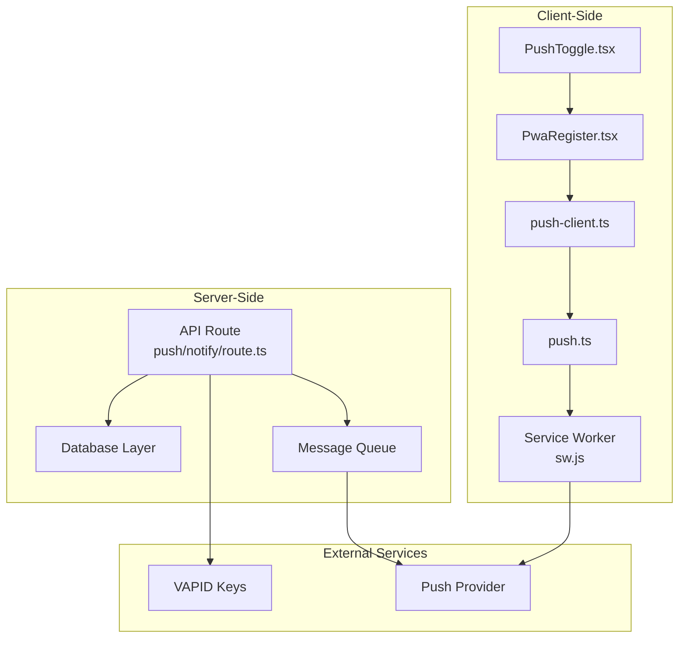
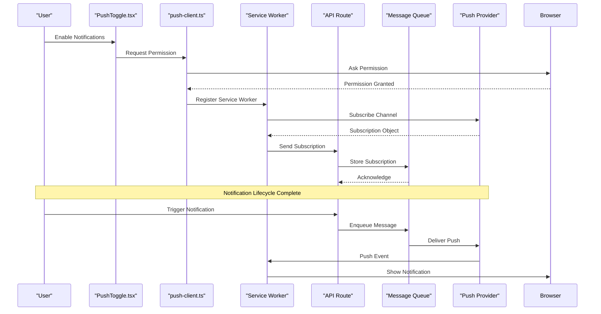
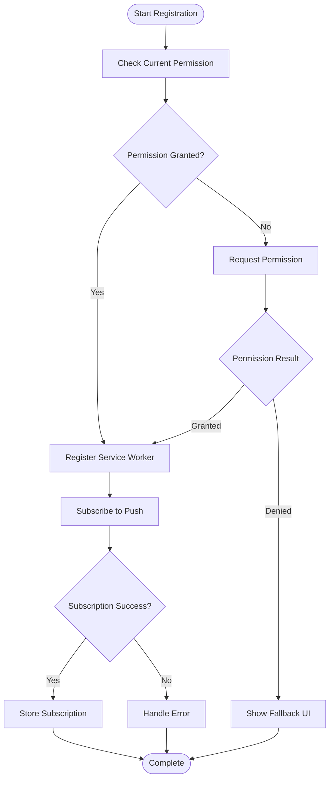
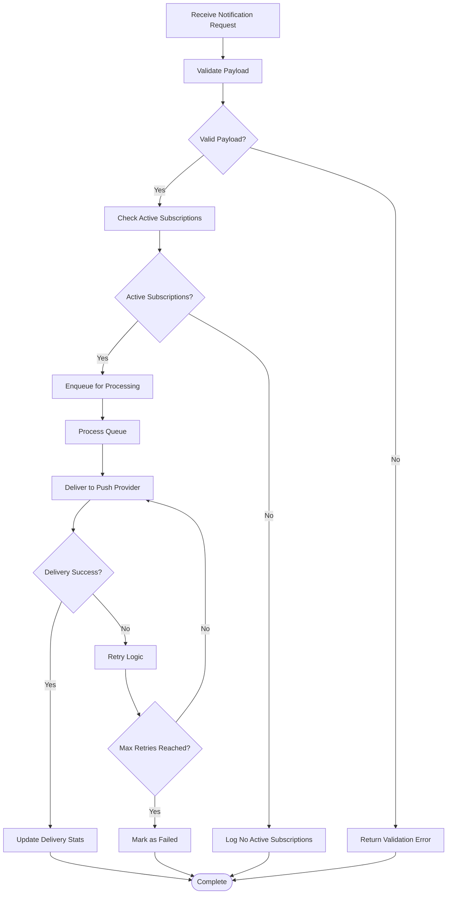
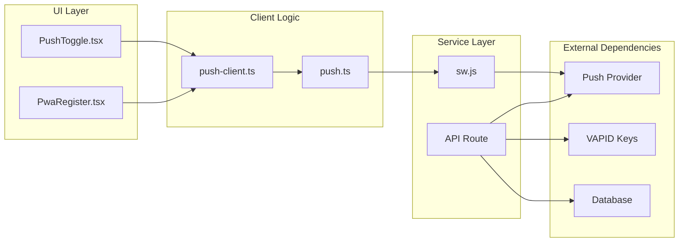

# Push Notification System

<cite>
**Referenced Files in This Document**
- [push.ts](file://lib/push.ts)
- [push-client.ts](file://lib/push-client.ts)
- [PushToggle.tsx](file://components/PushToggle.tsx)
- [route.ts](file://app/api/push/notify/route.ts)
- [sw.js](file://public/sw.js)
- [PwaRegister.tsx](file://components/PwaRegister.tsx)
- [manifest.ts](file://app/manifest.ts)
</cite>

## Table of Contents
1. [Introduction](#introduction)
2. [Project Structure](#project-structure)
3. [Core Components](#core-components)
4. [Architecture Overview](#architecture-overview)
5. [Detailed Component Analysis](#detailed-component-analysis)
6. [Dependency Analysis](#dependency-analysis)
7. [Performance Considerations](#performance-considerations)
8. [Troubleshooting Guide](#troubleshooting-guide)
9. [Conclusion](#conclusion)

## Introduction

The push notification system in this photobooth application provides real-time communication capabilities between the server and client devices. The system enables users to receive timely updates about photo sessions, reminders, and promotional content while maintaining full control over their notification preferences.

This implementation follows modern web standards including the Web Push Protocol, Service Workers, and the Notifications API to ensure cross-platform compatibility across browsers and mobile devices.

## Project Structure

The push notification system is distributed across several key components:

**Diagram sources**
- [PushToggle.tsx](file://components/PushToggle.tsx)
- [PwaRegister.tsx](file://components/PwaRegister.tsx)
- [push-client.ts](file://lib/push-client.ts)
- [push.ts](file://lib/push.ts)
- [sw.js](file://public/sw.js)
- [route.ts](file://app/api/push/notify/route.ts)

**Section sources**
- [PushToggle.tsx](file://components/PushToggle.tsx)
- [PwaRegister.tsx](file://components/PwaRegister.tsx)
- [push-client.ts](file://lib/push-client.ts)
- [push.ts](file://lib/push.ts)
- [sw.js](file://public/sw.js)
- [route.ts](file://app/api/push/notify/route.ts)

## Core Components

### Client-Side Registration and Management

The client-side implementation handles user permission requests, subscription management, and service worker registration. Key responsibilities include:

- **Permission Handling**: Requests browser notifications permission and handles user consent
- **Subscription Management**: Manages VAPID subscriptions and stores them securely
- **Service Worker Integration**: Registers and manages the service worker for background processing
- **User Preferences**: Provides UI controls for enabling/disabling notifications

### Server-Side Delivery Mechanism

The server component manages notification delivery through a robust architecture:

- **API Endpoints**: RESTful endpoints for sending notifications and managing subscriptions
- **Message Queuing**: Asynchronous processing of notification requests
- **Delivery Confirmation**: Tracking and logging of successful deliveries
- **Error Handling**: Retry mechanisms and failure recovery

### Service Worker Implementation

The service worker acts as an intermediary between the browser and push provider:

- **Background Processing**: Handles notifications when the app is not active
- **Event Handling**: Processes push events and notification clicks
- **Data Caching**: Stores subscription data and user preferences
- **Offline Support**: Ensures functionality even without internet connectivity

**Section sources**
- [push-client.ts](file://lib/push-client.ts)
- [push.ts](file://lib/push.ts)
- [PushToggle.tsx](file://components/PushToggle.tsx)
- [sw.js](file://public/sw.js)

## Architecture Overview

The push notification system follows a decoupled architecture that separates client concerns from server responsibilities:

**Diagram sources**
- [PushToggle.tsx](file://components/PushToggle.tsx)
- [push-client.ts](file://lib/push-client.ts)
- [sw.js](file://public/sw.js)
- [route.ts](file://app/api/push/notify/route.ts)

## Detailed Component Analysis

### Client-Side Notification Registration

The client-side registration process involves multiple steps to ensure proper setup and user consent:

#### Permission Flow

**Diagram sources**
- [push-client.ts](file://lib/push-client.ts)
- [push.ts](file://lib/push.ts)

#### Service Worker Integration
The service worker handles background processing and ensures notifications are delivered even when the application is not actively running. It manages:

- Push event listeners for incoming messages
- Notification click handlers for user interactions
- Background sync for offline message queuing
- Data persistence for subscription state

### Server-Side Delivery Mechanism

The server implements a robust delivery system with message queuing and retry logic:

#### Message Processing Pipeline

**Diagram sources**
- [route.ts](file://app/api/push/notify/route.ts)

#### Payload Structure
The notification payload follows a standardized format to ensure consistency across different platforms:

| Field | Type | Required | Description |
|-------|------|----------|-------------|
| `title` | string | Yes | Notification title displayed to the user |
| `body` | string | Yes | Main notification content |
| `icon` | string | No | Custom icon URL for the notification |
| `badge` | string | No | Badge icon for Android devices |
| `image` | string | No | Additional image attachment |
| `data` | object | No | Custom data object for handling actions |
| `timestamp` | number | Yes | Unix timestamp for message ordering |
| `priority` | string | No | Message priority (high, normal, low) |
| `tag` | string | No | Grouping identifier for related notifications |

### User Preference Management

The system provides granular control over notification preferences through a dedicated UI component:

#### Preference States
- **Enabled**: All notifications are active
- **Disabled**: All notifications are turned off
- **Selective**: Granular control over notification types

#### State Persistence
User preferences are stored locally and synchronized with the server to maintain consistency across devices:

- Local storage for immediate preference changes
- Server synchronization for cross-device consistency
- Graceful fallback when server is unavailable

### Cross-Platform Compatibility

The implementation ensures broad compatibility across different platforms and browsers:

#### Browser Support Matrix
| Feature | Chrome | Firefox | Safari | Edge | iOS Safari |
|---------|--------|---------|--------|------|------------|
| Push API | ✅ | ✅ | ✅ | ✅ | ✅ |
| Service Worker | ✅ | ✅ | ✅ | ✅ | ✅ |
| Notifications | ✅ | ✅ | ✅ | ✅ | ✅ |
| VAPID | ✅ | ✅ | ✅ | ✅ | ✅ |
| Background Sync | ✅ | ✅ | ❌ | ✅ | ❌ |

#### Fallback Mechanisms
When advanced features are unavailable, the system gracefully degrades:

- In-app notifications when push is disabled
- Email fallback for critical notifications
- SMS alerts for high-priority messages
- Progressive enhancement based on capability detection

**Section sources**
- [PushToggle.tsx](file://components/PushToggle.tsx)
- [push-client.ts](file://lib/push-client.ts)
- [route.ts](file://app/api/push/notify/route.ts)
- [sw.js](file://public/sw.js)

## Dependency Analysis

The push notification system has well-defined dependencies between components:

**Diagram sources**
- [PushToggle.tsx](file://components/PushToggle.tsx)
- [PwaRegister.tsx](file://components/PwaRegister.tsx)
- [push-client.ts](file://lib/push-client.ts)
- [push.ts](file://lib/push.ts)
- [sw.js](file://public/sw.js)
- [route.ts](file://app/api/push/notify/route.ts)

### Key Dependencies

- **Web APIs**: Notifications API, Service Worker API, Push API
- **Security**: VAPID keys for authentication with push providers
- **Storage**: Local storage for client-side preferences
- **Network**: HTTP requests for API communication
- **Cryptography**: Encryption for secure subscription management

## Performance Considerations

### Optimization Strategies

#### Client-Side Optimizations
- **Lazy Loading**: Load push-related code only when needed
- **Debounced Requests**: Prevent excessive permission prompts
- **Efficient Storage**: Minimize local storage operations
- **Memory Management**: Clean up unused event listeners

#### Server-Side Optimizations
- **Batch Processing**: Group multiple notifications together
- **Connection Pooling**: Reuse database connections
- **Caching**: Cache subscription data and user preferences
- **Rate Limiting**: Prevent abuse and manage load

### Monitoring and Metrics

Key performance indicators to monitor:

- **Delivery Rate**: Percentage of successfully delivered notifications
- **Latency**: Time from request to delivery
- **Error Rate**: Failure percentage by error type
- **Subscription Health**: Active vs. expired subscriptions
- **User Engagement**: Click-through rates and response times

## Troubleshooting Guide

### Common Issues and Solutions

#### Permission Denied
**Symptoms**: Users cannot receive notifications despite enabling them
**Causes**: 
- Browser security settings blocking permissions
- HTTPS requirement not met
- User previously denied permission

**Solutions**:
- Ensure site is served over HTTPS
- Implement proper permission request flow
- Provide clear instructions for manual permission granting

#### Service Worker Not Registering
**Symptoms**: Push notifications don't work in background
**Causes**:
- Incorrect service worker path
- MIME type issues
- CORS configuration problems

**Solutions**:
- Verify service worker registration path
- Check network tab for registration errors
- Ensure proper CORS headers

#### Subscription Expiration
**Symptoms**: Notifications stop working after some time
**Causes**:
- VAPID key rotation
- Push provider token expiration
- Browser clearing stored data

**Solutions**:
- Implement automatic subscription renewal
- Monitor subscription health
- Provide re-subscription prompts

### Debugging Tools

#### Client-Side Debugging
- Use browser developer tools to inspect service worker status
- Monitor network requests for API calls
- Check local storage for subscription data
- Log permission states and errors

#### Server-Side Debugging
- Monitor API endpoint logs
- Track message queue processing
- Inspect push provider responses
- Analyze delivery statistics

**Section sources**
- [push-client.ts](file://lib/push-client.ts)
- [sw.js](file://public/sw.js)
- [route.ts](file://app/api/push/notify/route.ts)

## Conclusion

The push notification system provides a robust, scalable solution for real-time communication in the photobooth application. By implementing proper permission handling, efficient delivery mechanisms, and comprehensive user preference management, the system ensures optimal user experience while maintaining high reliability.

Key strengths of the implementation include:

- **Cross-platform compatibility** across major browsers and devices
- **Graceful degradation** when advanced features are unavailable
- **Comprehensive error handling** with retry mechanisms
- **User-centric design** with full control over notification preferences
- **Performance optimization** through lazy loading and efficient caching

Future enhancements could include:

- Advanced analytics for notification effectiveness
- Personalization based on user behavior
- Rich media support for enhanced engagement
- Integration with additional messaging channels

The modular architecture allows for easy extension and maintenance, ensuring the system can evolve with changing requirements and technologies.