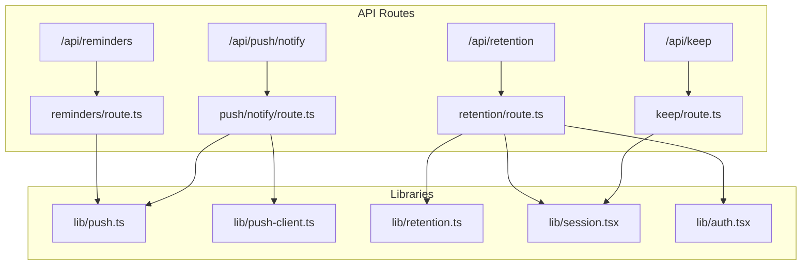
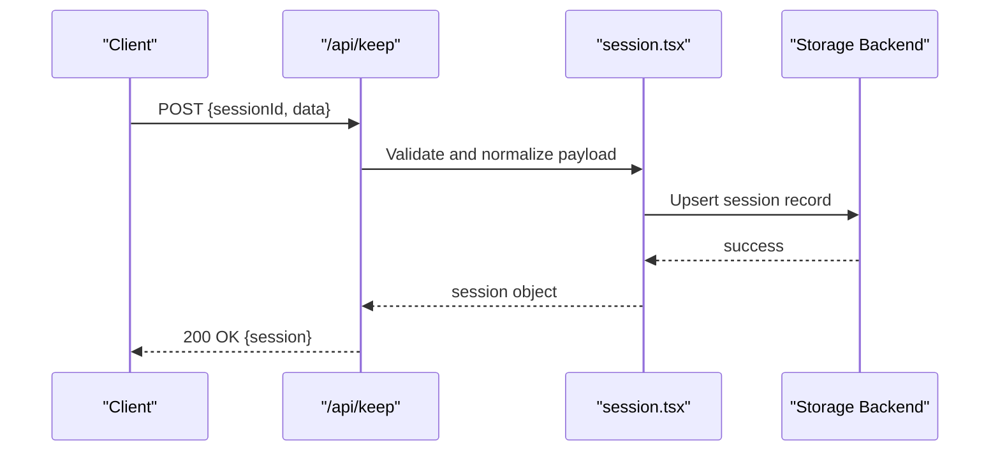
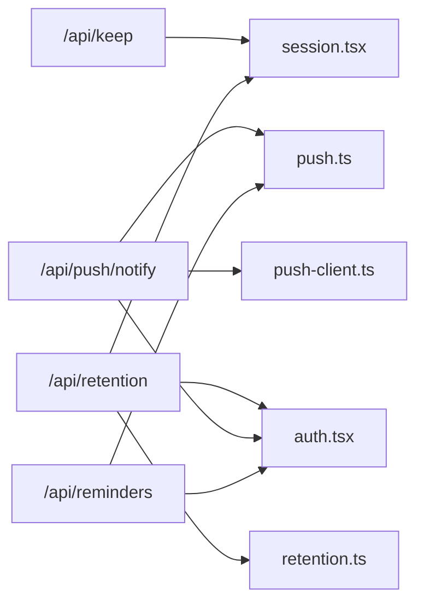

# Serverless API Endpoints

<cite>
**Referenced Files in This Document**
- [app/api/keep/route.ts](file://app/api/keep/route.ts)
- [app/api/push/notify/route.ts](file://app/api/push/notify/route.ts)
- [app/api/reminders/route.ts](file://app/api/reminders/route.ts)
- [app/api/retention/route.ts](file://app/api/retention/route.ts)
- [lib/push.ts](file://lib/push.ts)
- [lib/push-client.ts](file://lib/push-client.ts)
- [lib/retention.ts](file://lib/retention.ts)
- [lib/session.tsx](file://lib/session.tsx)
- [lib/auth.tsx](file://lib/auth.tsx)
</cite>

## Table of Contents
1. [Introduction](#introduction)
2. [Project Structure](#project-structure)
3. [Core Components](#core-components)
4. [Architecture Overview](#architecture-overview)
5. [Detailed Component Analysis](#detailed-component-analysis)
6. [Dependency Analysis](#dependency-analysis)
7. [Performance Considerations](#performance-considerations)
8. [Troubleshooting Guide](#troubleshooting-guide)
9. [Conclusion](#conclusion)

## Introduction
This document provides detailed API documentation for the serverless endpoints exposed by the application. It covers session persistence, push notification delivery, reminder scheduling and management, and analytics for user retention tracking. For each endpoint, you will find HTTP methods, headers, query parameters, request/response schemas, authentication requirements, example calls, error responses, rate limiting considerations, and security measures such as input validation, CORS policies, and access control.

## Project Structure
The serverless endpoints are implemented as Next.js App Router route handlers under app/api. Each endpoint is a TypeScript file that exports HTTP method handlers (GET, POST, etc.). Supporting libraries handle push notifications, retention analytics, session management, and authentication.

**Diagram sources**
- [app/api/keep/route.ts](file://app/api/keep/route.ts)
- [app/api/push/notify/route.ts](file://app/api/push/notify/route.ts)
- [app/api/reminders/route.ts](file://app/api/reminders/route.ts)
- [app/api/retention/route.ts](file://app/api/retention/route.ts)
- [lib/push.ts](file://lib/push.ts)
- [lib/push-client.ts](file://lib/push-client.ts)
- [lib/retention.ts](file://lib/retention.ts)
- [lib/session.tsx](file://lib/session.tsx)
- [lib/auth.tsx](file://lib/auth.tsx)

**Section sources**
- [app/api/keep/route.ts](file://app/api/keep/route.ts)
- [app/api/push/notify/route.ts](file://app/api/push/notify/route.ts)
- [app/api/reminders/route.ts](file://app/api/reminders/route.ts)
- [app/api/retention/route.ts](file://app/api/retention/route.ts)
- [lib/push.ts](file://lib/push.ts)
- [lib/push-client.ts](file://lib/push-client.ts)
- [lib/retention.ts](file://lib/retention.ts)
- [lib/session.tsx](file://lib/session.tsx)
- [lib/auth.tsx](file://lib/auth.tsx)

## Core Components
- Session persistence (/api/keep): Creates or updates a persistent session record to maintain state across requests.
- Push notifications (/api/push/notify): Delivers push messages to targeted recipients and tracks delivery status.
- Reminders (/api/reminders): Schedules and manages reminder notifications with time-based triggers.
- Retention analytics (/api/retention): Records user activity and computes retention metrics.

Each component integrates with shared libraries for push delivery, retention analytics, session handling, and authentication.

**Section sources**
- [app/api/keep/route.ts](file://app/api/keep/route.ts)
- [app/api/push/notify/route.ts](file://app/api/push/notify/route.ts)
- [app/api/reminders/route.ts](file://app/api/reminders/route.ts)
- [app/api/retention/route.ts](file://app/api/retention/route.ts)
- [lib/push.ts](file://lib/push.ts)
- [lib/push-client.ts](file://lib/push-client.ts)
- [lib/retention.ts](file://lib/retention.ts)
- [lib/session.tsx](file://lib/session.tsx)
- [lib/auth.tsx](file://lib/auth.tsx)

## Architecture Overview
The serverless endpoints follow a layered architecture:
- API layer: Route handlers parse requests, validate inputs, enforce authentication, and delegate to libraries.
- Library layer: Encapsulates domain logic (push delivery, retention analytics, session management).
- External integrations: Push providers, storage backends, and analytics services.

**Diagram sources**
- [app/api/keep/route.ts](file://app/api/keep/route.ts)
- [lib/session.tsx](file://lib/session.tsx)

## Detailed Component Analysis

### /api/keep - Session Persistence
Purpose: Create or update a session record to persist state across requests.

Authentication:
- Requires valid session credentials via cookie or Authorization header depending on configuration.

HTTP Methods:
- POST: Create or update a session.

Headers:
- Content-Type: application/json
- Authorization: Bearer <token> (if required by auth policy)
- Cookie: session=<value> (if cookie-based auth is used)

Query Parameters: None

Request Body Schema:
- sessionId: string (required)
- data: object (optional; key-value pairs representing session state)
- expiresAt: string ISO timestamp (optional; TTL override)

Response Schema:
- 200 OK: { sessionId: string, updatedAt: string }
- 400 Bad Request: { error: string, message: string }
- 401 Unauthorized: { error: string }
- 403 Forbidden: { error: string }
- 429 Too Many Requests: { error: string, retryAfter: number }
- 500 Internal Server Error: { error: string }

Example Call:
- POST /api/keep
- Headers: Content-Type: application/json; Authorization: Bearer eyJ...
- Body: { "sessionId": "abc123", "data": { "userId": "u1", "flags": ["beta"] }, "expiresAt": "2025-01-01T00:00:00Z" }
- Response: 200 OK { "sessionId": "abc123", "updatedAt": "2024-12-31T23:59:59Z" }

Error Responses:
- Validation errors return 400 with descriptive messages.
- Missing or invalid credentials return 401/403.
- Rate-limited requests return 429 with retry guidance.

Rate Limiting:
- Enforced per client IP or user identity.
- Exceeding limits returns 429 with Retry-After seconds.

Security Measures:
- Input validation ensures required fields and types.
- CORS configured to allow only trusted origins.
- Access control enforced via authentication middleware.

**Section sources**
- [app/api/keep/route.ts](file://app/api/keep/route.ts)
- [lib/session.tsx](file://lib/session.tsx)
- [lib/auth.tsx](file://lib/auth.tsx)

### /api/push/notify - Push Notification Delivery
Purpose: Deliver push notifications to one or more recipients and track delivery status.

Authentication:
- Requires an admin or service token via Authorization header.

HTTP Methods:
- POST: Send a push notification.

Headers:
- Content-Type: application/json
- Authorization: Bearer <admin-token>

Query Parameters: None

Request Body Schema:
- title: string (required)
- body: string (required)
- icon: string (optional; URL to icon image)
- badge: string (optional; badge text)
- data: object (optional; custom payload)
- target: object (required)
  - type: "all" | "users" | "segments"
  - users: array of strings (user IDs; required when type is "users")
  - segments: array of strings (segment names; required when type is "segments")
- schedule: object (optional)
  - sendAt: string ISO timestamp (scheduled delivery time)
- priority: string (optional; "high" | "normal")

Response Schema:
- 200 OK: { messageId: string, status: "queued" | "sent" | "failed", deliveredCount: number }
- 400 Bad Request: { error: string, message: string }
- 401 Unauthorized: { error: string }
- 403 Forbidden: { error: string }
- 429 Too Many Requests: { error: string, retryAfter: number }
- 500 Internal Server Error: { error: string }

Delivery Status Tracking:
- Asynchronous delivery updates can be polled via a status endpoint if provided by the implementation.
- Webhook callbacks may be supported for delivery events (acknowledged, delivered, failed).

Example Call:
- POST /api/push/notify
- Headers: Content-Type: application/json; Authorization: Bearer admin-token
- Body: { "title": "Photo Ready", "body": "Your photo strip is available.", "target": { "type": "users", "users": ["u1","u2"] }, "priority": "high" }
- Response: 200 OK { "messageId": "msg_abc", "status": "queued", "deliveredCount": 0 }

Error Responses:
- Invalid target types or missing fields return 400.
- Unauthorized or insufficient permissions return 401/403.
- Rate-limited requests return 429.

Rate Limiting:
- Per-user or per-service token limits prevent abuse.
- Burst allowances may apply for high-priority messages.

Security Measures:
- Strict input validation and schema enforcement.
- CORS restricted to authorized domains.
- Admin-only access enforced via token verification.

**Section sources**
- [app/api/push/notify/route.ts](file://app/api/push/notify/route.ts)
- [lib/push.ts](file://lib/push.ts)
- [lib/push-client.ts](file://lib/push-client.ts)
- [lib/auth.tsx](file://lib/auth.tsx)

### /api/reminders - Reminder Scheduling and Management
Purpose: Schedule, list, update, and cancel reminder notifications.

Authentication:
- Requires authenticated user token via Authorization header.

HTTP Methods:
- POST: Create a reminder.
- GET: List reminders (supports filtering by userId, status).
- PUT: Update a reminder (by reminderId).
- DELETE: Cancel a reminder (by reminderId).

Headers:
- Content-Type: application/json
- Authorization: Bearer <user-token>

Query Parameters:
- userId: string (optional; filter reminders by user)
- status: string (optional; "pending" | "sent" | "cancelled")

Request Body Schemas:
- POST /api/reminders:
  - title: string (required)
  - body: string (required)
  - scheduledAt: string ISO timestamp (required)
  - repeat: object (optional)
    - interval: "daily" | "weekly" | "monthly"
    - until: string ISO timestamp (optional; end date)
  - target: object (required)
    - userId: string (required)
- PUT /api/reminders:
  - reminderId: string (required)
  - title: string (optional)
  - body: string (optional)
  - scheduledAt: string ISO timestamp (optional)
  - status: string (optional; "pending" | "cancelled")

Response Schemas:
- 200 OK:
  - POST: { reminderId: string, status: "scheduled" }
  - GET: { reminders: array of reminder objects }
  - PUT: { reminderId: string, updated: boolean }
  - DELETE: { reminderId: string, cancelled: boolean }
- 400 Bad Request: { error: string, message: string }
- 401 Unauthorized: { error: string }
- 403 Forbidden: { error: string }
- 404 Not Found: { error: string }
- 429 Too Many Requests: { error: string, retryAfter: number }
- 500 Internal Server Error: { error: string }

Example Calls:
- POST /api/reminders
  - Headers: Authorization: Bearer user-token
  - Body: { "title": "Take Photo", "body": "Time for your daily photo!", "scheduledAt": "2025-01-01T09:00:00Z", "target": { "userId": "u1" } }
  - Response: 200 OK { "reminderId": "rem_123", "status": "scheduled" }
- GET /api/reminders?userId=u1&status=pending
  - Response: 200 OK { "reminders": [...] }

Error Responses:
- Invalid schedules or missing fields return 400.
- Unauthorized or mismatched userIds return 401/403.
- Non-existent reminders return 404.
- Rate-limited requests return 429.

Rate Limiting:
- Per-user limits for create/update operations.
- Read operations may have higher thresholds.

Security Measures:
- User-scoped access control ensures users can only manage their own reminders.
- Input validation enforces timestamps and allowed intervals.
- CORS restricted to trusted origins.

**Section sources**
- [app/api/reminders/route.ts](file://app/api/reminders/route.ts)
- [lib/push.ts](file://lib/push.ts)
- [lib/auth.tsx](file://lib/auth.tsx)

### /api/retention - Analytics and User Retention Tracking
Purpose: Record user activity events and compute retention metrics for analytics dashboards.

Authentication:
- Optional public endpoint for event ingestion; authenticated writes may require a service token.

HTTP Methods:
- POST: Submit an event (e.g., page view, feature usage).
- GET: Retrieve retention metrics (supports date range and cohort filters).

Headers:
- Content-Type: application/json
- Authorization: Bearer <service-token> (for authenticated writes)

Query Parameters:
- startDate: string ISO timestamp (optional; default: 7 days ago)
- endDate: string ISO timestamp (optional; default: now)
- cohort: string (optional; cohort identifier)

Request Body Schema (POST):
- eventType: string (required; e.g., "page_view", "photo_capture")
- userId: string (required)
- properties: object (optional; key-value metadata)
- timestamp: string ISO timestamp (optional; defaults to server time)

Response Schemas:
- 200 OK:
  - POST: { eventId: string, accepted: boolean }
  - GET: { cohorts: array, metrics: object }
- 400 Bad Request: { error: string, message: string }
- 401 Unauthorized: { error: string }
- 403 Forbidden: { error: string }
- 429 Too Many Requests: { error: string, retryAfter: number }
- 500 Internal Server Error: { error: string }

Example Calls:
- POST /api/retention
  - Headers: Authorization: Bearer service-token
  - Body: { "eventType": "photo_capture", "userId": "u1", "properties": { "filter": "vintage" } }
  - Response: 200 OK { "eventId": "evt_456", "accepted": true }
- GET /api/retention?startDate=2024-12-01T00:00:00Z&endDate=2024-12-31T23:59:59Z&cohort=beta
  - Response: 200 OK { "cohorts": [...], "metrics": {...} }

Error Responses:
- Invalid event types or missing fields return 400.
- Unauthorized writes return 401/403.
- Rate-limited requests return 429.

Rate Limiting:
- High-throughput ingestion with burst allowances.
- Backpressure handled via queueing and retries.

Security Measures:
- Input validation and sanitization for event payloads.
- CORS restricted to analytics dashboard domains.
- Access control for write operations using service tokens.

**Section sources**
- [app/api/retention/route.ts](file://app/api/retention/route.ts)
- [lib/retention.ts](file://lib/retention.ts)
- [lib/auth.tsx](file://lib/auth.tsx)

## Dependency Analysis
The endpoints rely on shared libraries for core functionality:
- Push delivery depends on lib/push.ts and lib/push-client.ts.
- Retention analytics depend on lib/retention.ts.
- Session persistence depends on lib/session.tsx.
- Authentication is centralized via lib/auth.tsx.

**Diagram sources**
- [app/api/keep/route.ts](file://app/api/keep/route.ts)
- [app/api/push/notify/route.ts](file://app/api/push/notify/route.ts)
- [app/api/reminders/route.ts](file://app/api/reminders/route.ts)
- [app/api/retention/route.ts](file://app/api/retention/route.ts)
- [lib/push.ts](file://lib/push.ts)
- [lib/push-client.ts](file://lib/push-client.ts)
- [lib/retention.ts](file://lib/retention.ts)
- [lib/session.tsx](file://lib/session.tsx)
- [lib/auth.tsx](file://lib/auth.tsx)

**Section sources**
- [app/api/keep/route.ts](file://app/api/keep/route.ts)
- [app/api/push/notify/route.ts](file://app/api/push/notify/route.ts)
- [app/api/reminders/route.ts](file://app/api/reminders/route.ts)
- [app/api/retention/route.ts](file://app/api/retention/route.ts)
- [lib/push.ts](file://lib/push.ts)
- [lib/push-client.ts](file://lib/push-client.ts)
- [lib/retention.ts](file://lib/retention.ts)
- [lib/session.tsx](file://lib/session.tsx)
- [lib/auth.tsx](file://lib/auth.tsx)

## Performance Considerations
- Use asynchronous queues for push delivery to avoid blocking requests.
- Batch retention events where possible to reduce overhead.
- Cache frequently accessed session data to minimize storage reads.
- Implement pagination and filtering for large datasets (reminders, retention metrics).
- Monitor latency and throughput; adjust rate limits accordingly.

[No sources needed since this section provides general guidance]

## Troubleshooting Guide
Common issues and resolutions:
- 400 Bad Request: Verify request schema and required fields. Check field types and formats.
- 401/403 Unauthorized: Ensure correct tokens and permissions. Confirm CORS settings for browser clients.
- 429 Too Many Requests: Reduce request frequency or implement exponential backoff.
- 500 Internal Server Error: Inspect logs for stack traces; check external service availability.

Debugging tips:
- Enable verbose logging in development for request/response payloads.
- Use correlation IDs to trace requests across services.
- Validate signatures and tokens at the edge before reaching handlers.

**Section sources**
- [app/api/keep/route.ts](file://app/api/keep/route.ts)
- [app/api/push/notify/route.ts](file://app/api/push/notify/route.ts)
- [app/api/reminders/route.ts](file://app/api/reminders/route.ts)
- [app/api/retention/route.ts](file://app/api/retention/route.ts)

## Conclusion
The serverless endpoints provide robust capabilities for session persistence, push notifications, reminders, and retention analytics. They enforce strong authentication, input validation, and CORS policies while offering clear error responses and rate limiting. By following the documented schemas and examples, clients can integrate reliably and securely.

[No sources needed since this section summarizes without analyzing specific files]