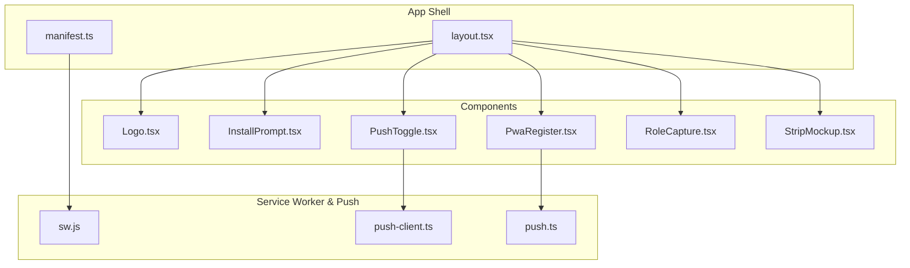
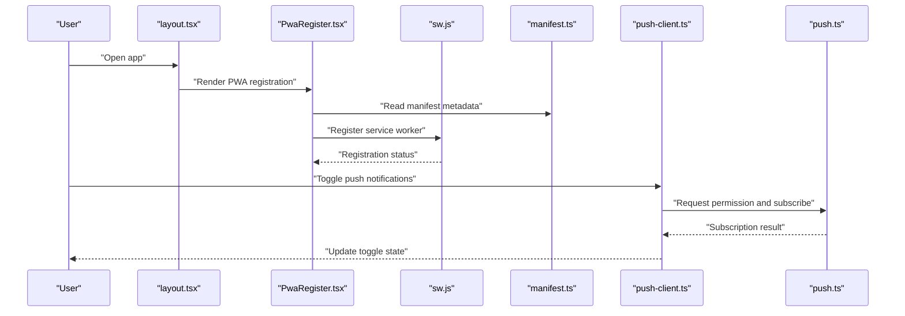
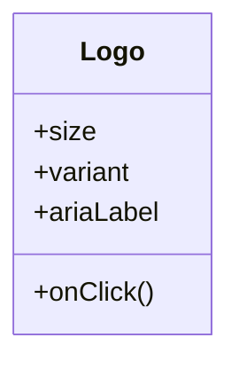
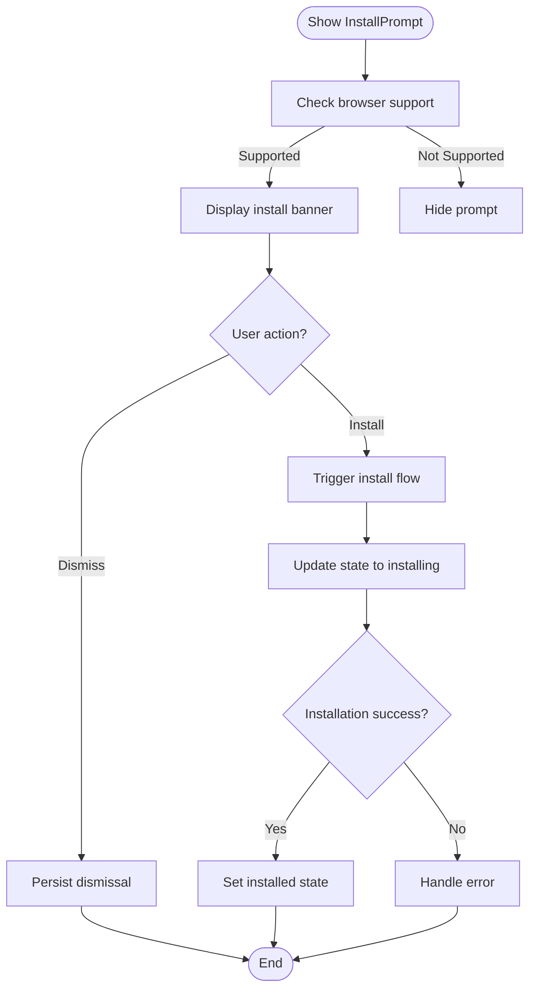
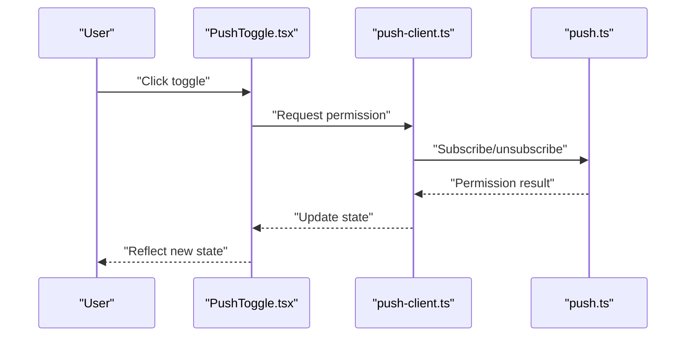
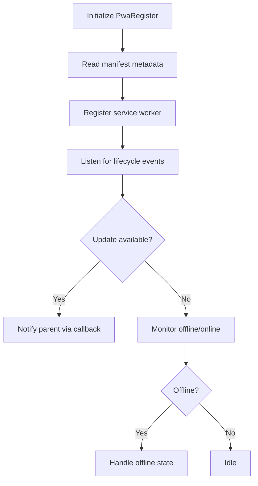
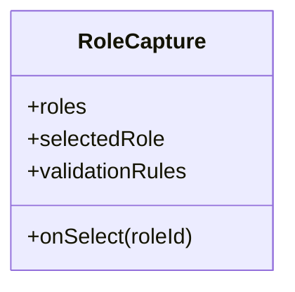
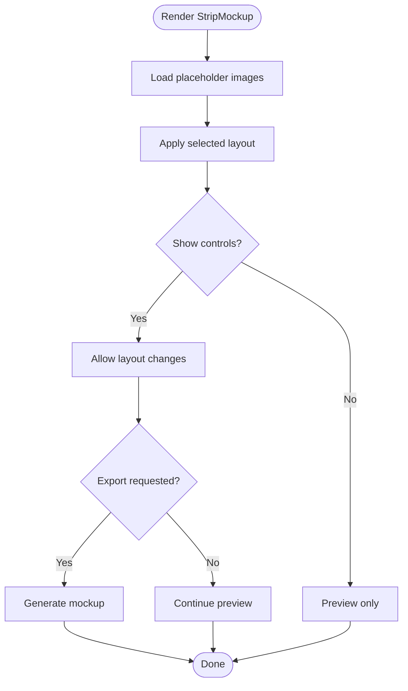
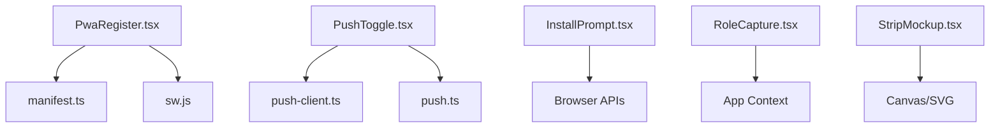

# Component Library

<cite>
**Referenced Files in This Document**
- [Logo.tsx](file://components/Logo.tsx)
- [InstallPrompt.tsx](file://components/InstallPrompt.tsx)
- [PushToggle.tsx](file://components/PushToggle.tsx)
- [PwaRegister.tsx](file://components/PwaRegister.tsx)
- [RoleCapture.tsx](file://components/RoleCapture.tsx)
- [StripMockup.tsx](file://components/StripMockup.tsx)
- [layout.tsx](file://app/layout.tsx)
- [manifest.ts](file://app/manifest.ts)
- [sw.js](file://public/sw.js)
- [push-client.ts](file://lib/push-client.ts)
- [push.ts](file://lib/push.ts)
</cite>

## Table of Contents
1. [Introduction](#introduction)
2. [Project Structure](#project-structure)
3. [Core Components](#core-components)
4. [Architecture Overview](#architecture-overview)
5. [Detailed Component Analysis](#detailed-component-analysis)
6. [Dependency Analysis](#dependency-analysis)
7. [Performance Considerations](#performance-considerations)
8. [Troubleshooting Guide](#troubleshooting-guide)
9. [Conclusion](#conclusion)
10. [Appendices](#appendices)

## Introduction
This document provides comprehensive documentation for the reusable component library used across the application. It focuses on visual appearance, behavior, user interaction patterns, props/attributes, events, slots, and customization options for the following components: Logo, InstallPrompt, PushToggle, PwaRegister, RoleCapture, and StripMockup. It also includes responsive design guidelines, accessibility compliance, state and animation considerations, theming support, cross-browser compatibility, performance optimization techniques, and integration patterns with the overall architecture.

## Project Structure
The component library is organized under the components directory, with each component encapsulating its own logic, styling, and interactions. Supporting infrastructure such as service worker registration, manifest configuration, and push utilities are located in app and lib directories.

**Diagram sources**
- [layout.tsx](file://app/layout.tsx)
- [manifest.ts](file://app/manifest.ts)
- [sw.js](file://public/sw.js)
- [push-client.ts](file://lib/push-client.ts)
- [push.ts](file://lib/push.ts)

**Section sources**
- [layout.tsx](file://app/layout.tsx)
- [manifest.ts](file://app/manifest.ts)
- [sw.js](file://public/sw.js)
- [push-client.ts](file://lib/push-client.ts)
- [push.ts](file://lib/push.ts)

## Core Components
This section summarizes the purpose and responsibilities of each component in the library.

- Logo: Renders the brand logo with consistent sizing, aspect ratio, and theme-aware colors.
- InstallPrompt: Guides users to install the Progressive Web App when supported by the browser.
- PushToggle: Allows users to enable or disable push notifications with appropriate permissions handling.
- PwaRegister: Registers the service worker and handles PWA lifecycle events.
- RoleCapture: Captures and manages user role selection within the application flow.
- StripMockup: Displays a mock preview of photo strips with layout and styling controls.

**Section sources**
- [Logo.tsx](file://components/Logo.tsx)
- [InstallPrompt.tsx](file://components/InstallPrompt.tsx)
- [PushToggle.tsx](file://components/PushToggle.tsx)
- [PwaRegister.tsx](file://components/PwaRegister.tsx)
- [RoleCapture.tsx](file://components/RoleCapture.tsx)
- [StripMockup.tsx](file://components/StripMockup.tsx)

## Architecture Overview
The component library integrates with the application shell and PWA infrastructure. The layout orchestrates component composition, while PWA features rely on the manifest and service worker. Push functionality uses client-side utilities to manage permissions and messaging.

**Diagram sources**
- [layout.tsx](file://app/layout.tsx)
- [PwaRegister.tsx](file://components/PwaRegister.tsx)
- [sw.js](file://public/sw.js)
- [manifest.ts](file://app/manifest.ts)
- [push-client.ts](file://lib/push-client.ts)
- [push.ts](file://lib/push.ts)

## Detailed Component Analysis

### Logo
- Visual appearance: Displays the brand logo with responsive sizing and theme-aware color variants (light/dark).
- Behavior: Maintains aspect ratio, supports hover states, and adapts to container constraints.
- User interaction patterns: Clickable for navigation or branding actions; keyboard accessible via focus and activation.
- Props/attributes:
  - size: Controls width/height scaling.
  - variant: Selects light or dark color scheme.
  - onClick: Optional handler for click events.
  - ariaLabel: Accessibility label for screen readers.
- Events: onClick, onFocus, onBlur.
- Slots: None; content is image-based.
- Customization options: CSS variables for colors, border radius, and shadow.
- States: Default, hover, focus, active.
- Animations/Transitions: Subtle scale on hover; smooth color transitions.
- Responsive design: Uses relative units and max-width constraints.
- Accessibility: Semantic img with alt text fallback; keyboard navigable.
- Theming: Supports theme tokens for foreground/background colors.
- Cross-browser compatibility: Standard SVG/PNG rendering; graceful fallback for unsupported formats.
- Performance: Optimized asset loading; lazy loading if large.
- Composition patterns: Used in headers, footers, and splash screens.

**Diagram sources**
- [Logo.tsx](file://components/Logo.tsx)

**Section sources**
- [Logo.tsx](file://components/Logo.tsx)

### InstallPrompt
- Visual appearance: Inline banner or modal prompting installation; shows platform-specific instructions.
- Behavior: Detects installability; hides prompt when not applicable; persists dismissal preference.
- User interaction patterns: Dismissal, “Install” action, and informational links.
- Props/attributes:
  - placement: Determines where the prompt appears (top, bottom, modal).
  - showOnce: Boolean to control repeated display.
  - onInstall: Callback triggered upon successful installation.
  - onDismiss: Callback when dismissed.
- Events: onInstall, onDismiss.
- Slots: Custom message slot for localized copy.
- Customization options: Styling via CSS classes and theme variables; icon replacement.
- States: Hidden, visible, installing, installed, dismissed.
- Animations/Transitions: Fade-in/out; slide transitions based on placement.
- Responsive design: Adapts layout for mobile and desktop; collapsible instructions.
- Accessibility: ARIA live region updates; keyboard operable buttons.
- Theming: Theme-aware background and text colors.
- Cross-browser compatibility: Uses standard beforeinstallprompt event with fallback messaging.
- Performance: Debounced visibility checks; minimal DOM updates.
- Composition patterns: Integrated into layout header or as a floating banner.

**Diagram sources**
- [InstallPrompt.tsx](file://components/InstallPrompt.tsx)

**Section sources**
- [InstallPrompt.tsx](file://components/InstallPrompt.tsx)

### PushToggle
- Visual appearance: Toggle switch with descriptive label and optional status indicator.
- Behavior: Manages notification permission requests; updates UI based on current permission state.
- User interaction patterns: Toggling enables/disables push notifications; shows guidance when blocked.
- Props/attributes:
  - enabled: Controlled boolean for toggle state.
  - onChange: Callback to update parent state.
  - helpText: Descriptive text explaining implications.
  - disabled: Prevents interaction.
- Events: onChange, onError.
- Slots: Custom icon or status badge slot.
- Customization options: Colors, labels, and tooltip content via theme variables.
- States: Unknown, granted, denied, requesting.
- Animations/Transitions: Smooth toggle movement; subtle pulse when requesting permission.
- Responsive design: Compact layout for small screens; stacked label and control.
- Accessibility: ARIA attributes for toggle state; keyboard navigation.
- Theming: Theme-aware colors and focus styles.
- Cross-browser compatibility: Handles permission API differences and fallback prompts.
- Performance: Minimal re-renders; debounced permission checks.
- Composition patterns: Embedded in settings panels or onboarding flows.

**Diagram sources**
- [PushToggle.tsx](file://components/PushToggle.tsx)
- [push-client.ts](file://lib/push-client.ts)
- [push.ts](file://lib/push.ts)

**Section sources**
- [PushToggle.tsx](file://components/PushToggle.tsx)
- [push-client.ts](file://lib/push-client.ts)
- [push.ts](file://lib/push.ts)

### PwaRegister
- Visual appearance: Invisible component that registers the service worker and displays status indicators if needed.
- Behavior: Reads manifest metadata; registers service worker; listens for lifecycle events (update available, offline).
- User interaction patterns: Automatic registration; optional manual refresh trigger.
- Props/attributes:
  - swPath: Path to service worker file.
  - onUpdateAvailable: Callback when update is ready.
  - onOffline: Callback when going offline.
- Events: onUpdateAvailable, onOffline.
- Slots: None.
- Customization options: Status messages and retry behavior via configuration.
- States: Registering, registered, updating, offline.
- Animations/Transitions: None; relies on parent UI for feedback.
- Responsive design: Not UI-facing; affects global app behavior.
- Accessibility: Updates ARIA live regions for status changes.
- Theming: N/A.
- Cross-browser compatibility: Polyfills and feature detection for service workers.
- Performance: Efficient registration; avoids unnecessary reloads.
- Composition patterns: Placed at root layout to ensure early registration.

**Diagram sources**
- [PwaRegister.tsx](file://components/PwaRegister.tsx)
- [manifest.ts](file://app/manifest.ts)
- [sw.js](file://public/sw.js)

**Section sources**
- [PwaRegister.tsx](file://components/PwaRegister.tsx)
- [manifest.ts](file://app/manifest.ts)
- [sw.js](file://public/sw.js)

### RoleCapture
- Visual appearance: Form-like interface for selecting user roles; may include cards or list items.
- Behavior: Validates selection; persists choice; updates application context accordingly.
- User interaction patterns: Click/select role; confirm selection; navigate to next step.
- Props/attributes:
  - roles: Array of role definitions (id, label, description).
  - selectedRole: Controlled selected role id.
  - onSelect: Callback to update selection.
  - validationRules: Optional rules for role eligibility.
- Events: onSelect, onValidation.
- Slots: Custom role card template slot.
- Customization options: Styling per role; icons and descriptions via theme variables.
- States: Idle, selected, validating, error.
- Animations/Transitions: Highlight selection; fade transitions between steps.
- Responsive design: Grid layout for multiple roles; single column on small screens.
- Accessibility: Radio group semantics; keyboard navigation; error announcements.
- Theming: Theme-aware colors and focus rings.
- Cross-browser compatibility: Standard form elements and events.
- Performance: Lightweight selection logic; memoized role lists.
- Composition patterns: Used in onboarding, settings, and multi-user flows.

**Diagram sources**
- [RoleCapture.tsx](file://components/RoleCapture.tsx)

**Section sources**
- [RoleCapture.tsx](file://components/RoleCapture.tsx)

### StripMockup
- Visual appearance: Preview of photo strip layout with placeholders and decorative elements.
- Behavior: Renders mock images; supports layout variations; allows user to visualize final output.
- User interaction patterns: Switch layouts; preview changes; export or share mockup.
- Props/attributes:
  - layout: Layout type (e.g., vertical, horizontal).
  - images: Array of placeholder or real images.
  - showControls: Boolean to display interactive controls.
  - onLayoutChange: Callback when layout changes.
- Events: onLayoutChange, onExport.
- Slots: Custom overlay or watermark slot.
- Customization options: Border styles, spacing, and colors via theme variables.
- States: Loading, ready, exporting.
- Animations/Transitions: Smooth layout transitions; loading spinners.
- Responsive design: Scales to fit container; maintains aspect ratios.
- Accessibility: Descriptive labels for controls; keyboard operable.
- Theming: Theme-aware borders and backgrounds.
- Cross-browser compatibility: Canvas/SVG rendering fallbacks.
- Performance: Lazy load images; optimize canvas operations.
- Composition patterns: Embedded in editing screens and sharing flows.

**Diagram sources**
- [StripMockup.tsx](file://components/StripMockup.tsx)

**Section sources**
- [StripMockup.tsx](file://components/StripMockup.tsx)

## Dependency Analysis
Components depend on shared utilities and infrastructure:
- PwaRegister depends on manifest and service worker files.
- PushToggle interacts with push-client and push utilities.
- InstallPrompt may rely on browser APIs and local storage for preferences.
- RoleCapture and StripMockup are self-contained but may integrate with application context.

**Diagram sources**
- [PwaRegister.tsx](file://components/PwaRegister.tsx)
- [manifest.ts](file://app/manifest.ts)
- [sw.js](file://public/sw.js)
- [PushToggle.tsx](file://components/PushToggle.tsx)
- [push-client.ts](file://lib/push-client.ts)
- [push.ts](file://lib/push.ts)
- [InstallPrompt.tsx](file://components/InstallPrompt.tsx)
- [RoleCapture.tsx](file://components/RoleCapture.tsx)
- [StripMockup.tsx](file://components/StripMockup.tsx)

**Section sources**
- [PwaRegister.tsx](file://components/PwaRegister.tsx)
- [manifest.ts](file://app/manifest.ts)
- [sw.js](file://public/sw.js)
- [PushToggle.tsx](file://components/PushToggle.tsx)
- [push-client.ts](file://lib/push-client.ts)
- [push.ts](file://lib/push.ts)
- [InstallPrompt.tsx](file://components/InstallPrompt.tsx)
- [RoleCapture.tsx](file://components/RoleCapture.tsx)
- [StripMockup.tsx](file://components/StripMockup.tsx)

## Performance Considerations
- Use lazy loading for heavy assets (images, models).
- Debounce frequent state updates (permission checks, resize handlers).
- Memoize computed values and lists to prevent unnecessary re-renders.
- Prefer CSS animations over JavaScript where possible.
- Minimize DOM mutations; batch updates when possible.
- Utilize service worker caching for static assets and API responses.

[No sources needed since this section provides general guidance]

## Troubleshooting Guide
Common issues and resolutions:
- Service worker registration fails: Verify path and MIME types; check console errors.
- Push notifications not working: Ensure permission granted; validate subscription endpoint.
- Install prompt not showing: Confirm HTTPS and valid manifest; test on supported browsers.
- Role capture validation errors: Review rules and input sanitization.
- Strip mockup rendering issues: Check canvas support and image dimensions.

**Section sources**
- [PwaRegister.tsx](file://components/PwaRegister.tsx)
- [push-client.ts](file://lib/push-client.ts)
- [push.ts](file://lib/push.ts)
- [InstallPrompt.tsx](file://components/InstallPrompt.tsx)
- [RoleCapture.tsx](file://components/RoleCapture.tsx)
- [StripMockup.tsx](file://components/StripMockup.tsx)

## Conclusion
The component library provides a cohesive set of reusable UI elements with robust behaviors, accessibility, and theming support. Integration with PWA infrastructure ensures reliable offline capabilities and push notifications. Following the guidelines outlined here will help maintain consistency, performance, and usability across the application.

[No sources needed since this section summarizes without analyzing specific files]

## Appendices
- Usage examples: Refer to component source files for implementation patterns and prop usage.
- Style customization: Leverage CSS variables and theme tokens defined in the application.
- Accessibility checklist: Ensure ARIA attributes, keyboard navigation, and screen reader compatibility.

[No sources needed since this section provides general guidance]