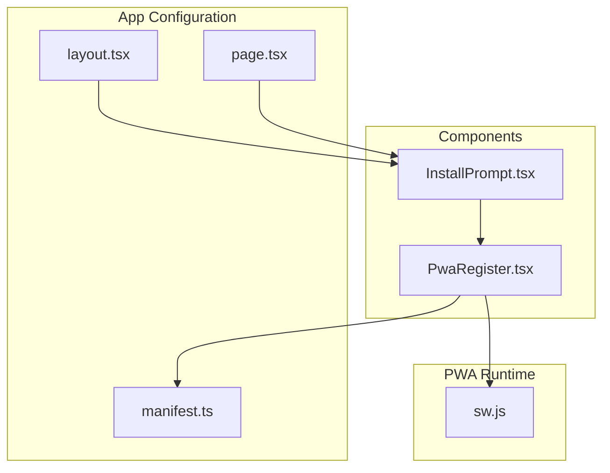
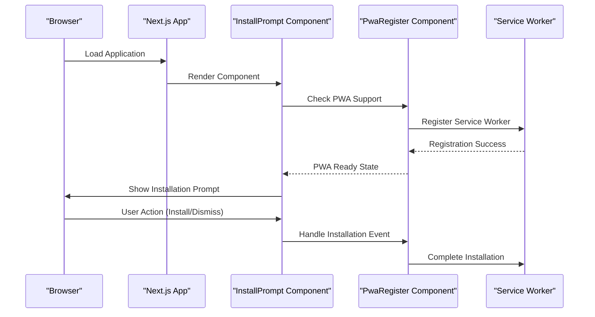
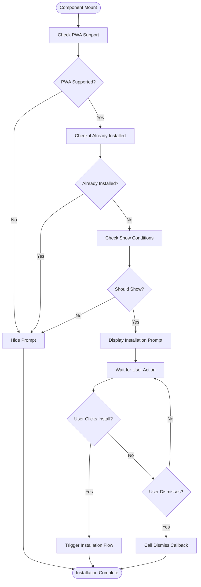
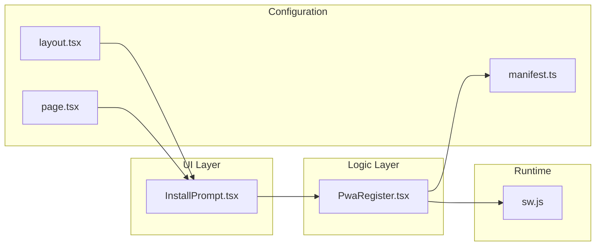

# Install Prompt Component

<cite>
**Referenced Files in This Document**
- [InstallPrompt.tsx](file://components/InstallPrompt.tsx)
- [PwaRegister.tsx](file://components/PwaRegister.tsx)
- [manifest.ts](file://app/manifest.ts)
- [sw.js](file://public/sw.js)
- [page.tsx](file://app/page.tsx)
- [layout.tsx](file://app/layout.tsx)
</cite>

## Table of Contents
1. [Introduction](#introduction)
2. [Project Structure](#project-structure)
3. [Core Components](#core-components)
4. [Architecture Overview](#architecture-overview)
5. [Detailed Component Analysis](#detailed-component-analysis)
6. [Dependency Analysis](#dependency-analysis)
7. [Performance Considerations](#performance-considerations)
8. [Troubleshooting Guide](#troubleshooting-guide)
9. [Conclusion](#conclusion)

## Introduction
This document provides comprehensive documentation for the InstallPrompt component, which handles Progressive Web App (PWA) installation prompts. It explains the PWA installation prompt functionality, user interaction flow, browser compatibility handling, props for customization, usage examples, mobile vs desktop behavior differences, user experience best practices, and fallback mechanisms for unsupported browsers.

## Project Structure
The InstallPrompt component is part of a Next.js application with PWA capabilities. The relevant files include:
- InstallPrompt component implementation
- PWA registration logic
- Manifest configuration
- Service Worker setup
- Page integration points

**Diagram sources**
- [InstallPrompt.tsx](file://components/InstallPrompt.tsx)
- [PwaRegister.tsx](file://components/PwaRegister.tsx)
- [manifest.ts](file://app/manifest.ts)
- [sw.js](file://public/sw.js)
- [layout.tsx](file://app/layout.tsx)
- [page.tsx](file://app/page.tsx)

**Section sources**
- [InstallPrompt.tsx](file://components/InstallPrompt.tsx)
- [PwaRegister.tsx](file://components/PwaRegister.tsx)
- [manifest.ts](file://app/manifest.ts)

## Core Components
The InstallPrompt system consists of several key components working together to provide seamless PWA installation functionality:

### InstallPrompt Component
The main component responsible for displaying installation prompts to users based on their browser capabilities and preferences.

### PwaRegister Component  
Handles the technical aspects of PWA registration, service worker management, and installation event handling.

### Manifest Configuration
Defines app metadata, icons, and PWA settings that control how the app appears when installed.

### Service Worker
Manages offline functionality, caching strategies, and background sync capabilities.

**Section sources**
- [InstallPrompt.tsx](file://components/InstallPrompt.tsx)
- [PwaRegister.tsx](file://components/PwaRegister.tsx)
- [manifest.ts](file://app/manifest.ts)
- [sw.js](file://public/sw.js)

## Architecture Overview
The InstallPrompt architecture follows a layered approach with clear separation of concerns:

**Diagram sources**
- [InstallPrompt.tsx](file://components/InstallPrompt.tsx)
- [PwaRegister.tsx](file://components/PwaRegister.tsx)
- [sw.js](file://public/sw.js)

## Detailed Component Analysis

### InstallPrompt Component
The InstallPrompt component serves as the primary interface for PWA installation prompts. It manages user interactions, displays appropriate messaging, and coordinates with the underlying PWA registration system.

#### Key Features
- **Conditional Rendering**: Only shows installation prompts when PWA is supported and not already installed
- **User Experience Optimization**: Provides clear calls-to-action and dismiss options
- **Cross-Browser Compatibility**: Handles different browser-specific installation flows
- **Customizable Content**: Supports text customization and styling options

#### Props Interface
The component accepts various props for customization:

| Prop Name | Type | Default | Description |
|-----------|------|---------|-------------|
| `showPrompt` | boolean | false | Controls visibility of the installation prompt |
| `promptText` | string | "Install this app" | Custom text content for the prompt |
| `buttonText` | string | "Install" | Text displayed on the install button |
| `onInstall` | function | undefined | Callback when user clicks install |
| `onDismiss` | function | undefined | Callback when user dismisses prompt |
| `style` | object | {} | Custom styling object |
| `className` | string | "" | Additional CSS classes |

#### Implementation Details
The component implements sophisticated logic to determine when to show installation prompts:

**Diagram sources**
- [InstallPrompt.tsx](file://components/InstallPrompt.tsx)

**Section sources**
- [InstallPrompt.tsx](file://components/InstallPrompt.tsx)

### PwaRegister Component
The PwaRegister component handles the technical implementation of PWA registration and service worker management.

#### Responsibilities
- Service worker registration and lifecycle management
- Installation event handling
- Update detection and notification
- Error handling and fallback mechanisms

#### Integration Points
- Connects with the browser's PWA APIs
- Manages service worker registration
- Handles installation and update events
- Provides state management for PWA readiness

**Section sources**
- [PwaRegister.tsx](file://components/PwaRegister.tsx)

### Manifest Configuration
The manifest file defines essential PWA metadata including app name, description, icons, colors, and display modes.

#### Key Properties
- **name/description**: App identification and description
- **icons**: Various icon sizes for different use cases
- **start_url**: Entry point when app launches from home screen
- **display**: Display mode (standalone, fullscreen, etc.)
- **theme_color**: Theme color for browser UI elements

**Section sources**
- [manifest.ts](file://app/manifest.ts)

### Service Worker
The service worker enables offline functionality, caching strategies, and background processing capabilities.

#### Capabilities
- Offline resource caching
- Background sync operations
- Push notification support
- Cache management and updates

**Section sources**
- [sw.js](file://public/sw.js)

## Dependency Analysis
The InstallPrompt system has well-defined dependencies between components:

**Diagram sources**
- [InstallPrompt.tsx](file://components/InstallPrompt.tsx)
- [PwaRegister.tsx](file://components/PwaRegister.tsx)
- [manifest.ts](file://app/manifest.ts)
- [layout.tsx](file://app/layout.tsx)
- [page.tsx](file://app/page.tsx)
- [sw.js](file://public/sw.js)

**Section sources**
- [InstallPrompt.tsx](file://components/InstallPrompt.tsx)
- [PwaRegister.tsx](file://components/PwaRegister.tsx)

## Performance Considerations
The InstallPrompt component is designed with performance in mind:

### Lazy Loading
- PWA registration occurs only when needed
- Service worker registration is deferred until after initial page load
- Installation prompts are shown conditionally to avoid unnecessary re-renders

### Memory Management
- Proper cleanup of event listeners and timers
- Efficient state management to prevent memory leaks
- Optimized rendering through conditional logic

### Network Efficiency
- Minimal network requests for PWA capability detection
- Cached responses for better performance
- Efficient service worker updates

## Troubleshooting Guide

### Common Issues and Solutions

#### Installation Prompt Not Showing
**Symptoms**: Users don't see installation prompts even though they should
**Causes**: 
- PWA not properly configured
- HTTPS not enabled
- Service worker registration failed
- Browser doesn't support PWA

**Solutions**:
- Verify HTTPS is enabled
- Check browser console for errors
- Ensure service worker is registered successfully
- Test on different browsers

#### Mobile vs Desktop Behavior Differences
**Mobile Behavior**:
- iOS Safari requires manual home screen addition
- Android Chrome shows native install prompts
- Different gesture requirements across platforms

**Desktop Behavior**:
- Chrome/Firefox show install banners
- Edge supports PWA installation
- Safari requires manual steps

#### Fallback Mechanisms
For unsupported browsers or devices:
- Provide clear instructions for manual installation
- Offer alternative web-based experiences
- Gracefully degrade functionality

### Debugging Tips
1. Check browser developer tools for PWA-related logs
2. Verify service worker registration status
3. Test installation flow on target devices
4. Monitor network requests during installation

**Section sources**
- [InstallPrompt.tsx](file://components/InstallPrompt.tsx)
- [PwaRegister.tsx](file://components/PwaRegister.tsx)

## Conclusion
The InstallPrompt component provides a robust, user-friendly solution for PWA installation across different platforms and browsers. Its modular architecture allows for easy customization while maintaining consistent user experience. The component handles complex browser compatibility issues behind a simple interface, making it accessible for developers while providing powerful functionality for end users.

Key benefits include:
- Cross-platform compatibility
- Customizable user experience
- Graceful fallbacks for unsupported browsers
- Performance-optimized implementation
- Clear error handling and debugging support

The component follows modern React patterns and TypeScript best practices, ensuring maintainability and scalability for future enhancements.