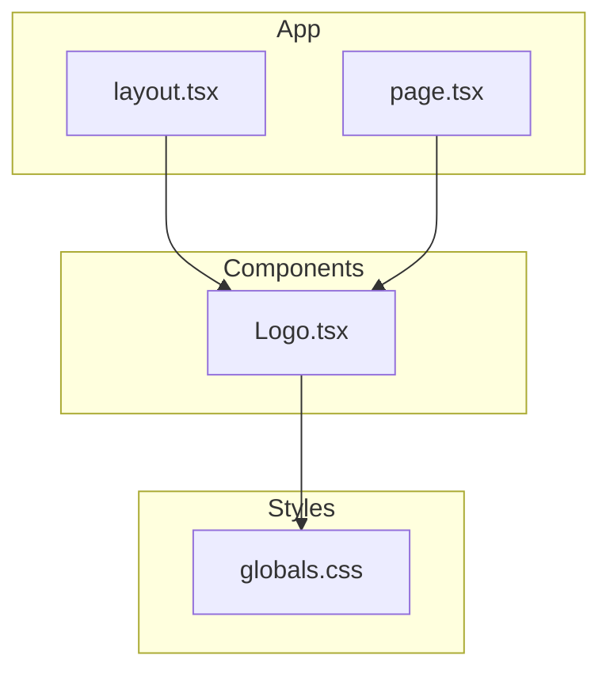
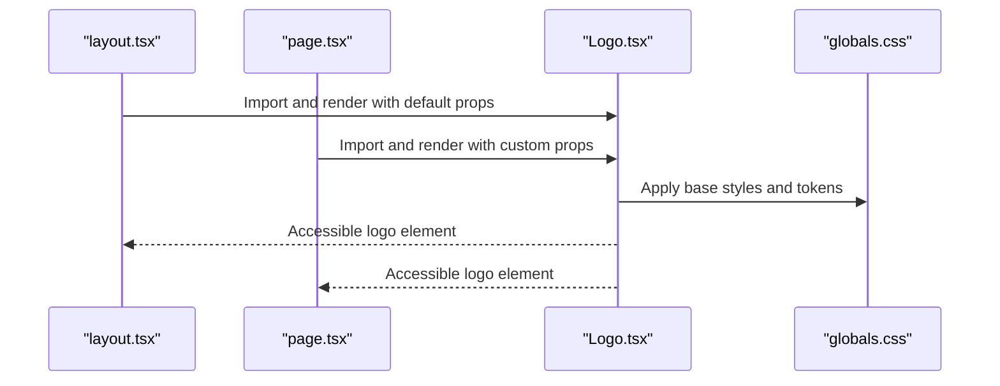
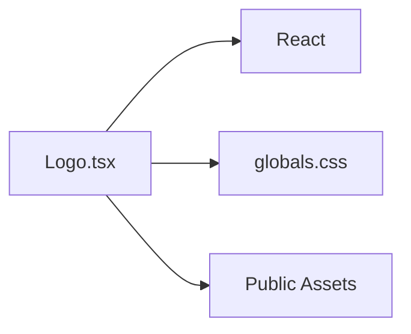

# Logo Component

<cite>
**Referenced Files in This Document**
- [Logo.tsx](file://components/Logo.tsx)
- [layout.tsx](file://app/layout.tsx)
- [page.tsx](file://app/page.tsx)
- [globals.css](file://app/globals.css)
</cite>

## Table of Contents
1. [Introduction](#introduction)
2. [Project Structure](#project-structure)
3. [Core Components](#core-components)
4. [Architecture Overview](#architecture-overview)
5. [Detailed Component Analysis](#detailed-component-analysis)
6. [Dependency Analysis](#dependency-analysis)
7. [Performance Considerations](#performance-considerations)
8. [Troubleshooting Guide](#troubleshooting-guide)
9. [Conclusion](#conclusion)

## Introduction
This document provides comprehensive documentation for the Logo component used across the application. It explains how the logo is visually presented, how branding is implemented, and how it behaves responsively. It also documents all props (size variants, color customization, and styling properties), usage examples, integration patterns with the design system, accessibility considerations, SEO implications, and performance optimization techniques for rendering logos efficiently.

## Project Structure
The Logo component resides in the components directory and is consumed by pages and layout files to render brand imagery consistently throughout the app. Global styles may influence sizing and colors at a higher level.

**Diagram sources**
- [layout.tsx](file://app/layout.tsx)
- [page.tsx](file://app/page.tsx)
- [Logo.tsx](file://components/Logo.tsx)
- [globals.css](file://app/globals.css)

**Section sources**
- [Logo.tsx](file://components/Logo.tsx)
- [layout.tsx](file://app/layout.tsx)
- [page.tsx](file://app/page.tsx)
- [globals.css](file://app/globals.css)

## Core Components
The Logo component encapsulates the brand mark and exposes configurable props for size, color, and styling. It integrates with the application’s design tokens and global styles to ensure consistent visual presentation across devices.

Key responsibilities:
- Render the logo asset with appropriate alt text and semantic markup
- Apply responsive sizing based on props or theme tokens
- Support color customization via CSS variables or inline styles
- Provide accessible labels and roles for assistive technologies

**Section sources**
- [Logo.tsx](file://components/Logo.tsx)

## Architecture Overview
At a high level, the Logo component is imported into layout and page files where it is rendered with specific props. Global styles define base typography and spacing that can affect logo appearance. The component may also reference assets from the public directory or use Next.js image optimization when applicable.

**Diagram sources**
- [layout.tsx](file://app/layout.tsx)
- [page.tsx](file://app/page.tsx)
- [Logo.tsx](file://components/Logo.tsx)
- [globals.css](file://app/globals.css)

## Detailed Component Analysis

### Visual Appearance and Branding
- The logo displays the brand mark using an optimized image or SVG asset.
- Alt text describes the brand for screen readers and search engines.
- The component respects global color tokens and theme settings to maintain consistency.

Accessibility highlights:
- Semantic HTML ensures proper labeling.
- ARIA attributes are applied where necessary to convey purpose and state.
- Focus management is not required for static images but should be considered if interactive.

SEO considerations:
- Descriptive alt text improves indexing and discoverability.
- Proper file naming and caching strategies enhance load performance.

**Section sources**
- [Logo.tsx](file://components/Logo.tsx)

### Props API
The Logo component supports the following props:

- size
  - Type: string | number
  - Description: Controls the rendered width/height of the logo. Accepts predefined sizes or numeric values.
  - Default: medium
  - Examples: small, medium, large, 40, "100%"

- color
  - Type: string
  - Description: Overrides the default color via CSS variable or inline style. Useful for dark/light mode toggles.
  - Default: theme token
  - Examples: "#000", "currentColor", "var(--brand-color)"

- className
  - Type: string
  - Description: Additional CSS classes for custom styling or overrides.
  - Default: none

- style
  - Type: object
  - Description: Inline styles applied directly to the root element.
  - Default: none

- alt
  - Type: string
  - Description: Accessibility label describing the logo. Should be concise and meaningful.
  - Default: "Brand logo"

- role
  - Type: string
  - Description: ARIA role for enhanced semantics. Defaults to img when applicable.
  - Default: img

- ariaLabel
  - Type: string
  - Description: Alternative accessible label when alt is insufficient.
  - Default: derived from alt

Usage examples:
- Basic usage with default props
- Custom size and color
- Applying custom class names and inline styles
- Providing explicit alt text for accessibility

Integration patterns:
- Use in header layouts for consistent branding
- Embed within landing pages with responsive sizing
- Combine with theme providers for dynamic color changes

**Section sources**
- [Logo.tsx](file://components/Logo.tsx)

### Responsive Behavior
- The component adapts to different screen sizes through flexible sizing props and CSS media queries.
- When no explicit size is provided, it falls back to theme-based defaults.
- For optimal performance, consider using Next.js Image optimization for raster assets.

Responsive tips:
- Use relative units (em, rem, %) for scalable logos
- Avoid fixed pixel sizes unless necessary
- Test across breakpoints to ensure clarity and legibility

**Section sources**
- [Logo.tsx](file://components/Logo.tsx)
- [globals.css](file://app/globals.css)

### Styling Properties
- className allows overriding default styles or adding utility classes.
- style enables direct inline modifications for quick adjustments.
- Color customization can leverage CSS variables defined in global styles.

Styling best practices:
- Prefer className for maintainable styles
- Use CSS variables for theme-aware colors
- Avoid excessive inline styles to keep bundle size minimal

**Section sources**
- [Logo.tsx](file://components/Logo.tsx)
- [globals.css](file://app/globals.css)

### Accessibility Considerations
- Always provide descriptive alt text for non-decorative logos.
- Ensure sufficient contrast between logo and background.
- Use ARIA roles and labels appropriately to improve screen reader experience.
- Test with accessibility tools to validate compliance.

**Section sources**
- [Logo.tsx](file://components/Logo.tsx)

### SEO Implications
- Include meaningful alt text to aid search engine indexing.
- Optimize image formats and sizes to reduce load times.
- Cache assets effectively to improve repeat visit performance.

**Section sources**
- [Logo.tsx](file://components/Logo.tsx)

### Performance Optimization Techniques
- Use Next.js Image optimization for automatic format selection and lazy loading.
- Prefer SVG for vector scalability and smaller file sizes.
- Implement caching headers for static assets.
- Defer non-critical rendering if the logo is below the fold.

**Section sources**
- [Logo.tsx](file://components/Logo.tsx)

## Dependency Analysis
The Logo component has minimal external dependencies, primarily relying on React and global styles. It may import assets from the public directory or use Next.js image utilities.

**Diagram sources**
- [Logo.tsx](file://components/Logo.tsx)
- [globals.css](file://app/globals.css)

**Section sources**
- [Logo.tsx](file://components/Logo.tsx)
- [globals.css](file://app/globals.css)

## Performance Considerations
- Optimize image formats (WebP, AVIF) for faster loading.
- Use responsive srcset to serve appropriate resolutions.
- Leverage browser caching for static assets.
- Avoid unnecessary re-renders by memoizing props where appropriate.

[No sources needed since this section provides general guidance]

## Troubleshooting Guide
Common issues and resolutions:
- Logo appears too large or small: Adjust size prop or verify CSS overrides.
- Colors do not update: Check color prop and CSS variable definitions.
- Accessibility warnings: Ensure alt text and ARIA attributes are present.
- Slow loading: Optimize image format and enable caching.

**Section sources**
- [Logo.tsx](file://components/Logo.tsx)

## Conclusion
The Logo component provides a flexible, accessible, and performant way to display brand imagery across the application. By leveraging props for size, color, and styling, it integrates seamlessly with the design system while maintaining responsiveness and accessibility standards. Following the recommended practices ensures optimal user experience and SEO performance.

[No sources needed since this section summarizes without analyzing specific files]