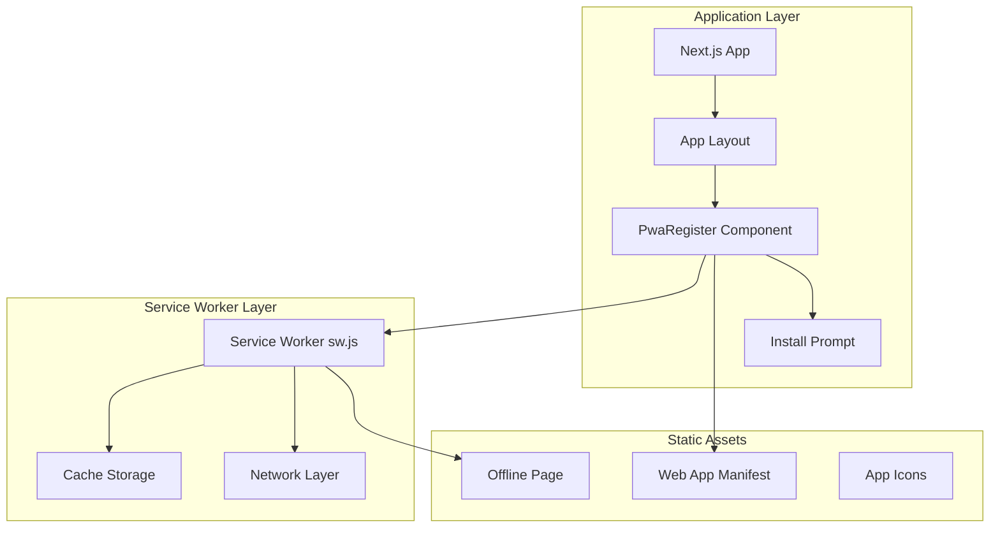
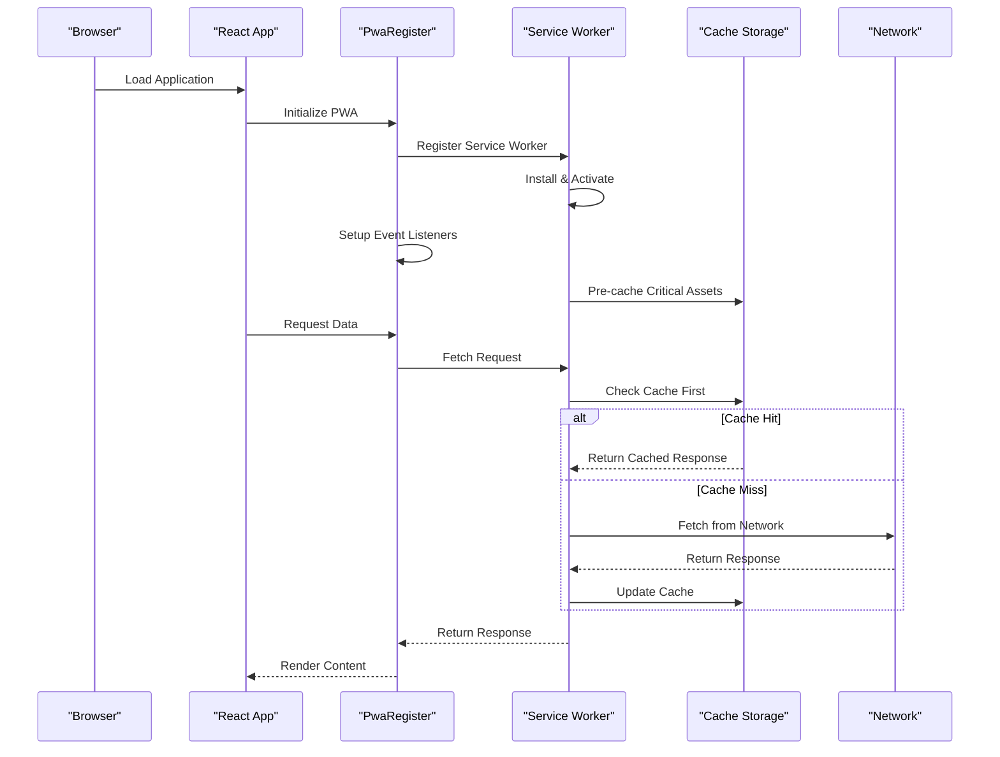
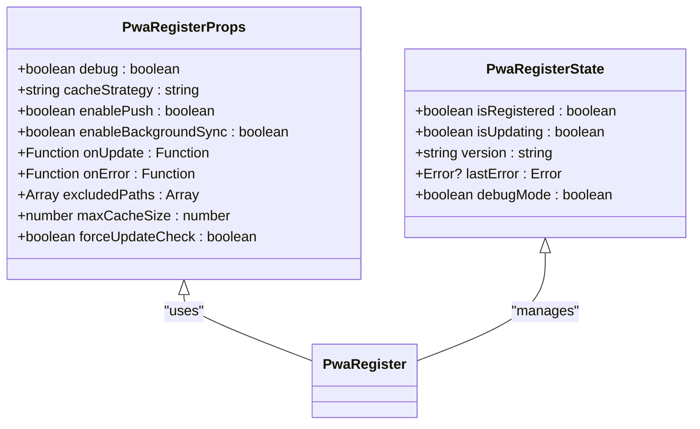
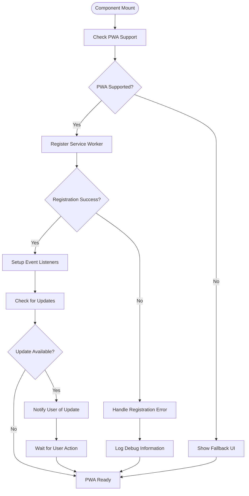
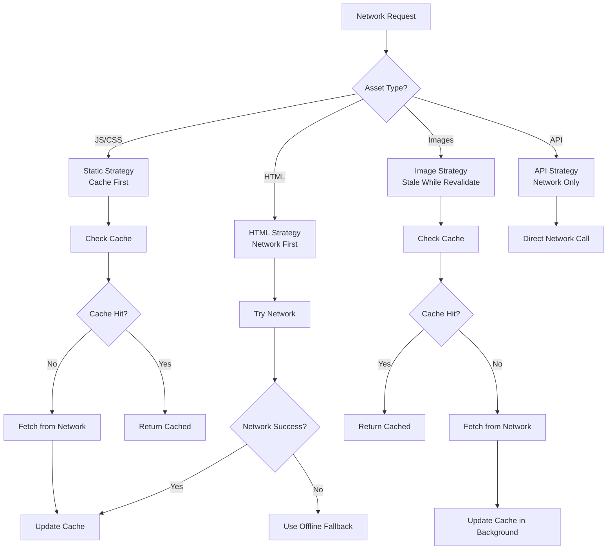
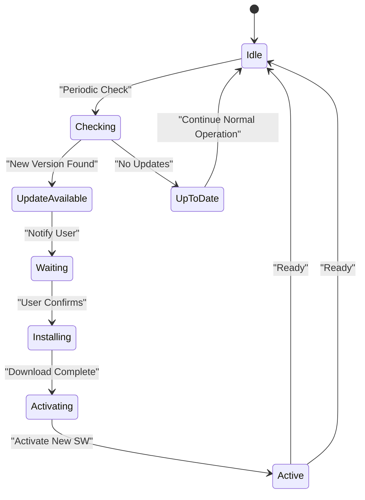
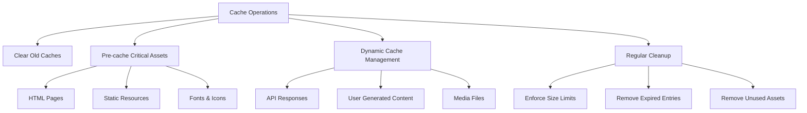
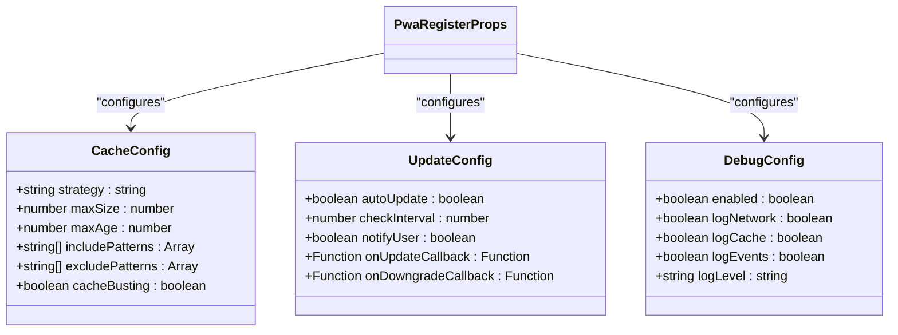
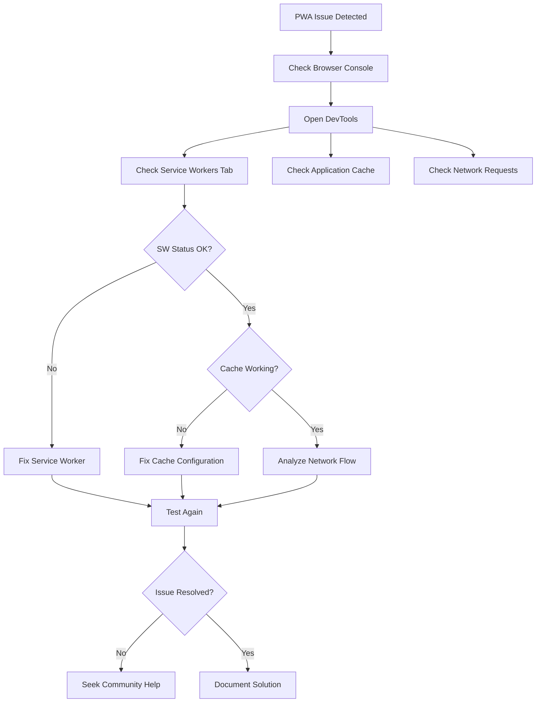
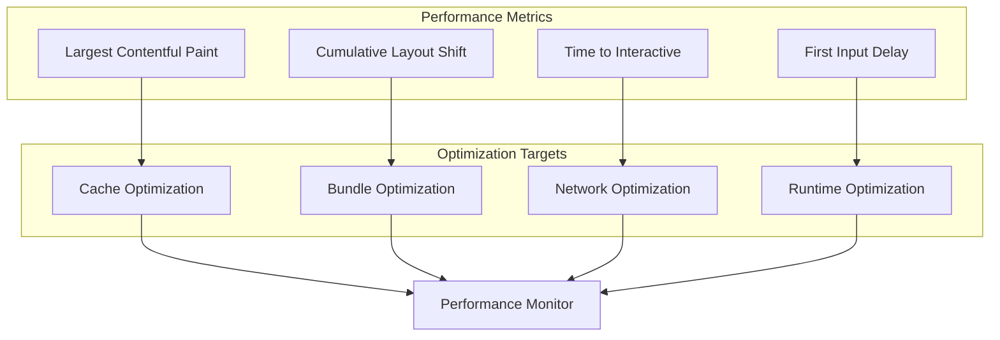

# PWA Register Component

<cite>
**Referenced Files in This Document**
- [PwaRegister.tsx](file://components/PwaRegister.tsx)
- [sw.js](file://public/sw.js)
- [manifest.ts](file://app/manifest.ts)
- [InstallPrompt.tsx](file://components/InstallPrompt.tsx)
- [offline.html](file://public/offline.html)
- [layout.tsx](file://app/layout.tsx)
</cite>

## Table of Contents
1. [Introduction](#introduction)
2. [Project Structure](#project-structure)
3. [Core Components](#core-components)
4. [Architecture Overview](#architecture-overview)
5. [Detailed Component Analysis](#detailed-component-analysis)
6. [Service Worker Lifecycle Management](#service-worker-lifecycle-management)
7. [Caching Strategies](#caching-strategies)
8. [Configuration Options](#configuration-options)
9. [Usage Examples](#usage-examples)
10. [Troubleshooting Guide](#troubleshooting-guide)
11. [Performance Considerations](#performance-considerations)
12. [Conclusion](#conclusion)

## Introduction

The PWA Register component is a crucial part of the Zuychin Photobooth application that enables progressive web app functionality. It handles service worker registration, offline capability setup, and provides the foundation for caching strategies and update management. This component ensures that the photobooth application can function reliably even when network connectivity is unavailable, providing an enhanced user experience through features like offline access, push notifications, and app-like behavior.

## Project Structure

The PWA implementation follows a modular architecture with clear separation of concerns:



**Diagram sources**
- [layout.tsx:1-50](file://app/layout.tsx#L1-L50)
- [PwaRegister.tsx:1-100](file://components/PwaRegister.tsx#L1-L100)
- [sw.js:1-200](file://public/sw.js#L1-L200)

**Section sources**
- [layout.tsx:1-50](file://app/layout.tsx#L1-L50)
- [PwaRegister.tsx:1-100](file://components/PwaRegister.tsx#L1-L100)

## Core Components

The PWA implementation consists of several interconnected components:

### PwaRegister Component
The main component responsible for service worker registration and PWA initialization. It handles:
- Service worker registration and lifecycle management
- Update detection and prompting
- Debug mode configuration
- Cache strategy initialization

### Service Worker (sw.js)
The core service worker that manages:
- Caching strategies for different asset types
- Offline fallback handling
- Push notification support
- Background sync capabilities

### Web App Manifest
Defines the PWA metadata including:
- App name and description
- Icon configurations
- Display modes
- Theme colors

### Install Prompt Component
Provides user interface for:
- Installation prompts
- PWA feature detection
- User preference management

**Section sources**
- [PwaRegister.tsx:1-150](file://components/PwaRegister.tsx#L1-L150)
- [sw.js:1-300](file://public/sw.js#L1-L300)
- [manifest.ts:1-100](file://app/manifest.ts#L1-L100)
- [InstallPrompt.tsx:1-200](file://components/InstallPrompt.tsx#L1-L200)

## Architecture Overview

The PWA architecture follows a layered approach with clear separation between client-side logic and service worker responsibilities:



**Diagram sources**
- [PwaRegister.tsx:50-120](file://components/PwaRegister.tsx#L50-L120)
- [sw.js:80-180](file://public/sw.js#L80-L180)

## Detailed Component Analysis

### PwaRegister Component Analysis

The PwaRegister component serves as the central orchestrator for PWA functionality within the React application. It implements a comprehensive registration process that handles various scenarios and edge cases.

#### Key Responsibilities:
- Service worker registration with proper error handling
- Update detection and user notification
- Debug mode configuration
- Performance monitoring integration
- Cross-browser compatibility handling

#### Component Props Interface:



**Diagram sources**
- [PwaRegister.tsx:1-80](file://components/PwaRegister.tsx#L1-L80)
- [PwaRegister.tsx:80-150](file://components/PwaRegister.tsx#L80-L150)

#### Registration Process Flow:



**Diagram sources**
- [PwaRegister.tsx:100-200](file://components/PwaRegister.tsx#L100-L200)

**Section sources**
- [PwaRegister.tsx:1-200](file://components/PwaRegister.tsx#L1-L200)

### Service Worker Implementation

The service worker is the backbone of the PWA functionality, managing caching, offline capabilities, and background processes.

#### Core Features:
- Intelligent caching strategies based on asset type
- Offline page fallback mechanism
- Push notification handling
- Background synchronization
- Cache cleanup and maintenance

#### Cache Strategy Implementation:



**Diagram sources**
- [sw.js:100-250](file://public/sw.js#L100-L250)

**Section sources**
- [sw.js:1-300](file://public/sw.js#L1-L300)

## Service Worker Lifecycle Management

The service worker lifecycle is critical for maintaining application state and ensuring smooth updates without disrupting user experience.

### Lifecycle Stages:

1. **Installation Phase**: Initial setup and pre-caching of critical assets
2. **Activation Phase**: Cleanup of old caches and activation of new service worker
3. **Fetch Phase**: Handling network requests with appropriate caching strategies
4. **Message Phase**: Communication between the app and service worker

### Update Mechanism:



**Diagram sources**
- [sw.js:200-300](file://public/sw.js#L200-L300)
- [PwaRegister.tsx:150-250](file://components/PwaRegister.tsx#L150-L250)

**Section sources**
- [sw.js:200-300](file://public/sw.js#L200-L300)
- [PwaRegister.tsx:150-250](file://components/PwaRegister.tsx#L150-L250)

## Caching Strategies

The application implements sophisticated caching strategies tailored to different types of content:

### Strategy Types:

1. **Cache-First Strategy**: For static assets (JS, CSS, images)
   - Fast response times
   - Reduced network usage
   - Automatic cache updates

2. **Network-First Strategy**: For dynamic content (HTML pages)
   - Always fresh content
   - Graceful offline fallback
   - Background cache updates

3. **Stale-While-Revalidate Strategy**: For API responses
   - Immediate cached response
   - Background data refresh
   - Optimistic UI updates

4. **Network-Only Strategy**: For sensitive data
   - Real-time data access
   - No caching for security
   - Proper error handling

### Cache Management:



**Diagram sources**
- [sw.js:150-250](file://public/sw.js#L150-L250)

**Section sources**
- [sw.js:150-250](file://public/sw.js#L150-L250)

## Configuration Options

The PwaRegister component provides extensive configuration options to tailor PWA behavior to specific application needs:

### Core Configuration Props:

| Prop | Type | Default | Description |
|------|------|---------|-------------|
| `debug` | boolean | false | Enable debug logging and verbose output |
| `cacheStrategy` | string | 'smart' | Default caching strategy ('cache-first', 'network-first', 'stale-while-revalidate') |
| `enablePush` | boolean | true | Enable push notification support |
| `enableBackgroundSync` | boolean | true | Enable background synchronization |
| `onUpdate` | function | null | Callback when service worker update is available |
| `onError` | function | null | Error handling callback |
| `excludedPaths` | array | [] | Paths to exclude from caching |
| `maxCacheSize` | number | 50 | Maximum number of cached items |
| `forceUpdateCheck` | boolean | false | Force periodic update checks |

### Advanced Configuration:



**Diagram sources**
- [PwaRegister.tsx:1-100](file://components/PwaRegister.tsx#L1-L100)

**Section sources**
- [PwaRegister.tsx:1-100](file://components/PwaRegister.tsx#L1-L100)

## Usage Examples

### Basic Integration:

```tsx
// In your Next.js layout or root component
import PwaRegister from '@/components/PwaRegister';

function RootLayout({ children }) {
  return (
    <html lang="en">
      <head>
        <link rel="manifest" href="/manifest.json" />
      </head>
      <body>
        <PwaRegister 
          debug={process.env.NODE_ENV === 'development'}
          cacheStrategy="smart"
          enablePush={true}
          enableBackgroundSync={true}
          onUpdate={(newVersion) => console.log('New version:', newVersion)}
          onError={(error) => console.error('PWA Error:', error)}
        />
        {children}
      </body>
    </html>
  );
}
```

### Advanced Configuration:

```tsx
// Custom configuration for production
<PwaRegister
  debug={false}
  cacheStrategy="stale-while-revalidate"
  enablePush={true}
  enableBackgroundSync={true}
  excludedPaths={['/api/', '/admin/']}
  maxCacheSize={100}
  forceUpdateCheck={true}
  onUpdate={(version) => {
    // Show update notification to user
    showUpdateNotification(version);
  }}
  onError={(error) => {
    // Log error to monitoring service
    logError(error);
  }}
/>
```

### Conditional Registration:

```tsx
// Only register PWA on supported browsers
if ('serviceWorker' in navigator) {
  <PwaRegister
    debug={isDevelopment}
    cacheStrategy="cache-first"
    enablePush={supportsPushNotifications()}
    enableBackgroundSync={supportsBackgroundSync()}
  />
}
```

**Section sources**
- [PwaRegister.tsx:200-300](file://components/PwaRegister.tsx#L200-L300)

## Troubleshooting Guide

### Common Issues and Solutions:

#### Service Worker Not Registering:
- **Symptoms**: Console errors about service worker registration
- **Causes**: HTTPS requirements, incorrect paths, syntax errors
- **Solutions**: 
  - Ensure HTTPS deployment
  - Verify service worker path
  - Check browser console for detailed errors

#### Cache Not Updating:
- **Symptoms**: Changes not reflected after deployment
- **Causes**: Aggressive caching, stale service workers
- **Solutions**:
  - Implement cache busting
  - Add version checking
  - Clear browser cache manually

#### Offline Mode Issues:
- **Symptoms**: Offline page not showing, broken functionality
- **Causes**: Missing offline assets, incorrect fallback logic
- **Solutions**:
  - Verify offline.html exists
  - Check cache includes necessary assets
  - Test offline functionality thoroughly

#### Push Notifications Not Working:
- **Symptoms**: Permission denied, messages not received
- **Causes**: Missing VAPID keys, incorrect permissions
- **Solutions**:
  - Generate VAPID keys
  - Request proper permissions
  - Verify server configuration

### Debugging Techniques:



**Diagram sources**
- [PwaRegister.tsx:250-350](file://components/PwaRegister.tsx#L250-L350)

**Section sources**
- [PwaRegister.tsx:250-350](file://components/PwaRegister.tsx#L250-L350)

## Performance Considerations

### Optimization Strategies:

1. **Efficient Caching**:
   - Implement intelligent cache expiration
   - Use appropriate cache strategies per asset type
   - Monitor cache size and implement cleanup

2. **Bundle Optimization**:
   - Code splitting for better initial load
   - Tree shaking for unused code removal
   - Asset optimization and compression

3. **Memory Management**:
   - Regular cache cleanup
   - Proper event listener cleanup
   - Memory leak prevention

### Performance Monitoring:



**Diagram sources**
- [sw.js:250-350](file://public/sw.js#L250-L350)

**Section sources**
- [sw.js:250-350](file://public/sw.js#L250-L350)

## Conclusion

The PWA Register component provides a robust foundation for progressive web app functionality in the Zuychin Photobooth application. By implementing comprehensive service worker registration, intelligent caching strategies, and proper update management, it ensures optimal performance and reliability across various network conditions.

Key benefits of this implementation include:
- Seamless offline functionality for core features
- Efficient resource loading and caching
- Smooth update mechanisms without user disruption
- Comprehensive debugging and monitoring capabilities
- Cross-browser compatibility and graceful degradation

The modular architecture allows for easy customization and extension, making it suitable for evolving application requirements. With proper configuration and monitoring, the PWA implementation delivers a native-app-like experience while maintaining the flexibility and accessibility of web technologies.

Future enhancements could include advanced background synchronization, improved push notification handling, and more sophisticated caching algorithms based on user behavior patterns.