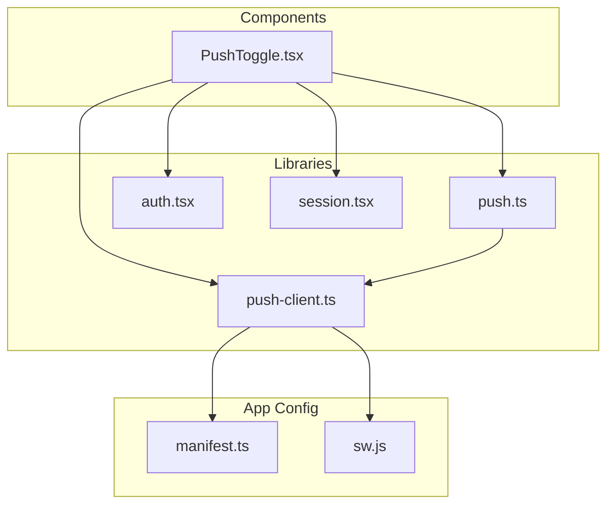
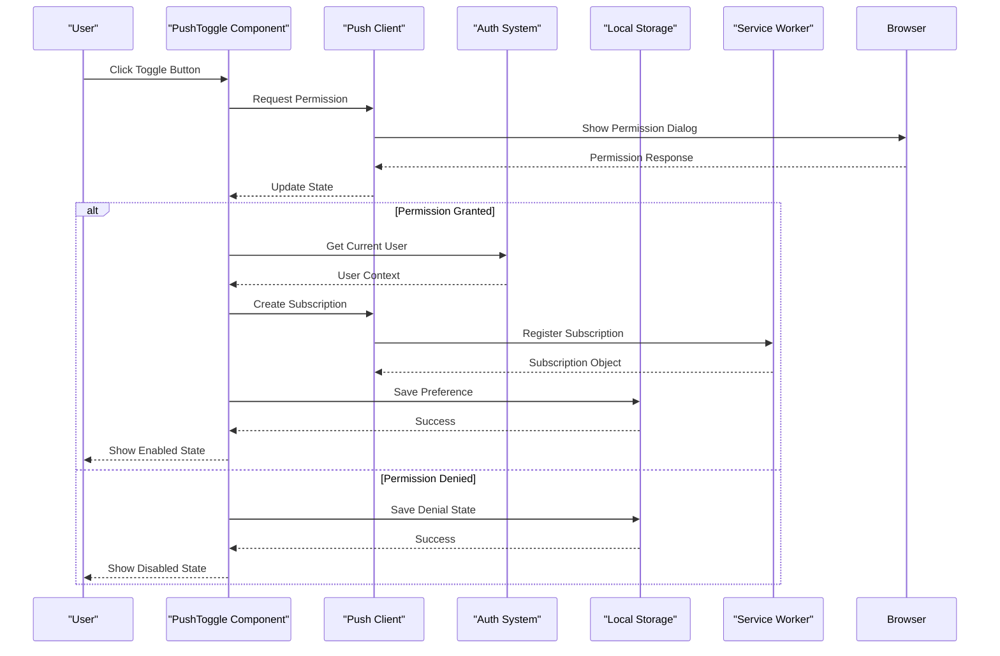
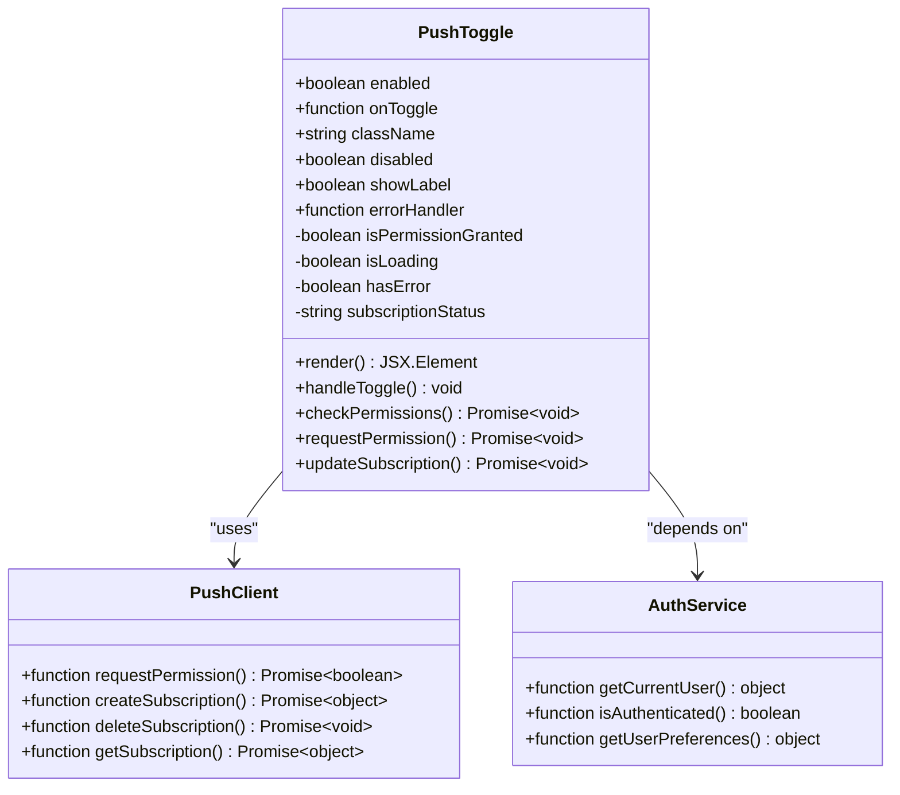
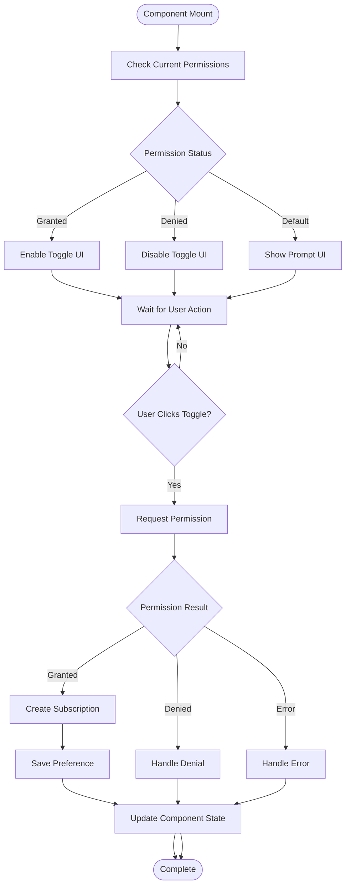
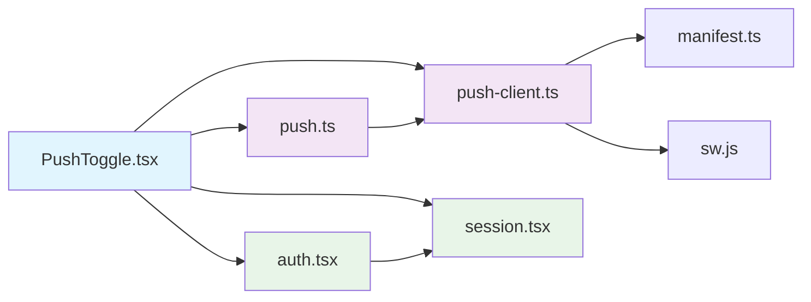

# Push Toggle Component

<cite>
**Referenced Files in This Document**
- [PushToggle.tsx](file://components/PushToggle.tsx)
- [push-client.ts](file://lib/push-client.ts)
- [push.ts](file://lib/push.ts)
- [auth.tsx](file://lib/auth.tsx)
- [session.tsx](file://lib/session.tsx)
- [manifest.ts](file://app/manifest.ts)
- [sw.js](file://public/sw.js)
</cite>

## Table of Contents
1. [Introduction](#introduction)
2. [Project Structure](#project-structure)
3. [Core Components](#core-components)
4. [Architecture Overview](#architecture-overview)
5. [Detailed Component Analysis](#detailed-component-analysis)
6. [Dependency Analysis](#dependency-analysis)
7. [Performance Considerations](#performance-considerations)
8. [Troubleshooting Guide](#troubleshooting-guide)
9. [Conclusion](#conclusion)
10. [Appendices](#appendices)

## Introduction
This document provides comprehensive documentation for the PushToggle component, which manages push notification permissions and subscription state within the application. It explains how the component integrates with the authentication system and preference storage, handles user interactions, and ensures cross-browser compatibility for push notifications. The guide also covers error handling strategies and offers practical usage examples to help developers integrate the component effectively.

## Project Structure
The PushToggle component resides in the components directory and relies on several libraries and utilities located in the lib directory. These include modules for managing push client functionality, authentication, session management, and service worker registration. The manifest file defines the PWA configuration required for push notifications, while the service worker handles background events.



**Diagram sources**
- [PushToggle.tsx](file://components/PushToggle.tsx)
- [push-client.ts](file://lib/push-client.ts)
- [push.ts](file://lib/push.ts)
- [auth.tsx](file://lib/auth.tsx)
- [session.tsx](file://lib/session.tsx)
- [manifest.ts](file://app/manifest.ts)
- [sw.js](file://public/sw.js)

**Section sources**
- [PushToggle.tsx](file://components/PushToggle.tsx)
- [push-client.ts](file://lib/push-client.ts)
- [push.ts](file://lib/push.ts)
- [auth.tsx](file://lib/auth.tsx)
- [session.tsx](file://lib/session.tsx)
- [manifest.ts](file://app/manifest.ts)
- [sw.js](file://public/sw.js)

## Core Components
The PushToggle component serves as the primary interface for users to manage their push notification preferences. It provides a toggle button that allows users to enable or disable push notifications based on their current permission status. The component handles various states including:
- Initial loading state while checking permissions
- Permission granted state with active subscription
- Permission denied state requiring manual intervention
- Permission prompt state when requesting user consent
- Error states when push notifications are unavailable

The component integrates with the application's authentication system to associate push subscriptions with user accounts and stores preference states in local storage for persistence across sessions.

**Section sources**
- [PushToggle.tsx](file://components/PushToggle.tsx)
- [push-client.ts](file://lib/push-client.ts)
- [push.ts](file://lib/push.ts)

## Architecture Overview
The PushToggle component follows a modular architecture that separates concerns between UI presentation, business logic, and external integrations. The component communicates with the push client library to handle browser-specific implementations and interacts with the authentication system to maintain user context.



**Diagram sources**
- [PushToggle.tsx](file://components/PushToggle.tsx)
- [push-client.ts](file://lib/push-client.ts)
- [auth.tsx](file://lib/auth.tsx)
- [session.tsx](file://lib/session.tsx)

## Detailed Component Analysis

### PushToggle Component Structure
The PushToggle component implements a React functional component with useState hooks for managing internal state and useEffect hooks for side effects related to permission checking and subscription management. The component accepts several props to customize its behavior and appearance.

#### Props Interface
The component supports the following props:
- `enabled`: Boolean prop to control initial enabled state
- `onToggle`: Callback function triggered when toggle state changes
- `className`: CSS class name for styling customization
- `disabled`: Boolean to disable the toggle interaction
- `showLabel`: Boolean to display descriptive text alongside the toggle
- `errorHandler`: Optional callback for handling errors during permission requests

#### State Management
The component maintains several internal states:
- `isPermissionGranted`: Tracks whether push notifications are enabled
- `isLoading`: Indicates when permission checks are in progress
- `hasError`: Stores error information when operations fail
- `subscriptionStatus`: Tracks the current subscription state



**Diagram sources**
- [PushToggle.tsx](file://components/PushToggle.tsx)
- [push-client.ts](file://lib/push-client.ts)
- [auth.tsx](file://lib/auth.tsx)

#### Permission Request Flow
The component implements a comprehensive permission request flow that handles various browser behaviors and edge cases:



**Diagram sources**
- [PushToggle.tsx](file://components/PushToggle.tsx)
- [push-client.ts](file://lib/push-client.ts)

#### Error Handling Strategy
The component implements robust error handling for various scenarios:
- Network failures during subscription creation
- Invalid subscription objects from the browser
- Authentication failures when associating subscriptions with users
- Storage failures when saving preferences
- Browser compatibility issues with push notification APIs

**Section sources**
- [PushToggle.tsx](file://components/PushToggle.tsx)
- [push-client.ts](file://lib/push-client.ts)

### Push Client Integration
The push client module provides browser-agnostic methods for managing push notifications. It abstracts the complexity of different browser implementations and provides a consistent API for the PushToggle component.

Key functionalities include:
- Permission checking and requesting
- Subscription management (create, update, delete)
- Error handling for unsupported browsers
- Integration with service workers

**Section sources**
- [push-client.ts](file://lib/push-client.ts)
- [push.ts](file://lib/push.ts)

### Authentication Integration
The component integrates with the authentication system to ensure that push subscriptions are properly associated with authenticated users. This integration includes:
- Checking user authentication status before creating subscriptions
- Associating subscription data with user profiles
- Handling authentication state changes
- Managing user preferences across authentication sessions

**Section sources**
- [auth.tsx](file://lib/auth.tsx)
- [session.tsx](file://lib/session.tsx)

## Dependency Analysis
The PushToggle component has several direct dependencies that it uses to provide its functionality. Understanding these dependencies is crucial for proper integration and troubleshooting.



**Diagram sources**
- [PushToggle.tsx](file://components/PushToggle.tsx)
- [push-client.ts](file://lib/push-client.ts)
- [push.ts](file://lib/push.ts)
- [auth.tsx](file://lib/auth.tsx)
- [session.tsx](file://lib/session.tsx)
- [manifest.ts](file://app/manifest.ts)
- [sw.js](file://public/sw.js)

**Section sources**
- [PushToggle.tsx](file://components/PushToggle.tsx)
- [push-client.ts](file://lib/push-client.ts)
- [push.ts](file://lib/push.ts)
- [auth.tsx](file://lib/auth.tsx)
- [session.tsx](file://lib/session.tsx)

## Performance Considerations
The PushToggle component is designed with performance in mind, implementing several optimization strategies:
- Lazy loading of push-related functionality only when needed
- Debounced permission checks to avoid excessive API calls
- Efficient state updates using React's batching mechanisms
- Minimal re-renders through careful prop management
- Caching of subscription status to prevent unnecessary network requests

The component also handles memory cleanup properly by removing event listeners and clearing timeouts when the component unmounts.

[No sources needed since this section provides general guidance]

## Troubleshooting Guide
Common issues and their solutions when working with the PushToggle component:

### Permission Issues
- **Problem**: Users cannot enable push notifications
- **Solution**: Ensure HTTPS is enabled and check browser settings
- **Symptoms**: Permission dialog doesn't appear or immediately denies
- **Debug Steps**: Check console for security errors, verify manifest configuration

### Subscription Problems
- **Problem**: Push notifications not received after enabling
- **Solution**: Verify subscription exists and service worker is registered
- **Symptoms**: Toggle shows enabled but no notifications arrive
- **Debug Steps**: Check subscription object validity, verify service worker registration

### Authentication Errors
- **Problem**: Subscriptions not associated with user account
- **Solution**: Ensure user is authenticated before creating subscription
- **Symptoms**: Subscription created but not visible in user profile
- **Debug Steps**: Verify auth state, check user ID consistency

### Browser Compatibility
- **Problem**: Component not working in certain browsers
- **Solution**: Implement feature detection and fallbacks
- **Symptoms**: JavaScript errors or undefined APIs
- **Debug Steps**: Check browser support matrix, implement graceful degradation

**Section sources**
- [PushToggle.tsx](file://components/PushToggle.tsx)
- [push-client.ts](file://lib/push-client.ts)

## Conclusion
The PushToggle component provides a robust and user-friendly interface for managing push notification permissions within the application. Its modular design, comprehensive error handling, and cross-browser compatibility make it suitable for production use. The component successfully integrates with the authentication system and preference storage while maintaining clean separation of concerns and optimal performance characteristics.

For successful implementation, developers should ensure proper configuration of the service worker, manifest file, and authentication system. Regular testing across different browsers and devices is recommended to maintain consistent user experience.

[No sources needed since this section summarizes without analyzing specific files]

## Appendices

### Usage Examples

#### Basic Integration
```jsx
import PushToggle from './components/PushToggle';

function App() {
  return (
    <PushToggle
      enabled={true}
      onToggle={(isEnabled) => console.log('Toggle changed:', isEnabled)}
      className="custom-toggle"
      showLabel={true}
    />
  );
}
```

#### With Authentication Integration
```jsx
import PushToggle from './components/PushToggle';
import { useAuth } from './lib/auth';

function ProtectedPage() {
  const { user, isAuthenticated } = useAuth();
  
  if (!isAuthenticated) {
    return <div>Please log in to manage notifications</div>;
  }
  
  return (
    <PushToggle
      enabled={user?.preferences?.pushEnabled || false}
      onToggle={(isEnabled) => updateUserPreferences(isEnabled)}
      errorHandler={(error) => handleNotificationError(error)}
    />
  );
}
```

#### Custom Styling
```jsx
<PushToggle
  enabled={true}
  className="my-custom-push-toggle"
  showLabel={true}
  disabled={false}
/>
```

**Section sources**
- [PushToggle.tsx](file://components/PushToggle.tsx)

### Configuration Requirements
- HTTPS required for production environments
- Service worker must be properly registered
- Manifest file must include required push notification fields
- Browser must support Web Push API
- User must grant necessary permissions

**Section sources**
- [manifest.ts](file://app/manifest.ts)
- [sw.js](file://public/sw.js)