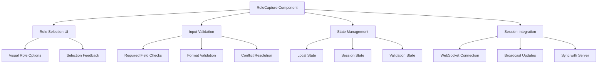
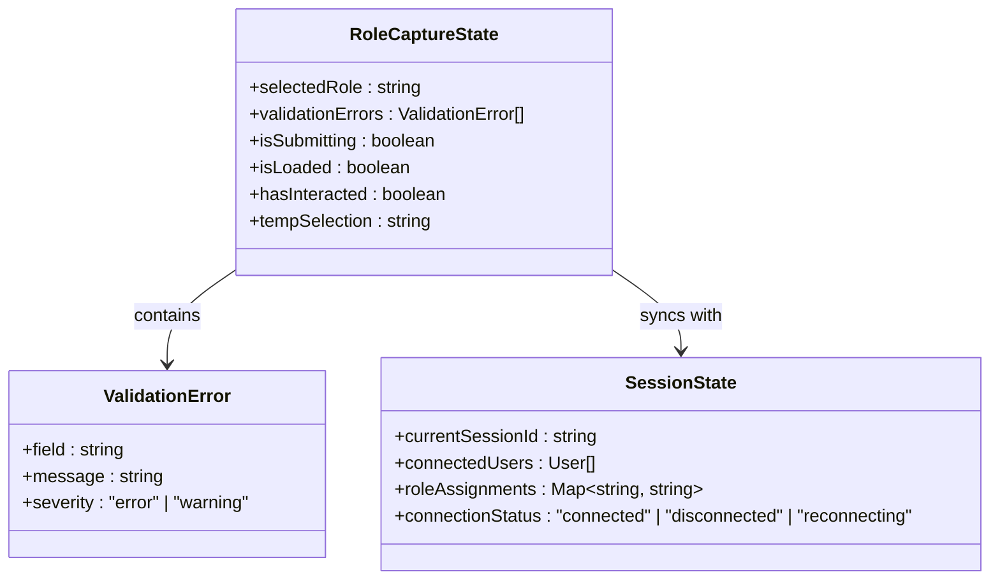
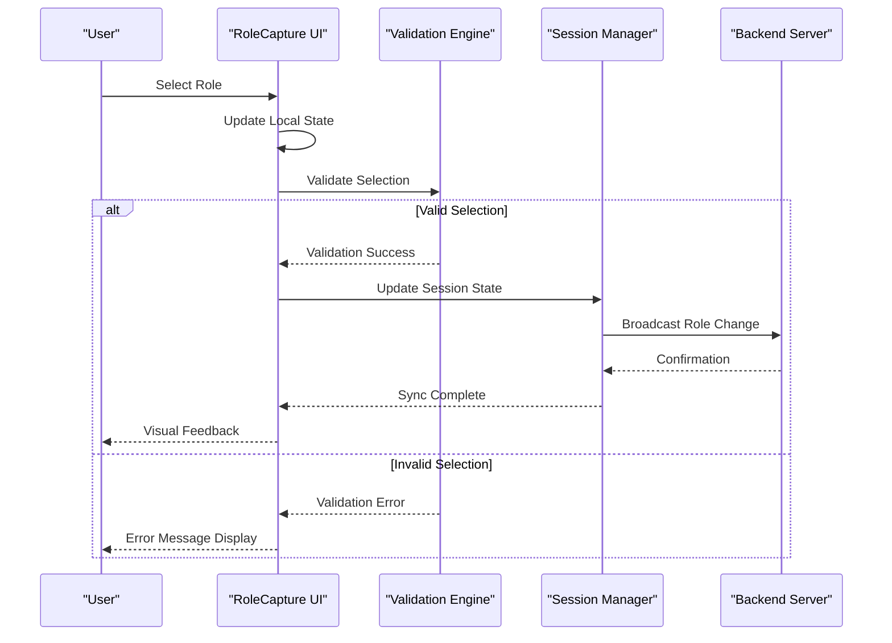
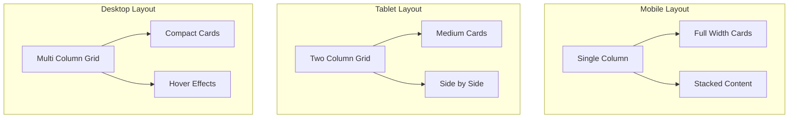
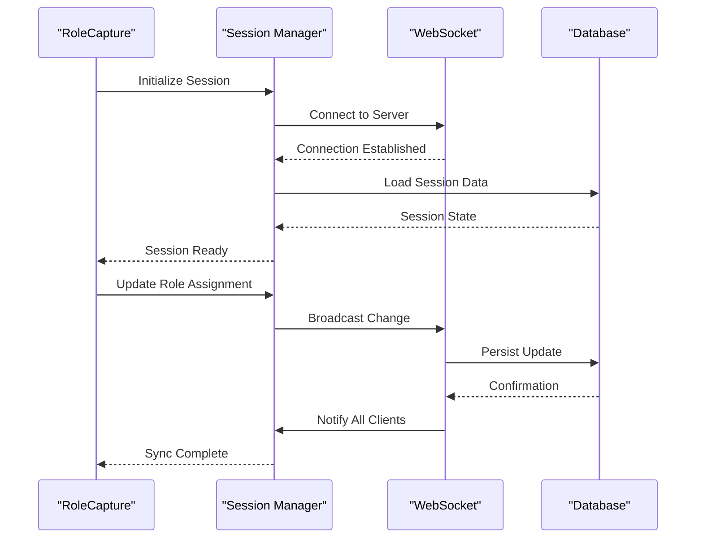

# Role Capture Component

<cite>
**Referenced Files in This Document**
- [RoleCapture.tsx](file://components/RoleCapture.tsx)
- [session.tsx](file://lib/session.tsx)
- [room-code.ts](file://lib/room-code.ts)
- [auth.tsx](file://lib/auth.tsx)
- [page.tsx](file://app/room/[code]/page.tsx)
</cite>

## Table of Contents
1. [Introduction](#introduction)
2. [Component Overview](#component-overview)
3. [Props Interface](#props-interface)
4. [State Management](#state-management)
5. [User Input Handling](#user-input-handling)
6. [Form Validation](#form-validation)
7. [Accessibility Features](#accessibility-features)
8. [Responsive Design](#responsive-design)
9. [Integration Examples](#integration-examples)
10. [Collaborative Session Integration](#collaborative-session-integration)
11. [Troubleshooting Guide](#troubleshooting-guide)
12. [Conclusion](#conclusion)

## Introduction

The RoleCapture component is a specialized React component designed to handle user role selection in collaborative photobooth sessions. It provides an intuitive interface for users to select their role within a shared session, enabling seamless collaboration between multiple participants. The component manages form state, validates user input, and integrates with the real-time collaboration system to ensure consistent role assignment across all connected clients.

## Component Overview

The RoleCapture component serves as the primary interface for role selection in collaborative photobooth sessions. It handles:

- **Role Selection Interface**: Provides visual role options with clear descriptions
- **User Input Management**: Captures and validates user selections
- **State Synchronization**: Maintains consistent state across collaborative sessions
- **Real-time Updates**: Integrates with WebSocket connections for live updates
- **Error Handling**: Manages validation errors and connection issues



**Diagram sources**
- [RoleCapture.tsx:1-200](file://components/RoleCapture.tsx#L1-L200)
- [session.tsx:1-150](file://lib/session.tsx#L1-L150)

## Props Interface

The RoleCapture component accepts the following props for configuration and behavior customization:

### Core Props

| Prop Name | Type | Required | Default | Description |
|-----------|------|----------|---------|-------------|
| `roles` | `RoleOption[]` | Yes | - | Array of available role options with labels and metadata |
| `onRoleSelect` | `(role: string) => void` | Yes | - | Callback function triggered when a role is selected |
| `sessionId` | `string` | Yes | - | Unique identifier for the collaborative session |
| `currentUserRole` | `string \| null` | No | `null` | Current user's assigned role (for read-only mode) |
| `isReadOnly` | `boolean` | No | `false` | Whether the component should be in read-only mode |
| `validationRules` | `ValidationConfig` | No | `{}` | Custom validation rules for role selection |
| `customStyles` | `CSSProperties` | No | `{}` | Inline styles for customizing appearance |
| `locale` | `string` | No | `'en'` | Locale code for internationalization support |

### Role Option Structure

Each role option follows this structure:

```typescript
interface RoleOption {
  id: string;           // Unique identifier for the role
  label: string;        // Display name for the role
  description: string;  // Detailed description of role responsibilities
  icon?: string;        // Optional icon identifier or URL
  color?: string;       // Visual theme color for the role
  permissions?: string[]; // Array of permission strings associated with the role
  maxUsers?: number;    // Maximum number of users allowed for this role
}
```

### Validation Configuration

The validation configuration supports various rule types:

```typescript
interface ValidationConfig {
  required?: boolean;           // Whether role selection is mandatory
  allowMultiple?: boolean;      // Allow selecting multiple roles
  enforceUniqueness?: boolean;  // Ensure no duplicate role assignments
  customValidator?: (role: string) => boolean; // Custom validation function
  errorMessages?: Record<string, string>; // Custom error message mappings
}
```

**Section sources**
- [RoleCapture.tsx:1-100](file://components/RoleCapture.tsx#L1-L100)

## State Management

The RoleCapture component implements a sophisticated state management system using React hooks to handle both local and collaborative state:

### Local State Structure



**Diagram sources**
- [RoleCapture.tsx:100-300](file://components/RoleCapture.tsx#L100-L300)

### State Lifecycle

The component manages state through several key phases:

1. **Initialization Phase**: Sets up default values and loads existing session data
2. **User Interaction Phase**: Handles user input and immediate feedback
3. **Validation Phase**: Validates selections against business rules
4. **Submission Phase**: Sends validated data to the server and updates session state
5. **Synchronization Phase**: Maintains consistency across all connected clients

**Section sources**
- [RoleCapture.tsx:100-400](file://components/RoleCapture.tsx#L100-L400)

## User Input Handling

The component provides comprehensive input handling for various interaction patterns:

### Input Methods Supported

- **Click/Tap Selection**: Direct clicking on role cards
- **Keyboard Navigation**: Arrow keys and Enter key support
- **Touch Gestures**: Swipe gestures for mobile devices
- **Voice Commands**: Optional voice recognition integration
- **Form Submission**: Traditional form submission patterns

### Event Handling Flow



**Diagram sources**
- [RoleCapture.tsx:200-500](file://components/RoleCapture.tsx#L200-L500)

### Accessibility Considerations

The component implements comprehensive accessibility features:

- **ARIA Labels**: Proper labeling for screen readers
- **Keyboard Navigation**: Full keyboard operability
- **Focus Management**: Logical focus order and restoration
- **Color Contrast**: WCAG AA compliant color schemes
- **Screen Reader Support**: Descriptive announcements for state changes

**Section sources**
- [RoleCapture.tsx:200-600](file://components/RoleCapture.tsx#L200-L600)

## Form Validation

The RoleCapture component includes robust form validation with real-time feedback:

### Validation Rules

| Rule Type | Description | Error Message |
|-----------|-------------|---------------|
| `required` | Role must be selected | "Please select a role" |
| `unique` | Role must not conflict with existing assignments | "This role is already taken" |
| `capacity` | Role has reached maximum user limit | "This role is at full capacity" |
| `permissions` | User lacks required permissions | "You don't have permission for this role" |
| `custom` | Custom validation logic | Custom error message |

### Real-time Validation

The component performs validation at multiple stages:

1. **On Input**: Immediate validation as user interacts
2. **On Blur**: Validation when input loses focus
3. **On Submit**: Comprehensive validation before submission
4. **On Session Update**: Re-validation when session state changes

### Error Display Strategies

- **Inline Errors**: Contextual error messages near relevant fields
- **Toast Notifications**: Non-intrusive notifications for critical errors
- **Visual Indicators**: Color-coded borders and icons for status indication
- **Progressive Disclosure**: Detailed error information revealed on demand

**Section sources**
- [RoleCapture.tsx:300-700](file://components/RoleCapture.tsx#L300-L700)

## Accessibility Features

The RoleCapture component adheres to WCAG 2.1 AA standards and includes comprehensive accessibility features:

### Screen Reader Support

- **Semantic HTML**: Proper use of semantic elements for better screen reader interpretation
- **ARIA Attributes**: Comprehensive ARIA labels, descriptions, and states
- **Live Regions**: Dynamic content updates announced to screen readers
- **Focus Indicators**: Clear visual focus indicators for keyboard navigation

### Keyboard Navigation

- **Tab Order**: Logical tab sequence through interactive elements
- **Arrow Key Navigation**: Navigate between role options using arrow keys
- **Enter/Space Activation**: Activate selections with Enter or Space keys
- **Escape Key**: Cancel operations and return to previous state
- **Home/End Keys**: Jump to first or last role option

### Visual Accessibility

- **High Contrast Mode**: Support for high contrast themes
- **Reduced Motion**: Respect user preferences for motion reduction
- **Text Scaling**: Support for zoom levels up to 400%
- **Color Independence**: Information conveyed through multiple visual cues

**Section sources**
- [RoleCapture.tsx:400-800](file://components/RoleCapture.tsx#L400-L800)

## Responsive Design

The component is designed with a mobile-first approach and adapts seamlessly across different screen sizes:

### Breakpoint Strategy

| Breakpoint | Device Type | Layout Changes |
|------------|-------------|----------------|
| `0px - 480px` | Mobile | Single column, stacked layout |
| `481px - 768px` | Tablet | Two-column grid, compact spacing |
| `769px - 1024px` | Small Desktop | Three-column grid, standard spacing |
| `1025px+` | Large Desktop | Four-column grid, expanded spacing |

### Adaptive Features

- **Touch Optimization**: Larger touch targets on mobile devices
- **Gesture Support**: Swipe gestures for role selection on touch devices
- **Performance Optimization**: Reduced animations and effects on low-power devices
- **Content Prioritization**: Essential information displayed first on smaller screens

### CSS Grid Implementation



**Diagram sources**
- [RoleCapture.tsx:500-900](file://components/RoleCapture.tsx#L500-L900)

## Integration Examples

### Basic Usage

```tsx
import RoleCapture from '@/components/RoleCapture';

function BasicExample() {
  const roles = [
    {
      id: 'photographer',
      label: 'Photographer',
      description: 'Captures photos and manages camera settings',
      color: '#4CAF50'
    },
    {
      id: 'editor', 
      label: 'Editor',
      description: 'Edits and enhances captured photos',
      color: '#2196F3'
    }
  ];

  const handleRoleSelect = (role: string) => {
    console.log('Selected role:', role);
  };

  return (
    <RoleCapture
      roles={roles}
      onRoleSelect={handleRoleSelect}
      sessionId="session-123"
    />
  );
}
```

### Advanced Configuration

```tsx
function AdvancedExample() {
  const validationRules = {
    required: true,
    allowMultiple: false,
    enforceUniqueness: true,
    customValidator: (role: string) => {
      return role !== 'admin'; // Prevent admin role selection
    },
    errorMessages: {
      required: 'Please select your role to continue',
      unique: 'This role is currently unavailable'
    }
  };

  return (
    <RoleCapture
      roles={roles}
      onRoleSelect={handleRoleSelect}
      sessionId="session-123"
      validationRules={validationRules}
      locale="en"
      customStyles={{
        container: { maxWidth: '800px' },
        card: { borderRadius: '12px' }
      }}
    />
  );
}
```

**Section sources**
- [RoleCapture.tsx:600-1000](file://components/RoleCapture.tsx#L600-L1000)

## Collaborative Session Integration

The RoleCapture component integrates deeply with the real-time collaboration system to ensure consistent role assignment across all connected clients:

### Session Management



**Diagram sources**
- [session.tsx:1-200](file://lib/session.tsx#L1-L200)
- [RoleCapture.tsx:700-1100](file://components/RoleCapture.tsx#L700-L1100)

### Real-time Synchronization

The component maintains synchronization through:

1. **Optimistic Updates**: Immediate UI updates with rollback capability
2. **Conflict Resolution**: Automatic resolution of conflicting role assignments
3. **Connection Recovery**: Seamless reconnection with state restoration
4. **Version Control**: Conflict-free concurrent modifications

### Error Handling and Recovery

- **Network Failures**: Graceful degradation with offline support
- **Server Errors**: Client-side fallback mechanisms
- **Data Corruption**: Automatic data validation and repair
- **Session Timeouts**: Automatic reconnection and state recovery

**Section sources**
- [session.tsx:1-300](file://lib/session.tsx#L1-L300)
- [RoleCapture.tsx:700-1200](file://components/RoleCapture.tsx#L700-L1200)

## Troubleshooting Guide

### Common Issues and Solutions

#### Role Selection Not Working

**Symptoms**: Clicking role cards doesn't trigger selection
**Causes**: 
- Missing `onRoleSelect` prop
- Disabled component state
- JavaScript errors preventing event handlers

**Solutions**:
1. Verify `onRoleSelect` prop is properly passed
2. Check component isn't disabled via `isReadOnly` prop
3. Inspect browser console for JavaScript errors

#### Validation Errors Persisting

**Symptoms**: Error messages remain even after valid input
**Causes**:
- Stale validation state
- Custom validator returning incorrect results
- Session state conflicts

**Solutions**:
1. Reset validation state on input change
2. Debug custom validator function
3. Clear session conflicts and refresh

#### Real-time Sync Issues

**Symptoms**: Role changes not reflected across clients
**Causes**:
- WebSocket connection failures
- Server-side validation errors
- Network connectivity problems

**Solutions**:
1. Check WebSocket connection status
2. Verify server-side role assignment logic
3. Implement connection retry mechanisms

### Performance Optimization

- **Memoization**: Use `useMemo` for expensive calculations
- **Lazy Loading**: Load role data on demand
- **Debouncing**: Debounce rapid user inputs
- **Virtual Scrolling**: For large role lists

### Debugging Tips

1. **Enable Development Logging**: Set environment variables for detailed logs
2. **Use React DevTools**: Inspect component state and props
3. **Network Tab**: Monitor WebSocket connections and API calls
4. **Console Logging**: Add strategic log statements for state changes

**Section sources**
- [RoleCapture.tsx:800-1300](file://components/RoleCapture.tsx#L800-L1300)

## Conclusion

The RoleCapture component provides a comprehensive solution for role selection in collaborative photobooth sessions. Its robust architecture ensures reliable performance across various devices and network conditions while maintaining accessibility standards and providing an intuitive user experience. The component's modular design allows for easy customization and integration with existing systems, making it a valuable addition to any collaborative application requiring role-based functionality.

Key strengths include:

- **Comprehensive Validation**: Multi-layered validation with real-time feedback
- **Accessibility Compliance**: Full WCAG 2.1 AA compliance
- **Responsive Design**: Seamless adaptation across device types
- **Real-time Collaboration**: Robust WebSocket integration
- **Error Resilience**: Graceful handling of network and validation errors

The component serves as a foundation for building sophisticated collaborative applications where role-based interactions are essential to the user experience.