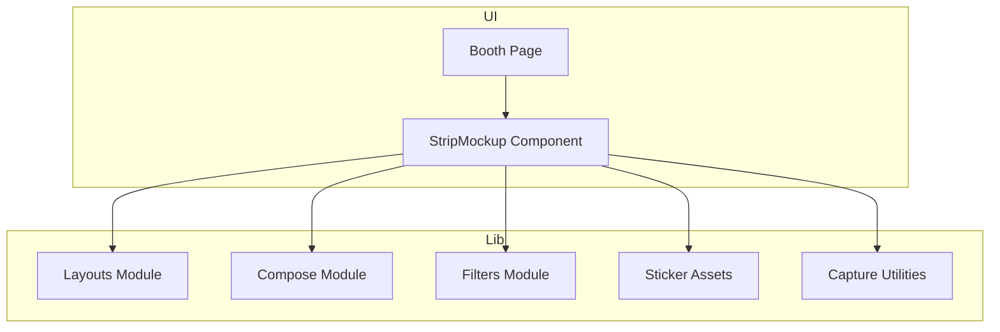
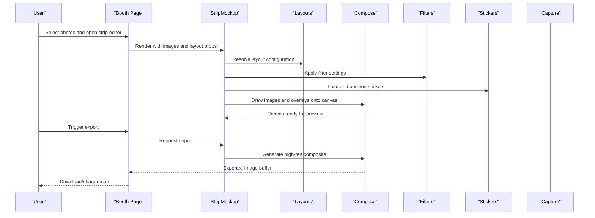
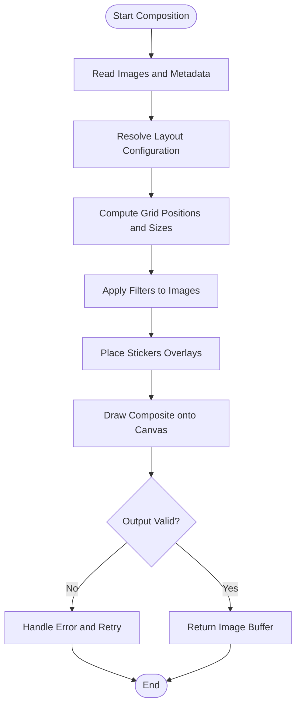
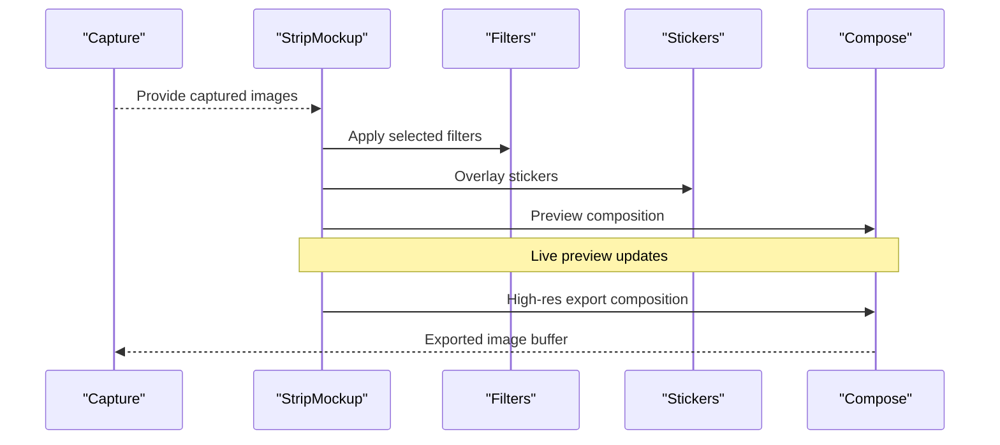
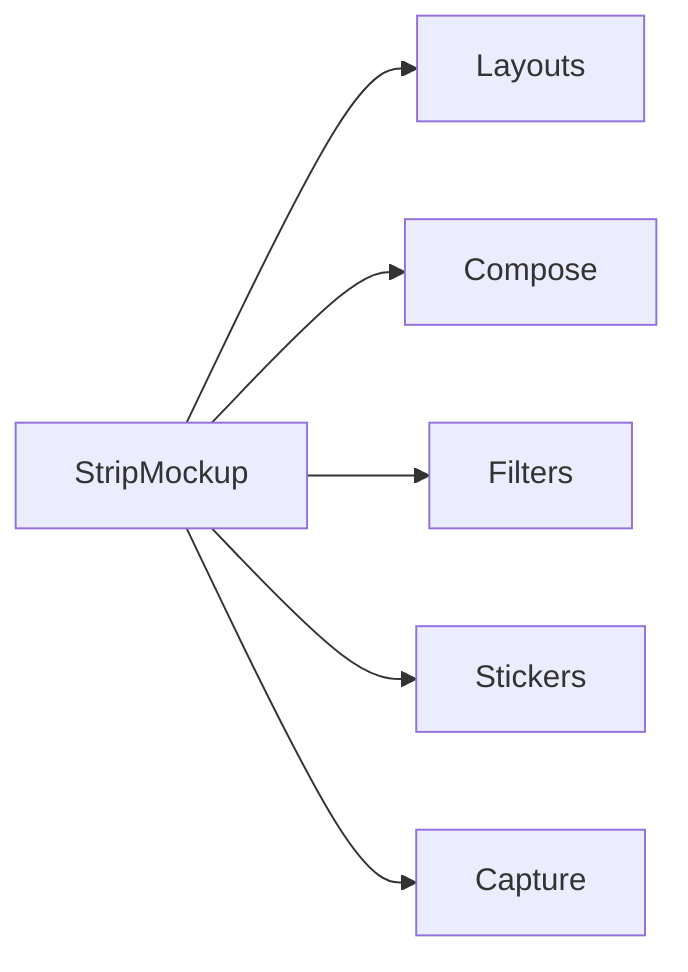

# Strip Mockup Component

<cite>
**Referenced Files in This Document**
- [StripMockup.tsx](file://components/StripMockup.tsx)
- [layouts.ts](file://lib/layouts.ts)
- [compose.ts](file://lib/compose.ts)
- [capture.ts](file://lib/capture.ts)
- [filters.ts](file://lib/filters.ts)
- [sticker-assets.ts](file://lib/sticker-assets.ts)
- [page.tsx](file://app/booth/page.tsx)
</cite>

## Table of Contents
1. [Introduction](#introduction)
2. [Project Structure](#project-structure)
3. [Core Components](#core-components)
4. [Architecture Overview](#architecture-overview)
5. [Detailed Component Analysis](#detailed-component-analysis)
6. [Dependency Analysis](#dependency-analysis)
7. [Performance Considerations](#performance-considerations)
8. [Troubleshooting Guide](#troubleshooting-guide)
9. [Conclusion](#conclusion)
10. [Appendices](#appendices)

## Introduction
This document provides comprehensive documentation for the StripMockup component, which renders a photo strip visualization and composes multiple images into a cohesive layout suitable for export. It explains how the component handles image arrays, layout configurations, styling options, canvas rendering performance, image optimization, and responsive behavior across devices. Usage examples demonstrate integration with the photo editing pipeline and export functionality.

## Project Structure
The StripMockup component resides under components and integrates with library modules that manage layouts, composition, filters, stickers, and capture workflows. The booth page orchestrates user interactions and invokes the component within the editing flow.

**Diagram sources**
- [page.tsx](file://app/booth/page.tsx)
- [StripMockup.tsx](file://components/StripMockup.tsx)
- [layouts.ts](file://lib/layouts.ts)
- [compose.ts](file://lib/compose.ts)
- [filters.ts](file://lib/filters.ts)
- [sticker-assets.ts](file://lib/sticker-assets.ts)
- [capture.ts](file://lib/capture.ts)

**Section sources**
- [page.tsx](file://app/booth/page.tsx)
- [StripMockup.tsx](file://components/StripMockup.tsx)
- [layouts.ts](file://lib/layouts.ts)
- [compose.ts](file://lib/compose.ts)
- [filters.ts](file://lib/filters.ts)
- [sticker-assets.ts](file://lib/sticker-assets.ts)
- [capture.ts](file://lib/capture.ts)

## Core Components
- StripMockup: Renders a vertical or horizontal photo strip preview, applies selected layout, overlays filters and stickers, and prepares a high-resolution canvas for export.
- Layouts: Defines grid arrangements, spacing, margins, and orientation presets used by StripMockup to arrange images.
- Compose: Handles drawing images onto a canvas, applying transformations, and generating final output buffers.
- Filters: Applies visual effects (brightness, contrast, saturation, etc.) during preview and export.
- Sticker Assets: Provides sticker resources and positioning helpers.
- Capture: Supplies captured image data and metadata for inclusion in the strip.

Key responsibilities:
- Accept an array of images and render them according to a chosen layout.
- Allow users to adjust styling (margins, padding, background color).
- Provide real-time preview updates as images change.
- Export a high-quality composite image via canvas operations.

**Section sources**
- [StripMockup.tsx](file://components/StripMockup.tsx)
- [layouts.ts](file://lib/layouts.ts)
- [compose.ts](file://lib/compose.ts)
- [filters.ts](file://lib/filters.ts)
- [sticker-assets.ts](file://lib/sticker-assets.ts)
- [capture.ts](file://lib/capture.ts)

## Architecture Overview
StripMockup acts as a presentation layer that consumes layout definitions and composition utilities to produce a visually consistent photo strip. It coordinates with filters and stickers to enhance the preview and ensures the exported image matches the on-screen appearance.

**Diagram sources**
- [page.tsx](file://app/booth/page.tsx)
- [StripMockup.tsx](file://components/StripMockup.tsx)
- [layouts.ts](file://lib/layouts.ts)
- [compose.ts](file://lib/compose.ts)
- [filters.ts](file://lib/filters.ts)
- [sticker-assets.ts](file://lib/sticker-assets.ts)
- [capture.ts](file://lib/capture.ts)

## Detailed Component Analysis

### StripMockup Props and Behavior
StripMockup accepts props to control image arrays, layout configuration, styling, and export behavior. Typical props include:
- images: Array of image sources or data URLs to compose into the strip.
- layout: A layout descriptor defining grid rows/columns, spacing, and orientation.
- style: Styling options such as background color, border radius, and container dimensions.
- filters: Filter settings applied to each image or the entire strip.
- stickers: Sticker assets and their positions/scales.
- exportOptions: Output format, quality, and resolution parameters.

Behavior highlights:
- Real-time preview updates when images or layout changes.
- Responsive scaling based on container size while maintaining aspect ratios.
- Efficient canvas redraws using incremental updates where possible.
- Consistent export quality matching the preview.

**Section sources**
- [StripMockup.tsx](file://components/StripMockup.tsx)
- [layouts.ts](file://lib/layouts.ts)
- [filters.ts](file://lib/filters.ts)
- [sticker-assets.ts](file://lib/sticker-assets.ts)
- [compose.ts](file://lib/compose.ts)

### Layout Rendering and Image Composition
StripMockup uses layout descriptors to compute image positions, sizes, and spacing. Composition draws images onto a canvas, applying filters and stickers before producing the final output.

**Diagram sources**
- [compose.ts](file://lib/compose.ts)
- [layouts.ts](file://lib/layouts.ts)
- [filters.ts](file://lib/filters.ts)
- [sticker-assets.ts](file://lib/sticker-assets.ts)

**Section sources**
- [compose.ts](file://lib/compose.ts)
- [layouts.ts](file://lib/layouts.ts)
- [filters.ts](file://lib/filters.ts)
- [sticker-assets.ts](file://lib/sticker-assets.ts)

### Integration with Photo Editing Pipeline
StripMockup integrates seamlessly with the editing pipeline:
- Captured images are passed from capture utilities to StripMockup for preview.
- Users can apply filters and add stickers; changes update the preview instantly.
- Export triggers a high-resolution composition pass to ensure print-ready output.

**Diagram sources**
- [capture.ts](file://lib/capture.ts)
- [StripMockup.tsx](file://components/StripMockup.tsx)
- [filters.ts](file://lib/filters.ts)
- [sticker-assets.ts](file://lib/sticker-assets.ts)
- [compose.ts](file://lib/compose.ts)

**Section sources**
- [capture.ts](file://lib/capture.ts)
- [StripMockup.tsx](file://components/StripMockup.tsx)
- [filters.ts](file://lib/filters.ts)
- [sticker-assets.ts](file://lib/sticker-assets.ts)
- [compose.ts](file://lib/compose.ts)

### Usage Examples
- Basic usage: Pass an array of images and a layout configuration to render a simple strip.
- Advanced usage: Combine filters, stickers, and custom styling for a branded look.
- Export workflow: Trigger export after edits; receive a downloadable image buffer.

Integration points:
- Booth page initializes StripMockup with user-selected images.
- Editing controls update props (layout, filters, stickers) to reflect changes.
- Export button calls the component’s export method to generate the final image.

**Section sources**
- [page.tsx](file://app/booth/page.tsx)
- [StripMockup.tsx](file://components/StripMockup.tsx)

## Dependency Analysis
StripMockup depends on several modules to achieve its functionality:
- Layouts: Provides grid and arrangement rules.
- Compose: Performs canvas drawing and buffer generation.
- Filters: Modifies image appearance.
- Stickers: Adds decorative overlays.
- Capture: Supplies source images.

**Diagram sources**
- [StripMockup.tsx](file://components/StripMockup.tsx)
- [layouts.ts](file://lib/layouts.ts)
- [compose.ts](file://lib/compose.ts)
- [filters.ts](file://lib/filters.ts)
- [sticker-assets.ts](file://lib/sticker-assets.ts)
- [capture.ts](file://lib/capture.ts)

**Section sources**
- [StripMockup.tsx](file://components/StripMockup.tsx)
- [layouts.ts](file://lib/layouts.ts)
- [compose.ts](file://lib/compose.ts)
- [filters.ts](file://lib/filters.ts)
- [sticker-assets.ts](file://lib/sticker-assets.ts)
- [capture.ts](file://lib/capture.ts)

## Performance Considerations
- Canvas rendering: Use requestAnimationFrame for smooth updates; batch draw operations to minimize reflows.
- Image optimization: Resize images to target dimensions before drawing; cache decoded images to avoid repeated decoding.
- Memory management: Release intermediate buffers after export; avoid holding large arrays unnecessarily.
- Responsive behavior: Scale canvas based on container size; maintain aspect ratios to prevent distortion.
- Filter efficiency: Apply filters once per image and reuse results; prefer GPU-accelerated operations when available.

[No sources needed since this section provides general guidance]

## Troubleshooting Guide
Common issues and resolutions:
- Blurry export: Ensure high-resolution canvas and correct image scaling; verify export quality settings.
- Misaligned images: Check layout configuration and spacing values; validate image aspect ratios.
- Slow preview: Optimize filter application; reduce sticker complexity; defer heavy computations until export.
- Memory errors: Monitor memory usage; clear temporary buffers; limit concurrent operations.

**Section sources**
- [compose.ts](file://lib/compose.ts)
- [filters.ts](file://lib/filters.ts)
- [sticker-assets.ts](file://lib/sticker-assets.ts)

## Conclusion
StripMockup delivers a robust photo strip visualization and composition system. By leveraging layout definitions, efficient canvas rendering, and integrated filters and stickers, it supports both real-time editing and high-quality export. Proper performance tuning and responsive design ensure excellent user experience across devices.

[No sources needed since this section summarizes without analyzing specific files]

## Appendices

### Props Reference
- images: Array of image sources or data URLs.
- layout: Layout descriptor with grid, spacing, and orientation.
- style: Background color, border radius, container dimensions.
- filters: Visual effect settings applied to images or strip.
- stickers: Sticker assets and positioning data.
- exportOptions: Output format, quality, and resolution parameters.

**Section sources**
- [StripMockup.tsx](file://components/StripMockup.tsx)

### Export Workflow Checklist
- Verify images are loaded and valid.
- Confirm layout configuration matches desired output.
- Apply filters and stickers as intended.
- Trigger export and handle resulting buffer for download or sharing.

**Section sources**
- [page.tsx](file://app/booth/page.tsx)
- [compose.ts](file://lib/compose.ts)