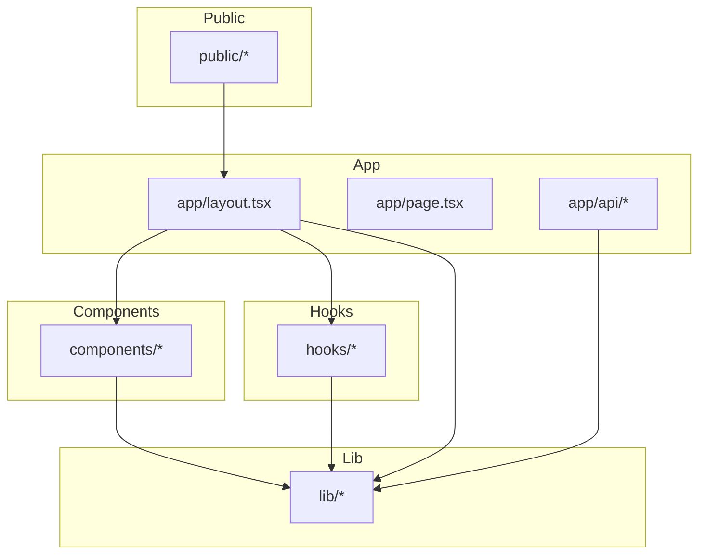
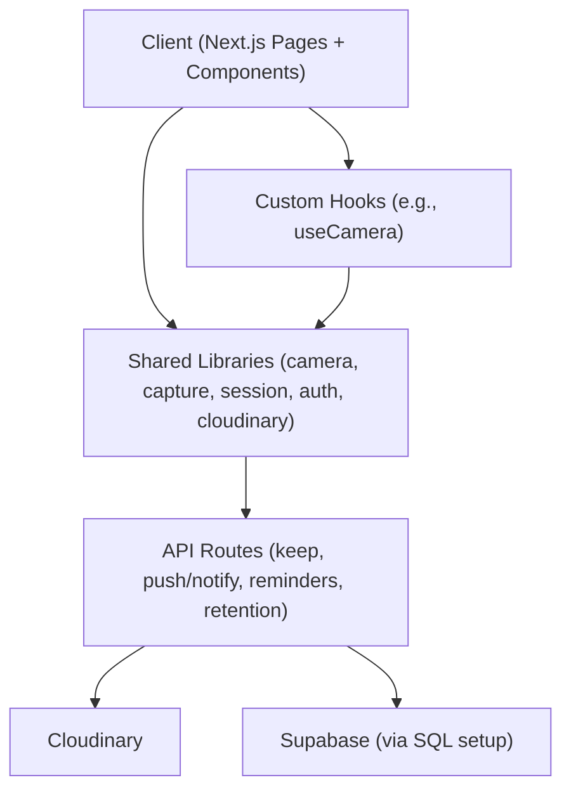
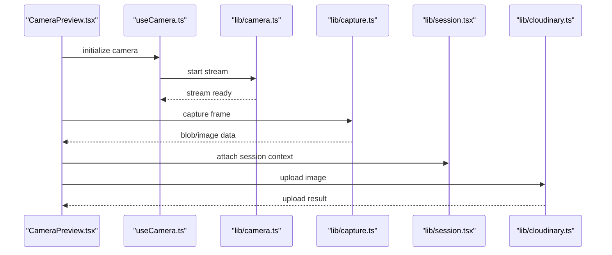
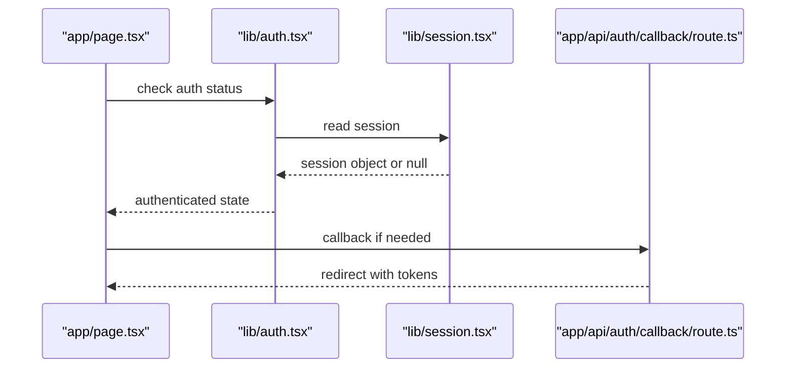
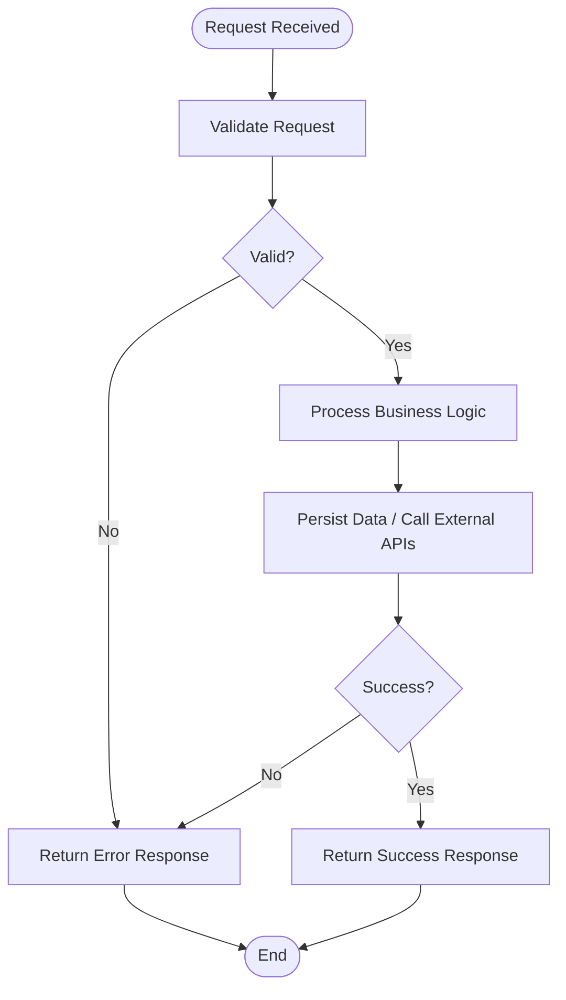
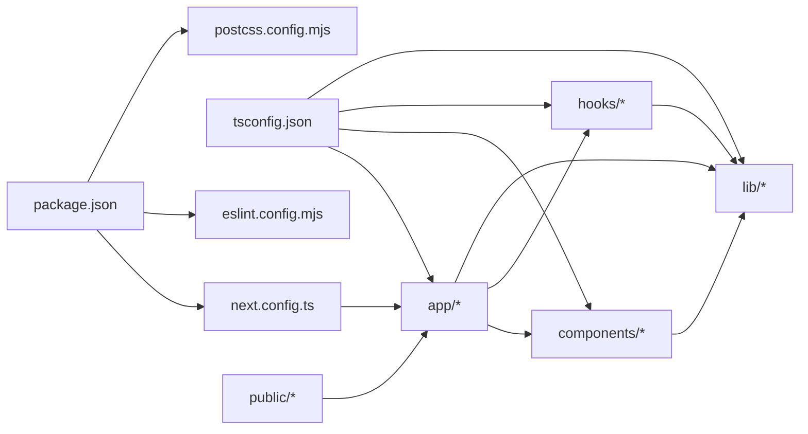

# Contributing Guidelines

<cite>
**Referenced Files in This Document**
- [README.md](file://README.md)
- [package.json](file://package.json)
- [eslint.config.mjs](file://eslint.config.mjs)
- [next.config.ts](file://next.config.ts)
- [tsconfig.json](file://tsconfig.json)
- [postcss.config.mjs](file://postcss.config.mjs)
- [app/layout.tsx](file://app/layout.tsx)
- [app/page.tsx](file://app/page.tsx)
- [app/api/keep/route.ts](file://app/api/keep/route.ts)
- [app/api/push/notify/route.ts](file://app/api/push/notify/route.ts)
- [app/api/reminders/route.ts](file://app/api/reminders/route.ts)
- [app/api/retention/route.ts](file://app/api/retention/route.ts)
- [components/CameraPreview.tsx](file://components/CameraPreview.tsx)
- [hooks/useCamera.ts](file://hooks/useCamera.ts)
- [lib/camera.ts](file://lib/camera.ts)
- [lib/capture.ts](file://lib/capture.ts)
- [lib/cloudinary.ts](file://lib/cloudinary.ts)
- [lib/session.tsx](file://lib/session.tsx)
- [lib/auth.tsx](file://lib/auth.tsx)
- [supabase-setup.sql](file://supabase-setup.sql)
</cite>

## Table of Contents
1. Introduction
2. Project Structure
3. Core Components
4. Architecture Overview
5. Detailed Component Analysis
6. Dependency Analysis
7. Performance Considerations
8. Troubleshooting Guide
9. Conclusion
10. Appendices

## Introduction
This document provides comprehensive contributing guidelines for the Zuychin Photobooth project. It covers development workflow, branch naming conventions, commit message standards, pull request procedures, code style and formatting rules (ESLint), project structure and naming conventions, adding new features/components/API endpoints, review process, testing requirements, documentation standards, issue reporting, feature requests, community interaction, setup instructions, debugging tools, examples of good contributions, and common pitfalls to avoid.

## Project Structure
The project follows a Next.js App Router layout with clear separation between UI components, hooks, libraries, API routes, and static assets:
- app/: Next.js application pages, layouts, and API routes
- components/: Reusable React components
- hooks/: Custom React hooks
- lib/: Shared utilities and integrations (camera, capture, cloud storage, auth, sessions, etc.)
- public/: Static assets including models, stickers, service worker, and offline page
- Configuration files at root for TypeScript, ESLint, PostCSS, Next.js, and package management

**Diagram sources**
- [app/layout.tsx](file://app/layout.tsx)
- [app/page.tsx](file://app/page.tsx)
- [app/api/keep/route.ts](file://app/api/keep/route.ts)
- [components/CameraPreview.tsx](file://components/CameraPreview.tsx)
- [hooks/useCamera.ts](file://hooks/useCamera.ts)
- [lib/camera.ts](file://lib/camera.ts)
- [lib/capture.ts](file://lib/capture.ts)
- [lib/cloudinary.ts](file://lib/cloudinary.ts)
- [public/sw.js](file://public/sw.js)

**Section sources**
- [README.md](file://README.md)
- [package.json](file://package.json)
- [next.config.ts](file://next.config.ts)
- [tsconfig.json](file://tsconfig.json)
- [postcss.config.mjs](file://postcss.config.mjs)

## Core Components
Key areas that contributors will interact with frequently:
- Camera and Capture pipeline: camera preview, capture logic, and media handling
- Session and Auth: user session management and authentication flows
- Cloud Storage: image upload and retrieval via Cloudinary
- API Routes: server-side endpoints for keep, push notifications, reminders, and retention

Examples of relevant files:
- Camera and capture: [useCamera hook](file://hooks/useCamera.ts), [CameraPreview component](file://components/CameraPreview.tsx), [camera utility](file://lib/camera.ts), [capture utility](file://lib/capture.ts)
- Session and Auth: [session provider](file://lib/session.tsx), [auth utilities](file://lib/auth.tsx)
- Cloud storage: [Cloudinary integration](file://lib/cloudinary.ts)
- API routes: [keep](file://app/api/keep/route.ts), [push notify](file://app/api/push/notify/route.ts), [reminders](file://app/api/reminders/route.ts), [retention](file://app/api/retention/route.ts)

**Section sources**
- [hooks/useCamera.ts](file://hooks/useCamera.ts)
- [components/CameraPreview.tsx](file://components/CameraPreview.tsx)
- [lib/camera.ts](file://lib/camera.ts)
- [lib/capture.ts](file://lib/capture.ts)
- [lib/session.tsx](file://lib/session.tsx)
- [lib/auth.tsx](file://lib/auth.tsx)
- [lib/cloudinary.ts](file://lib/cloudinary.ts)
- [app/api/keep/route.ts](file://app/api/keep/route.ts)
- [app/api/push/notify/route.ts](file://app/api/push/notify/route.ts)
- [app/api/reminders/route.ts](file://app/api/reminders/route.ts)
- [app/api/retention/route.ts](file://app/api/retention/route.ts)

## Architecture Overview
High-level architecture shows how client-side components and hooks interact with shared libraries and server-side API routes.

**Diagram sources**
- [app/page.tsx](file://app/page.tsx)
- [components/CameraPreview.tsx](file://components/CameraPreview.tsx)
- [hooks/useCamera.ts](file://hooks/useCamera.ts)
- [lib/camera.ts](file://lib/camera.ts)
- [lib/capture.ts](file://lib/capture.ts)
- [lib/session.tsx](file://lib/session.tsx)
- [lib/auth.tsx](file://lib/auth.tsx)
- [lib/cloudinary.ts](file://lib/cloudinary.ts)
- [app/api/keep/route.ts](file://app/api/keep/route.ts)
- [app/api/push/notify/route.ts](file://app/api/push/notify/route.ts)
- [app/api/reminders/route.ts](file://app/api/reminders/route.ts)
- [app/api/retention/route.ts](file://app/api/retention/route.ts)
- [supabase-setup.sql](file://supabase-setup.sql)

## Detailed Component Analysis

### Camera and Capture Pipeline
Responsibilities:
- Access device camera and render live preview
- Capture frames and convert to usable formats
- Integrate with session and storage layers

**Diagram sources**
- [components/CameraPreview.tsx](file://components/CameraPreview.tsx)
- [hooks/useCamera.ts](file://hooks/useCamera.ts)
- [lib/camera.ts](file://lib/camera.ts)
- [lib/capture.ts](file://lib/capture.ts)
- [lib/session.tsx](file://lib/session.tsx)
- [lib/cloudinary.ts](file://lib/cloudinary.ts)

**Section sources**
- [components/CameraPreview.tsx](file://components/CameraPreview.tsx)
- [hooks/useCamera.ts](file://hooks/useCamera.ts)
- [lib/camera.ts](file://lib/camera.ts)
- [lib/capture.ts](file://lib/capture.ts)
- [lib/session.tsx](file://lib/session.tsx)
- [lib/cloudinary.ts](file://lib/cloudinary.ts)

### Authentication and Session Flow
Responsibilities:
- Manage user authentication state
- Provide session context to components
- Handle callbacks and token persistence

**Diagram sources**
- [app/page.tsx](file://app/page.tsx)
- [lib/auth.tsx](file://lib/auth.tsx)
- [lib/session.tsx](file://lib/session.tsx)
- [app/auth/callback/route.ts](file://app/auth/callback/route.ts)

**Section sources**
- [lib/auth.tsx](file://lib/auth.tsx)
- [lib/session.tsx](file://lib/session.tsx)
- [app/auth/callback/route.ts](file://app/auth/callback/route.ts)

### API Endpoints
Responsibilities:
- Implement server-side logic for keep, push notifications, reminders, and retention
- Validate inputs, enforce permissions, and return consistent responses

**Diagram sources**
- [app/api/keep/route.ts](file://app/api/keep/route.ts)
- [app/api/push/notify/route.ts](file://app/api/push/notify/route.ts)
- [app/api/reminders/route.ts](file://app/api/reminders/route.ts)
- [app/api/retention/route.ts](file://app/api/retention/route.ts)

**Section sources**
- [app/api/keep/route.ts](file://app/api/keep/route.ts)
- [app/api/push/notify/route.ts](file://app/api/push/notify/route.ts)
- [app/api/reminders/route.ts](file://app/api/reminders/route.ts)
- [app/api/retention/route.ts](file://app/api/retention/route.ts)

## Dependency Analysis
Key dependencies and their roles:
- Next.js App Router for routing and API routes
- React components and hooks for UI and behavior
- Shared libraries for camera, capture, session, auth, and cloud storage
- Supabase setup for database schema and initial configuration

**Diagram sources**
- [package.json](file://package.json)
- [next.config.ts](file://next.config.ts)
- [tsconfig.json](file://tsconfig.json)
- [eslint.config.mjs](file://eslint.config.mjs)
- [postcss.config.mjs](file://postcss.config.mjs)
- [app/layout.tsx](file://app/layout.tsx)
- [components/CameraPreview.tsx](file://components/CameraPreview.tsx)
- [hooks/useCamera.ts](file://hooks/useCamera.ts)
- [lib/camera.ts](file://lib/camera.ts)
- [lib/capture.ts](file://lib/capture.ts)
- [lib/cloudinary.ts](file://lib/cloudinary.ts)
- [public/sw.js](file://public/sw.js)

**Section sources**
- [package.json](file://package.json)
- [next.config.ts](file://next.config.ts)
- [tsconfig.json](file://tsconfig.json)
- [eslint.config.mjs](file://eslint.config.mjs)
- [postcss.config.mjs](file://postcss.config.mjs)

## Performance Considerations
- Prefer lazy loading for heavy components and libraries
- Optimize images and media; use appropriate formats and sizes
- Minimize re-renders by memoizing expensive computations and stable references
- Use streaming where possible for large media transfers
- Cache API responses appropriately and leverage CDN for static assets

[No sources needed since this section provides general guidance]

## Troubleshooting Guide
Common issues and resolutions:
- Camera access denied: ensure HTTPS and proper permissions; verify browser support
- Upload failures: validate credentials and network connectivity; check rate limits
- Session inconsistencies: clear cookies and re-authenticate; verify token expiration
- Build errors: align TypeScript and ESLint configurations; run linters before committing

**Section sources**
- [eslint.config.mjs](file://eslint.config.mjs)
- [tsconfig.json](file://tsconfig.json)
- [next.config.ts](file://next.config.ts)
- [supabase-setup.sql](file://supabase-setup.sql)

## Conclusion
By following these guidelines, contributors can maintain consistency, improve code quality, and collaborate effectively. Adhering to branch naming, commit standards, and review processes ensures smooth development and reliable releases.

[No sources needed since this section summarizes without analyzing specific files]

## Appendices

### Development Workflow
- Branch naming:
  - feature/<short-description>
  - bugfix/<short-description>
  - refactor/<short-description>
  - docs/<short-description>
  - chore/<short-description>
- Commit message standards:
  - Use imperative mood (e.g., add, fix, update)
  - Keep subject lines concise (< 72 characters)
  - Add body when necessary to explain changes
- Pull request procedures:
  - Link related issues
  - Include screenshots or recordings for UI changes
  - Ensure all checks pass (lint, build, tests)
  - Request reviews from maintainers

[No sources needed since this section provides general guidance]

### Code Style and Formatting
- Enforced by ESLint configuration
- Follow TypeScript best practices and strict mode
- Consistent import ordering and file organization
- Avoid unused variables and imports

**Section sources**
- [eslint.config.mjs](file://eslint.config.mjs)
- [tsconfig.json](file://tsconfig.json)

### Project Structure and Naming Conventions
- app/: Next.js pages and API routes
- components/: reusable UI components
- hooks/: custom hooks
- lib/: shared utilities and integrations
- public/: static assets
- Naming:
  - PascalCase for components and classes
  - camelCase for functions and variables
  - kebab-case for file names and directories

**Section sources**
- [app/layout.tsx](file://app/layout.tsx)
- [components/CameraPreview.tsx](file://components/CameraPreview.tsx)
- [hooks/useCamera.ts](file://hooks/useCamera.ts)
- [lib/camera.ts](file://lib/camera.ts)
- [lib/capture.ts](file://lib/capture.ts)
- [lib/cloudinary.ts](file://lib/cloudinary.ts)

### Adding New Features, Components, and API Endpoints
- New components:
  - Place under components/
  - Export default functional component
  - Include props interface and usage comments
- New hooks:
  - Place under hooks/
  - Encapsulate side effects and state logic
- New API endpoints:
  - Create route.ts under app/api/<feature>/
  - Validate inputs and handle errors consistently
  - Return standardized JSON responses

**Section sources**
- [components/CameraPreview.tsx](file://components/CameraPreview.tsx)
- [hooks/useCamera.ts](file://hooks/useCamera.ts)
- [app/api/keep/route.ts](file://app/api/keep/route.ts)
- [app/api/push/notify/route.ts](file://app/api/push/notify/route.ts)
- [app/api/reminders/route.ts](file://app/api/reminders/route.ts)
- [app/api/retention/route.ts](file://app/api/retention/route.ts)

### Review Process and Testing Requirements
- Review process:
  - At least one maintainer approval
  - Address all feedback before merging
- Testing requirements:
  - Unit tests for critical logic
  - Integration tests for API endpoints
  - Manual testing for UI interactions

[No sources needed since this section provides general guidance]

### Documentation Standards
- Update README for significant changes
- Add inline comments for complex logic
- Maintain API documentation for endpoints

**Section sources**
- [README.md](file://README.md)

### Issue Reporting and Feature Requests
- Use GitHub Issues for bugs and feature requests
- Provide steps to reproduce for bugs
- Include environment details and logs

[No sources needed since this section provides general guidance]

### Community Interaction Guidelines
- Be respectful and inclusive
- Ask questions clearly and provide context
- Help others when possible

[No sources needed since this section provides general guidance]

### Setup Instructions and Debugging Tools
- Install dependencies using package manager
- Configure environment variables for Supabase and Cloudinary
- Run development server and open browser
- Use browser DevTools and VS Code debugger

**Section sources**
- [package.json](file://package.json)
- [supabase-setup.sql](file://supabase-setup.sql)

### Examples of Good Contributions and Common Pitfalls
- Good contributions:
  - Clear commit messages
  - Small, focused PRs
  - Updated documentation
- Common pitfalls:
  - Large monolithic changes
  - Ignoring linting and type errors
  - Missing error handling

[No sources needed since this section provides general guidance]