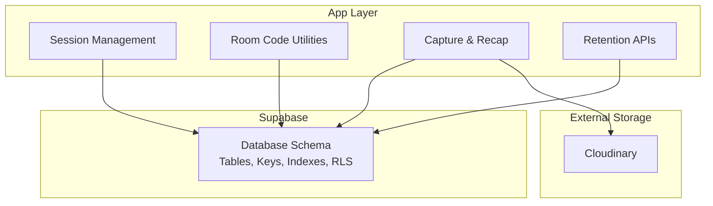
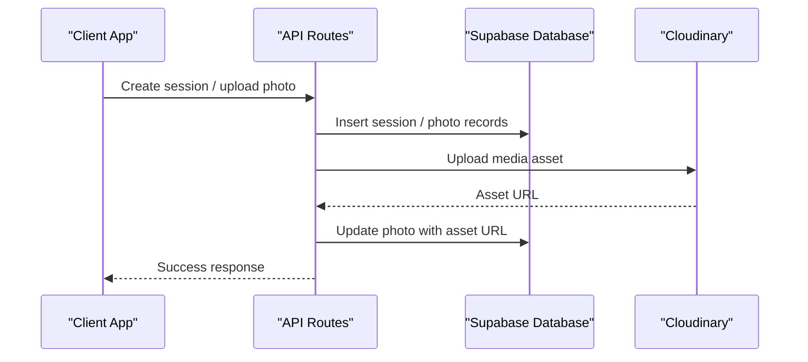
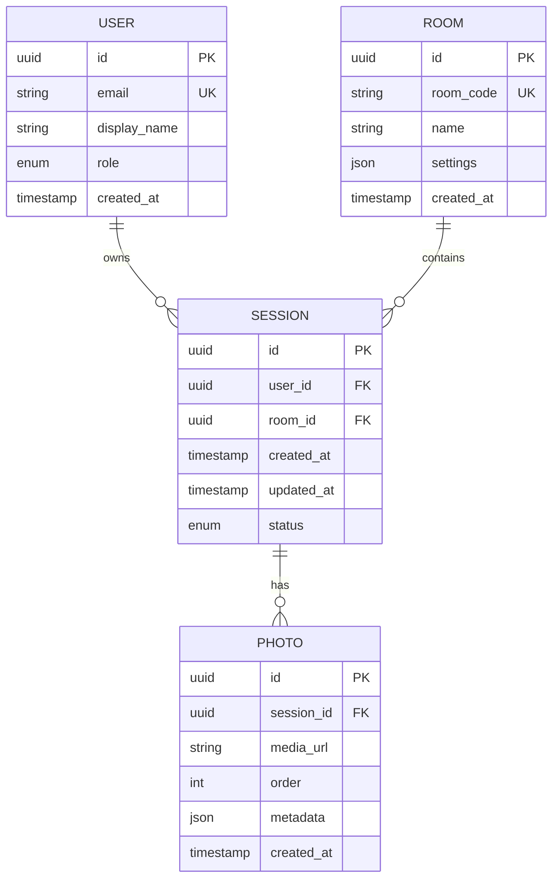
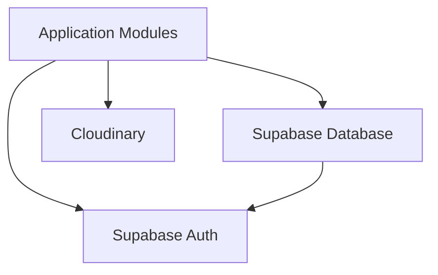
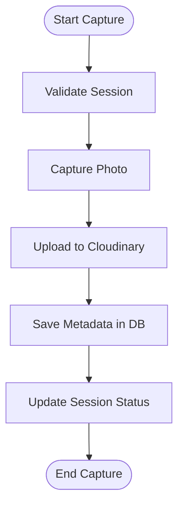

# Database Schema

<cite>
**Referenced Files in This Document**
- [supabase-setup.sql](file://supabase-setup.sql)
- [lib/session.tsx](file://lib/session.tsx)
- [lib/room-code.ts](file://lib/room-code.ts)
- [lib/cloudinary.ts](file://lib/cloudinary.ts)
- [lib/capture.ts](file://lib/capture.ts)
- [lib/recap.ts](file://lib/recap.ts)
- [lib/retention.ts](file://lib/retention.ts)
- [app/api/keep/route.ts](file://app/api/keep/route.ts)
- [app/api/retention/route.ts](file://app/api/retention/route.ts)
</cite>

## Table of Contents
1. [Introduction](#introduction)
2. [Project Structure](#project-structure)
3. [Core Components](#core-components)
4. [Architecture Overview](#architecture-overview)
5. [Detailed Component Analysis](#detailed-component-analysis)
6. [Dependency Analysis](#dependency-analysis)
7. [Performance Considerations](#performance-considerations)
8. [Troubleshooting Guide](#troubleshooting-guide)
9. [Conclusion](#conclusion)
10. [Appendices](#appendices)

## Introduction
This document provides a comprehensive data model and schema documentation for the Supabase database used by the photobooth application. It covers entity relationships, field definitions, data types, keys, indexes, constraints, validation rules, business rules enforced at the database level, access control via Row Level Security (RLS), data lifecycle and retention policies, migration and versioning strategies, and performance considerations. Where applicable, diagrams illustrate table relationships and data flows.

## Project Structure
The database schema is defined in the setup script. The application code interacts with the database through Supabase client libraries and server routes. Key files related to data handling include session management, room codes, media capture, recap generation, retention logic, and API endpoints that coordinate data operations.

[No sources needed since this diagram shows conceptual workflow, not actual code structure]

## Core Components
The core data model centers around sessions, photos, and related metadata. Sessions represent a photobooth event or user session, while photos are captured media associated with a session. Additional entities may include users, rooms, and audit logs depending on the schema definition.

Key responsibilities:
- Session lifecycle: creation, updates, and deletion
- Photo storage: linking media to sessions and maintaining metadata
- Access control: enforcing permissions via RLS policies
- Retention: managing data lifecycle and cleanup

**Section sources**
- [supabase-setup.sql](file://supabase-setup.sql)
- [lib/session.tsx](file://lib/session.tsx)
- [lib/capture.ts](file://lib/capture.ts)
- [lib/recap.ts](file://lib/recap.ts)
- [lib/retention.ts](file://lib/retention.ts)

## Architecture Overview
The system integrates the Supabase database with Cloudinary for media storage. Application layers manage sessions and capture workflows, while API routes handle retention and keep-alive signals. RLS policies ensure secure access based on authenticated users and session ownership.

**Diagram sources**
- [lib/capture.ts](file://lib/capture.ts)
- [lib/cloudinary.ts](file://lib/cloudinary.ts)
- [app/api/keep/route.ts](file://app/api/keep/route.ts)

## Detailed Component Analysis

### Data Model Entities
- Session
  - Purpose: Represents a photobooth session or event instance
  - Fields: Typically includes identifiers, timestamps, owner references, status, and metadata
  - Keys: Primary key on session identifier; foreign keys referencing users or rooms if applicable
  - Constraints: Not-null fields for required attributes; unique constraints where necessary
  - Indexes: Optimized queries on owner_id, created_at, and status fields
  - RLS Policies: Restrict read/write to session owners or authorized roles

- Photo
  - Purpose: Stores individual photo records linked to a session
  - Fields: Includes session reference, media URL, order, dimensions, filters, and timestamps
  - Keys: Primary key on photo identifier; foreign key to session
  - Constraints: Enforces valid session association; ensures non-empty media URL
  - Indexes: Optimized queries on session_id and created_at
  - RLS Policies: Allow reads for session participants; restrict writes to creators or admins

- User (if present)
  - Purpose: Manages user accounts and roles
  - Fields: Identifiers, profile info, role flags, and timestamps
  - Keys: Primary key on user id; unique email or username
  - Constraints: Validates email format; enforces role enum values
  - Indexes: Unique index on email or username
  - RLS Policies: Protect sensitive fields; allow self-modification

- Room (if present)
  - Purpose: Groups sessions under a shared room context
  - Fields: Room code, name, settings, timestamps
  - Keys: Primary key on room id; unique room code
  - Constraints: Ensures uniqueness of room code
  - Indexes: Unique index on room_code
  - RLS Policies: Control access based on room membership

**Diagram sources**
- [supabase-setup.sql](file://supabase-setup.sql)

**Section sources**
- [supabase-setup.sql](file://supabase-setup.sql)

### Data Validation Rules and Business Rules
- Field-level validation:
  - Non-null constraints on essential fields like session_id, media_url, and timestamps
  - Enum constraints for status and role fields to enforce allowed values
  - Unique constraints on emails and room codes to prevent duplicates

- Referential integrity:
  - Foreign keys ensure photos belong to existing sessions and sessions belong to valid users or rooms
  - Cascade rules configured to maintain consistency during deletions

- RLS policies:
  - Read access restricted to session owners and authorized participants
  - Write access limited to creators and administrators
  - Policy expressions validate user identity and ownership before allowing operations

**Section sources**
- [supabase-setup.sql](file://supabase-setup.sql)

### Data Lifecycle and Retention Policies
- Session lifecycle:
  - Creation upon first interaction or explicit start
  - Updates during capture and editing phases
  - Deletion after retention period or manual cleanup

- Photo lifecycle:
  - Uploaded to Cloudinary and referenced in the database
  - Metadata updated with processing results
  - Cleanup triggered by retention policies

- Retention policies:
  - Automated jobs delete old sessions and associated photos beyond retention windows
  - Archive strategies move historical data to cold storage if required

**Section sources**
- [lib/retention.ts](file://lib/retention.ts)
- [app/api/retention/route.ts](file://app/api/retention/route.ts)

### Data Migration Paths and Version Management
- Migration strategy:
  - Use versioned SQL scripts to evolve schema changes
  - Apply migrations in development and production environments consistently
  - Rollback procedures documented for failed migrations

- Version management:
  - Track schema versions in repository history
  - Use migration tools to apply incremental changes
  - Validate schema compatibility across environments

**Section sources**
- [supabase-setup.sql](file://supabase-setup.sql)

### Security, Privacy, and Access Control
- RLS policies:
  - Enforce row-level security to protect sensitive data
  - Validate user roles and ownership for each operation
  - Audit access patterns for compliance

- Privacy requirements:
  - Minimize collection of personal data
  - Anonymize or pseudonymize identifiers where possible
  - Provide mechanisms for data deletion upon request

**Section sources**
- [supabase-setup.sql](file://supabase-setup.sql)

## Dependency Analysis
The database schema depends on external services like Cloudinary for media storage and Supabase for authentication and authorization. Application modules interact with these dependencies through well-defined interfaces.

**Diagram sources**
- [lib/cloudinary.ts](file://lib/cloudinary.ts)
- [lib/session.tsx](file://lib/session.tsx)

**Section sources**
- [lib/cloudinary.ts](file://lib/cloudinary.ts)
- [lib/session.tsx](file://lib/session.tsx)

## Performance Considerations
- Indexing strategies:
  - Create indexes on frequently queried columns like session_id, created_at, and user_id
  - Use composite indexes for complex queries involving multiple conditions

- Query optimization:
  - Avoid N+1 queries by using joins or batch operations
  - Limit result sets with pagination and filtering

- Storage efficiency:
  - Store large media assets externally (Cloudinary) and reference them in the database
  - Compress metadata and use appropriate data types to minimize storage usage

- Caching:
  - Cache frequently accessed data at the application layer
  - Invalidate caches on data mutations

[No sources needed since this section provides general guidance]

## Troubleshooting Guide
Common issues and resolutions:
- RLS policy violations:
  - Verify user authentication and session ownership
  - Review policy expressions for correctness

- Foreign key constraint errors:
  - Ensure referenced entities exist before inserting dependent records
  - Check cascade rules for expected behavior

- Performance bottlenecks:
  - Analyze query plans and add missing indexes
  - Optimize joins and reduce unnecessary data retrieval

**Section sources**
- [supabase-setup.sql](file://supabase-setup.sql)

## Conclusion
The Supabase database schema for the photobooth application provides a robust foundation for managing sessions, photos, and related metadata. With careful attention to validation, indexing, and RLS policies, the system ensures data integrity, security, and performance. Ongoing maintenance of migration scripts and retention policies will support long-term scalability and compliance.

[No sources needed since this section summarizes without analyzing specific files]

## Appendices

### Data Flow Diagrams

**Diagram sources**
- [lib/capture.ts](file://lib/capture.ts)
- [lib/cloudinary.ts](file://lib/cloudinary.ts)