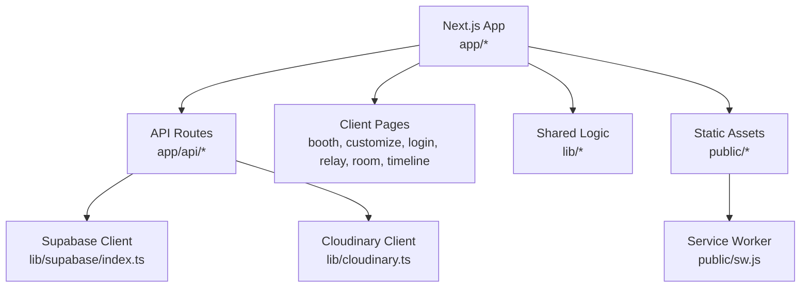
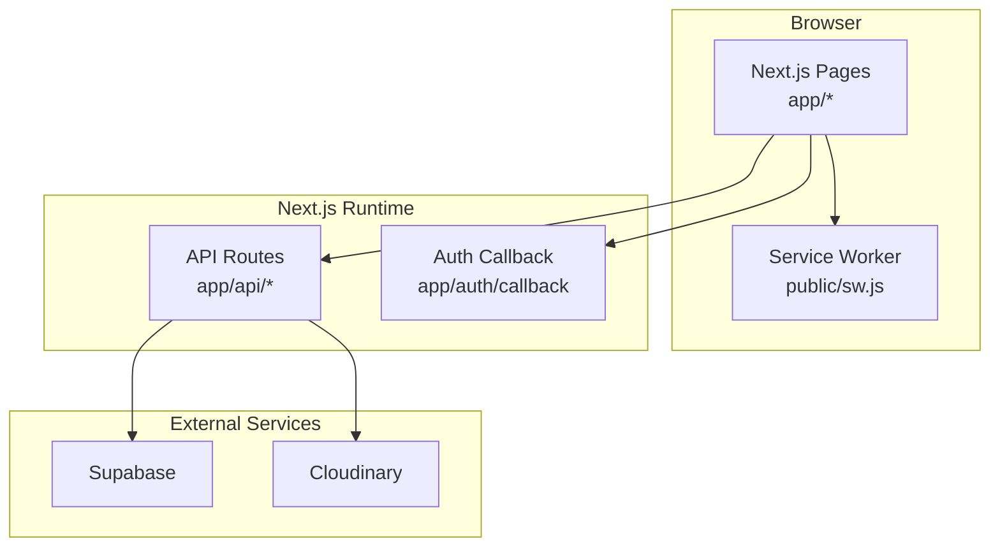
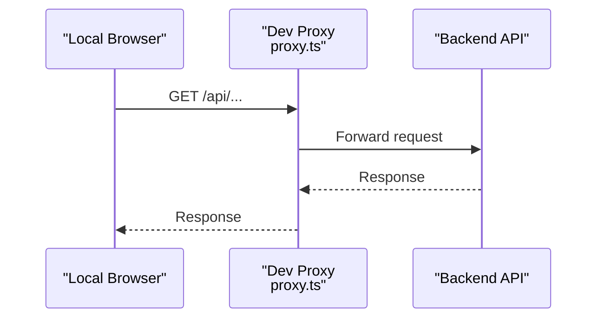
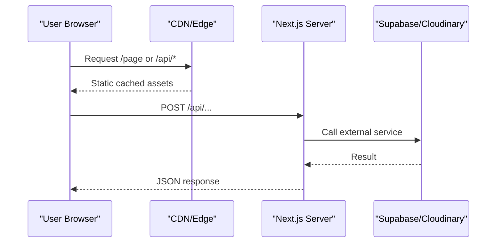
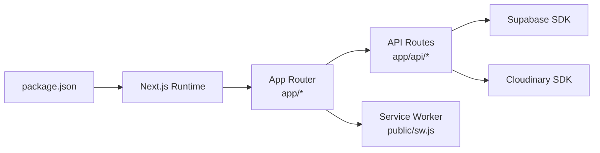

# Deployment Guide

<cite>
**Referenced Files in This Document**
- [next.config.ts](file://next.config.ts)
- [package.json](file://package.json)
- [proxy.ts](file://proxy.ts)
- [app/api/keep/route.ts](file://app/api/keep/route.ts)
- [app/api/push/notify/route.ts](file://app/api/push/notify/route.ts)
- [app/api/reminders/route.ts](file://app/api/reminders/route.ts)
- [app/api/retention/route.ts](file://app/api/retention/route.ts)
- [app/auth/callback/route.ts](file://app/auth/callback/route.ts)
- [lib/supabase/index.ts](file://lib/supabase/index.ts)
- [lib/cloudinary.ts](file://lib/cloudinary.ts)
- [public/sw.js](file://public/sw.js)
- [supabase-setup.sql](file://supabase-setup.sql)
</cite>

## Table of Contents
1. [Introduction](#introduction)
2. [Project Structure](#project-structure)
3. [Core Components](#core-components)
4. [Architecture Overview](#architecture-overview)
5. [Detailed Component Analysis](#detailed-component-analysis)
6. [Dependency Analysis](#dependency-analysis)
7. [Performance Considerations](#performance-considerations)
8. [Troubleshooting Guide](#troubleshooting-guide)
9. [Conclusion](#conclusion)
10. [Appendices](#appendices)

## Introduction
This deployment guide explains how to build, configure, and deploy the Zuychin Photobooth application using Next.js. It covers production optimizations, environment variables, API proxying and CORS, SSL/domain setup, CDN integration, monitoring/logging, rollback and disaster recovery, troubleshooting, and performance tuning. The guidance is tailored for Vercel, Netlify, and self-hosted environments.

## Project Structure
The project follows a standard Next.js App Router layout with server routes under app/api, client pages under app, shared logic under lib, and static assets under public. Key configuration files include next.config.ts for build/runtime behavior, package.json for dependencies and scripts, and proxy.ts for local development proxying.

**Diagram sources**
- [next.config.ts](file://next.config.ts)
- [package.json](file://package.json)
- [proxy.ts](file://proxy.ts)
- [app/api/keep/route.ts](file://app/api/keep/route.ts)
- [app/api/push/notify/route.ts](file://app/api/push/notify/route.ts)
- [app/api/reminders/route.ts](file://app/api/reminders/route.ts)
- [app/api/retention/route.ts](file://app/api/retention/route.ts)
- [lib/supabase/index.ts](file://lib/supabase/index.ts)
- [lib/cloudinary.ts](file://lib/cloudinary.ts)
- [public/sw.js](file://public/sw.js)

**Section sources**
- [next.config.ts](file://next.config.ts)
- [package.json](file://package.json)
- [proxy.ts](file://proxy.ts)

## Core Components
- Build and runtime configuration: next.config.ts controls Next.js behavior such as output mode, asset handling, and security headers.
- Dependency management: package.json defines Node/Next.js versions, build scripts, and runtime dependencies.
- Local development proxy: proxy.ts configures API forwarding during development.
- Server-side APIs: app/api/* routes implement keep-alive, push notifications, reminders, and retention policies.
- Authentication callback: app/auth/callback handles OAuth flows.
- External integrations: Supabase client (lib/supabase/index.ts) and Cloudinary client (lib/cloudinary.ts).
- PWA support: Service worker at public/sw.js enables offline caching and background sync.

**Section sources**
- [next.config.ts](file://next.config.ts)
- [package.json](file://package.json)
- [proxy.ts](file://proxy.ts)
- [app/api/keep/route.ts](file://app/api/keep/route.ts)
- [app/api/push/notify/route.ts](file://app/api/push/notify/route.ts)
- [app/api/reminders/route.ts](file://app/api/reminders/route.ts)
- [app/api/retention/route.ts](file://app/api/retention/route.ts)
- [app/auth/callback/route.ts](file://app/auth/callback/route.ts)
- [lib/supabase/index.ts](file://lib/supabase/index.ts)
- [lib/cloudinary.ts](file://lib/cloudinary.ts)
- [public/sw.js](file://public/sw.js)

## Architecture Overview
The application uses Next.js App Router with serverless API routes that call external services (Supabase, Cloudinary). The frontend renders pages and interacts with APIs via relative paths. In development, a local proxy forwards requests; in production, platform routing or reverse proxies handle API paths.

**Diagram sources**
- [app/api/keep/route.ts](file://app/api/keep/route.ts)
- [app/api/push/notify/route.ts](file://app/api/push/notify/route.ts)
- [app/api/reminders/route.ts](file://app/api/reminders/route.ts)
- [app/api/retention/route.ts](file://app/api/retention/route.ts)
- [app/auth/callback/route.ts](file://app/auth/callback/route.ts)
- [lib/supabase/index.ts](file://lib/supabase/index.ts)
- [lib/cloudinary.ts](file://lib/cloudinary.ts)
- [public/sw.js](file://public/sw.js)

## Detailed Component Analysis

### Build Configuration and Production Optimizations
- Output mode: Configure standalone output for efficient serverless deployments.
- Asset optimization: Enable image optimization and ensure proper cache headers for static assets.
- Security headers: Set strict transport security, content security policy, and other hardening headers.
- Compression: Enable gzip/brotli compression where supported by the hosting platform.
- Environment-specific builds: Use separate build configurations for dev/staging/prod.

Key files:
- next.config.ts: Central place for Next.js build/runtime settings.
- package.json: Scripts and dependency versions that influence build behavior.

**Section sources**
- [next.config.ts](file://next.config.ts)
- [package.json](file://package.json)

### Environment Variables Management
- Define variables for Supabase URL and keys, Cloudinary credentials, and feature flags.
- Separate values per environment (development, staging, production) using platform-specific mechanisms.
- Avoid committing secrets; use secret managers or platform vaults.
- Validate required variables at startup and fail fast if missing.

Relevant integration points:
- lib/supabase/index.ts: Reads Supabase configuration.
- lib/cloudinary.ts: Reads Cloudinary configuration.
- API routes may also reference env vars for tokens or endpoints.

**Section sources**
- [lib/supabase/index.ts](file://lib/supabase/index.ts)
- [lib/cloudinary.ts](file://lib/cloudinary.ts)
- [app/api/keep/route.ts](file://app/api/keep/route.ts)
- [app/api/push/notify/route.ts](file://app/api/push/notify/route.ts)
- [app/api/reminders/route.ts](file://app/api/reminders/route.ts)
- [app/api/retention/route.ts](file://app/api/retention/route.ts)

### Proxy Configuration and CORS Policies
- Development proxy: proxy.ts forwards API calls to backend endpoints during local development.
- Production routing: On Vercel/Netlify, route /api/* to serverless functions automatically. For self-hosted, configure Nginx/Caddy to forward /api/* to the Next.js server.
- CORS: Allow origins from your domain(s), restrict methods and headers, and preflight caching.

Development flow:

Production flow:

**Diagram sources**
- [proxy.ts](file://proxy.ts)
- [app/api/keep/route.ts](file://app/api/keep/route.ts)
- [app/api/push/notify/route.ts](file://app/api/push/notify/route.ts)
- [app/api/reminders/route.ts](file://app/api/reminders/route.ts)
- [app/api/retention/route.ts](file://app/api/retention/route.ts)

**Section sources**
- [proxy.ts](file://proxy.ts)

### SSL Certificate Setup and Domain Configuration
- Use platform-managed HTTPS (Vercel/Netlify provide automatic certificates).
- For custom domains, add DNS records (CNAME/A) and enable HTTPS on the platform.
- Self-hosted: Install certificates via Let’s Encrypt and configure Nginx/Caddy with TLS termination.
- Enforce HTTPS redirects and set HSTS headers.

**Section sources**
- [next.config.ts](file://next.config.ts)

### CDN Integration
- Cache static assets aggressively with immutable filenames.
- Configure CDN rules to bypass cache for API routes.
- Enable edge caching for images and fonts; invalidate caches on updates.
- Ensure Service Worker assets are not over-cached to avoid stale updates.

**Section sources**
- [public/sw.js](file://public/sw.js)
- [next.config.ts](file://next.config.ts)

### Monitoring and Logging Strategies
- Application logs: Centralize structured logs (JSON) with levels and correlation IDs.
- Error tracking: Integrate error reporting (e.g., Sentry) for unhandled exceptions and user context.
- Metrics: Track latency, throughput, and error rates for API routes and key pages.
- Health checks: Expose /health endpoint and monitor uptime.

Integration points:
- API routes should log requests/responses and errors consistently.
- Frontend can send performance metrics and user interactions.

**Section sources**
- [app/api/keep/route.ts](file://app/api/keep/route.ts)
- [app/api/push/notify/route.ts](file://app/api/push/notify/route.ts)
- [app/api/reminders/route.ts](file://app/api/reminders/route.ts)
- [app/api/retention/route.ts](file://app/api/retention/route.ts)

### Rollback Procedures, Backup Strategies, and Disaster Recovery
- Rollbacks: Maintain tagged releases; redeploy previous version quickly using platform pipelines.
- Backups: Regularly back up Supabase database and Cloudinary storage references.
- DR plan: Document RTO/RPO, define failover steps, and test restoration procedures periodically.

Database schema reference:
- supabase-setup.sql: Defines tables and relationships used by the application.

**Section sources**
- [supabase-setup.sql](file://supabase-setup.sql)

### Troubleshooting Common Deployment Issues
- Build failures: Check Node/Next.js versions, missing dependencies, and environment variables.
- API 404/500: Verify route paths, CORS settings, and upstream service availability.
- Auth issues: Confirm callback URLs and secrets match platform configuration.
- PWA problems: Ensure service worker registration and cache invalidation work after updates.

**Section sources**
- [app/auth/callback/route.ts](file://app/auth/callback/route.ts)
- [public/sw.js](file://public/sw.js)

## Dependency Analysis
The application depends on Next.js runtime, Supabase SDK, and Cloudinary SDK. API routes depend on environment variables and network access to external services.

**Diagram sources**
- [package.json](file://package.json)
- [app/api/keep/route.ts](file://app/api/keep/route.ts)
- [app/api/push/notify/route.ts](file://app/api/push/notify/route.ts)
- [app/api/reminders/route.ts](file://app/api/reminders/route.ts)
- [app/api/retention/route.ts](file://app/api/retention/route.ts)
- [lib/supabase/index.ts](file://lib/supabase/index.ts)
- [lib/cloudinary.ts](file://lib/cloudinary.ts)
- [public/sw.js](file://public/sw.js)

**Section sources**
- [package.json](file://package.json)

## Performance Considerations
- Image optimization: Use Next.js image optimization and serve WebP/AVIF where supported.
- Code splitting: Keep bundles small; lazy-load heavy components.
- Caching: Leverage CDN and browser caching for static assets; set appropriate cache-control headers.
- Database queries: Optimize Supabase queries and indexes; paginate large datasets.
- Edge caching: Cache read-heavy responses at the edge when safe.
- PWA: Pre-cache critical assets via service worker; implement background sync for non-critical data.

[No sources needed since this section provides general guidance]

## Troubleshooting Guide
- Build-time errors: Inspect dependency versions and environment variables; run local builds to reproduce.
- Runtime errors: Check API route logs, upstream service status, and CORS misconfigurations.
- Auth callbacks: Validate redirect URIs and secret alignment between platform and app.
- Service worker issues: Clear cache, check registration logs, and ensure updated sw.js is served.

**Section sources**
- [app/auth/callback/route.ts](file://app/auth/callback/route.ts)
- [public/sw.js](file://public/sw.js)

## Conclusion
By following this guide, you can reliably build, deploy, and operate the Zuychin Photobooth across platforms. Focus on secure environment variable management, robust API routing and CORS, strong SSL/domain setup, effective CDN usage, comprehensive monitoring/logging, and well-tested rollback and disaster recovery plans.

[No sources needed since this section summarizes without analyzing specific files]

## Appendices

### Step-by-Step Deployment Instructions

#### Vercel
- Connect repository and select Next.js preset.
- Add environment variables (Supabase, Cloudinary, feature flags).
- Configure custom domain and enable HTTPS.
- Deploy preview branches for staging.

**Section sources**
- [package.json](file://package.json)
- [next.config.ts](file://next.config.ts)

#### Netlify
- Connect repository and choose Next.js build command.
- Set environment variables in the dashboard.
- Configure redirects and headers for API routing and security.
- Enable CDN and custom domain with automatic HTTPS.

**Section sources**
- [package.json](file://package.json)
- [next.config.ts](file://next.config.ts)

#### Self-Hosted (Node + Nginx/Caddy)
- Install dependencies and build the app.
- Run the production server with environment variables.
- Configure reverse proxy to forward /api/* to the Next.js server.
- Set up SSL certificates and enforce HTTPS.

**Section sources**
- [package.json](file://package.json)
- [next.config.ts](file://next.config.ts)
- [proxy.ts](file://proxy.ts)

### Environment Variables Checklist
- Supabase URL and anon/public keys
- Cloudinary cloud name, API key, and secret
- Feature flags and logging levels
- Secret keys for authentication and encryption

**Section sources**
- [lib/supabase/index.ts](file://lib/supabase/index.ts)
- [lib/cloudinary.ts](file://lib/cloudinary.ts)

### API Route Reference
- Keep alive: app/api/keep/route.ts
- Push notifications: app/api/push/notify/route.ts
- Reminders: app/api/reminders/route.ts
- Retention: app/api/retention/route.ts
- Auth callback: app/auth/callback/route.ts

**Section sources**
- [app/api/keep/route.ts](file://app/api/keep/route.ts)
- [app/api/push/notify/route.ts](file://app/api/push/notify/route.ts)
- [app/api/reminders/route.ts](file://app/api/reminders/route.ts)
- [app/api/retention/route.ts](file://app/api/retention/route.ts)
- [app/auth/callback/route.ts](file://app/auth/callback/route.ts)