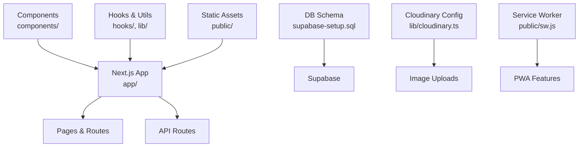
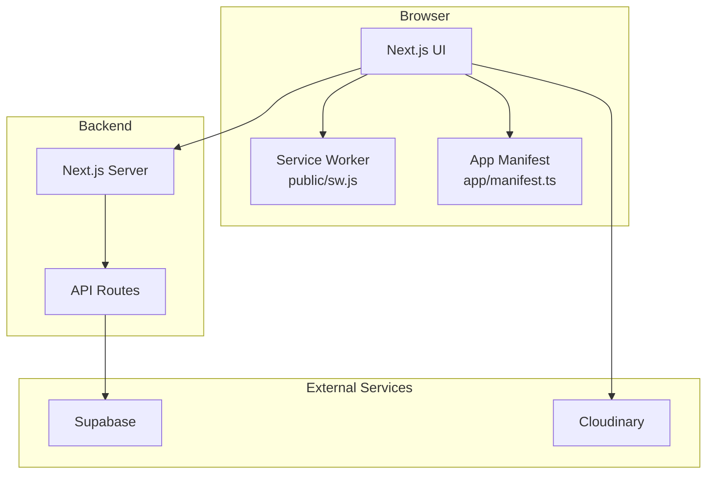
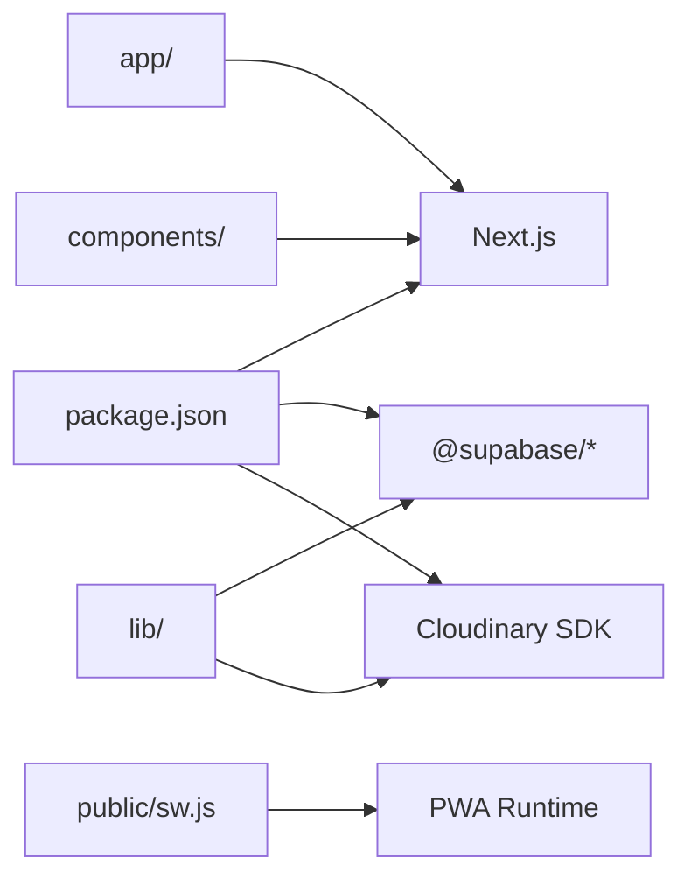

# Getting Started

<cite>
**Referenced Files in This Document**
- [README.md](file://README.md)
- [package.json](file://package.json)
- [supabase-setup.sql](file://supabase-setup.sql)
- [next.config.ts](file://next.config.ts)
- [app/manifest.ts](file://app/manifest.ts)
- [public/sw.js](file://public/sw.js)
- [lib/cloudinary.ts](file://lib/cloudinary.ts)
- [lib/supabase/index.ts](file://lib/supabase/index.ts)
- [lib/session.tsx](file://lib/session.tsx)
- [components/CameraPreview.tsx](file://components/CameraPreview.tsx)
- [hooks/useCamera.ts](file://hooks/useCamera.ts)
</cite>

## Table of Contents
1. Introduction
2. Project Structure
3. Core Components
4. Architecture Overview
5. Detailed Component Analysis
6. Dependency Analysis
7. Performance Considerations
8. Troubleshooting Guide
9. Conclusion

## Introduction
This guide helps you set up and run the Zuychin Photobooth project locally. You will install dependencies, configure environment variables for Supabase and Cloudinary, initialize the database schema, and start the development server. It also covers prerequisites such as browser permissions for camera access and installing the app as a Progressive Web App (PWA).

## Project Structure
At a high level, the project is a Next.js application with:
- Pages and API routes under app/
- Reusable UI components under components/
- Client-side hooks and utilities under hooks/ and lib/
- Static assets and service worker under public/
- Database schema initialization via supabase-setup.sql
- Configuration files for Next.js, TypeScript, ESLint, and PostCSS

[No sources needed since this diagram shows conceptual structure]

## Core Components
Key areas that affect setup and runtime behavior:
- Environment configuration for Supabase and Cloudinary
- Camera capture pipeline and PWA registration
- Service worker and manifest for offline/PWA support

What to know before starting:
- Node.js version requirements are defined by the project’s package manager and scripts.
- The Supabase client is initialized from environment variables.
- Cloudinary integration requires upload credentials.
- Camera features require HTTPS or localhost and user permission.

**Section sources**
- [package.json](file://package.json)
- [next.config.ts](file://next.config.ts)
- [lib/cloudinary.ts](file://lib/cloudinary.ts)
- [lib/supabase/index.ts](file://lib/supabase/index.ts)
- [lib/session.tsx](file://lib/session.tsx)
- [components/CameraPreview.tsx](file://components/CameraPreview.tsx)
- [hooks/useCamera.ts](file://hooks/useCamera.ts)
- [app/manifest.ts](file://app/manifest.ts)
- [public/sw.js](file://public/sw.js)

## Architecture Overview
The app runs on Next.js with client-side camera capture, Supabase for data persistence, and Cloudinary for media storage. A service worker enables PWA capabilities.

**Diagram sources**
- [next.config.ts](file://next.config.ts)
- [app/manifest.ts](file://app/manifest.ts)
- [public/sw.js](file://public/sw.js)
- [lib/supabase/index.ts](file://lib/supabase/index.ts)
- [lib/cloudinary.ts](file://lib/cloudinary.ts)

## Detailed Component Analysis

### Prerequisites
- Install a recent LTS version of Node.js compatible with the project’s toolchain.
- Use npm or yarn to manage dependencies.
- Ensure your browser supports modern web APIs (MediaDevices, WebRTC, Canvas).

**Section sources**
- [package.json](file://package.json)

### Installation
- Clone the repository and open it in your terminal.
- Install dependencies using your preferred package manager.
- Verify installation by running the development script defined in the project.

**Section sources**
- [package.json](file://package.json)

### Environment Variables
Create a .env.local file at the project root and add the following keys:
- Supabase
  - NEXT_PUBLIC_SUPABASE_URL
  - NEXT_PUBLIC_SUPABASE_ANON_KEY
- Cloudinary
  - CLOUDINARY_CLOUD_NAME
  - CLOUDINARY_API_KEY
  - CLOUDINARY_API_SECRET
- Optional flags for local development or feature toggles if referenced by the codebase.

Notes:
- Variables prefixed with NEXT_PUBLIC_ are exposed to the browser.
- Keep secrets out of version control; .gitignore should exclude .env.local.

**Section sources**
- [lib/supabase/index.ts](file://lib/supabase/index.ts)
- [lib/cloudinary.ts](file://lib/cloudinary.ts)
- [lib/session.tsx](file://lib/session.tsx)

### Database Setup with Supabase
- Create a new Supabase project and obtain the URL and anon key.
- Run the provided SQL schema to create tables and policies.
- Confirm that required tables exist and that RLS policies allow expected operations.

Steps:
1. Open the Supabase dashboard for your project.
2. Navigate to the SQL editor.
3. Execute the contents of the provided schema file.
4. Verify tables and relationships were created successfully.

**Section sources**
- [supabase-setup.sql](file://supabase-setup.sql)

### Running the Development Server
- Start the dev server using the script defined in the project.
- Open http://localhost:3000 in your browser.
- If prompted, allow camera and microphone permissions when using capture features.

Tips:
- Use an HTTPS-capable proxy if testing on mobile devices.
- Clear cache or hard-refresh if changes do not appear.

**Section sources**
- [package.json](file://package.json)

### PWA Installation and Permissions
- The app includes a manifest and service worker to enable PWA features.
- On supported browsers, you can install the app to the home screen.
- Camera access requires HTTPS or localhost and explicit user permission.

Actions:
- Trust the site when prompted to install the PWA.
- Grant camera/microphone permissions when requested.

**Section sources**
- [app/manifest.ts](file://app/manifest.ts)
- [public/sw.js](file://public/sw.js)
- [components/CameraPreview.tsx](file://components/CameraPreview.tsx)
- [hooks/useCamera.ts](file://hooks/useCamera.ts)

### Basic Development Workflow
- Make changes to components or pages.
- Save files; the dev server hot-reloads automatically.
- Test camera features on localhost or over a secure tunnel.
- Commit changes and push to your repository.

**Section sources**
- [package.json](file://package.json)

## Dependency Analysis
The project relies on:
- Next.js framework and React ecosystem
- Supabase client for data and auth
- Cloudinary SDK for image uploads
- MediaDevices/WebRTC APIs for camera capture
- Service Worker and manifest for PWA

**Diagram sources**
- [package.json](file://package.json)
- [lib/supabase/index.ts](file://lib/supabase/index.ts)
- [lib/cloudinary.ts](file://lib/cloudinary.ts)
- [public/sw.js](file://public/sw.js)

**Section sources**
- [package.json](file://package.json)

## Performance Considerations
- Prefer lazy loading for heavy components and libraries.
- Optimize images and leverage CDN caching via Cloudinary.
- Minimize unnecessary re-renders in React components.
- Use efficient camera streams and avoid excessive polling.

[No sources needed since this section provides general guidance]

## Troubleshooting Guide
Common issues and resolutions:
- Missing environment variables
  - Ensure all required variables are present in .env.local and restart the dev server.
- Supabase connection errors
  - Verify URL and anon key; confirm schema was applied; check RLS policies.
- Cloudinary upload failures
  - Validate cloud name, API key, and secret; ensure correct folder/preset settings.
- Camera not working
  - Access via HTTPS or localhost; grant permissions; test on multiple browsers.
- PWA not installing
  - Check manifest validity; ensure service worker is registered; clear cache and retry.

Where to look:
- Supabase client initialization and session handling
- Cloudinary configuration and upload helpers
- Camera preview and hook implementations
- Service worker and manifest definitions

**Section sources**
- [lib/supabase/index.ts](file://lib/supabase/index.ts)
- [lib/session.tsx](file://lib/session.tsx)
- [lib/cloudinary.ts](file://lib/cloudinary.ts)
- [components/CameraPreview.tsx](file://components/CameraPreview.tsx)
- [hooks/useCamera.ts](file://hooks/useCamera.ts)
- [app/manifest.ts](file://app/manifest.ts)
- [public/sw.js](file://public/sw.js)

## Conclusion
You now have the essentials to install, configure, and run the Zuychin Photobooth project locally. With Supabase and Cloudinary configured, and proper browser permissions granted, you can develop and test features like camera capture and PWA installation. Refer to the troubleshooting section if you encounter common setup issues.