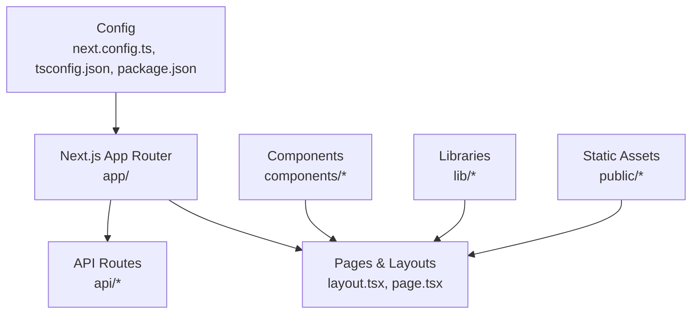
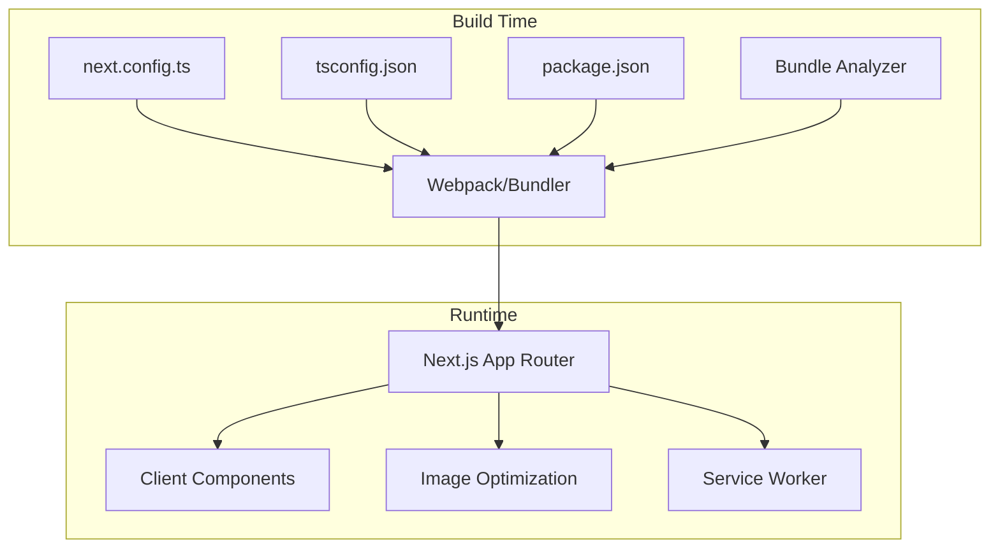
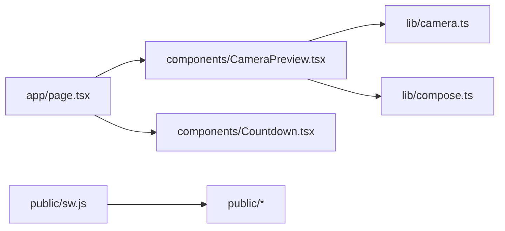

# Build Optimization

<cite>
**Referenced Files in This Document**
- [next.config.ts](file://next.config.ts)
- [package.json](file://package.json)
- [tsconfig.json](file://tsconfig.json)
- [app/layout.tsx](file://app/layout.tsx)
- [app/page.tsx](file://app/page.tsx)
- [components/CameraPreview.tsx](file://components/CameraPreview.tsx)
- [components/Countdown.tsx](file://components/Countdown.tsx)
- [lib/camera.ts](file://lib/camera.ts)
- [lib/compose.ts](file://lib/compose.ts)
- [public/sw.js](file://public/sw.js)
</cite>

## Table of Contents
1. Introduction
2. Project Structure
3. Core Components
4. Architecture Overview
5. Detailed Component Analysis
6. Dependency Analysis
7. Performance Considerations
8. Troubleshooting Guide
9. Conclusion

## Introduction
This document provides build optimization strategies tailored for the Next.js photobooth application. It covers Next.js configuration optimizations (image settings, bundle analysis, code splitting), TypeScript compilation improvements, webpack enhancements for faster builds and smaller bundles, practical examples of lazy loading and dynamic imports, caching strategies for development and production, and guidance for monitoring build performance to identify bottlenecks. The goal is to help you achieve faster builds, reduced bundle sizes, and better runtime performance without sacrificing functionality.

## Project Structure
The project follows a modern Next.js App Router layout with:
- app/: Route definitions and page components
- components/: Reusable UI components
- hooks/: Custom React hooks
- lib/: Shared utilities and integrations (camera, compose, push, etc.)
- public/: Static assets including service worker and WebAssembly modules
- Configuration files: next.config.ts, tsconfig.json, package.json

[No sources needed since this diagram shows conceptual structure]

## Core Components
Key areas that impact build performance:
- Next.js configuration: image optimization, experimental features, and bundling behavior
- TypeScript configuration: module resolution, incremental builds, and strictness
- Client-heavy components: camera preview, countdown, and media processing libraries
- Service worker and static assets: caching and offline support

Practical focus areas:
- Enable Next.js Image Optimization for photos and stickers
- Use dynamic imports for heavy components like CameraPreview and Compose
- Configure TypeScript for faster compilation
- Analyze bundles to remove unused dependencies
- Implement caching via service worker and HTTP headers

**Section sources**
- [next.config.ts](file://next.config.ts)
- [tsconfig.json](file://tsconfig.json)
- [package.json](file://package.json)
- [app/layout.tsx](file://app/layout.tsx)
- [app/page.tsx](file://app/page.tsx)
- [components/CameraPreview.tsx](file://components/CameraPreview.tsx)
- [components/Countdown.tsx](file://components/Countdown.tsx)
- [lib/camera.ts](file://lib/camera.ts)
- [lib/compose.ts](file://lib/compose.ts)
- [public/sw.js](file://public/sw.js)

## Architecture Overview
Build-time and runtime architecture relevant to optimization:
- Next.js compiles pages and components into optimized bundles
- Dynamic imports split large components into separate chunks
- Image optimization pipeline resizes and serves efficient formats
- Service worker caches assets for faster subsequent visits

**Diagram sources**
- [next.config.ts](file://next.config.ts)
- [tsconfig.json](file://tsconfig.json)
- [package.json](file://package.json)
- [public/sw.js](file://public/sw.js)

## Detailed Component Analysis

### Next.js Configuration Optimizations
Focus on image optimization, experimental flags, and bundling behavior:
- Image optimization: enable automatic format selection, responsive sizing, and CDN delivery when available
- Experimental features: selectively enable only what is necessary to avoid extra overhead
- Bundle analysis: integrate an analyzer to visualize chunk sizes and dependency usage

Recommended actions:
- Configure image domains and formats in next.config.ts
- Use dynamic imports for heavy client components
- Add a bundle analyzer script in package.json to run during CI or pre-deploy steps

**Section sources**
- [next.config.ts](file://next.config.ts)
- [package.json](file://package.json)

### TypeScript Compilation Optimizations
Improve compilation speed and correctness:
- Enable incremental compilation to cache results between runs
- Optimize module resolution paths to reduce lookup time
- Keep strict mode enabled to catch issues early and prevent bloated types from leaking into bundles

Recommended actions:
- Set incremental true in tsconfig.json
- Prefer explicit imports over wildcard imports
- Avoid overly complex generic types in shared libs used by many components

**Section sources**
- [tsconfig.json](file://tsconfig.json)

### Code Splitting and Lazy Loading
Split heavy components and libraries to reduce initial bundle size:
- Use dynamic imports for components like CameraPreview and Countdown
- Defer non-critical logic until user interaction
- Ensure client-only code is marked appropriately to avoid server-side inclusion

Example patterns:
- Lazy load CameraPreview when entering booth or relay pages
- Load composition tools on demand when editing photos
- Import WebAssembly modules lazily if used at runtime

**Section sources**
- [components/CameraPreview.tsx](file://components/CameraPreview.tsx)
- [components/Countdown.tsx](file://components/Countdown.tsx)
- [lib/camera.ts](file://lib/camera.ts)
- [lib/compose.ts](file://lib/compose.ts)

### Webpack Enhancements for Faster Builds and Smaller Bundles
Leverage Next.js built-in optimizations and targeted tweaks:
- Tree shaking: ensure side-effect-free modules and avoid default exports of large objects
- Minification and scope hoisting: rely on Next.js defaults; verify no overrides disable these
- Externalize large dependencies where possible (e.g., heavy video codecs)
- Reduce polyfills by targeting modern browsers

Recommended actions:
- Audit dependencies and remove unused packages
- Replace heavy libraries with lighter alternatives when feasible
- Avoid importing entire libraries; import specific functions

**Section sources**
- [package.json](file://package.json)
- [next.config.ts](file://next.config.ts)

### Practical Examples: Lazy Loading, Dynamic Imports, Tree Shaking
- Lazy load CameraPreview component on booth page entry
- Dynamically import composition utilities when user starts editing
- Use named imports to enable tree shaking across libraries

Implementation guidance:
- Wrap heavy components in dynamic() with ssr:false when appropriate
- Place dynamic imports inside useEffect or event handlers to defer execution
- Verify with bundle analyzer that chunks are created as expected

**Section sources**
- [app/page.tsx](file://app/page.tsx)
- [components/CameraPreview.tsx](file://components/CameraPreview.tsx)
- [lib/compose.ts](file://lib/compose.ts)

### Caching Strategies for Development and Production
Development:
- Use Next.js dev server caching and hot module replacement
- Cache npm dependencies locally and use lockfiles

Production:
- Configure long-term caching for static assets via service worker
- Set appropriate cache-control headers for images and models
- Preload critical resources and prefetch non-critical ones

**Section sources**
- [public/sw.js](file://public/sw.js)
- [package.json](file://package.json)

### Monitoring Build Performance and Identifying Bottlenecks
- Run bundle analyzer after each build to inspect chunk sizes
- Track build times in CI pipelines and alert on regressions
- Profile Node.js memory usage during builds to detect leaks
- Use Next.js telemetry (if enabled) to understand feature usage

Actionable steps:
- Add scripts to analyze and report bundle metrics
- Integrate performance budgets to fail builds on regressions
- Periodically audit dependencies and remove dead code

**Section sources**
- [package.json](file://package.json)
- [next.config.ts](file://next.config.ts)

## Dependency Analysis
Understand how components and libraries contribute to bundle size:
- Heavy client libraries (camera, segmentation, WebAssembly) should be dynamically imported
- Shared utilities in lib/ should be small and focused to maximize tree shaking
- Avoid circular dependencies that can hinder bundler optimizations

**Diagram sources**
- [app/page.tsx](file://app/page.tsx)
- [components/CameraPreview.tsx](file://components/CameraPreview.tsx)
- [components/Countdown.tsx](file://components/Countdown.tsx)
- [lib/camera.ts](file://lib/camera.ts)
- [lib/compose.ts](file://lib/compose.ts)
- [public/sw.js](file://public/sw.js)

**Section sources**
- [app/page.tsx](file://app/page.tsx)
- [components/CameraPreview.tsx](file://components/CameraPreview.tsx)
- [components/Countdown.tsx](file://components/Countdown.tsx)
- [lib/camera.ts](file://lib/camera.ts)
- [lib/compose.ts](file://lib/compose.ts)
- [public/sw.js](file://public/sw.js)

## Performance Considerations
- Prioritize lazy loading for camera and composition features
- Use Next.js Image Optimization to serve efficient formats and sizes
- Keep third-party libraries minimal and up-to-date
- Monitor bundle growth over time with automated checks
- Target modern browsers to reduce polyfills and improve performance

[No sources needed since this section provides general guidance]

## Troubleshooting Guide
Common issues and resolutions:
- Large initial bundle: identify heavy imports and convert to dynamic imports
- Slow builds: enable incremental TypeScript compilation and reduce unnecessary dependencies
- Missing assets in production: verify public path and service worker caching rules
- Runtime errors due to missing modules: ensure dynamic imports resolve correctly in both dev and prod

Checklist:
- Run bundle analyzer and compare against previous builds
- Validate service worker registration and cache strategies
- Test on low-end devices to confirm performance targets

**Section sources**
- [public/sw.js](file://public/sw.js)
- [package.json](file://package.json)

## Conclusion
By applying Next.js configuration optimizations, TypeScript compilation improvements, strategic code splitting, and robust caching, the photobooth application can achieve faster builds, smaller bundles, and smoother user experiences. Regular monitoring and iterative refinement will keep performance strong as the codebase evolves.

[No sources needed since this section summarizes without analyzing specific files]