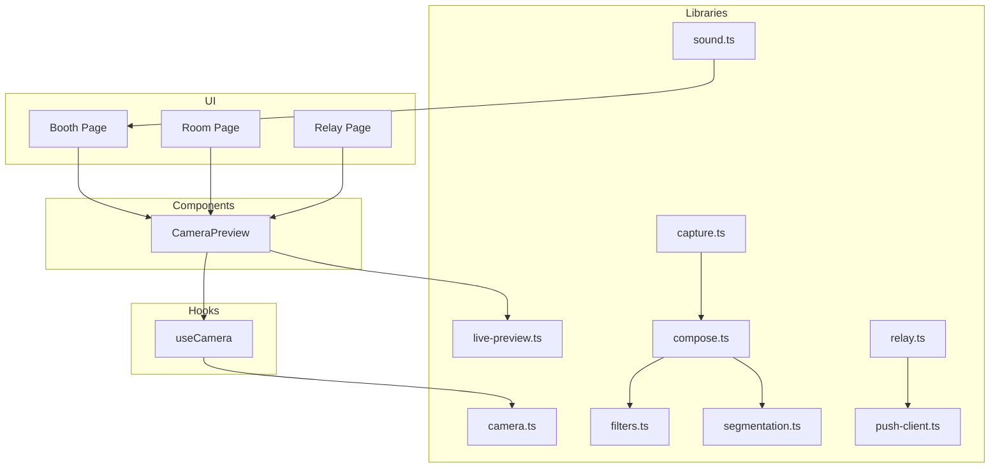
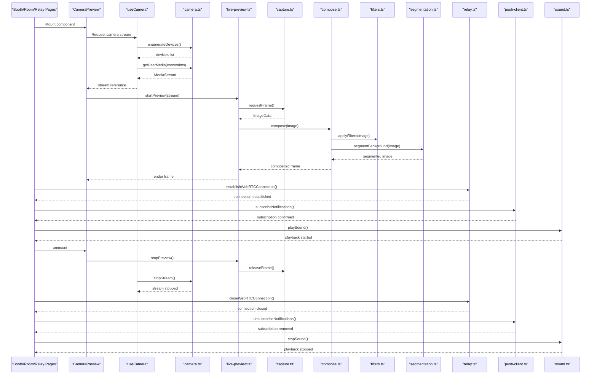
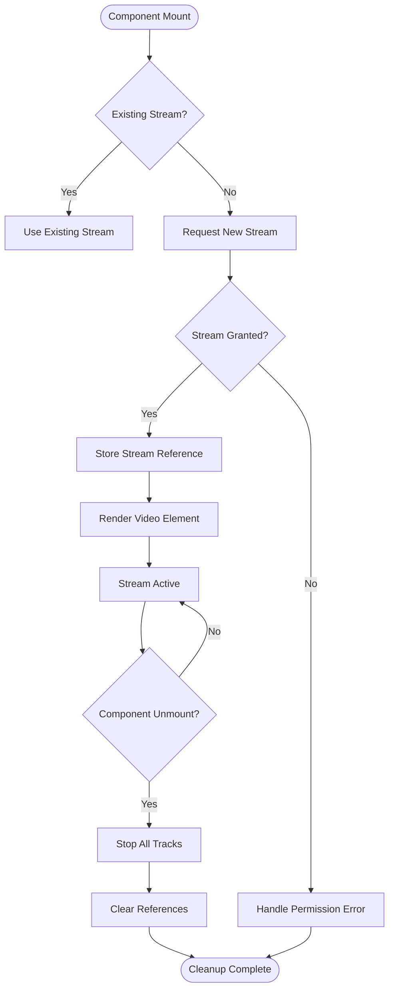
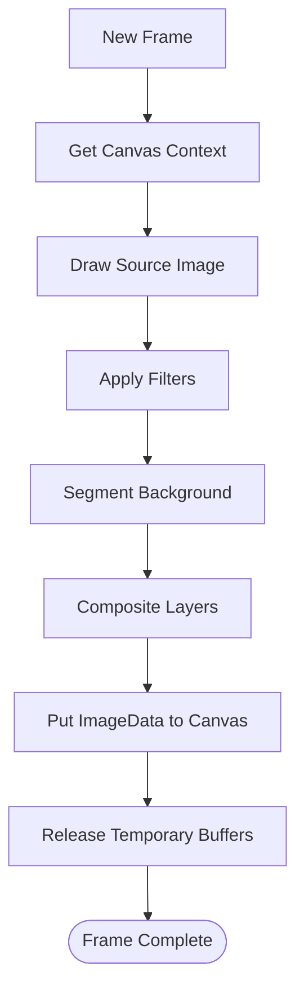
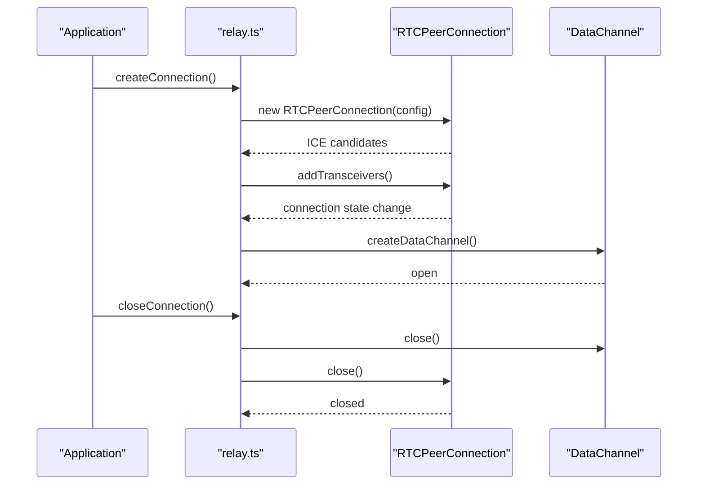
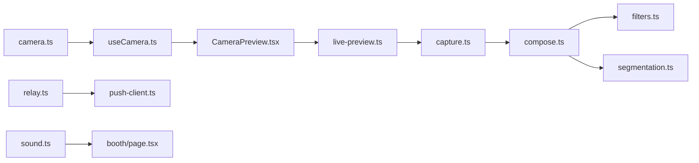

# Memory Management

<cite>
**Referenced Files in This Document**
- [CameraPreview.tsx](file://components/CameraPreview.tsx)
- [useCamera.ts](file://hooks/useCamera.ts)
- [camera.ts](file://lib/camera.ts)
- [capture.ts](file://lib/capture.ts)
- [live-preview.ts](file://lib/live-preview.ts)
- [compose.ts](file://lib/compose.ts)
- [filters.ts](file://lib/filters.ts)
- [segmentation.ts](file://lib/segmentation.ts)
- [relay.ts](file://lib/relay.ts)
- [push-client.ts](file://lib/push-client.ts)
- [sound.ts](file://lib/sound.ts)
- [page.tsx](file://app/booth/page.tsx)
- [page.tsx](file://app/room/[code]/page.tsx)
- [page.tsx](file://app/relay/[id]/page.tsx)
</cite>

## Table of Contents
1. [Introduction](#introduction)
2. [Project Structure](#project-structure)
3. [Core Components](#core-components)
4. [Architecture Overview](#architecture-overview)
5. [Detailed Component Analysis](#detailed-component-analysis)
6. [Dependency Analysis](#dependency-analysis)
7. [Performance Considerations](#performance-considerations)
8. [Troubleshooting Guide](#troubleshooting-guide)
9. [Conclusion](#conclusion)
10. [Appendices](#appendices)

## Introduction
This document provides a comprehensive guide to memory management in the photobooth application, focusing on preventing memory leaks and optimizing performance for camera streams, canvas operations, WebRTC connections, and real-time data synchronization. It explains garbage collection optimization, manual cleanup patterns, and practical examples of resource disposal. It also covers memory profiling techniques using browser developer tools and Chrome DevTools, along with guidelines for monitoring memory usage and identifying leaks in production environments.

## Project Structure
The photobooth application is organized into components, hooks, and libraries that handle camera access, media capture, image processing, and real-time communication. The key areas relevant to memory management include:
- Camera preview and lifecycle management
- Capture and image processing pipelines
- Real-time streaming via WebRTC
- Canvas-based composition and filters
- Background audio and push notifications

**Diagram sources**
- [page.tsx](file://app/booth/page.tsx)
- [page.tsx](file://app/room/[code]/page.tsx)
- [page.tsx](file://app/relay/[id]/page.tsx)
- [CameraPreview.tsx](file://components/CameraPreview.tsx)
- [useCamera.ts](file://hooks/useCamera.ts)
- [camera.ts](file://lib/camera.ts)
- [capture.ts](file://lib/capture.ts)
- [live-preview.ts](file://lib/live-preview.ts)
- [compose.ts](file://lib/compose.ts)
- [filters.ts](file://lib/filters.ts)
- [segmentation.ts](file://lib/segmentation.ts)
- [relay.ts](file://lib/relay.ts)
- [push-client.ts](file://lib/push-client.ts)
- [sound.ts](file://lib/sound.ts)

**Section sources**
- [page.tsx](file://app/booth/page.tsx)
- [page.tsx](file://app/room/[code]/page.tsx)
- [page.tsx](file://app/relay/[id]/page.tsx)
- [CameraPreview.tsx](file://components/CameraPreview.tsx)
- [useCamera.ts](file://hooks/useCamera.ts)
- [camera.ts](file://lib/camera.ts)
- [capture.ts](file://lib/capture.ts)
- [live-preview.ts](file://lib/live-preview.ts)
- [compose.ts](file://lib/compose.ts)
- [filters.ts](file://lib/filters.ts)
- [segmentation.ts](file://lib/segmentation.ts)
- [relay.ts](file://lib/relay.ts)
- [push-client.ts](file://lib/push-client.ts)
- [sound.ts](file://lib/sound.ts)

## Core Components
This section outlines the core components involved in memory-intensive operations and their responsibilities:
- CameraPreview: Manages the video element and stream lifecycle within the UI component.
- useCamera: Hook responsible for requesting and managing MediaStream resources.
- camera.ts: Low-level camera utilities for device enumeration, constraints, and stream control.
- capture.ts: Handles snapshot capture from video frames and prepares images for processing.
- live-preview.ts: Coordinates real-time preview updates and frame rendering.
- compose.ts: Orchestrates canvas-based composition, layout, and sticker placement.
- filters.ts: Applies visual effects to images and frames.
- segmentation.ts: Performs background segmentation using WebAssembly models.
- relay.ts: Manages WebRTC signaling and connection state.
- push-client.ts: Handles push notification subscriptions and events.
- sound.ts: Controls audio playback and resource management.

**Section sources**
- [CameraPreview.tsx](file://components/CameraPreview.tsx)
- [useCamera.ts](file://hooks/useCamera.ts)
- [camera.ts](file://lib/camera.ts)
- [capture.ts](file://lib/capture.ts)
- [live-preview.ts](file://lib/live-preview.ts)
- [compose.ts](file://lib/compose.ts)
- [filters.ts](file://lib/filters.ts)
- [segmentation.ts](file://lib/segmentation.ts)
- [relay.ts](file://lib/relay.ts)
- [push-client.ts](file://lib/push-client.ts)
- [sound.ts](file://lib/sound.ts)

## Architecture Overview
The memory management architecture centers around strict resource lifecycle control:
- Streams are created on demand and explicitly released when no longer needed.
- Canvas contexts are reused where possible; offscreen canvases are disposed after use.
- WebRTC connections are established per session and closed on navigation or error.
- Image buffers are processed in chunks to avoid large allocations.
- Background tasks (audio, push) are paused or stopped when not active.

**Diagram sources**
- [page.tsx](file://app/booth/page.tsx)
- [page.tsx](file://app/room/[code]/page.tsx)
- [page.tsx](file://app/relay/[id]/page.tsx)
- [CameraPreview.tsx](file://components/CameraPreview.tsx)
- [useCamera.ts](file://hooks/useCamera.ts)
- [camera.ts](file://lib/camera.ts)
- [live-preview.ts](file://lib/live-preview.ts)
- [capture.ts](file://lib/capture.ts)
- [compose.ts](file://lib/compose.ts)
- [filters.ts](file://lib/filters.ts)
- [segmentation.ts](file://lib/segmentation.ts)
- [relay.ts](file://lib/relay.ts)
- [push-client.ts](file://lib/push-client.ts)
- [sound.ts](file://lib/sound.ts)

## Detailed Component Analysis

### Camera Stream Lifecycle and Leak Prevention
- Create streams only when necessary and store references in stable locations (hook state).
- Stop all tracks when the component unmounts or when the user navigates away.
- Reuse existing streams if available; avoid redundant calls to getUserMedia.
- Handle permission errors gracefully and reset state to prevent lingering references.

**Diagram sources**
- [useCamera.ts](file://hooks/useCamera.ts)
- [camera.ts](file://lib/camera.ts)
- [CameraPreview.tsx](file://components/CameraPreview.tsx)

**Section sources**
- [useCamera.ts](file://hooks/useCamera.ts)
- [camera.ts](file://lib/camera.ts)
- [CameraPreview.tsx](file://components/CameraPreview.tsx)

### Canvas Operations and Memory Optimization
- Reuse canvas elements and contexts across frames to avoid allocation overhead.
- Process images in smaller chunks to reduce peak memory usage.
- Release temporary ImageData objects promptly after drawing.
- Avoid creating new OffscreenCanvas instances repeatedly; cache them when feasible.

**Diagram sources**
- [compose.ts](file://lib/compose.ts)
- [filters.ts](file://lib/filters.ts)
- [segmentation.ts](file://lib/segmentation.ts)
- [live-preview.ts](file://lib/live-preview.ts)

**Section sources**
- [compose.ts](file://lib/compose.ts)
- [filters.ts](file://lib/filters.ts)
- [segmentation.ts](file://lib/segmentation.ts)
- [live-preview.ts](file://lib/live-preview.ts)

### WebRTC Connections and Resource Disposal
- Establish connections per session and track connection states centrally.
- Close DataChannels and RTCPeerConnections on navigation or error.
- Clean up event listeners to prevent memory retention.
- Implement reconnection logic with backoff and resource limits.

**Diagram sources**
- [relay.ts](file://lib/relay.ts)

**Section sources**
- [relay.ts](file://lib/relay.ts)

### Garbage Collection Optimization and Manual Cleanup
- Avoid retaining large arrays or images in global scope; localize variables to functions.
- Nullify references after use to allow GC to reclaim memory.
- Use WeakMap or WeakRef for caching non-critical objects.
- Batch DOM updates to minimize layout thrashing and reduce pressure on the main thread.

Practical patterns:
- Explicitly set stream references to null after stopping tracks.
- Clear canvas buffers by drawing transparent rectangles before reuse.
- Remove event listeners when components unmount.

**Section sources**
- [camera.ts](file://lib/camera.ts)
- [compose.ts](file://lib/compose.ts)
- [live-preview.ts](file://lib/live-preview.ts)

### Memory Profiling Techniques
Use browser developer tools to identify memory issues:
- Take heap snapshots to compare object counts over time.
- Monitor allocation timeline during interactions like capturing photos or applying filters.
- Use Performance tab to detect long-running tasks and frequent GC cycles.
- Inspect detached DOM nodes and retained memory in Elements panel.

Recommended workflow:
- Record baseline memory usage at app startup.
- Perform typical user flows (start camera, capture, process, navigate away).
- Compare snapshots to find growing object graphs.
- Investigate top consumers and trace references to roots.

**Section sources**
- [CameraPreview.tsx](file://components/CameraPreview.tsx)
- [capture.ts](file://lib/capture.ts)
- [compose.ts](file://lib/compose.ts)

### Practical Examples of Resource Disposal
- Stream termination: Stop all tracks and clear references when leaving the booth page.
- Canvas disposal: Clear canvases and release ImageData after each frame.
- WebRTC cleanup: Close connections and channels on navigation or error.
- Audio management: Pause or stop sounds when not needed.

Example lifecycle:
- On mount: initialize resources.
- On update: refresh only necessary parts.
- On unmount: release all resources and remove listeners.

**Section sources**
- [useCamera.ts](file://hooks/useCamera.ts)
- [camera.ts](file://lib/camera.ts)
- [compose.ts](file://lib/compose.ts)
- [relay.ts](file://lib/relay.ts)
- [sound.ts](file://lib/sound.ts)

### Memory Optimization for Large Image Processing
- Process images at reduced resolution when possible.
- Use typed arrays for pixel manipulation to avoid extra allocations.
- Pipeline operations to avoid holding multiple large buffers simultaneously.
- Consider Web Workers for heavy computations to keep the main thread responsive.

**Section sources**
- [capture.ts](file://lib/capture.ts)
- [compose.ts](file://lib/compose.ts)
- [filters.ts](file://lib/filters.ts)
- [segmentation.ts](file://lib/segmentation.ts)

### Real-Time Data Synchronization
- Throttle updates to avoid excessive memory churn.
- Debounce user inputs to limit processing frequency.
- Use efficient data structures (e.g., maps keyed by IDs) for quick lookups.
- Clear stale data periodically to prevent unbounded growth.

**Section sources**
- [relay.ts](file://lib/relay.ts)
- [push-client.ts](file://lib/push-client.ts)

## Dependency Analysis
Memory-related dependencies form a tight coupling between camera, processing, and communication layers. Ensuring proper cleanup at each boundary prevents leaks from propagating across modules.

**Diagram sources**
- [camera.ts](file://lib/camera.ts)
- [useCamera.ts](file://hooks/useCamera.ts)
- [CameraPreview.tsx](file://components/CameraPreview.tsx)
- [live-preview.ts](file://lib/live-preview.ts)
- [capture.ts](file://lib/capture.ts)
- [compose.ts](file://lib/compose.ts)
- [filters.ts](file://lib/filters.ts)
- [segmentation.ts](file://lib/segmentation.ts)
- [relay.ts](file://lib/relay.ts)
- [push-client.ts](file://lib/push-client.ts)
- [sound.ts](file://lib/sound.ts)
- [page.tsx](file://app/booth/page.tsx)

**Section sources**
- [camera.ts](file://lib/camera.ts)
- [useCamera.ts](file://hooks/useCamera.ts)
- [CameraPreview.tsx](file://components/CameraPreview.tsx)
- [live-preview.ts](file://lib/live-preview.ts)
- [capture.ts](file://lib/capture.ts)
- [compose.ts](file://lib/compose.ts)
- [filters.ts](file://lib/filters.ts)
- [segmentation.ts](file://lib/segmentation.ts)
- [relay.ts](file://lib/relay.ts)
- [push-client.ts](file://lib/push-client.ts)
- [sound.ts](file://lib/sound.ts)
- [page.tsx](file://app/booth/page.tsx)

## Performance Considerations
- Prefer lazy initialization of heavy resources (e.g., segmentation models) until needed.
- Limit concurrent operations to avoid memory spikes.
- Use requestAnimationFrame for smooth rendering without blocking the main thread.
- Monitor memory growth trends and set alerts for abnormal increases.

[No sources needed since this section provides general guidance]

## Troubleshooting Guide
Common symptoms and remedies:
- Memory keeps increasing after navigating away: Ensure all streams are stopped and references cleared.
- Canvas flickering or lag: Verify context reuse and avoid unnecessary allocations.
- WebRTC connection leaks: Confirm connections are closed and event listeners removed.
- High CPU usage during processing: Offload work to Web Workers or reduce frame rate.

Debugging steps:
- Take heap snapshots before and after user flows.
- Inspect retained objects and trace references.
- Use Performance tab to identify long tasks and frequent GC.

**Section sources**
- [camera.ts](file://lib/camera.ts)
- [compose.ts](file://lib/compose.ts)
- [relay.ts](file://lib/relay.ts)

## Conclusion
Effective memory management in the photobooth application requires disciplined lifecycle control for camera streams, canvas operations, and WebRTC connections. By adopting explicit cleanup patterns, optimizing garbage collection behavior, and leveraging profiling tools, developers can prevent leaks and maintain smooth performance even under heavy usage. Continuous monitoring and proactive optimization are essential for reliable operation in production environments.

[No sources needed since this section summarizes without analyzing specific files]

## Appendices
- Best practices checklist:
  - Always stop tracks and close connections on unmount.
  - Reuse canvases and contexts; avoid repeated allocations.
  - Nullify references after use to aid GC.
  - Profile regularly and address regressions promptly.

[No sources needed since this section provides general guidance]