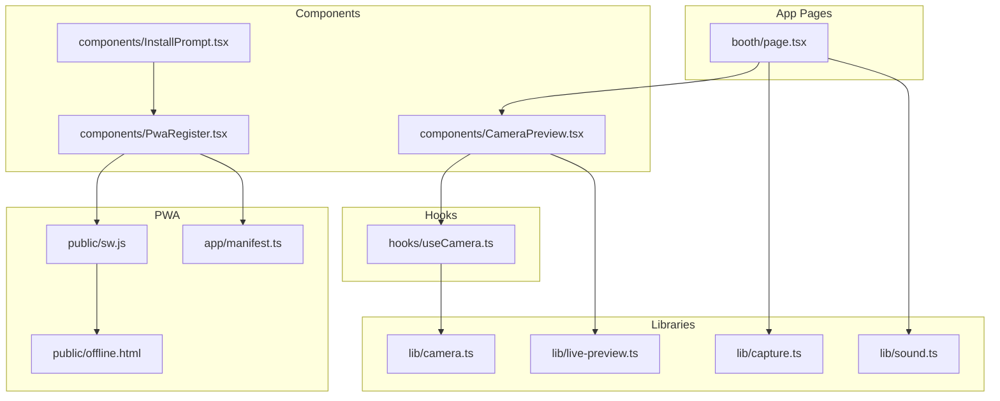
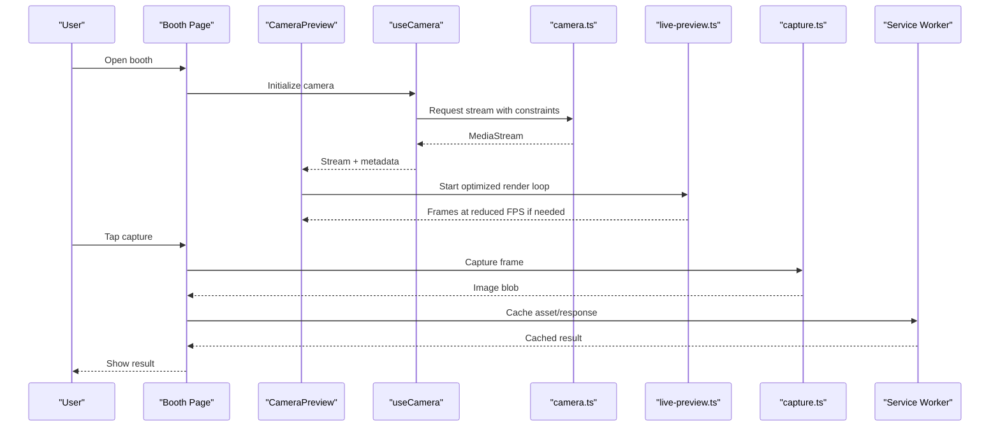
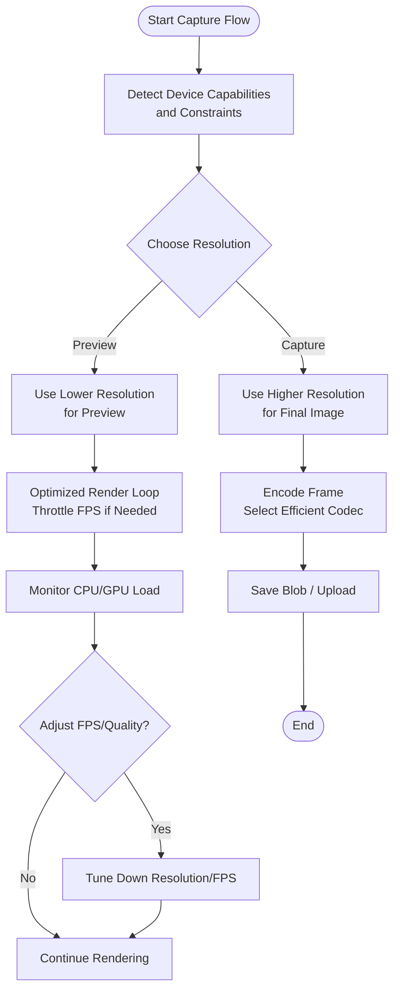
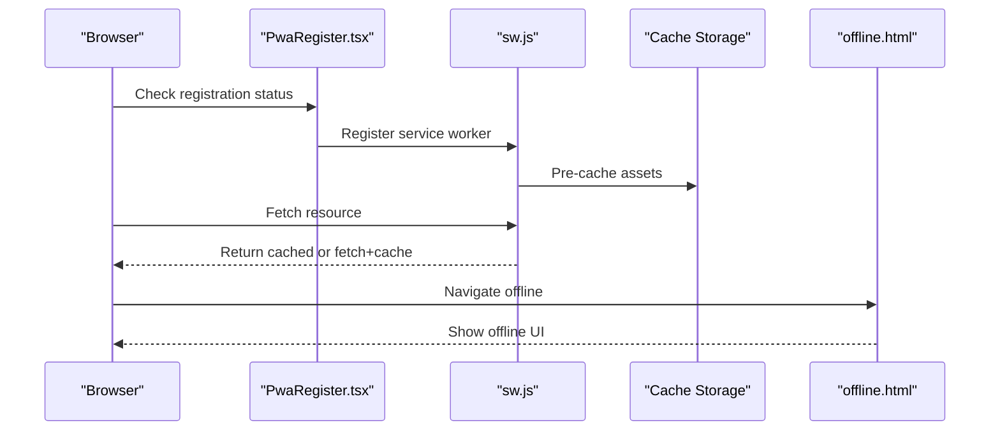
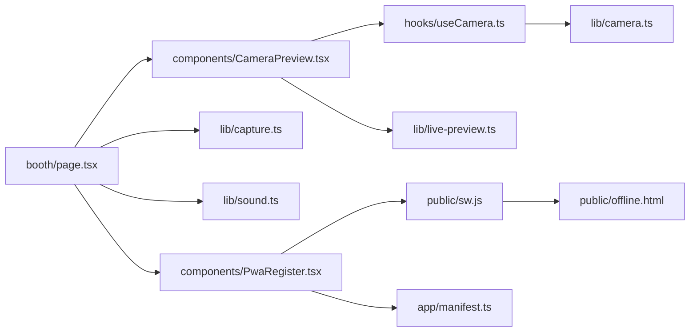

# Mobile Optimization

<cite>
**Referenced Files in This Document**
- [CameraPreview.tsx](file://components/CameraPreview.tsx)
- [useCamera.ts](file://hooks/useCamera.ts)
- [camera.ts](file://lib/camera.ts)
- [capture.ts](file://lib/capture.ts)
- [live-preview.ts](file://lib/live-preview.ts)
- [sound.ts](file://lib/sound.ts)
- [InstallPrompt.tsx](file://components/InstallPrompt.tsx)
- [PwaRegister.tsx](file://components/PwaRegister.tsx)
- [sw.js](file://public/sw.js)
- [offline.html](file://public/offline.html)
- [manifest.ts](file://app/manifest.ts)
- [booth/page.tsx](file://app/booth/page.tsx)
- [next.config.ts](file://next.config.ts)
</cite>

## Table of Contents
1. [Introduction](#introduction)
2. [Project Structure](#project-structure)
3. [Core Components](#core-components)
4. [Architecture Overview](#architecture-overview)
5. [Detailed Component Analysis](#detailed-component-analysis)
6. [Dependency Analysis](#dependency-analysis)
7. [Performance Considerations](#performance-considerations)
8. [Troubleshooting Guide](#troubleshooting-guide)
9. [Conclusion](#conclusion)
10. [Appendices](#appendices)

## Introduction
This document provides a comprehensive guide to mobile performance optimization for the photobooth application. It focuses on camera capture optimizations (resolution scaling, format selection, battery-conscious modes), sound management for mobile audio feedback and background music, PWA capabilities (service worker caching, offline functionality, install prompts), thermal throttling mitigation, CPU usage optimization, responsive image loading, touch-optimized interactions, and mobile-specific performance monitoring. Practical examples and testing guidelines are included to help you validate performance across devices and network conditions.

## Project Structure
The photobooth app is built with Next.js and organizes mobile-critical logic into focused modules:
- Camera and capture pipeline: hooks and libraries for media stream handling, preview rendering, and capture operations
- Audio subsystem: centralized sound utilities for feedback and music
- PWA layer: manifest, service worker, offline page, and install prompt components
- UI pages: booth experience that orchestrates camera, capture, and effects

**Diagram sources**
- [booth/page.tsx](file://app/booth/page.tsx)
- [CameraPreview.tsx](file://components/CameraPreview.tsx)
- [useCamera.ts](file://hooks/useCamera.ts)
- [camera.ts](file://lib/camera.ts)
- [live-preview.ts](file://lib/live-preview.ts)
- [capture.ts](file://lib/capture.ts)
- [sound.ts](file://lib/sound.ts)
- [InstallPrompt.tsx](file://components/InstallPrompt.tsx)
- [PwaRegister.tsx](file://components/PwaRegister.tsx)
- [sw.js](file://public/sw.js)
- [offline.html](file://public/offline.html)
- [manifest.ts](file://app/manifest.ts)

**Section sources**
- [booth/page.tsx](file://app/booth/page.tsx)
- [CameraPreview.tsx](file://components/CameraPreview.tsx)
- [useCamera.ts](file://hooks/useCamera.ts)
- [camera.ts](file://lib/camera.ts)
- [live-preview.ts](file://lib/live-preview.ts)
- [capture.ts](file://lib/capture.ts)
- [sound.ts](file://lib/sound.ts)
- [InstallPrompt.tsx](file://components/InstallPrompt.tsx)
- [PwaRegister.tsx](file://components/PwaRegister.tsx)
- [sw.js](file://public/sw.js)
- [offline.html](file://public/offline.html)
- [manifest.ts](file://app/manifest.ts)

## Core Components
- Camera preview and capture: The camera hook and preview component coordinate device media streams, resolution/format selection, and efficient canvas rendering. Capture logic handles encoding and memory management.
- Live preview: Optimizes frame delivery to the canvas, minimizing layout thrash and reflows.
- Sound: Centralized audio utilities manage short feedback sounds and optional background music with volume control and auto-pause strategies.
- PWA: Service worker caches assets and API responses; offline page provides graceful fallback; install prompt guides users to add to home screen.

Key responsibilities and integration points:
- useCamera.ts: Initializes MediaStream, selects constraints, exposes stream and metadata
- CameraPreview.tsx: Renders video or canvas, applies filters, manages resize and draw loops
- camera.ts: Low-level helpers for constraints, format negotiation, and device capability detection
- capture.ts: Encodes frames, chooses codecs/formats, and writes output
- live-preview.ts: Throttles/drops frames as needed, uses requestAnimationFrame efficiently
- sound.ts: Plays feedback, manages audio context lifecycle, and controls background music
- sw.js: Caching strategy for static assets and runtime data
- PwaRegister.tsx and InstallPrompt.tsx: Handle registration and user prompts
- manifest.ts: Defines app metadata for installation and display mode

**Section sources**
- [useCamera.ts](file://hooks/useCamera.ts)
- [CameraPreview.tsx](file://components/CameraPreview.tsx)
- [camera.ts](file://lib/camera.ts)
- [capture.ts](file://lib/capture.ts)
- [live-preview.ts](file://lib/live-preview.ts)
- [sound.ts](file://lib/sound.ts)
- [sw.js](file://public/sw.js)
- [PwaRegister.tsx](file://components/PwaRegister.tsx)
- [InstallPrompt.tsx](file://components/InstallPrompt.tsx)
- [manifest.ts](file://app/manifest.ts)

## Architecture Overview
The mobile capture pipeline is designed to minimize CPU and GPU load while maintaining responsiveness:
- Media stream acquisition with adaptive constraints based on device capabilities
- Preview rendering via offscreen-friendly techniques and controlled frame rate
- Capture path optimized for mobile codecs and memory footprint
- PWA caching ensures fast cold starts and offline resilience
- Sound system avoids blocking the main thread and respects power-saving modes

**Diagram sources**
- [booth/page.tsx](file://app/booth/page.tsx)
- [CameraPreview.tsx](file://components/CameraPreview.tsx)
- [useCamera.ts](file://hooks/useCamera.ts)
- [camera.ts](file://lib/camera.ts)
- [live-preview.ts](file://lib/live-preview.ts)
- [capture.ts](file://lib/capture.ts)
- [sw.js](file://public/sw.js)

## Detailed Component Analysis

### Camera and Capture Pipeline
Mobile camera optimization focuses on:
- Resolution scaling: Dynamically select lower resolutions for preview and higher only for final capture when necessary
- Format selection: Prefer efficient codecs (e.g., VP8/VP9/H.264) and container formats supported by target devices
- Battery-conscious capture: Reduce frame rate during preview, pause processing when not visible, and avoid unnecessary encodings

Implementation highlights:
- Constraint negotiation and capability checks ensure stable streams across devices
- Canvas-based preview minimizes DOM updates and leverages efficient drawing paths
- Capture path chooses appropriate quality and size to balance fidelity and memory

**Diagram sources**
- [camera.ts](file://lib/camera.ts)
- [capture.ts](file://lib/capture.ts)
- [live-preview.ts](file://lib/live-preview.ts)

**Section sources**
- [camera.ts](file://lib/camera.ts)
- [capture.ts](file://lib/capture.ts)
- [live-preview.ts](file://lib/live-preview.ts)
- [useCamera.ts](file://hooks/useCamera.ts)
- [CameraPreview.tsx](file://components/CameraPreview.tsx)

### Sound Management for Mobile
Mobile audio requires careful handling to avoid interruptions and conserve battery:
- Short feedback sounds should be preloaded and played via lightweight APIs
- Background music must respect user gestures, system mute, and power-saving modes
- Audio contexts should be created lazily and paused when the tab is hidden

Best practices:
- Defer audio initialization until first user interaction
- Use Web Audio API for precise control and low-latency playback
- Implement automatic volume reduction or pausing when other apps play audio

**Section sources**
- [sound.ts](file://lib/sound.ts)

### PWA Optimizations
A robust PWA improves perceived performance and reliability:
- Service worker caching: Pre-cache critical assets and apply intelligent runtime caching for dynamic content
- Offline functionality: Provide an offline page and cache essential resources so core features remain usable
- Install prompts: Guide users to install the app for full-screen, launch-like behavior

Key files:
- sw.js defines caching strategies and offline fallbacks
- offline.html serves as the fallback page
- manifest.ts configures app metadata for installation
- InstallPrompt.tsx and PwaRegister.tsx orchestrate user prompts and registration

**Diagram sources**
- [PwaRegister.tsx](file://components/PwaRegister.tsx)
- [sw.js](file://public/sw.js)
- [offline.html](file://public/offline.html)
- [manifest.ts](file://app/manifest.ts)

**Section sources**
- [sw.js](file://public/sw.js)
- [offline.html](file://public/offline.html)
- [manifest.ts](file://app/manifest.ts)
- [InstallPrompt.tsx](file://components/InstallPrompt.tsx)
- [PwaRegister.tsx](file://components/PwaRegister.tsx)

### Touch-Optimized Interactions
To deliver smooth mobile UX:
- Use large tap targets and avoid hover-dependent interactions
- Implement gesture handling that respects native behaviors (scrolling, zooming)
- Debounce rapid taps and prevent default browser actions where appropriate

Integration points:
- Camera preview and capture buttons should be accessible and responsive
- Avoid heavy computations on the main thread during touch events

**Section sources**
- [CameraPreview.tsx](file://components/CameraPreview.tsx)
- [booth/page.tsx](file://app/booth/page.tsx)

### Responsive Image Loading
Optimize images for mobile networks and screens:
- Serve appropriately sized images using srcset and sizes attributes
- Lazy-load non-critical images and defer heavy processing
- Use modern formats (WebP/AVIF) when supported

Where to apply:
- Filter thumbnails and sticker assets
- Captured photo previews before upload

**Section sources**
- [booth/page.tsx](file://app/booth/page.tsx)

## Dependency Analysis
The following diagram shows how key modules depend on each other within the mobile optimization scope:

**Diagram sources**
- [booth/page.tsx](file://app/booth/page.tsx)
- [CameraPreview.tsx](file://components/CameraPreview.tsx)
- [useCamera.ts](file://hooks/useCamera.ts)
- [camera.ts](file://lib/camera.ts)
- [live-preview.ts](file://lib/live-preview.ts)
- [capture.ts](file://lib/capture.ts)
- [sound.ts](file://lib/sound.ts)
- [PwaRegister.tsx](file://components/PwaRegister.tsx)
- [sw.js](file://public/sw.js)
- [manifest.ts](file://app/manifest.ts)
- [offline.html](file://public/offline.html)

**Section sources**
- [booth/page.tsx](file://app/booth/page.tsx)
- [CameraPreview.tsx](file://components/CameraPreview.tsx)
- [useCamera.ts](file://hooks/useCamera.ts)
- [camera.ts](file://lib/camera.ts)
- [live-preview.ts](file://lib/live-preview.ts)
- [capture.ts](file://lib/capture.ts)
- [sound.ts](file://lib/sound.ts)
- [PwaRegister.tsx](file://components/PwaRegister.tsx)
- [sw.js](file://public/sw.js)
- [manifest.ts](file://app/manifest.ts)
- [offline.html](file://public/offline.html)

## Performance Considerations
- Thermal throttling mitigation:
  - Reduce preview FPS dynamically based on device temperature indicators or sustained high CPU usage
  - Pause non-essential work (filters, stickers) when the device is hot
  - Limit simultaneous operations (avoid concurrent encode/upload)
- CPU usage optimization:
  - Offload heavy tasks to Web Workers where feasible
  - Batch DOM updates and avoid layout thrashing
  - Use requestAnimationFrame judiciously and cancel animations when offscreen
- Memory management:
  - Reuse buffers for capture and preview
  - Release MediaStream resources when no longer needed
  - Avoid retaining large blobs in memory longer than necessary
- Network efficiency:
  - Leverage service worker caching for repeat visits
  - Compress uploads and use progressive loading for large assets

[No sources needed since this section provides general guidance]

## Troubleshooting Guide
Common mobile issues and remedies:
- Camera fails to start:
  - Verify permissions and check device constraints compatibility
  - Fallback to lower resolution or different codec if negotiation fails
- Janky preview or dropped frames:
  - Reduce FPS and resolution; ensure rendering happens off the main thread where possible
- Excessive battery drain:
  - Stop preview when tab is hidden; avoid continuous capture loops
- PWA not installing:
  - Validate manifest fields and ensure HTTPS; confirm service worker registration succeeds
- Offline errors:
  - Confirm cache keys and fallback routes; verify offline.html is served correctly

**Section sources**
- [camera.ts](file://lib/camera.ts)
- [live-preview.ts](file://lib/live-preview.ts)
- [sw.js](file://public/sw.js)
- [offline.html](file://public/offline.html)

## Conclusion
By implementing adaptive camera constraints, efficient preview rendering, mindful audio handling, and robust PWA caching, the photobooth app can deliver a smooth, reliable mobile experience even under challenging conditions. Continuous monitoring and testing across devices and networks will help maintain performance as hardware and OS behaviors evolve.

[No sources needed since this section summarizes without analyzing specific files]

## Appendices

### Practical Examples
- Responsive image loading:
  - Use srcset and sizes to serve optimal images per viewport
  - Lazy-load below-the-fold assets to reduce initial load time
- Touch-optimized interactions:
  - Ensure tap targets meet minimum size guidelines
  - Prevent default browser gestures that conflict with app interactions
- Mobile-specific performance monitoring:
  - Track FPS, CPU usage, and memory via performance APIs
  - Log capture latency and encoding times to identify bottlenecks

[No sources needed since this section provides general guidance]

### Testing Guidelines
- Device matrix:
  - Test on low-end Android phones, mid-range iOS devices, and tablets
  - Validate camera permissions, orientation changes, and back/front cameras
- Network conditions:
  - Simulate slow 3G and high-latency environments
  - Verify offline behavior and cache invalidation
- Power considerations:
  - Run tests with battery saver enabled
  - Observe thermal throttling impacts and adjust strategies accordingly

[No sources needed since this section provides general guidance]