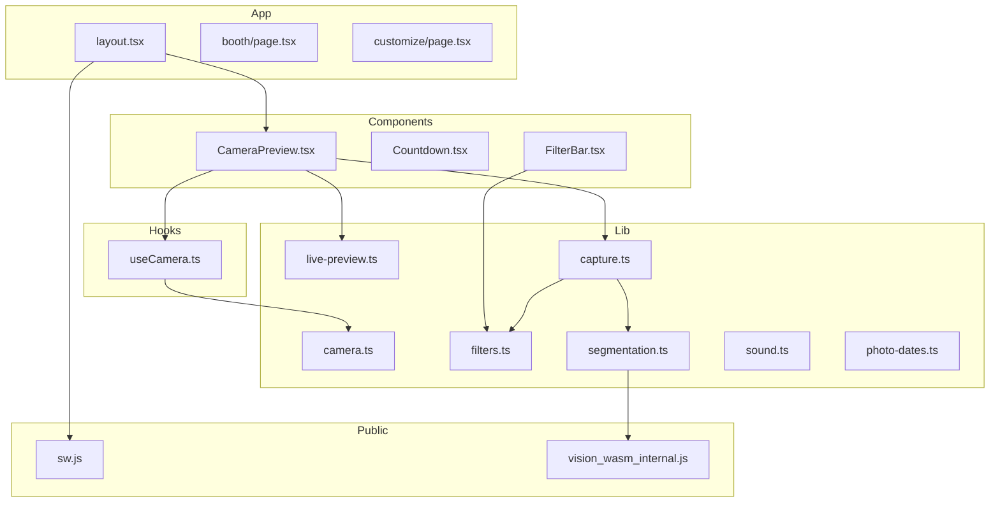
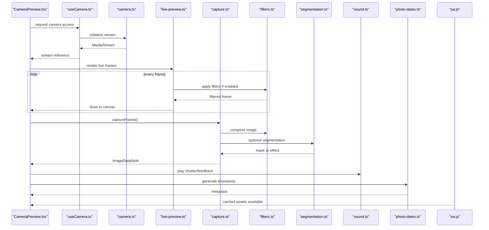
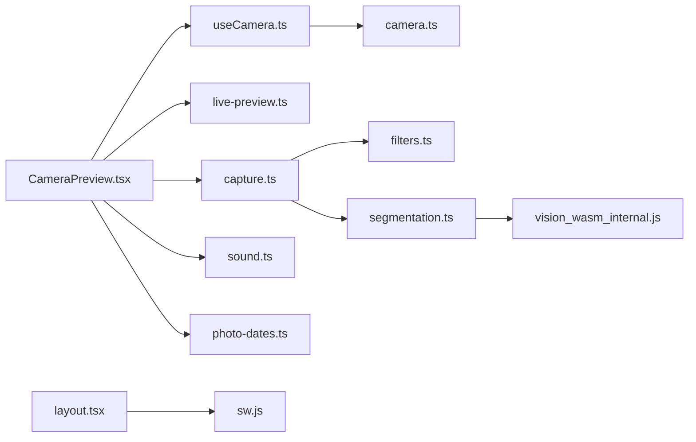

# Performance Optimization

<cite>
**Referenced Files in This Document**
- [next.config.ts](file://next.config.ts)
- [package.json](file://package.json)
- [app/layout.tsx](file://app/layout.tsx)
- [components/CameraPreview.tsx](file://components/CameraPreview.tsx)
- [hooks/useCamera.ts](file://hooks/useCamera.ts)
- [lib/live-preview.ts](file://lib/live-preview.ts)
- [lib/camera.ts](file://lib/camera.ts)
- [lib/capture.ts](file://lib/capture.ts)
- [lib/sound.ts](file://lib/sound.ts)
- [lib/photo-dates.ts](file://lib/photo-dates.ts)
- [public/sw.js](file://public/sw.js)
- [components/Countdown.tsx](file://components/Countdown.tsx)
- [components/FilterBar.tsx](file://components/FilterBar.tsx)
- [lib/filters.ts](file://lib/filters.ts)
- [lib/compose.ts](file://lib/compose.ts)
- [lib/segmentation.ts](file://lib/segmentation.ts)
- [public/mediapipe/wasm/vision_wasm_internal.js](file://public/mediapipe/wasm/vision_wasm_internal.js)
</cite>

## Table of Contents
1. [Introduction](#introduction)
2. [Project Structure](#project-structure)
3. [Core Components](#core-components)
4. [Architecture Overview](#architecture-overview)
5. [Detailed Component Analysis](#detailed-component-analysis)
6. [Dependency Analysis](#dependency-analysis)
7. [Performance Considerations](#performance Considerations)
8. [Troubleshooting Guide](#troubleshooting-guide)
9. [Conclusion](#conclusion)
10. [Appendices](#appendices)

## Introduction
This document provides performance optimization strategies for the photobooth application, focusing on Next.js configuration, live preview and camera streams, canvas operations, sound management, date/time handling, mobile considerations, and profiling techniques. It is designed to be accessible to both developers and non-technical readers while providing actionable guidance grounded in the codebase.

## Project Structure
The project follows a Next.js App Router layout with feature-oriented directories:
- app/: Routes and layouts
- components/: Reusable UI components (camera preview, countdown, filters)
- hooks/: Custom React hooks (camera lifecycle)
- lib/: Core logic modules (camera, capture, filters, segmentation, sound, dates)
- public/: Static assets including service worker and MediaPipe WASM binaries

**Diagram sources**
- [app/layout.tsx](file://app/layout.tsx)
- [components/CameraPreview.tsx](file://components/CameraPreview.tsx)
- [hooks/useCamera.ts](file://hooks/useCamera.ts)
- [lib/camera.ts](file://lib/camera.ts)
- [lib/live-preview.ts](file://lib/live-preview.ts)
- [lib/capture.ts](file://lib/capture.ts)
- [lib/filters.ts](file://lib/filters.ts)
- [lib/segmentation.ts](file://lib/segmentation.ts)
- [public/sw.js](file://public/sw.js)
- [public/mediapipe/wasm/vision_wasm_internal.js](file://public/mediapipe/wasm/vision_wasm_internal.js)

**Section sources**
- [next.config.ts](file://next.config.ts)
- [package.json](file://package.json)
- [app/layout.tsx](file://app/layout.tsx)

## Core Components
Key performance-sensitive areas:
- Camera stream and live preview rendering
- Canvas-based capture and filter composition
- Audio feedback and background music
- Timestamping and session timing
- Service worker caching and offline behavior

**Section sources**
- [components/CameraPreview.tsx](file://components/CameraPreview.tsx)
- [hooks/useCamera.ts](file://hooks/useCamera.ts)
- [lib/live-preview.ts](file://lib/live-preview.ts)
- [lib/camera.ts](file://lib/camera.ts)
- [lib/capture.ts](file://lib/capture.ts)
- [lib/filters.ts](file://lib/filters.ts)
- [lib/sound.ts](file://lib/sound.ts)
- [lib/photo-dates.ts](file://lib/photo-dates.ts)
- [public/sw.js](file://public/sw.js)

## Architecture Overview
The photobooth pipeline captures media from the device camera, applies real-time effects, composes final images, and manages audio and metadata. The service worker caches static assets and preloads critical resources.

**Diagram sources**
- [components/CameraPreview.tsx](file://components/CameraPreview.tsx)
- [hooks/useCamera.ts](file://hooks/useCamera.ts)
- [lib/camera.ts](file://lib/camera.ts)
- [lib/live-preview.ts](file://lib/live-preview.ts)
- [lib/capture.ts](file://lib/capture.ts)
- [lib/filters.ts](file://lib/filters.ts)
- [lib/segmentation.ts](file://lib/segmentation.ts)
- [lib/sound.ts](file://lib/sound.ts)
- [lib/photo-dates.ts](file://lib/photo-dates.ts)
- [public/sw.js](file://public/sw.js)

## Detailed Component Analysis

### Next.js Configuration Optimizations
- Image optimization: Configure Next.js image domains, formats, and sizes to reduce payload and improve load times.
- Bundle analysis: Use built-in or third-party tools to identify heavy dependencies and remove unused code.
- Code splitting: Ensure route-level and component-level splitting; avoid large synchronous imports in critical paths.
- Runtime and build flags: Enable only necessary features and disable development-only code in production builds.

Practical steps:
- Define allowed image domains and optimize formats via Next.js config.
- Add bundle analyzer scripts to package.json and run them during CI.
- Prefer dynamic imports for heavy libraries (e.g., segmentation models).
- Set environment variables to control logging and debug features in production.

**Section sources**
- [next.config.ts](file://next.config.ts)
- [package.json](file://package.json)

### Live Preview Optimization Techniques
Goals: maintain smooth frame rates, minimize CPU/GPU usage, and prevent memory leaks.

Recommendations:
- Throttle frame processing: process every Nth frame instead of every frame when filters are active.
- Offload heavy work: use Web Workers for segmentation or complex filters.
- Reuse canvases: keep a single offscreen canvas per resolution to avoid allocation churn.
- Stream constraints: prefer hardware-accelerated codecs and appropriate resolutions for devices.
- Debounce user interactions: delay filter changes until the next idle frame.

Implementation anchors:
- Camera stream lifecycle and constraints in the hook and camera module.
- Live preview loop and drawing logic.
- Filter application pipeline.

**Section sources**
- [hooks/useCamera.ts](file://hooks/useCamera.ts)
- [lib/camera.ts](file://lib/camera.ts)
- [lib/live-preview.ts](file://lib/live-preview.ts)
- [components/CameraPreview.tsx](file://components/CameraPreview.tsx)

### Canvas Operations and Capture Pipeline
Focus areas:
- Efficient pixel manipulation: batch operations and avoid unnecessary copies.
- Memory management: clear references to ImageData after use; reuse buffers.
- Composition strategy: precompute static overlays and masks.

Optimization tactics:
- Use Uint8ClampedArray views for pixel data.
- Avoid re-creating filter kernels; cache them per filter type.
- Limit segmentation runs to capture time or explicit triggers.

**Section sources**
- [lib/capture.ts](file://lib/capture.ts)
- [lib/filters.ts](file://lib/filters.ts)
- [lib/segmentation.ts](file://lib/segmentation.ts)

### Sound Management Strategies
Objectives: low-latency feedback, minimal startup cost, and battery-friendly playback.

Guidelines:
- Preload short sounds and use AudioBufferSourceNode for immediate playback.
- Defer background music initialization until user gesture.
- Pause or mute audio when tab is hidden or stream stops.
- Normalize volume levels across devices.

**Section sources**
- [lib/sound.ts](file://lib/sound.ts)

### Date/Time Handling Optimizations
Use cases: photo timestamps, session timers, and retention policies.

Best practices:
- Centralize timezone and formatting utilities to avoid repeated computations.
- Cache formatted timestamps for display-heavy lists.
- Use high-resolution timers for session timing where needed.

**Section sources**
- [lib/photo-dates.ts](file://lib/photo-dates.ts)

### Service Worker and Caching
- Cache static assets and critical fonts/icons.
- Pre-cache model files used by segmentation to reduce first-run latency.
- Implement stale-while-revalidate for API responses.

**Section sources**
- [public/sw.js](file://public/sw.js)

### Mobile Performance Considerations
Battery and thermal throttling mitigation:
- Reduce frame rate on low-power devices using device capability checks.
- Lower canvas resolution dynamically based on screen size and device class.
- Avoid continuous heavy computation; schedule tasks during idle periods.
- Minimize wake locks; release camera and audio when not in use.

[No sources needed since this section provides general guidance]

### Profiling Techniques
Tools and methods:
- Chrome DevTools Performance tab: record long tasks, identify main-thread bottlenecks.
- Memory snapshots: detect retained objects and potential leaks in camera streams and canvases.
- Network panel: verify asset sizes, caching headers, and preload effectiveness.
- Performance APIs: use mark/measure and navigation timing to track key metrics.

[No sources needed since this section provides general guidance]

## Dependency Analysis
High-level dependency relationships among core modules:

**Diagram sources**
- [components/CameraPreview.tsx](file://components/CameraPreview.tsx)
- [hooks/useCamera.ts](file://hooks/useCamera.ts)
- [lib/camera.ts](file://lib/camera.ts)
- [lib/live-preview.ts](file://lib/live-preview.ts)
- [lib/capture.ts](file://lib/capture.ts)
- [lib/filters.ts](file://lib/filters.ts)
- [lib/segmentation.ts](file://lib/segmentation.ts)
- [public/mediapipe/wasm/vision_wasm_internal.js](file://public/mediapipe/wasm/vision_wasm_internal.js)
- [lib/sound.ts](file://lib/sound.ts)
- [lib/photo-dates.ts](file://lib/photo-dates.ts)
- [app/layout.tsx](file://app/layout.tsx)
- [public/sw.js](file://public/sw.js)

**Section sources**
- [components/CameraPreview.tsx](file://components/CameraPreview.tsx)
- [hooks/useCamera.ts](file://hooks/useCamera.ts)
- [lib/camera.ts](file://lib/camera.ts)
- [lib/live-preview.ts](file://lib/live-preview.ts)
- [lib/capture.ts](file://lib/capture.ts)
- [lib/filters.ts](file://lib/filters.ts)
- [lib/segmentation.ts](file://lib/segmentation.ts)
- [lib/sound.ts](file://lib/sound.ts)
- [lib/photo-dates.ts](file://lib/photo-dates.ts)
- [app/layout.tsx](file://app/layout.tsx)
- [public/sw.js](file://public/sw.js)

## Performance Considerations
- Prioritize main-thread efficiency: keep frame loops lightweight and defer non-critical work.
- Reduce allocations: reuse buffers, arrays, and DOM nodes.
- Leverage GPU acceleration: prefer CSS transforms and compositor-friendly properties.
- Monitor memory growth: set up periodic checks and force cleanup when thresholds are exceeded.
- Optimize network: enable HTTP/2, compress assets, and leverage caching strategies.

[No sources needed since this section provides general guidance]

## Troubleshooting Guide
Common issues and remedies:
- Janky preview: lower resolution, skip frames, or disable heavy filters temporarily.
- Memory leaks: ensure camera streams are stopped and canvases cleared on unmount.
- Audio glitches: check for multiple concurrent sources and normalize playback paths.
- Slow capture: profile segmentation and filter pipelines; consider running off-main-thread.
- Stale assets: validate service worker cache invalidation and versioning.

**Section sources**
- [hooks/useCamera.ts](file://hooks/useCamera.ts)
- [lib/live-preview.ts](file://lib/live-preview.ts)
- [lib/capture.ts](file://lib/capture.ts)
- [lib/sound.ts](file://lib/sound.ts)
- [public/sw.js](file://public/sw.js)

## Conclusion
By applying targeted optimizations across configuration, live preview, canvas operations, audio, and caching, the photobooth can deliver responsive, battery-friendly experiences on all devices. Continuous profiling and monitoring will help sustain performance as features evolve.

[No sources needed since this section summarizes without analyzing specific files]

## Appendices

### Practical Examples and Checklists
- Bundle analysis workflow: add script, run locally and in CI, review top consumers, split or lazy-load.
- Live preview checklist: frame throttling, canvas reuse, worker offloading, resource cleanup.
- Sound checklist: preload small cues, defer background tracks, pause on visibility change.
- Date/time checklist: centralize formatting, cache results, use precise timers for sessions.
- Mobile checklist: adaptive resolution, power-aware scheduling, release locks promptly.

[No sources needed since this section provides general guidance]