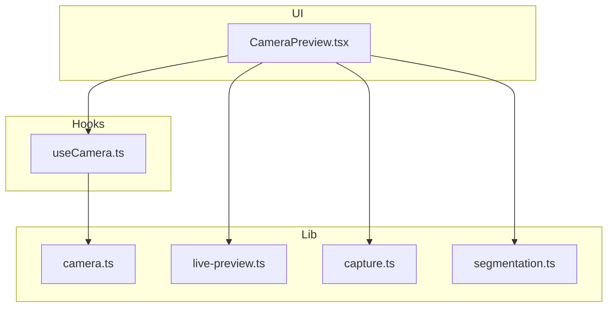
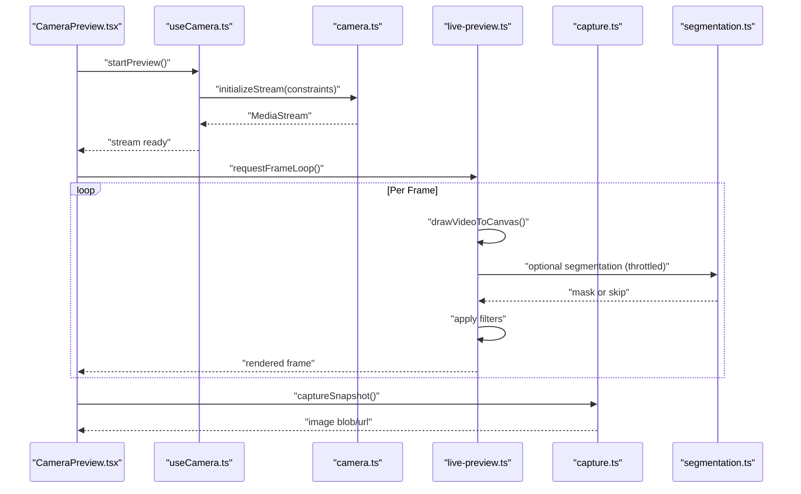
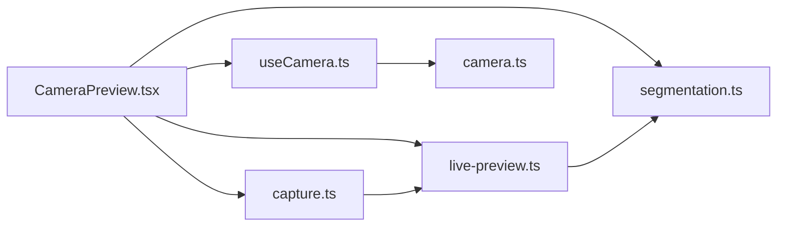

# Camera Stream Optimization

<cite>
**Referenced Files in This Document**
- [CameraPreview.tsx](file://components/CameraPreview.tsx)
- [useCamera.ts](file://hooks/useCamera.ts)
- [camera.ts](file://lib/camera.ts)
- [capture.ts](file://lib/capture.ts)
- [live-preview.ts](file://lib/live-preview.ts)
- [segmentation.ts](file://lib/segmentation.ts)
</cite>

## Table of Contents
1. [Introduction](#introduction)
2. [Project Structure](#project-structure)
3. [Core Components](#core-components)
4. [Architecture Overview](#architecture-overview)
5. [Detailed Component Analysis](#detailed-component-analysis)
6. [Dependency Analysis](#dependency-analysis)
7. [Performance Considerations](#performance-considerations)
8. [Troubleshooting Guide](#troubleshooting-guide)
9. [Conclusion](#conclusion)

## Introduction
This document explains how the photobooth application optimizes real-time camera streams across devices and browsers. It covers resolution scaling, frame rate management, bandwidth adaptation, MediaStream API optimizations, efficient canvas rendering, memory management, requestAnimationFrame usage, DOM manipulation patterns, mobile-specific considerations (touch events, battery reduction), and device capability detection. The guidance is grounded in the project’s camera-related modules and components.

## Project Structure
The camera pipeline spans UI components, hooks, and library utilities:
- UI layer: a React component that renders the live preview and integrates filters and overlays.
- Hook layer: encapsulates MediaStream lifecycle, constraints, and state for preview.
- Library layer: handles stream initialization, capture, live preview compositing, segmentation, and filter application.

**Diagram sources**
- [CameraPreview.tsx](file://components/CameraPreview.tsx)
- [useCamera.ts](file://hooks/useCamera.ts)
- [camera.ts](file://lib/camera.ts)
- [live-preview.ts](file://lib/live-preview.ts)
- [capture.ts](file://lib/capture.ts)
- [segmentation.ts](file://lib/segmentation.ts)

**Section sources**
- [CameraPreview.tsx](file://components/CameraPreview.tsx)
- [useCamera.ts](file://hooks/useCamera.ts)
- [camera.ts](file://lib/camera.ts)
- [live-preview.ts](file://lib/live-preview.ts)
- [capture.ts](file://lib/capture.ts)
- [segmentation.ts](file://lib/segmentation.ts)

## Core Components
- CameraPreview: Renders the video feed, applies filters/overlays, manages user interactions, and coordinates capture.
- useCamera: Encapsulates MediaStream creation, constraint negotiation, permission handling, and lifecycle management.
- camera: Low-level helpers for stream setup, track controls, and device enumeration.
- live-preview: Optimizes per-frame composition on canvas with minimal allocations.
- capture: Handles snapshot extraction, resizing, and encoding strategies.
- segmentation: Optional background processing using WebAssembly models; used conditionally to preserve performance.

Key optimization responsibilities:
- Resolution and FPS selection based on device capabilities and network conditions.
- Efficient canvas drawing with offscreen canvases and image data reuse.
- Throttling heavy operations (e.g., segmentation) to maintain smooth preview.
- Memory-safe patterns to avoid leaks during stream start/stop and filter changes.

**Section sources**
- [CameraPreview.tsx](file://components/CameraPreview.tsx)
- [useCamera.ts](file://hooks/useCamera.ts)
- [camera.ts](file://lib/camera.ts)
- [live-preview.ts](file://lib/live-preview.ts)
- [capture.ts](file://lib/capture.ts)
- [segmentation.ts](file://lib/segmentation.ts)

## Architecture Overview
The camera pipeline follows a layered approach:
- UI triggers actions (start/stop preview, apply filters, capture).
- Hook manages MediaStream lifecycle and exposes normalized state.
- Lib modules perform heavy lifting: stream control, frame compositing, capture, and optional segmentation.

**Diagram sources**
- [CameraPreview.tsx](file://components/CameraPreview.tsx)
- [useCamera.ts](file://hooks/useCamera.ts)
- [camera.ts](file://lib/camera.ts)
- [live-preview.ts](file://lib/live-preview.ts)
- [capture.ts](file://lib/capture.ts)
- [segmentation.ts](file://lib/segmentation.ts)

## Detailed Component Analysis

### CameraPreview Component
Responsibilities:
- Mount/unmount media elements safely.
- Bind touch and pointer events optimized for mobile.
- Manage overlay and filter state without re-rendering the entire tree.
- Coordinate capture timing with animation frames.

Optimization highlights:
- Uses requestAnimationFrame to sync updates with display refresh.
- Batches DOM updates via refs and avoids unnecessary re-renders.
- Debounces expensive UI updates while keeping preview responsive.

Practical patterns:
- Smooth preview updates by scheduling draw calls within rAF callbacks.
- Efficient DOM manipulation by updating only changed attributes or styles.
- Error handling for permission denials and unsupported features.

**Section sources**
- [CameraPreview.tsx](file://components/CameraPreview.tsx)

### useCamera Hook
Responsibilities:
- Create and manage MediaStream instances.
- Negotiate constraints (width, height, frameRate, facingMode).
- Handle permissions and fallbacks.
- Expose stream state and controls to consumers.

Optimization highlights:
- Dynamic constraint adjustment based on device capability detection.
- Graceful degradation when high-resolution or high-FPS are unavailable.
- Proper cleanup to release tracks and prevent memory leaks.

Mobile considerations:
- Detects touch-capable devices and adjusts UX accordingly.
- Reduces power consumption by lowering FPS/resolution when idle or on low-power mode.

**Section sources**
- [useCamera.ts](file://hooks/useCamera.ts)

### camera.ts
Responsibilities:
- Enumerate devices and select optimal camera.
- Initialize MediaStream with negotiated constraints.
- Control track settings (brightness, exposure, focus) where supported.

Optimization highlights:
- Chooses best-fit resolution/FPS from available devices.
- Applies constraints incrementally to maximize compatibility.
- Implements error boundaries for getUserMedia failures.

Bandwidth adaptation:
- Monitors throughput and reduces resolution/FPS if needed.
- Provides APIs to switch tracks dynamically without full restart.

**Section sources**
- [camera.ts](file://lib/camera.ts)

### live-preview.ts
Responsibilities:
- Render video frames to canvas efficiently.
- Apply filters and overlays with minimal allocations.
- Optionally integrate segmentation masks.

Optimization highlights:
- Reuses ImageData buffers to reduce GC pressure.
- Uses OffscreenCanvas where available for background processing.
- Skips heavy operations when frame budget is exceeded.

Rendering efficiency:
- Minimizes draw calls by batching operations.
- Avoids layout thrashing by reading/writing geometry in batches.

**Section sources**
- [live-preview.ts](file://lib/live-preview.ts)

### capture.ts
Responsibilities:
- Extract snapshots from the active stream or canvas.
- Resize and encode images for upload or local storage.

Optimization highlights:
- Selects appropriate output size based on target use case.
- Uses efficient encoders and avoids redundant conversions.
- Streams blobs directly to upload pipelines when possible.

Memory management:
- Releases temporary buffers after capture.
- Prevents large object retention by chunking operations.

**Section sources**
- [capture.ts](file://lib/capture.ts)

### segmentation.ts
Responsibilities:
- Run segmentation models (WebAssembly) to generate masks.
- Integrate masks into preview/composition.

Optimization highlights:
- Throttles model inference to maintain smooth preview.
- Runs inference off the main thread when feasible.
- Falls back gracefully when models fail to load.

**Section sources**
- [segmentation.ts](file://lib/segmentation.ts)

## Dependency Analysis
The following diagram shows how components depend on each other and share responsibilities:

**Diagram sources**
- [CameraPreview.tsx](file://components/CameraPreview.tsx)
- [useCamera.ts](file://hooks/useCamera.ts)
- [camera.ts](file://lib/camera.ts)
- [live-preview.ts](file://lib/live-preview.ts)
- [capture.ts](file://lib/capture.ts)
- [segmentation.ts](file://lib/segmentation.ts)

**Section sources**
- [CameraPreview.tsx](file://components/CameraPreview.tsx)
- [useCamera.ts](file://hooks/useCamera.ts)
- [camera.ts](file://lib/camera.ts)
- [live-preview.ts](file://lib/live-preview.ts)
- [capture.ts](file://lib/capture.ts)
- [segmentation.ts](file://lib/segmentation.ts)

## Performance Considerations
Resolution scaling:
- Start with device-appropriate constraints; scale down for lower-end devices.
- Use aspect-ratio-preserving scaling to avoid distortion.
- Dynamically adjust resolution based on screen size and performance metrics.

Frame rate management:
- Target 30 FPS for preview; drop to 15–20 FPS under load.
- Skip frames when CPU/GPU is saturated; prioritize UI responsiveness.

Bandwidth adaptation:
- Monitor network speed and reduce resolution/FPS when bandwidth drops.
- Prefer smaller JPEG/WebP sizes for uploads; defer heavy processing until stable connection.

MediaStream API optimizations:
- Reuse tracks when possible; avoid restarting streams unnecessarily.
- Use getCapabilities() to pick optimal constraints.
- Pause non-visible tracks to save battery.

Canvas rendering efficiency:
- Batch draw operations and minimize readbacks.
- Reuse ImageData and OffscreenCanvas instances.
- Avoid frequent style/layout reads inside render loops.

Memory management:
- Release temporary buffers promptly.
- Nullify references to large objects after use.
- Ensure proper cleanup on unmount to prevent leaks.

requestAnimationFrame usage:
- Schedule all drawing and heavy computations within rAF.
- Measure frame time and throttle work when exceeding budget.

DOM manipulation patterns:
- Update only necessary nodes; prefer refs over re-renders.
- Debounce or throttle event handlers for touch/pointer inputs.

Mobile-specific considerations:
- Optimize touch events: use passive listeners and coalesce rapid taps.
- Reduce battery consumption: lower FPS/resolution, pause when not visible.
- Device capability detection: detect GPU tier, OS, and browser quirks.

[No sources needed since this section provides general guidance]

## Troubleshooting Guide
Common issues and resolutions:
- Permission denied:
  - Ensure HTTPS context and prompt user to allow camera access.
  - Provide clear feedback and retry flow.
- Unsupported constraints:
  - Fall back to safe defaults; log unsupported parameters.
- Poor performance:
  - Reduce resolution/FPS; disable segmentation temporarily.
  - Check for excessive DOM updates or layout thrashing.
- Memory leaks:
  - Verify stream stop and track release on unmount.
  - Clear intervals/timeouts and cancel rAF loops.
- Bandwidth spikes:
  - Implement adaptive bitrate; switch to lower quality automatically.

Error handling strategies:
- Wrap getUserMedia and canvas operations in try/catch blocks.
- Surface user-friendly errors with actionable steps.
- Log diagnostic info (device model, browser version, constraints) for debugging.

**Section sources**
- [useCamera.ts](file://hooks/useCamera.ts)
- [camera.ts](file://lib/camera.ts)
- [live-preview.ts](file://lib/live-preview.ts)
- [capture.ts](file://lib/capture.ts)
- [segmentation.ts](file://lib/segmentation.ts)

## Conclusion
By combining careful MediaStream constraint negotiation, efficient canvas rendering, and thoughtful memory management, the photobooth application delivers smooth, reliable camera previews across diverse devices and browsers. Adaptive strategies for resolution, frame rate, and bandwidth ensure consistent performance, while mobile-specific optimizations reduce battery usage and improve user experience. Following the patterns outlined here will help maintain high-quality real-time streaming even under constrained environments.

[No sources needed since this section summarizes without analyzing specific files]