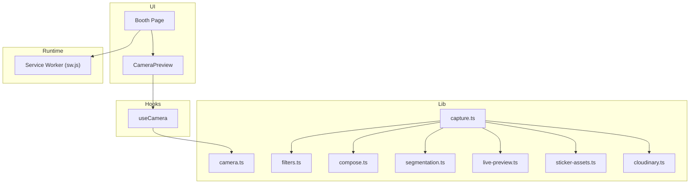
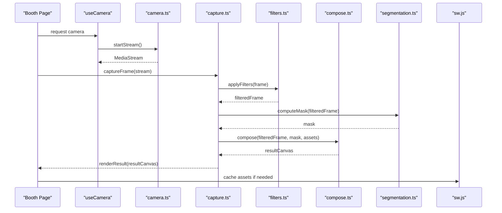
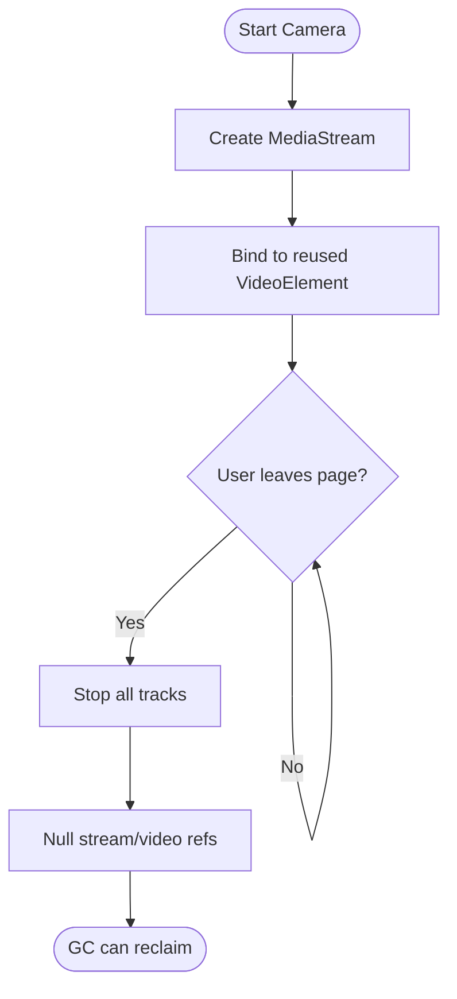
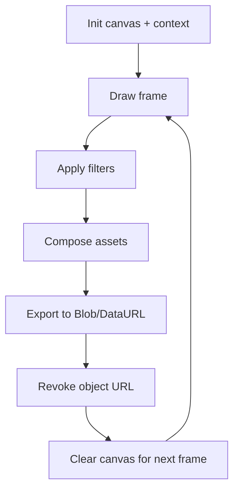
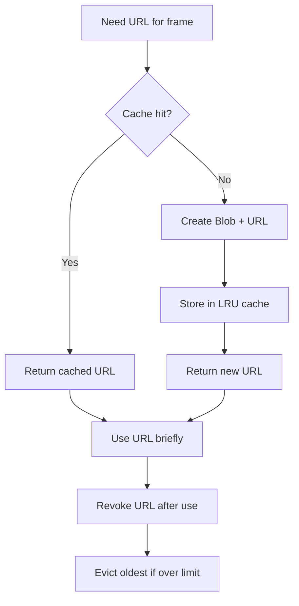
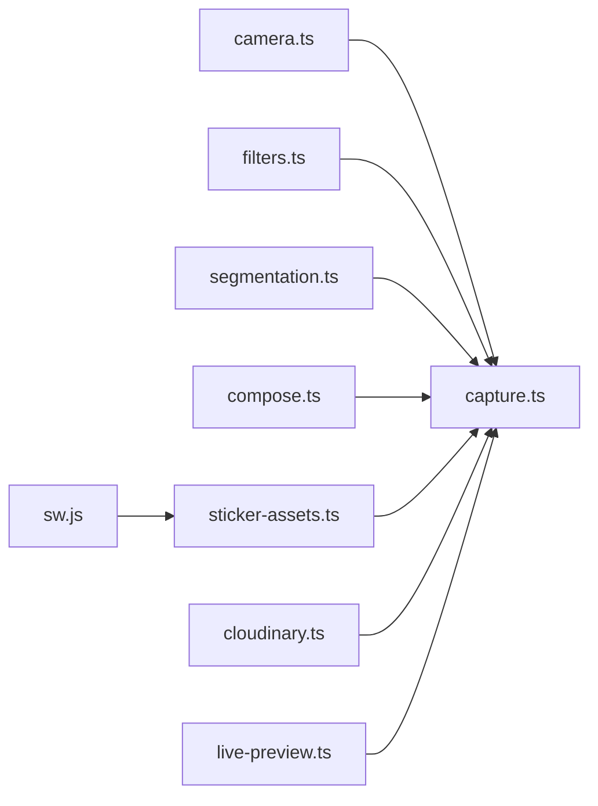

# Memory Management

<cite>
**Referenced Files in This Document**
- [CameraPreview.tsx](file://components/CameraPreview.tsx)
- [useCamera.ts](file://hooks/useCamera.ts)
- [camera.ts](file://lib/camera.ts)
- [capture.ts](file://lib/capture.ts)
- [compose.ts](file://lib/compose.ts)
- [filters.ts](file://lib/filters.ts)
- [segmentation.ts](file://lib/segmentation.ts)
- [live-preview.ts](file://lib/live-preview.ts)
- [sw.js](file://public/sw.js)
- [sticker-assets.ts](file://lib/sticker-assets.ts)
- [cloudinary.ts](file://lib/cloudinary.ts)
- [page.tsx](file://app/booth/page.tsx)
</cite>

## Table of Contents
1. [Introduction](#introduction)
2. [Project Structure](#project-structure)
3. [Core Components](#core-components)
4. [Architecture Overview](#architecture-overview)
5. [Detailed Component Analysis](#detailed-component-analysis)
6. [Dependency Analysis](#dependency-analysis)
7. [Performance Considerations](#performance-considerations)
8. [Troubleshooting Guide](#troubleshooting-guide)
9. [Conclusion](#conclusion)
10. [Appendices](#appendices)

## Introduction
This document explains memory management strategies for the photobooth application with a focus on efficient image processing, canvas cleanup, blob URL lifecycle, and garbage collection best practices. It also covers memory leak prevention patterns in Web Workers and long-running processes, resource disposal, event listener cleanup, mobile constraints, background tab limitations, and caching strategies to minimize memory footprint.

## Project Structure
The photobooth app is organized into UI components, hooks, and library modules that handle camera access, capture, filtering, composition, segmentation, and asset management. The service worker resides under public/sw.js.

**Diagram sources**
- [page.tsx:1-200](file://app/booth/page.tsx#L1-L200)
- [CameraPreview.tsx:1-200](file://components/CameraPreview.tsx#L1-L200)
- [useCamera.ts:1-200](file://hooks/useCamera.ts#L1-L200)
- [camera.ts:1-200](file://lib/camera.ts#L1-L200)
- [capture.ts:1-200](file://lib/capture.ts#L1-L200)
- [filters.ts:1-200](file://lib/filters.ts#L1-L200)
- [compose.ts:1-200](file://lib/compose.ts#L1-L200)
- [segmentation.ts:1-200](file://lib/segmentation.ts#L1-L200)
- [live-preview.ts:1-200](file://lib/live-preview.ts#L1-L200)
- [sticker-assets.ts:1-200](file://lib/sticker-assets.ts#L1-L200)
- [cloudinary.ts:1-200](file://lib/cloudinary.ts#L1-L200)
- [sw.js:1-200](file://public/sw.js#L1-L200)

**Section sources**
- [page.tsx:1-200](file://app/booth/page.tsx#L1-L200)
- [CameraPreview.tsx:1-200](file://components/CameraPreview.tsx#L1-L200)
- [useCamera.ts:1-200](file://hooks/useCamera.ts#L1-L200)
- [camera.ts:1-200](file://lib/camera.ts#L1-L200)
- [capture.ts:1-200](file://lib/capture.ts#L1-L200)
- [filters.ts:1-200](file://lib/filters.ts#L1-L200)
- [compose.ts:1-200](file://lib/compose.ts#L1-L200)
- [segmentation.ts:1-200](file://lib/segmentation.ts#L1-L200)
- [live-preview.ts:1-200](file://lib/live-preview.ts#L1-L200)
- [sticker-assets.ts:1-200](file://lib/sticker-assets.ts#L1-L200)
- [cloudinary.ts:1-200](file://lib/cloudinary.ts#L1-L200)
- [sw.js:1-200](file://public/sw.js#L1-L200)

## Core Components
- Camera stream and device management: handles media streams, track lifecycle, and reconnection logic.
- Capture pipeline: reads frames from the stream, applies filters, composes assets, and writes results to offscreen canvases.
- Segmentation and AI models: loads WASM models and manages their memory lifecycles.
- Asset loaders: preload stickers and textures; manage object URLs and caches.
- Service worker: caches static assets and responses to reduce network and memory pressure.

Key responsibilities for memory:
- Reuse canvases and avoid frequent allocations.
- Explicitly release MediaStream tracks and revoke Blob URLs.
- Dispose of model instances when no longer needed.
- Limit cache sizes and evict least-recently-used entries.

**Section sources**
- [useCamera.ts:1-200](file://hooks/useCamera.ts#L1-L200)
- [camera.ts:1-200](file://lib/camera.ts#L1-L200)
- [capture.ts:1-200](file://lib/capture.ts#L1-L200)
- [filters.ts:1-200](file://lib/filters.ts#L1-L200)
- [compose.ts:1-200](file://lib/compose.ts#L1-L200)
- [segmentation.ts:1-200](file://lib/segmentation.ts#L1-L200)
- [sticker-assets.ts:1-200](file://lib/sticker-assets.ts#L1-L200)
- [sw.js:1-200](file://public/sw.js#L1-L200)

## Architecture Overview
The capture flow uses a streaming pipeline with intermediate buffers and final output rendering. Memory hotspots include frame buffers, filter kernels, segmentation masks, and sticker overlays.

**Diagram sources**
- [page.tsx:1-200](file://app/booth/page.tsx#L1-L200)
- [useCamera.ts:1-200](file://hooks/useCamera.ts#L1-L200)
- [camera.ts:1-200](file://lib/camera.ts#L1-L200)
- [capture.ts:1-200](file://lib/capture.ts#L1-L200)
- [filters.ts:1-200](file://lib/filters.ts#L1-L200)
- [compose.ts:1-200](file://lib/compose.ts#L1-L200)
- [segmentation.ts:1-200](file://lib/segmentation.ts#L1-L200)
- [sw.js:1-200](file://public/sw.js#L1-L200)

## Detailed Component Analysis

### Camera Stream Lifecycle and Track Cleanup
- Start the stream once per session and reuse it across captures.
- On unmount or error, stop all tracks and null references to allow GC.
- Avoid creating new VideoElements per frame; reuse a single element bound to the stream.

**Diagram sources**
- [useCamera.ts:1-200](file://hooks/useCamera.ts#L1-L200)
- [camera.ts:1-200](file://lib/camera.ts#L1-L200)

**Section sources**
- [useCamera.ts:1-200](file://hooks/useCamera.ts#L1-L200)
- [camera.ts:1-200](file://lib/camera.ts#L1-L200)

### Canvas Memory Management
- Use offscreen canvases sized to the target resolution; avoid resizing frequently.
- Clear canvases each frame using a lightweight clear operation before drawing.
- Reuse canvas contexts and ImageBitmaps where possible.
- After exporting to Blob or uploading, revoke object URLs and drop references.

**Diagram sources**
- [capture.ts:1-200](file://lib/capture.ts#L1-L200)
- [filters.ts:1-200](file://lib/filters.ts#L1-L200)
- [compose.ts:1-200](file://lib/compose.ts#L1-L200)

**Section sources**
- [capture.ts:1-200](file://lib/capture.ts#L1-L200)
- [filters.ts:1-200](file://lib/filters.ts#L1-L200)
- [compose.ts:1-200](file://lib/compose.ts#L1-L200)

### Blob URL Management
- Create Blob URLs only when necessary (e.g., preview or upload).
- Immediately revoke after use to free underlying memory.
- Keep a small LRU cache of recent URLs keyed by content hash to avoid duplicates.

**Diagram sources**
- [capture.ts:1-200](file://lib/capture.ts#L1-L200)
- [sticker-assets.ts:1-200](file://lib/sticker-assets.ts#L1-L200)

**Section sources**
- [capture.ts:1-200](file://lib/capture.ts#L1-L200)
- [sticker-assets.ts:1-200](file://lib/sticker-assets.ts#L1-L200)

### Garbage Collection Best Practices
- Break cycles between DOM nodes and closures.
- Nullify large arrays/buffers after processing.
- Avoid storing full-resolution images in state; store thumbnails or references to canvases.
- Debounce heavy operations and batch updates to reduce GC pressure.

[No sources needed since this section provides general guidance]

### Memory Leak Prevention in Web Workers and Long-Running Processes
- Post messages with Transferable objects to move memory instead of copying.
- Close ports and terminate workers when done.
- Avoid global accumulators; reset or replace them periodically.
- Use structured cloning sparingly for large payloads.

[No sources needed since this section provides general guidance]

### Resource Disposal and Event Listener Cleanup
- Remove event listeners on component unmount.
- Stop animations and timers.
- Release model instances and WASM heaps when switching features.

**Section sources**
- [CameraPreview.tsx:1-200](file://components/CameraPreview.tsx#L1-L200)
- [useCamera.ts:1-200](file://hooks/useCamera.ts#L1-L200)

### Mobile Memory Constraints and Background Tab Limitations
- Reduce canvas size on low-memory devices.
- Lower frame rate and disable heavy effects in background tabs.
- Pause non-essential work when visibility changes.

**Section sources**
- [live-preview.ts:1-200](file://lib/live-preview.ts#L1-L200)
- [page.tsx:1-200](file://app/booth/page.tsx#L1-L200)

### Automatic Memory Management in Modern Browsers
- Rely on GC but assist by dropping strong references promptly.
- Prefer Uint8Array/ImageBitmap for pixel data.
- Monitor memory via DevTools and Performance panel.

[No sources needed since this section provides general guidance]

### Caching Strategies for Images and Processed Assets
- Cache stickers and textures in memory with LRU eviction.
- Use IndexedDB for larger assets; keep only keys in memory.
- Preload common assets at startup; lazy-load others.
- Integrate with service worker to cache network responses and static assets.

**Section sources**
- [sticker-assets.ts:1-200](file://lib/sticker-assets.ts#L1-L200)
- [cloudinary.ts:1-200](file://lib/cloudinary.ts#L1-L200)
- [sw.js:1-200](file://public/sw.js#L1-L200)

## Dependency Analysis
Memory-critical dependencies form a pipeline from camera input through filters, segmentation, and composition, with asset loading and caching layers.

**Diagram sources**
- [camera.ts:1-200](file://lib/camera.ts#L1-L200)
- [capture.ts:1-200](file://lib/capture.ts#L1-L200)
- [filters.ts:1-200](file://lib/filters.ts#L1-L200)
- [segmentation.ts:1-200](file://lib/segmentation.ts#L1-L200)
- [compose.ts:1-200](file://lib/compose.ts#L1-L200)
- [sticker-assets.ts:1-200](file://lib/sticker-assets.ts#L1-L200)
- [cloudinary.ts:1-200](file://lib/cloudinary.ts#L1-L200)
- [live-preview.ts:1-200](file://lib/live-preview.ts#L1-L200)
- [sw.js:1-200](file://public/sw.js#L1-L200)

**Section sources**
- [camera.ts:1-200](file://lib/camera.ts#L1-L200)
- [capture.ts:1-200](file://lib/capture.ts#L1-L200)
- [filters.ts:1-200](file://lib/filters.ts#L1-L200)
- [segmentation.ts:1-200](file://lib/segmentation.ts#L1-L200)
- [compose.ts:1-200](file://lib/compose.ts#L1-L200)
- [sticker-assets.ts:1-200](file://lib/sticker-assets.ts#L1-L200)
- [cloudinary.ts:1-200](file://lib/cloudinary.ts#L1-L200)
- [live-preview.ts:1-200](file://lib/live-preview.ts#L1-L200)
- [sw.js:1-200](file://public/sw.js#L1-L200)

## Performance Considerations
- Prefer OffscreenCanvas for heavy processing to avoid main-thread jank.
- Batch draw calls and minimize canvas resizes.
- Use transferable messages to move large buffers between threads.
- Implement adaptive quality: lower resolution or skip expensive steps under memory pressure.
- Profile with browser memory snapshots to detect retained nodes and large arrays.

[No sources needed since this section provides general guidance]

## Troubleshooting Guide
Common symptoms and remedies:
- Out-of-memory crashes during capture: reduce canvas size, limit concurrent filters, and ensure Blob URLs are revoked.
- Increasing heap over time: check for leaked event listeners, unclosed streams, or growing caches without eviction.
- Stuttering on mobile: pause segmentation or high-cost filters when visibility is hidden or battery saver is active.
- Service worker memory growth: prune caches and avoid storing large responses in memory.

Action checklist:
- Verify stream tracks are stopped and references cleared.
- Confirm object URLs are revoked after use.
- Ensure caches have maximum size and eviction policies.
- Add visibilitychange handlers to pause heavy work.

**Section sources**
- [useCamera.ts:1-200](file://hooks/useCamera.ts#L1-L200)
- [capture.ts:1-200](file://lib/capture.ts#L1-L200)
- [sticker-assets.ts:1-200](file://lib/sticker-assets.ts#L1-L200)
- [sw.js:1-200](file://public/sw.js#L1-L200)

## Conclusion
Effective memory management in the photobooth hinges on disciplined resource lifecycle control: reuse canvases, revoke Blob URLs, dispose of models and streams, and implement bounded caches. Combine these practices with profiling and adaptive strategies to deliver smooth performance on both desktop and mobile devices.

[No sources needed since this section summarizes without analyzing specific files]

## Appendices

### Practical Examples Index
- Canvas cleanup pattern: see capture and compose modules for clearing and reusing canvases.
- Blob URL lifecycle: create, use, revoke, and cache with LRU eviction.
- Event listener cleanup: remove listeners on unmount and visibility change.
- Memory profiling: use browser DevTools to take heap snapshots and compare before/after fixes.

[No sources needed since this section provides general guidance]