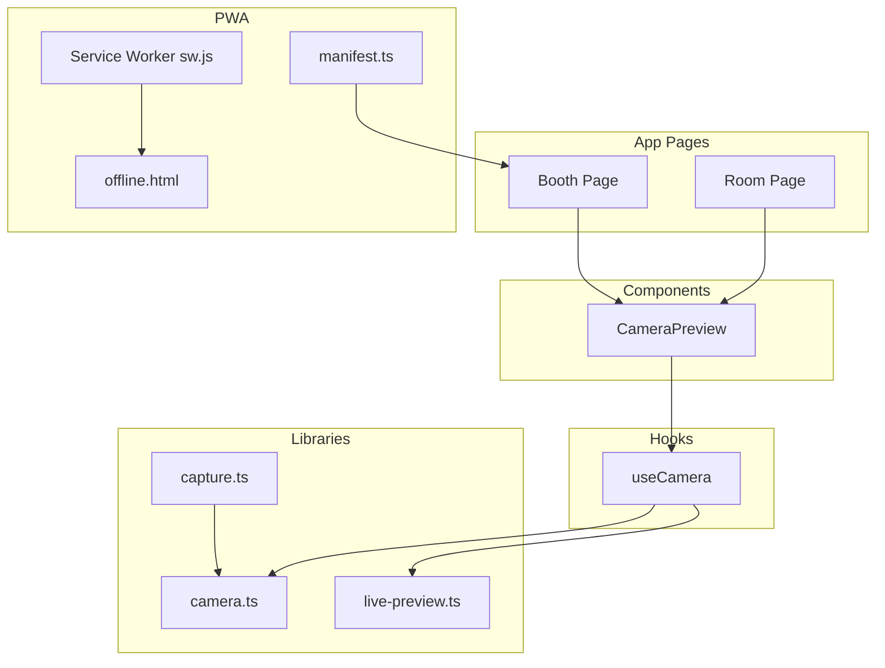
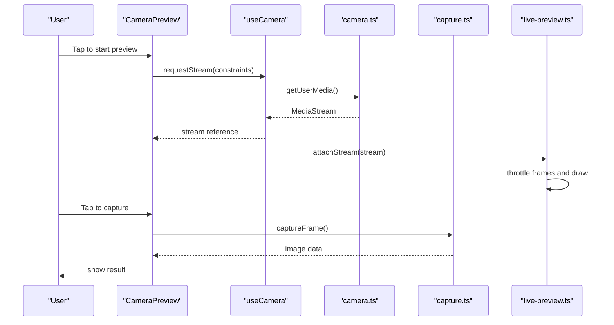
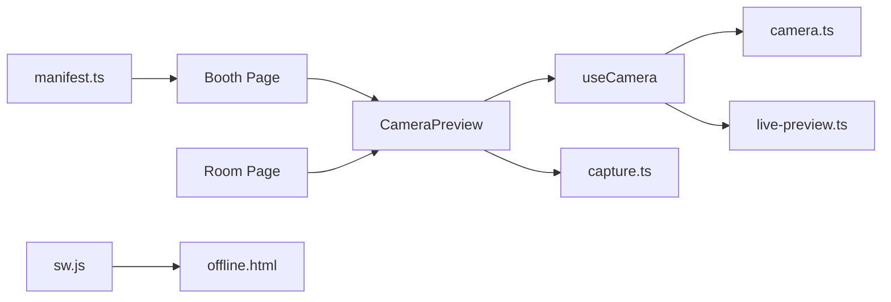

# Mobile Optimization

<cite>
**Referenced Files in This Document**
- [CameraPreview.tsx](file://components/CameraPreview.tsx)
- [useCamera.ts](file://hooks/useCamera.ts)
- [camera.ts](file://lib/camera.ts)
- [capture.ts](file://lib/capture.ts)
- [live-preview.ts](file://lib/live-preview.ts)
- [globals.css](file://app/globals.css)
- [manifest.ts](file://app/manifest.ts)
- [sw.js](file://public/sw.js)
- [offline.html](file://public/offline.html)
- [booth/page.tsx](file://app/booth/page.tsx)
- [room/[code]/page.tsx](file://app/room/[code]/page.tsx)
</cite>

## Table of Contents
1. [Introduction](#introduction)
2. [Project Structure](#project-structure)
3. [Core Components](#core-components)
4. [Architecture Overview](#architecture-overview)
5. [Detailed Component Analysis](#detailed-component-analysis)
6. [Dependency Analysis](#dependency-analysis)
7. [Performance Considerations](#performance-considerations)
8. [Troubleshooting Guide](#troubleshooting-guide)
9. [Conclusion](#conclusion)

## Introduction
This document provides comprehensive guidance for mobile-specific performance optimizations in the photobooth application. It focuses on touch event optimization, battery consumption reduction, responsive design and viewport handling, orientation change management, mobile browser limitations, background execution restrictions, and progressive enhancement strategies for older devices. The content is grounded in the project’s camera pipeline, live preview system, service worker configuration, and mobile manifest setup.

## Project Structure
The photobooth app organizes mobile-critical functionality across components, hooks, and libraries:
- Camera and capture logic are implemented in dedicated modules to isolate media I/O and processing.
- Live preview and UI rendering are separated to minimize reflows and repaints.
- Service worker and offline assets support resilient mobile experiences.
- Manifest defines PWA behavior and preferred orientations.

**Diagram sources**
- [booth/page.tsx](file://app/booth/page.tsx)
- [room/[code]/page.tsx](file://app/room/[code]/page.tsx)
- [CameraPreview.tsx](file://components/CameraPreview.tsx)
- [useCamera.ts](file://hooks/useCamera.ts)
- [camera.ts](file://lib/camera.ts)
- [capture.ts](file://lib/capture.ts)
- [live-preview.ts](file://lib/live-preview.ts)
- [sw.js](file://public/sw.js)
- [offline.html](file://public/offline.html)
- [manifest.ts](file://app/manifest.ts)

**Section sources**
- [booth/page.tsx](file://app/booth/page.tsx)
- [room/[code]/page.tsx](file://app/room/[code]/page.tsx)
- [CameraPreview.tsx](file://components/CameraPreview.tsx)
- [useCamera.ts](file://hooks/useCamera.ts)
- [camera.ts](file://lib/camera.ts)
- [capture.ts](file://lib/capture.ts)
- [live-preview.ts](file://lib/live-preview.ts)
- [sw.js](file://public/sw.js)
- [offline.html](file://public/offline.html)
- [manifest.ts](file://app/manifest.ts)

## Core Components
- CameraPreview: Renders the live camera feed and overlays UI elements. Optimized for minimal layout thrash and efficient updates.
- useCamera: Encapsulates camera stream lifecycle, constraints, and device selection. Centralizes power-sensitive operations like stopping streams when not needed.
- camera.ts: Low-level camera access, stream management, and constraint negotiation.
- capture.ts: Captures frames from the active stream with minimal overhead and avoids unnecessary allocations.
- live-preview.ts: Manages frame throttling, canvas drawing, and debounced updates to reduce CPU/GPU usage.

Key mobile considerations:
- Touch events should be handled via passive listeners where possible to avoid scroll jank.
- CSS touch-action properties can prevent unwanted scrolling during gestures.
- Stream lifecycle must respect user visibility changes to conserve battery.

**Section sources**
- [CameraPreview.tsx](file://components/CameraPreview.tsx)
- [useCamera.ts](file://hooks/useCamera.ts)
- [camera.ts](file://lib/camera.ts)
- [capture.ts](file://lib/capture.ts)
- [live-preview.ts](file://lib/live-preview.ts)

## Architecture Overview
The mobile camera pipeline follows a clear separation of concerns:
- UI layer (CameraPreview) renders frames and handles interactions.
- Hook layer (useCamera) manages media streams and device capabilities.
- Library layer (camera.ts, capture.ts, live-preview.ts) performs I/O and processing.
- PWA layer (sw.js, offline.html, manifest.ts) ensures resilience and offline fallback.

**Diagram sources**
- [CameraPreview.tsx](file://components/CameraPreview.tsx)
- [useCamera.ts](file://hooks/useCamera.ts)
- [camera.ts](file://lib/camera.ts)
- [capture.ts](file://lib/capture.ts)
- [live-preview.ts](file://lib/live-preview.ts)

## Detailed Component Analysis

### Touch Event Optimization
- Prefer passive event listeners for touchstart/touchmove/touchend to avoid blocking main thread and causing scroll jank.
- Use CSS touch-action to disable default browser behaviors that interfere with custom gestures (e.g., pan-y or none).
- Debounce or throttle gesture handlers to limit expensive operations during rapid touches.
- Avoid synchronous layout reads inside touch handlers; batch DOM reads/writes outside event callbacks.

Practical patterns:
- Implement a lightweight gesture recognizer that coalesces multiple touch points into single logical actions.
- Use requestAnimationFrame to schedule visual updates after input processing.
- Prevent default only when necessary and immediately after handling the gesture.

[No sources needed since this section provides general guidance]

### Battery Consumption Reduction
- Throttle frame processing and canvas drawing to reduce CPU/GPU load.
- Pause or stop camera streams when the tab is hidden or the component unmounts.
- Use efficient polling strategies: prefer event-driven updates over timers; if polling is required, increase intervals when the page is not visible.
- Employ power-aware programming: detect low-power modes and degrade features (e.g., disable heavy filters or segmentation).

Implementation anchors:
- Frame throttling and drawing logic reside in the live preview module.
- Stream lifecycle management is centralized in the camera hook and library.

**Section sources**
- [live-preview.ts](file://lib/live-preview.ts)
- [useCamera.ts](file://hooks/useCamera.ts)
- [camera.ts](file://lib/camera.ts)

### Responsive Design and Viewport Handling
- Set viewport meta tags to ensure correct scaling and prevent zoom-on-input.
- Use relative units and flexible layouts to adapt to various screen sizes and densities.
- Handle orientation changes by recalculating layout and adjusting camera constraints (e.g., aspect ratio).

Mobile best practices:
- Avoid fixed pixel dimensions for critical UI elements; use percentages or clamp().
- Test both portrait and landscape modes to ensure consistent UX.

**Section sources**
- [globals.css](file://app/globals.css)
- [booth/page.tsx](file://app/booth/page.tsx)
- [room/[code]/page.tsx](file://app/room/[code]/page.tsx)

### Orientation Change Management
- Listen for orientationchange events to update layout and camera settings.
- Recalculate canvas size and redraw frames to match new aspect ratios.
- Ensure touch-action and scroll behavior remain consistent across orientations.

**Section sources**
- [booth/page.tsx](file://app/booth/page.tsx)
- [room/[code]/page.tsx](file://app/room/[code]/page.tsx)

### Mobile Browser Limitations and Background Execution Restrictions
- Browsers may suspend tabs in background; pause non-essential work and release resources.
- Web Workers cannot directly access camera streams; keep media I/O on the main thread but offload heavy computation.
- Some APIs require secure contexts (HTTPS); ensure proper environment setup.

Progressive enhancement:
- Detect feature support and gracefully degrade functionality on older devices.
- Provide fallback UI and messages when advanced features are unavailable.

**Section sources**
- [sw.js](file://public/sw.js)
- [offline.html](file://public/offline.html)
- [manifest.ts](file://app/manifest.ts)

### Progressive Enhancement Strategies
- Start with core camera functionality and add enhancements (filters, segmentation) conditionally.
- Cache static assets via service worker to improve load times on slow networks.
- Offer an offline fallback page when connectivity is lost.

**Section sources**
- [sw.js](file://public/sw.js)
- [offline.html](file://public/offline.html)
- [manifest.ts](file://app/manifest.ts)

## Dependency Analysis
The following diagram shows how key modules interact to deliver a performant mobile experience:

**Diagram sources**
- [booth/page.tsx](file://app/booth/page.tsx)
- [room/[code]/page.tsx](file://app/room/[code]/page.tsx)
- [CameraPreview.tsx](file://components/CameraPreview.tsx)
- [useCamera.ts](file://hooks/useCamera.ts)
- [camera.ts](file://lib/camera.ts)
- [capture.ts](file://lib/capture.ts)
- [live-preview.ts](file://lib/live-preview.ts)
- [sw.js](file://public/sw.js)
- [offline.html](file://public/offline.html)
- [manifest.ts](file://app/manifest.ts)

**Section sources**
- [booth/page.tsx](file://app/booth/page.tsx)
- [room/[code]/page.tsx](file://app/room/[code]/page.tsx)
- [CameraPreview.tsx](file://components/CameraPreview.tsx)
- [useCamera.ts](file://hooks/useCamera.ts)
- [camera.ts](file://lib/camera.ts)
- [capture.ts](file://lib/capture.ts)
- [live-preview.ts](file://lib/live-preview.ts)
- [sw.js](file://public/sw.js)
- [offline.html](file://public/offline.html)
- [manifest.ts](file://app/manifest.ts)

## Performance Considerations
- Minimize reflows and repaints by batching DOM updates and using transform/opacity for animations.
- Throttle camera frame processing to match display refresh rates and reduce CPU usage.
- Stop camera streams promptly when not in use to save battery and memory.
- Leverage service workers for caching and offline resilience to improve perceived performance.

[No sources needed since this section provides general guidance]

## Troubleshooting Guide
Common issues and resolutions:
- Janky scrolling during gestures: ensure passive listeners and appropriate touch-action values.
- High battery drain: verify frame throttling and stream lifecycle management.
- Orientation glitches: recalculate canvas and constraints on orientation change.
- Offline failures: confirm service worker registration and offline asset availability.

Checkpoints:
- Inspect event listener options for passivity.
- Monitor CPU/GPU usage during capture and preview.
- Validate manifest settings and service worker cache entries.

**Section sources**
- [live-preview.ts](file://lib/live-preview.ts)
- [useCamera.ts](file://hooks/useCamera.ts)
- [sw.js](file://public/sw.js)
- [manifest.ts](file://app/manifest.ts)

## Conclusion
By applying touch event optimizations, battery-conscious programming, responsive design techniques, and robust PWA practices, the photobooth application delivers a smooth and efficient mobile experience. Adhering to these guidelines ensures reliable performance across diverse devices and network conditions while respecting mobile browser constraints and user expectations.

[No sources needed since this section summarizes without analyzing specific files]