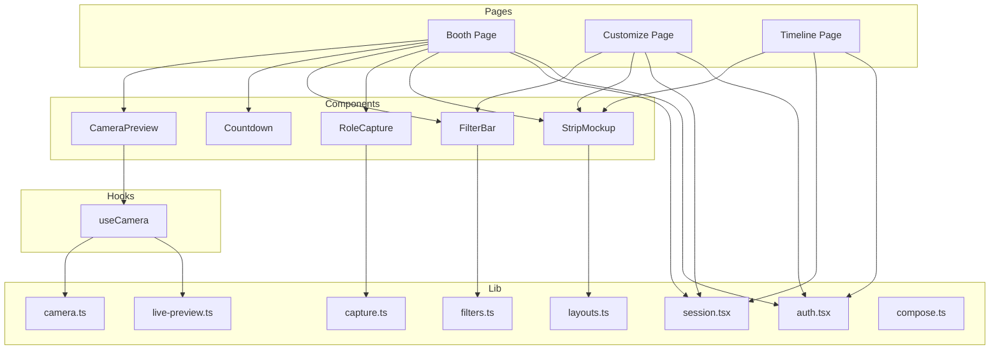
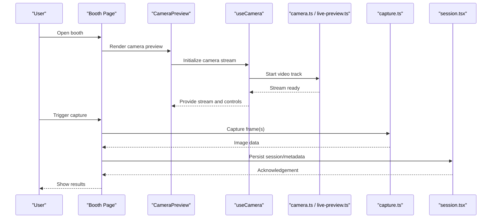
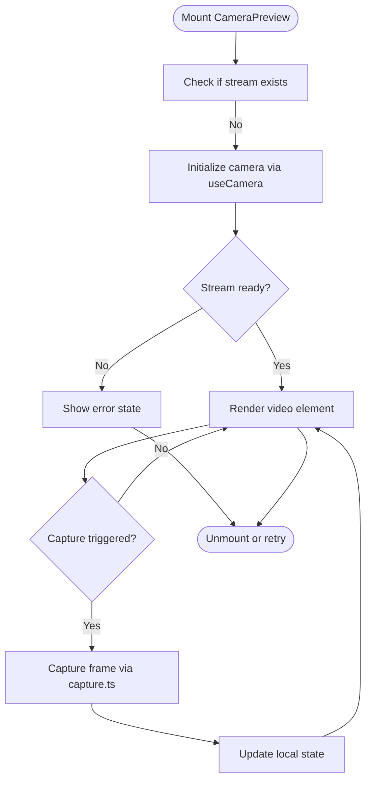
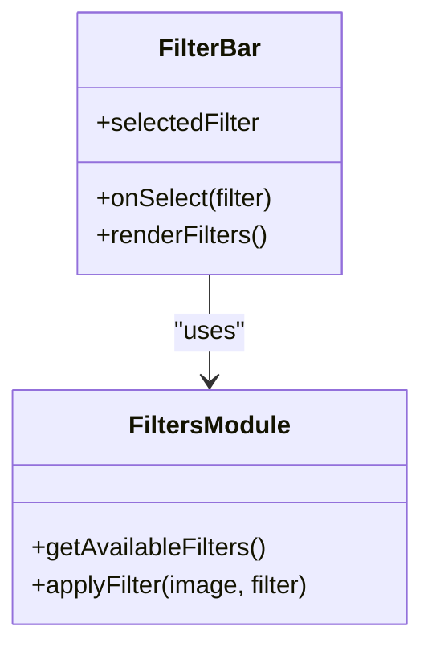
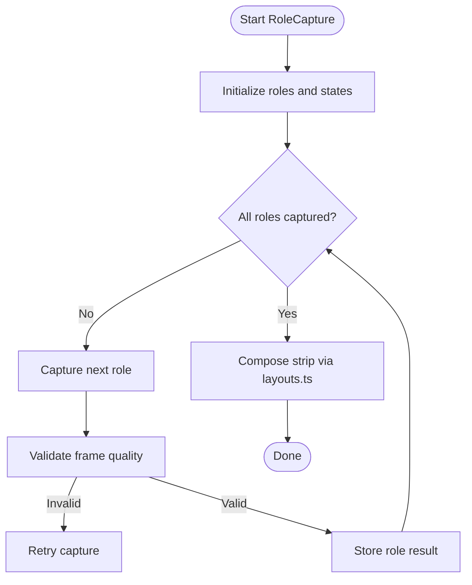
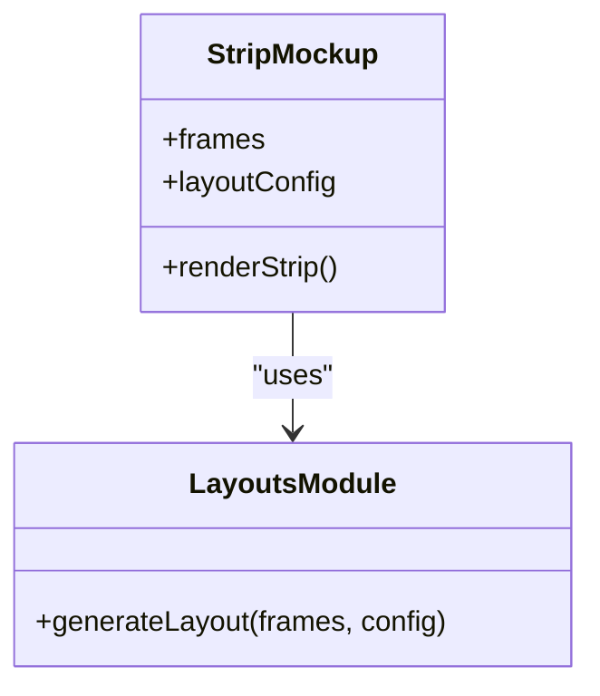
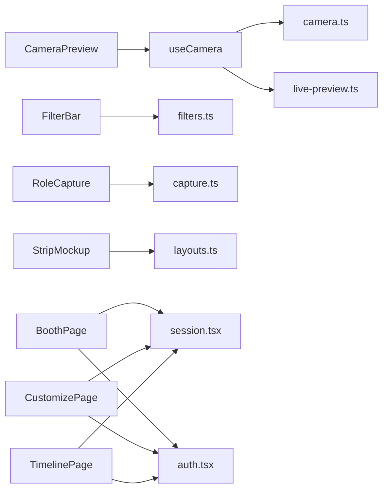

# React Component Performance

<cite>
**Referenced Files in This Document**
- [page.tsx](file://app/booth/page.tsx)
- [page.tsx](file://app/customize/page.tsx)
- [page.tsx](file://app/timeline/page.tsx)
- [CameraPreview.tsx](file://components/CameraPreview.tsx)
- [Countdown.tsx](file://components/Countdown.tsx)
- [FilterBar.tsx](file://components/FilterBar.tsx)
- [RoleCapture.tsx](file://components/RoleCapture.tsx)
- [StripMockup.tsx](file://components/StripMockup.tsx)
- [useCamera.ts](file://hooks/useCamera.ts)
- [camera.ts](file://lib/camera.ts)
- [capture.ts](file://lib/capture.ts)
- [filters.ts](file://lib/filters.ts)
- [layouts.ts](file://lib/layouts.ts)
- [live-preview.ts](file://lib/live-preview.ts)
- [session.tsx](file://lib/session.tsx)
- [auth.tsx](file://lib/auth.tsx)
- [compose.ts](file://lib/compose.ts)
- [next.config.ts](file://next.config.ts)
</cite>

## Table of Contents
1. [Introduction](#introduction)
2. [Project Structure](#project-structure)
3. [Core Components](#core-components)
4. [Architecture Overview](#architecture-overview)
5. [Detailed Component Analysis](#detailed-component-analysis)
6. [Dependency Analysis](#dependency-analysis)
7. [Performance Considerations](#performance-considerations)
8. [Troubleshooting Guide](#troubleshooting-guide)
9. [Conclusion](#conclusion)
10. [Appendices](#appendices)

## Introduction
This document provides a comprehensive guide to optimizing React component performance in the photobooth application. It focuses on memoization techniques (React.memo, useMemo, useCallback), state management optimization (state splitting, context usage patterns), efficient composition, avoiding prop drilling, virtualization for large lists, lazy loading, and bundle size optimization through code splitting. The guidance is grounded in the actual components and libraries used by the project.

## Project Structure
The photobooth app is built with Next.js and organizes UI logic into reusable components under components/, hooks under hooks/, and shared utilities under lib/. Pages under app/ orchestrate feature flows such as booth capture, customization, timeline browsing, and relay sessions.

**Diagram sources**
- [page.tsx](file://app/booth/page.tsx)
- [page.tsx](file://app/customize/page.tsx)
- [page.tsx](file://app/timeline/page.tsx)
- [CameraPreview.tsx](file://components/CameraPreview.tsx)
- [Countdown.tsx](file://components/Countdown.tsx)
- [FilterBar.tsx](file://components/FilterBar.tsx)
- [RoleCapture.tsx](file://components/RoleCapture.tsx)
- [StripMockup.tsx](file://components/StripMockup.tsx)
- [useCamera.ts](file://hooks/useCamera.ts)
- [camera.ts](file://lib/camera.ts)
- [capture.ts](file://lib/capture.ts)
- [filters.ts](file://lib/filters.ts)
- [layouts.ts](file://lib/layouts.ts)
- [live-preview.ts](file://lib/live-preview.ts)
- [session.tsx](file://lib/session.tsx)
- [auth.tsx](file://lib/auth.tsx)
- [compose.ts](file://lib/compose.ts)

**Section sources**
- [page.tsx](file://app/booth/page.tsx)
- [page.tsx](file://app/customize/page.tsx)
- [page.tsx](file://app/timeline/page.tsx)
- [CameraPreview.tsx](file://components/CameraPreview.tsx)
- [Countdown.tsx](file://components/Countdown.tsx)
- [FilterBar.tsx](file://components/FilterBar.tsx)
- [RoleCapture.tsx](file://components/RoleCapture.tsx)
- [StripMockup.tsx](file://components/StripMockup.tsx)
- [useCamera.ts](file://hooks/useCamera.ts)
- [camera.ts](file://lib/camera.ts)
- [capture.ts](file://lib/capture.ts)
- [filters.ts](file://lib/filters.ts)
- [layouts.ts](file://lib/layouts.ts)
- [live-preview.ts](file://lib/live-preview.ts)
- [session.tsx](file://lib/session.tsx)
- [auth.tsx](file://lib/auth.tsx)
- [compose.ts](file://lib/compose.ts)

## Core Components
Key UI building blocks that drive performance-sensitive interactions:
- CameraPreview: renders live camera feed and integrates with useCamera hook.
- Countdown: orchestrates timing for photo capture sequences.
- FilterBar: manages filter selection and preview updates.
- RoleCapture: handles multi-role capture flows and state coordination.
- StripMockup: composes final strip layouts from captured frames.

These components interact with library modules for camera control, capture, filters, and layout generation. Optimizing these components involves memoization, stable references, and careful state design.

**Section sources**
- [CameraPreview.tsx](file://components/CameraPreview.tsx)
- [Countdown.tsx](file://components/Countdown.tsx)
- [FilterBar.tsx](file://components/FilterBar.tsx)
- [RoleCapture.tsx](file://components/RoleCapture.tsx)
- [StripMockup.tsx](file://components/StripMockup.tsx)

## Architecture Overview
The application follows a page-driven architecture where each page composes multiple components and relies on shared hooks and libraries. Data flows from user actions through components to hooks/libraries, which perform heavy operations like camera access, image processing, and session management.

**Diagram sources**
- [page.tsx](file://app/booth/page.tsx)
- [CameraPreview.tsx](file://components/CameraPreview.tsx)
- [useCamera.ts](file://hooks/useCamera.ts)
- [camera.ts](file://lib/camera.ts)
- [live-preview.ts](file://lib/live-preview.ts)
- [capture.ts](file://lib/capture.ts)
- [session.tsx](file://lib/session.tsx)

## Detailed Component Analysis

### CameraPreview Optimization
Responsibilities:
- Display live camera feed
- Manage stream lifecycle
- Expose capture triggers and error states

Optimization strategies:
- Wrap with React.memo to prevent re-renders when props are unchanged.
- Memoize derived values (e.g., canvas dimensions or overlay styles) using useMemo.
- Stabilize callbacks (start/stop stream, capture) with useCallback to avoid recreating handlers on each render.
- Avoid passing inline objects/functions as props; lift them up or memoize.

**Diagram sources**
- [CameraPreview.tsx](file://components/CameraPreview.tsx)
- [useCamera.ts](file://hooks/useCamera.ts)
- [camera.ts](file://lib/camera.ts)
- [capture.ts](file://lib/capture.ts)

**Section sources**
- [CameraPreview.tsx](file://components/CameraPreview.tsx)
- [useCamera.ts](file://hooks/useCamera.ts)
- [camera.ts](file://lib/camera.ts)
- [capture.ts](file://lib/capture.ts)

### FilterBar Optimization
Responsibilities:
- Present available filters
- Apply selected filter to preview or captured images
- Maintain selection state

Optimization strategies:
- Memoize filter list and computed properties (e.g., active filter metadata) with useMemo.
- Use React.memo for filter items to avoid re-rendering unaffected items.
- Stabilize selection handlers with useCallback to prevent unnecessary child re-renders.
- Prefer shallow comparisons; avoid creating new arrays/objects on every render.

**Diagram sources**
- [FilterBar.tsx](file://components/FilterBar.tsx)
- [filters.ts](file://lib/filters.ts)

**Section sources**
- [FilterBar.tsx](file://components/FilterBar.tsx)
- [filters.ts](file://lib/filters.ts)

### RoleCapture Coordination
Responsibilities:
- Coordinate multi-role capture flow
- Manage per-role state and transitions
- Aggregate results for strip composition

Optimization strategies:
- Split state into smaller slices per role to minimize re-renders.
- Use context sparingly; prefer lifting state to the nearest common ancestor or using a focused context only for cross-cutting concerns.
- Memoize expensive computations (e.g., composite image preparation) with useMemo.
- Stabilize event handlers with useCallback to keep child components stable.

**Diagram sources**
- [RoleCapture.tsx](file://components/RoleCapture.tsx)
- [capture.ts](file://lib/capture.ts)
- [layouts.ts](file://lib/layouts.ts)

**Section sources**
- [RoleCapture.tsx](file://components/RoleCapture.tsx)
- [capture.ts](file://lib/capture.ts)
- [layouts.ts](file://lib/layouts.ts)

### StripMockup Composition
Responsibilities:
- Assemble captured frames into a final strip layout
- Apply overlays, stickers, and decorations
- Export or share the final image

Optimization strategies:
- Memoize layout calculations and generated canvases with useMemo.
- Defer heavy drawing operations off the main thread where possible.
- Avoid re-computing static assets; cache them at module level.
- Use React.memo to prevent re-rendering when inputs are unchanged.

**Diagram sources**
- [StripMockup.tsx](file://components/StripMockup.tsx)
- [layouts.ts](file://lib/layouts.ts)

**Section sources**
- [StripMockup.tsx](file://components/StripMockup.tsx)
- [layouts.ts](file://lib/layouts.ts)

### Countdown Timing
Responsibilities:
- Drive countdown timers for capture sequences
- Synchronize UI updates with timing events

Optimization strategies:
- Use requestAnimationFrame or Web Workers for precise timing if needed.
- Memoize timer configurations and callbacks.
- Avoid frequent state updates; batch updates where appropriate.

**Section sources**
- [Countdown.tsx](file://components/Countdown.tsx)

## Dependency Analysis
Component-to-library dependencies influence rendering frequency and performance. Stable references and minimal re-renders reduce overhead.

**Diagram sources**
- [CameraPreview.tsx](file://components/CameraPreview.tsx)
- [useCamera.ts](file://hooks/useCamera.ts)
- [camera.ts](file://lib/camera.ts)
- [live-preview.ts](file://lib/live-preview.ts)
- [FilterBar.tsx](file://components/FilterBar.tsx)
- [filters.ts](file://lib/filters.ts)
- [RoleCapture.tsx](file://components/RoleCapture.tsx)
- [capture.ts](file://lib/capture.ts)
- [StripMockup.tsx](file://components/StripMockup.tsx)
- [layouts.ts](file://lib/layouts.ts)
- [page.tsx](file://app/booth/page.tsx)
- [page.tsx](file://app/customize/page.tsx)
- [page.tsx](file://app/timeline/page.tsx)
- [session.tsx](file://lib/session.tsx)
- [auth.tsx](file://lib/auth.tsx)

**Section sources**
- [CameraPreview.tsx](file://components/CameraPreview.tsx)
- [useCamera.ts](file://hooks/useCamera.ts)
- [camera.ts](file://lib/camera.ts)
- [live-preview.ts](file://lib/live-preview.ts)
- [FilterBar.tsx](file://components/FilterBar.tsx)
- [filters.ts](file://lib/filters.ts)
- [RoleCapture.tsx](file://components/RoleCapture.tsx)
- [capture.ts](file://lib/capture.ts)
- [StripMockup.tsx](file://components/StripMockup.tsx)
- [layouts.ts](file://lib/layouts.ts)
- [page.tsx](file://app/booth/page.tsx)
- [page.tsx](file://app/customize/page.tsx)
- [page.tsx](file://app/timeline/page.tsx)
- [session.tsx](file://lib/session.tsx)
- [auth.tsx](file://lib/auth.tsx)

## Performance Considerations
Memoization techniques:
- React.memo: Wrap pure components to skip re-renders when props are unchanged.
- useMemo: Cache expensive computations (e.g., filter transformations, layout calculations).
- useCallback: Stabilize function references passed to children to avoid unnecessary re-renders.

State management optimization:
- Split state into granular slices to limit re-render scope.
- Use context judiciously; prefer localized state or lifted state near consumers.
- Avoid prop drilling by introducing focused contexts or component composition patterns.

Virtualization for large lists:
- Implement windowing/virtualization for timelines or galleries to render only visible items.
- Combine with React.memo for list items and stable keys.

Lazy loading patterns:
- Use dynamic imports for heavy features (e.g., segmentation, advanced filters).
- Defer non-critical resources until interaction.

Bundle size optimization:
- Code split routes and heavy modules.
- Remove unused dependencies and tree-shake effectively.
- Configure Next.js optimizations (e.g., asset handling, externalization).

[No sources needed since this section provides general guidance]

## Troubleshooting Guide
Common issues and remedies:
- Excessive re-renders:
  - Verify React.memo usage on leaf components.
  - Ensure callbacks are memoized with useCallback.
  - Check for object/array creation inside render functions.
- Memory leaks:
  - Clean up camera streams and event listeners in useEffect cleanup.
  - Cancel timers and abort long-running tasks on unmount.
- Jank during capture:
  - Offload heavy image processing to Web Workers or background threads.
  - Batch state updates and avoid synchronous heavy work in render.
- Bundle bloat:
  - Audit dependencies and remove unused code.
  - Use dynamic imports for heavy features.

**Section sources**
- [useCamera.ts](file://hooks/useCamera.ts)
- [camera.ts](file://lib/camera.ts)
- [capture.ts](file://lib/capture.ts)
- [filters.ts](file://lib/filters.ts)
- [layouts.ts](file://lib/layouts.ts)

## Conclusion
By applying memoization, refining state management, adopting efficient composition patterns, and leveraging virtualization and lazy loading, the photobooth application can achieve smoother interactions and reduced rendering overhead. Monitoring with React DevTools helps identify bottlenecks and validate improvements.

[No sources needed since this section summarizes without analyzing specific files]

## Appendices

### Practical Examples and Patterns
- Memoization checklist:
  - Wrap pure components with React.memo.
  - Memoize derived values with useMemo.
  - Stabilize handlers with useCallback.
- State splitting:
  - Separate UI state from business logic state.
  - Lift state only as high as necessary.
- Context usage:
  - Create small, focused contexts.
  - Avoid global state for frequently changing data.
- Virtualization:
  - Use windowed lists for timelines/galleries.
  - Combine with stable keys and memoized items.
- Lazy loading:
  - Dynamic import heavy modules.
  - Preload critical paths, defer others.
- Bundle optimization:
  - Code split routes and features.
  - Externalize large libraries when possible.

[No sources needed since this section provides general guidance]