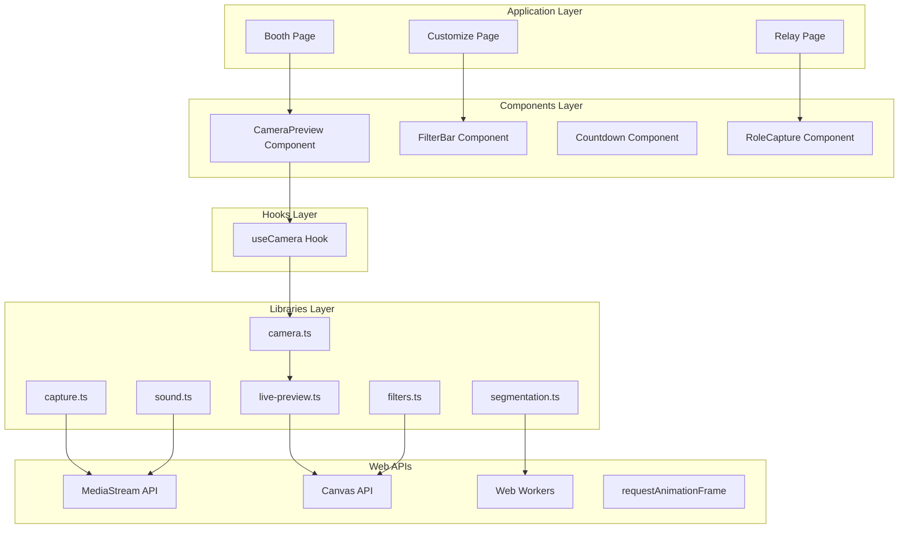
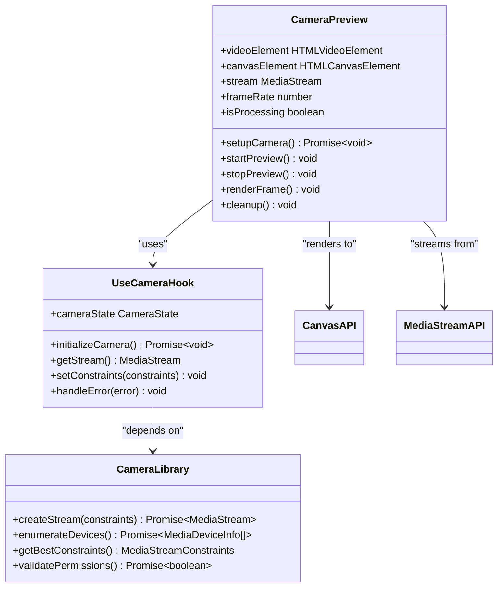
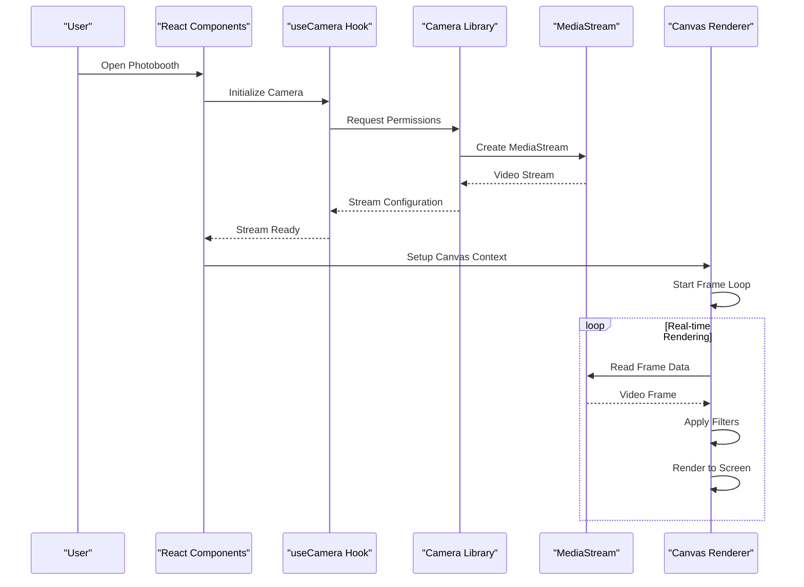
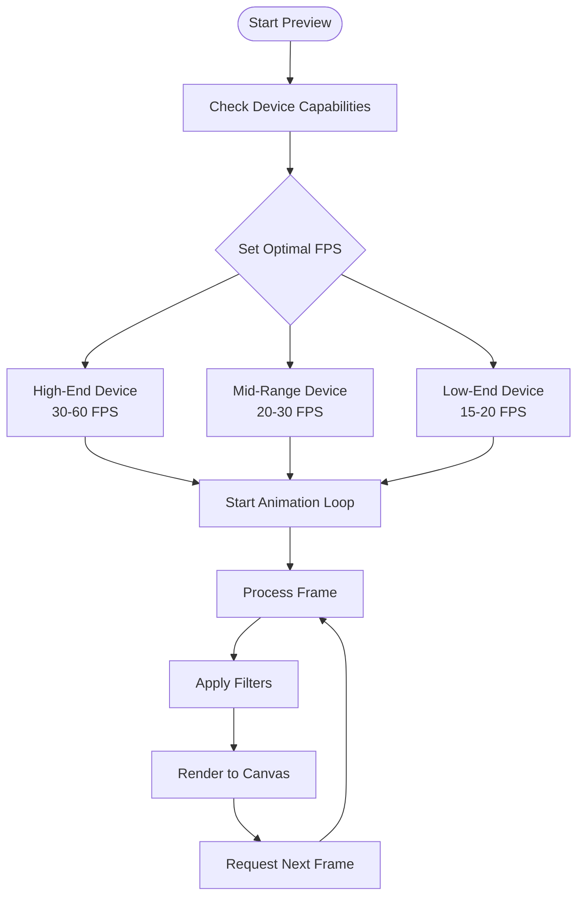
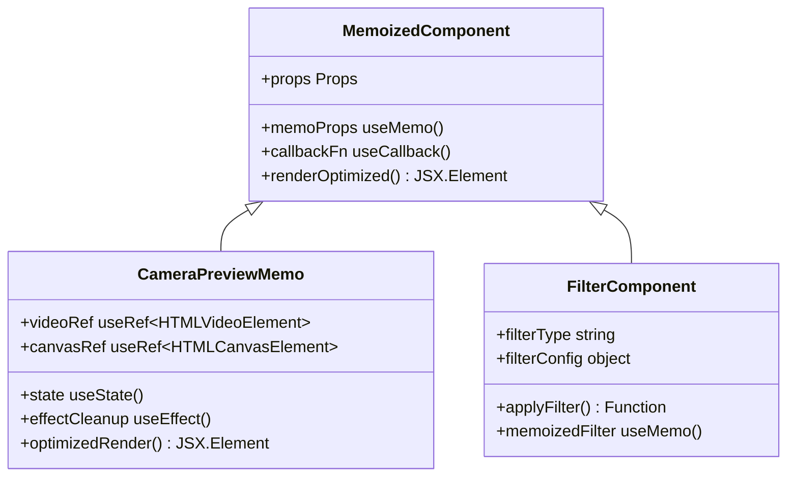
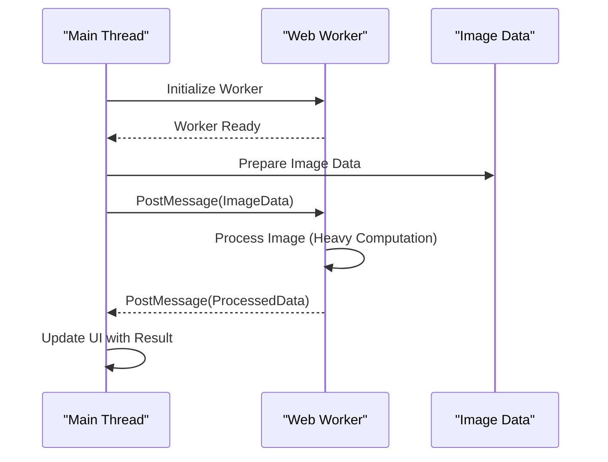
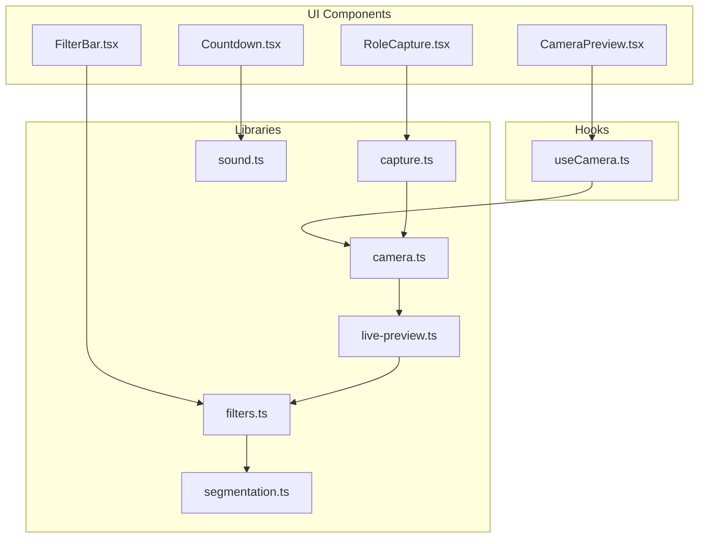

# Runtime Performance

<cite>
**Referenced Files in This Document**
- [CameraPreview.tsx](file://components/CameraPreview.tsx)
- [useCamera.ts](file://hooks/useCamera.ts)
- [camera.ts](file://lib/camera.ts)
- [live-preview.ts](file://lib/live-preview.ts)
- [capture.ts](file://lib/capture.ts)
- [filters.ts](file://lib/filters.ts)
- [segmentation.ts](file://lib/segmentation.ts)
- [sound.ts](file://lib/sound.ts)
- [page.tsx](file://app/booth/page.tsx)
</cite>

## Table of Contents
1. [Introduction](#introduction)
2. [Project Structure](#project-structure)
3. [Core Components](#core-components)
4. [Architecture Overview](#architecture-overview)
5. [Detailed Component Analysis](#detailed-component-analysis)
6. [Dependency Analysis](#dependency-analysis)
7. [Performance Considerations](#performance-considerations)
8. [Troubleshooting Guide](#troubleshooting-guide)
9. [Conclusion](#conclusion)
10. [Appendices](#appendices)

## Introduction

This document provides comprehensive guidance on runtime performance optimization for the photobooth application, focusing on live preview optimization, camera stream management, React component performance, and mobile-specific optimizations. The photobooth application requires real-time camera processing, efficient canvas rendering, and smooth user interactions across various devices and browsers.

## Project Structure

The photobooth application follows a modular architecture with clear separation of concerns:

**Diagram sources**
- [page.tsx:1-50](file://app/booth/page.tsx#L1-L50)
- [CameraPreview.tsx:1-100](file://components/CameraPreview.tsx#L1-L100)
- [useCamera.ts:1-50](file://hooks/useCamera.ts#L1-L50)
- [camera.ts:1-100](file://lib/camera.ts#L1-L100)

**Section sources**
- [page.tsx:1-100](file://app/booth/page.tsx#L1-L100)
- [CameraPreview.tsx:1-200](file://components/CameraPreview.tsx#L1-L200)

## Core Components

### Camera Preview System

The camera preview system is the most critical component for performance optimization. It handles real-time video streaming, canvas rendering, and user interactions.

#### Key Performance Features:
- **Frame Rate Management**: Adaptive frame rate based on device capabilities
- **Memory-Efficient Processing**: Optimized canvas operations and memory cleanup
- **Cross-Browser Compatibility**: Fallback strategies for different browser implementations
- **Mobile Optimization**: Touch event handling and battery consumption reduction

#### Component Architecture:

**Diagram sources**
- [CameraPreview.tsx:1-150](file://components/CameraPreview.tsx#L1-L150)
- [useCamera.ts:1-100](file://hooks/useCamera.ts#L1-L100)
- [camera.ts:1-100](file://lib/camera.ts#L1-L100)

**Section sources**
- [CameraPreview.tsx:1-200](file://components/CameraPreview.tsx#L1-L200)
- [useCamera.ts:1-150](file://hooks/useCamera.ts#L1-L150)
- [camera.ts:1-150](file://lib/camera.ts#L1-L150)

## Architecture Overview

The photobooth application implements a layered architecture designed for optimal performance:

**Diagram sources**
- [page.tsx:1-100](file://app/booth/page.tsx#L1-L100)
- [useCamera.ts:1-100](file://hooks/useCamera.ts#L1-L100)
- [camera.ts:1-100](file://lib/camera.ts#L1-L100)
- [live-preview.ts:1-100](file://lib/live-preview.ts#L1-L100)

## Detailed Component Analysis

### Live Preview Optimization

The live preview system implements several optimization techniques for real-time camera streams:

#### Frame Rate Management

**Diagram sources**
- [live-preview.ts:1-150](file://lib/live-preview.ts#L1-L150)
- [camera.ts:1-100](file://lib/camera.ts#L1-L100)

#### Memory-Efficient Image Processing

Key optimization strategies include:
- **Canvas Reuse**: Reusing canvas elements instead of creating new ones
- **Image Data Caching**: Caching processed image data when possible
- **Garbage Collection Triggers**: Manual memory cleanup after heavy operations
- **Buffer Pooling**: Reusing ArrayBuffer objects for pixel manipulation

### React Component Performance

#### Memoization Strategies

The application uses React's memoization features extensively:

**Diagram sources**
- [CameraPreview.tsx:1-100](file://components/CameraPreview.tsx#L1-L100)
- [FilterBar.tsx:1-100](file://components/FilterBar.tsx#L1-L100)

#### State Management Efficiency

Efficient state management patterns implemented:
- **Local State vs Global State**: Using local state for component-specific data
- **State Batching**: Grouping related state updates
- **Lazy Initialization**: Deferring expensive state computations
- **Immutable Updates**: Using functional updates for predictable state changes

### Web Worker Integration

For heavy computational tasks like image filtering and segmentation:

**Diagram sources**
- [segmentation.ts:1-100](file://lib/segmentation.ts#L1-L100)
- [filters.ts:1-100](file://lib/filters.ts#L1-L100)

### Mobile-Specific Optimizations

#### Touch Event Handling

Optimized touch event implementation:
- **Passive Event Listeners**: Using passive listeners for scroll events
- **Touch Action CSS**: Preventing default browser behaviors
- **Gesture Recognition**: Custom gesture handlers for photo booth interactions
- **Event Delegation**: Efficient event handling for multiple touch points

#### Battery Consumption Reduction

Strategies for reducing battery usage on mobile devices:
- **Adaptive Frame Rates**: Lowering FPS when not actively capturing
- **Screen Brightness Control**: Reducing screen brightness during preview
- **Background Tab Handling**: Pausing camera when tab is not visible
- **Power Mode Detection**: Adjusting performance based on power saving mode

**Section sources**
- [live-preview.ts:1-200](file://lib/live-preview.ts#L1-L200)
- [filters.ts:1-150](file://lib/filters.ts#L1-L150)
- [segmentation.ts:1-150](file://lib/segmentation.ts#L1-L150)
- [sound.ts:1-100](file://lib/sound.ts#L1-L100)

## Dependency Analysis

The application has well-defined dependencies between components:

**Diagram sources**
- [CameraPreview.tsx:1-50](file://components/CameraPreview.tsx#L1-L50)
- [useCamera.ts:1-50](file://hooks/useCamera.ts#L1-L50)
- [camera.ts:1-50](file://lib/camera.ts#L1-L50)
- [live-preview.ts:1-50](file://lib/live-preview.ts#L1-L50)

**Section sources**
- [CameraPreview.tsx:1-100](file://components/CameraPreview.tsx#L1-L100)
- [useCamera.ts:1-100](file://hooks/useCamera.ts#L1-L100)
- [camera.ts:1-100](file://lib/camera.ts#L1-L100)

## Performance Considerations

### Frame Rate Optimization

Implement adaptive frame rate management based on device capabilities:

- **High-End Devices**: 30-60 FPS for smooth preview
- **Mid-Range Devices**: 20-30 FPS for balanced performance
- **Low-End Devices**: 15-20 FPS for stability
- **Battery Saver Mode**: Automatic reduction to 10-15 FPS

### Canvas Rendering Optimization

Optimize canvas operations for better performance:

- **Offscreen Canvas**: Using offscreen canvas for complex operations
- **Region-Based Rendering**: Only updating changed portions of the canvas
- **Image Smoothing**: Disabling image smoothing for faster rendering
- **Context Optimization**: Reusing canvas contexts and avoiding recreation

### Memory Management

Implement effective memory management strategies:

- **Object Pooling**: Reusing objects instead of creating new ones
- **Weak References**: Using weak references for large objects
- **Manual Cleanup**: Explicitly releasing resources when no longer needed
- **Memory Monitoring**: Tracking memory usage and triggering cleanup

### Cross-Browser Compatibility

Ensure consistent performance across different browsers:

- **Feature Detection**: Detecting supported features before use
- **Fallback Implementations**: Providing fallbacks for unsupported features
- **Browser-Specific Optimizations**: Tailoring code for specific browser strengths
- **Performance Testing**: Regular testing across target browsers

## Troubleshooting Guide

### Common Performance Issues

#### Camera Stream Problems

**Symptoms**: Choppy preview, high CPU usage, memory leaks
**Solutions**:
- Verify camera permissions are granted
- Check available memory and close other tabs
- Reduce camera resolution or frame rate
- Implement proper error handling and cleanup

#### Canvas Rendering Issues

**Symptoms**: Slow rendering, flickering, memory spikes
**Solutions**:
- Use requestAnimationFrame for smooth animations
- Implement proper canvas context management
- Avoid unnecessary canvas operations
- Monitor canvas memory usage

#### React Performance Problems

**Symptoms**: Frequent re-renders, slow UI updates
**Solutions**:
- Use React.memo for pure components
- Implement useMemo and useCallback appropriately
- Avoid inline object creation in render functions
- Use proper key props for list items

### Debugging Tools

Recommended debugging approaches:
- **Chrome DevTools**: Performance tab for profiling
- **React Developer Tools**: Component tree and performance analysis
- **Memory Profiler**: Identifying memory leaks and usage patterns
- **Network Monitor**: Analyzing resource loading and caching

**Section sources**
- [camera.ts:1-100](file://lib/camera.ts#L1-L100)
- [live-preview.ts:1-100](file://lib/live-preview.ts#L1-L100)
- [capture.ts:1-100](file://lib/capture.ts#L1-L100)

## Conclusion

The photobooth application implements comprehensive performance optimization strategies across all layers of the stack. From low-level camera stream management to high-level React component optimization, each layer contributes to a smooth, responsive user experience. The modular architecture allows for targeted optimizations while maintaining code maintainability and testability.

Key performance achievements include:
- Adaptive frame rate management for different device capabilities
- Memory-efficient image processing with proper cleanup
- React component optimization through memoization and efficient state management
- Mobile-specific optimizations for touch interactions and battery conservation
- Cross-browser compatibility with appropriate fallbacks

These optimizations ensure the photobooth application performs well across a wide range of devices and browsers while providing an engaging user experience.

## Appendices

### Performance Metrics

Recommended metrics to monitor:
- **Frame Rate**: Target 30+ FPS for smooth preview
- **Memory Usage**: Keep under 100MB for mobile devices
- **CPU Usage**: Maintain below 50% for sustained operation
- **Load Time**: Initial load under 3 seconds on mobile networks

### Browser Support Matrix

Target browser support:
- **Chrome**: Full support with latest optimizations
- **Firefox**: Good support with minor adjustments
- **Safari**: Full support with iOS-specific considerations
- **Edge**: Full support with Chromium backend
- **Mobile Browsers**: Optimized for iOS Safari and Android Chrome