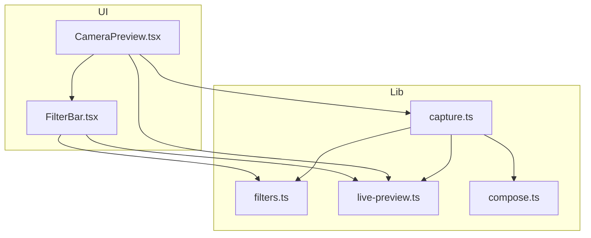
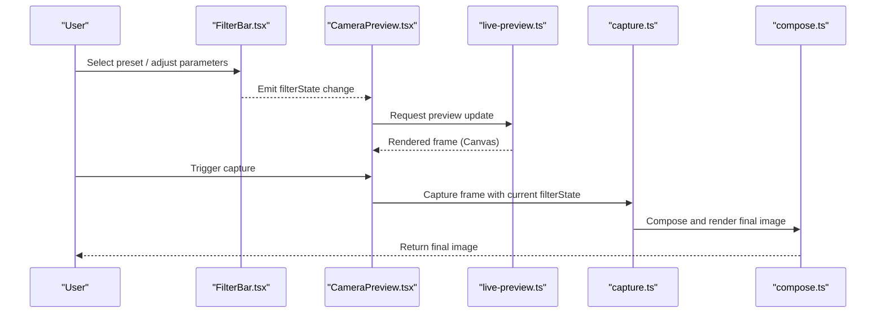
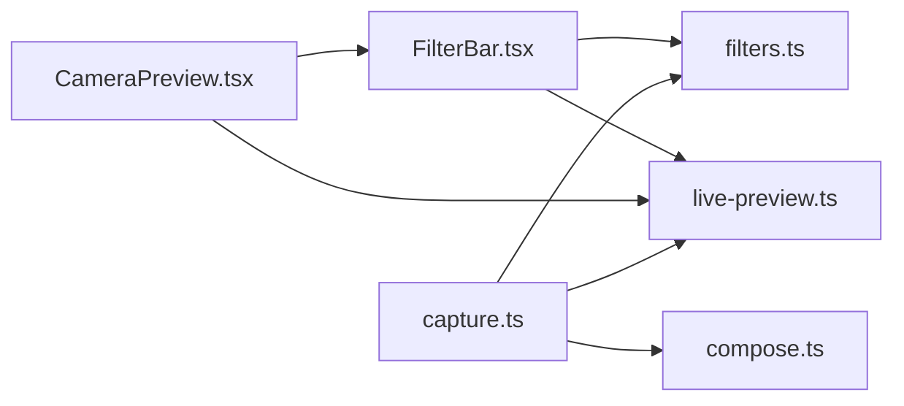

# Filter System

<cite>
**Referenced Files in This Document**
- [FilterBar.tsx](file://components/FilterBar.tsx)
- [filters.ts](file://lib/filters.ts)
- [live-preview.ts](file://lib/live-preview.ts)
- [capture.ts](file://lib/capture.ts)
- [compose.ts](file://lib/compose.ts)
- [CameraPreview.tsx](file://components/CameraPreview.tsx)
</cite>

## Table of Contents
1. [Introduction](#introduction)
2. [Project Structure](#project-structure)
3. [Core Components](#core-components)
4. [Architecture Overview](#architecture-overview)
5. [Detailed Component Analysis](#detailed-component-analysis)
6. [Dependency Analysis](#dependency-analysis)
7. [Performance Considerations](#performance-considerations)
8. [Troubleshooting Guide](#troubleshooting-guide)
9. [Conclusion](#conclusion)
10. [Appendices](#appendices)

## Introduction
This document explains the filter system used by the photobooth application. It covers CSS-based filters (brightness, contrast, saturation, and custom color adjustments), real-time preview via canvas operations, performance optimizations, the end-to-end pipeline from filter selection to final rendering, and how to add custom filters and manage filter state. It also documents the FilterBar component interface, event handling, integration with the photo editing workflow, browser compatibility considerations, and fallback strategies.

## Project Structure
The filter system spans UI components and library modules:
- FilterBar.tsx: The user-facing control for selecting and adjusting filters.
- filters.ts: Definitions of built-in filters, parameter schemas, and helpers for composing CSS filters.
- live-preview.ts: Real-time preview logic using Canvas API to apply pixel-level effects when needed.
- capture.ts: Captures frames and applies filters during capture.
- compose.ts: Composes multiple image layers and applies final render steps.
- CameraPreview.tsx: Integrates camera feed, preview, and filter application into the editing flow.

**Diagram sources**
- [FilterBar.tsx](file://components/FilterBar.tsx)
- [filters.ts](file://lib/filters.ts)
- [live-preview.ts](file://lib/live-preview.ts)
- [capture.ts](file://lib/capture.ts)
- [compose.ts](file://lib/compose.ts)
- [CameraPreview.tsx](file://components/CameraPreview.tsx)

**Section sources**
- [FilterBar.tsx](file://components/FilterBar.tsx)
- [filters.ts](file://lib/filters.ts)
- [live-preview.ts](file://lib/live-preview.ts)
- [capture.ts](file://lib/capture.ts)
- [compose.ts](file://lib/compose.ts)
- [CameraPreview.tsx](file://components/CameraPreview.tsx)

## Core Components
- FilterBar.tsx
  - Presents a list of presets and sliders for parameters such as brightness, contrast, saturation, and custom color adjustments.
  - Emits events when a preset is selected or a parameter changes, updating the active filter state.
  - Integrates with the preview pipeline to reflect changes in real time.

- filters.ts
  - Defines preset filters and their parameter schemas.
  - Provides utilities to generate CSS filter strings and to compute equivalent Canvas operations when necessary.
  - Supports composition of multiple filter effects.

- live-preview.ts
  - Implements real-time preview using Canvas API for pixel-level manipulations.
  - Optimizes updates by throttling/debouncing input and reusing offscreen canvases.
  - Bridges between CSS filters and Canvas operations depending on capability and performance needs.

- capture.ts
  - Captures frames from the camera or existing images.
  - Applies selected filters either via CSS filters or Canvas operations before saving or further processing.

- compose.ts
  - Handles multi-layer composition and final rendering, including applying filters at the last stage.

- CameraPreview.tsx
  - Orchestrates camera stream, preview rendering, and filter application.
  - Subscribes to FilterBar events and updates the preview accordingly.

**Section sources**
- [FilterBar.tsx](file://components/FilterBar.tsx)
- [filters.ts](file://lib/filters.ts)
- [live-preview.ts](file://lib/live-preview.ts)
- [capture.ts](file://lib/capture.ts)
- [compose.ts](file://lib/compose.ts)
- [CameraPreview.tsx](file://components/CameraPreview.tsx)

## Architecture Overview
The filter system follows a clear pipeline:
- User selects a preset or adjusts parameters in FilterBar.
- FilterBar emits an event with the new filter state.
- CameraPreview subscribes to these events and updates the preview source.
- For real-time preview, live-preview.ts uses Canvas operations to apply effects efficiently.
- During capture, capture.ts applies the same filter logic to ensure consistency between preview and saved output.
- Final composition and rendering are handled by compose.ts.

**Diagram sources**
- [FilterBar.tsx](file://components/FilterBar.tsx)
- [CameraPreview.tsx](file://components/CameraPreview.tsx)
- [live-preview.ts](file://lib/live-preview.ts)
- [capture.ts](file://lib/capture.ts)
- [compose.ts](file://lib/compose.ts)

## Detailed Component Analysis

### FilterBar Component Interface and Events
- Responsibilities:
  - Display available presets and parameter controls.
  - Manage local UI state and emit global filter state changes.
  - Provide callbacks for selection and parameter updates.

- Key interactions:
  - On preset selection, FilterBar computes the default parameters and emits a filterState object.
  - On slider changes, it updates the corresponding parameter and emits the updated filterState.
  - Integrates with CameraPreview to reflect changes immediately in the preview.

- Event contract:
  - filterChange: payload includes preset identifier and parameter values.
  - reset: clears custom adjustments and returns to base state.

**Section sources**
- [FilterBar.tsx](file://components/FilterBar.tsx)

### Filters Library: Presets, Parameters, and Composition
- Preset definitions:
  - Each preset includes a name, category, and default parameters for brightness, contrast, saturation, and custom color adjustments.
  - Custom color adjustments may include hue rotation, tinting, and selective channel modifications.

- Parameter schema:
  - Numeric ranges with min/max and step values for smooth control.
  - Validation ensures values stay within supported bounds.

- Composition:
  - Combines multiple filter effects into a single CSS filter string for fast preview.
  - Maps equivalent Canvas operations for pixel-level manipulation when required.

**Section sources**
- [filters.ts](file://lib/filters.ts)

### Live Preview Pipeline Using Canvas Operations
- Real-time preview strategy:
  - Uses requestAnimationFrame to batch updates and avoid jank.
  - Throttles/debounces high-frequency slider changes.
  - Reuses offscreen canvases to minimize allocation overhead.

- Effect mapping:
  - Simple effects (brightness, contrast, saturation) can be applied via CSS filters for performance.
  - Complex or custom color adjustments use Canvas pixel manipulation for accuracy.

- Performance techniques:
  - Downscales preview resolution while maintaining aspect ratio.
  - Skips recomputation if filterState has not changed.
  - Leverages GPU-accelerated CSS filters where possible.

**Section sources**
- [live-preview.ts](file://lib/live-preview.ts)

### Capture and Final Rendering
- Capture process:
  - Captures the current frame from the camera or image source.
  - Applies the same filter logic used in preview to ensure visual parity.
  - Optionally composes additional layers or overlays before final output.

- Rendering:
  - Uses compose.ts to merge layers and apply final filters.
  - Outputs a high-resolution image suitable for saving or sharing.

**Section sources**
- [capture.ts](file://lib/capture.ts)
- [compose.ts](file://lib/compose.ts)

### Integration with CameraPreview
- CameraPreview orchestrates:
  - Camera stream initialization and display.
  - Subscription to FilterBar events to update preview.
  - Triggering capture with current filterState.

- State synchronization:
  - Ensures that preview and capture use identical filter computations.
  - Handles edge cases like stream interruptions or permission changes.

**Section sources**
- [CameraPreview.tsx](file://components/CameraPreview.tsx)

## Dependency Analysis
The filter system exhibits low coupling between UI and core logic:
- FilterBar depends on filters.ts for preset definitions and parameter validation.
- live-preview.ts depends on filters.ts for effect mappings and parameter computation.
- capture.ts depends on filters.ts and live-preview.ts to mirror preview behavior.
- compose.ts depends on capture.ts outputs to finalize rendering.
- CameraPreview ties together FilterBar, live-preview.ts, and capture.ts.

**Diagram sources**
- [FilterBar.tsx](file://components/FilterBar.tsx)
- [filters.ts](file://lib/filters.ts)
- [live-preview.ts](file://lib/live-preview.ts)
- [capture.ts](file://lib/capture.ts)
- [compose.ts](file://lib/compose.ts)
- [CameraPreview.tsx](file://components/CameraPreview.tsx)

**Section sources**
- [FilterBar.tsx](file://components/FilterBar.tsx)
- [filters.ts](file://lib/filters.ts)
- [live-preview.ts](file://lib/live-preview.ts)
- [capture.ts](file://lib/capture.ts)
- [compose.ts](file://lib/compose.ts)
- [CameraPreview.tsx](file://components/CameraPreview.tsx)

## Performance Considerations
- Prefer CSS filters for simple effects to leverage GPU acceleration.
- Use Canvas only when necessary for complex or custom color adjustments.
- Downscale preview resolution and throttle updates to maintain smoothness.
- Reuse offscreen canvases and avoid frequent allocations.
- Skip recomputation when filterState remains unchanged.
- Batch DOM updates and avoid layout thrashing during preview refresh.

[No sources needed since this section provides general guidance]

## Troubleshooting Guide
Common issues and resolutions:
- Preview lag or stutter:
  - Reduce preview resolution or disable heavy Canvas effects.
  - Ensure throttling/debouncing is active for slider inputs.

- Mismatch between preview and captured image:
  - Verify that capture.ts applies the same filter logic as live-preview.ts.
  - Check for differences in image source dimensions or orientation.

- Unsupported filter effects:
  - Detect browser capabilities and fall back to Canvas operations or simplified CSS filters.
  - Log warnings when certain effects are unavailable and inform users.

- Memory leaks:
  - Dispose of offscreen canvases and release references when components unmount.
  - Avoid retaining large image buffers unnecessarily.

**Section sources**
- [live-preview.ts](file://lib/live-preview.ts)
- [capture.ts](file://lib/capture.ts)

## Conclusion
The filter system combines CSS-based presets with Canvas-powered customization to deliver a responsive and accurate photo editing experience. By separating UI, filter definitions, preview logic, and capture/rendering, the architecture supports extensibility and performance. Following the guidelines for adding custom filters, managing state, and optimizing performance ensures consistent results across devices and browsers.

[No sources needed since this section summarizes without analyzing specific files]

## Appendices

### Adding a Custom Filter
- Define a new preset in filters.ts with appropriate parameters and defaults.
- Map the preset to CSS filters for quick preview and Canvas operations for precise rendering.
- Expose the new preset in FilterBar.tsx and ensure parameter controls are available.
- Validate parameter ranges and handle unsupported effects gracefully.

**Section sources**
- [filters.ts](file://lib/filters.ts)
- [FilterBar.tsx](file://components/FilterBar.tsx)

### Configuring Filter Parameters
- Use numeric ranges with sensible min/max/step values for smooth control.
- Provide meaningful labels and tooltips for each parameter.
- Persist user preferences locally and apply them on next session.

**Section sources**
- [filters.ts](file://lib/filters.ts)
- [FilterBar.tsx](file://components/FilterBar.tsx)

### Handling Filter State Management
- Maintain a single source of truth for filterState.
- Emit filterChange events whenever parameters or presets change.
- Subscribe in CameraPreview to update preview and capture consistently.

**Section sources**
- [FilterBar.tsx](file://components/FilterBar.tsx)
- [CameraPreview.tsx](file://components/CameraPreview.tsx)

### Browser Compatibility and Fallbacks
- Detect support for CSS filter functions and Canvas pixel manipulation.
- Fall back to simpler effects or Canvas-only paths when features are missing.
- Gracefully degrade functionality and notify users of limitations.

**Section sources**
- [live-preview.ts](file://lib/live-preview.ts)
- [capture.ts](file://lib/capture.ts)