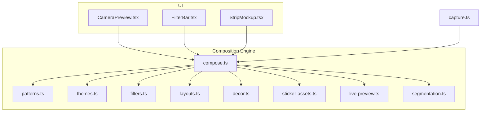
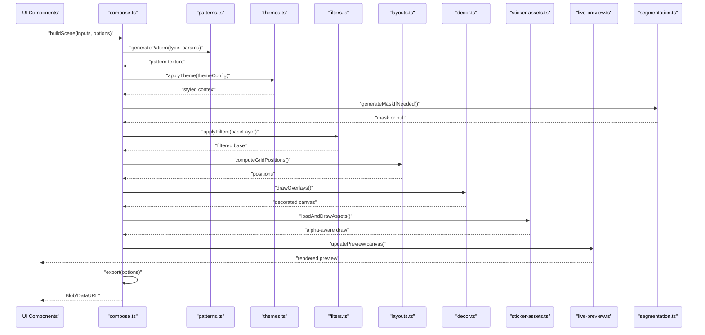
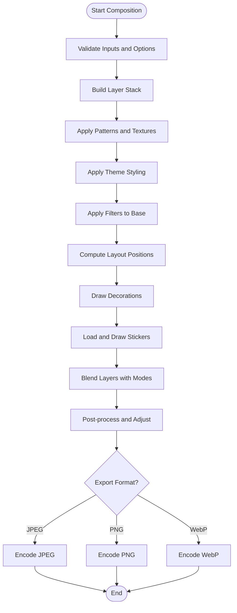
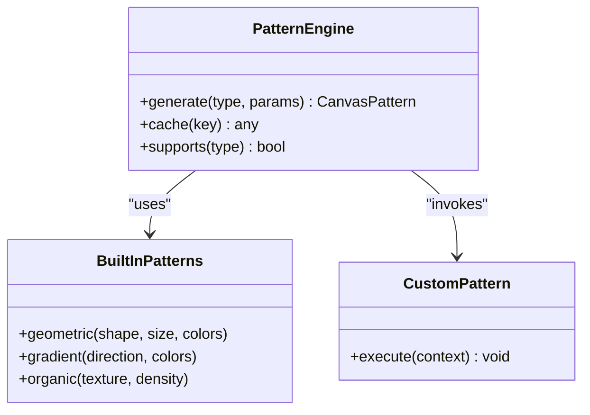
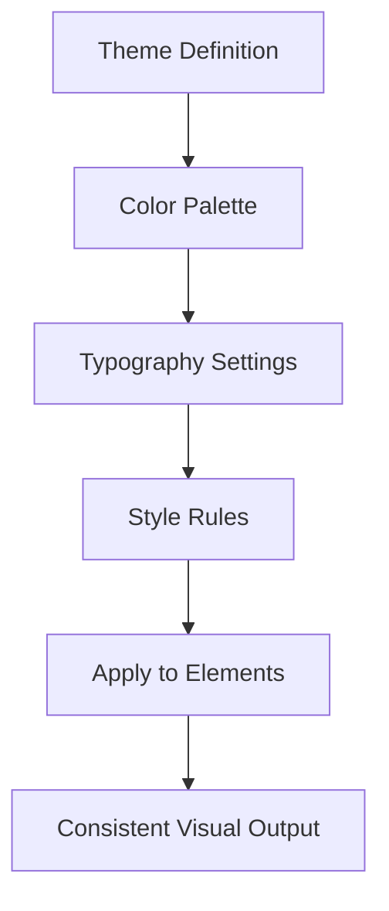
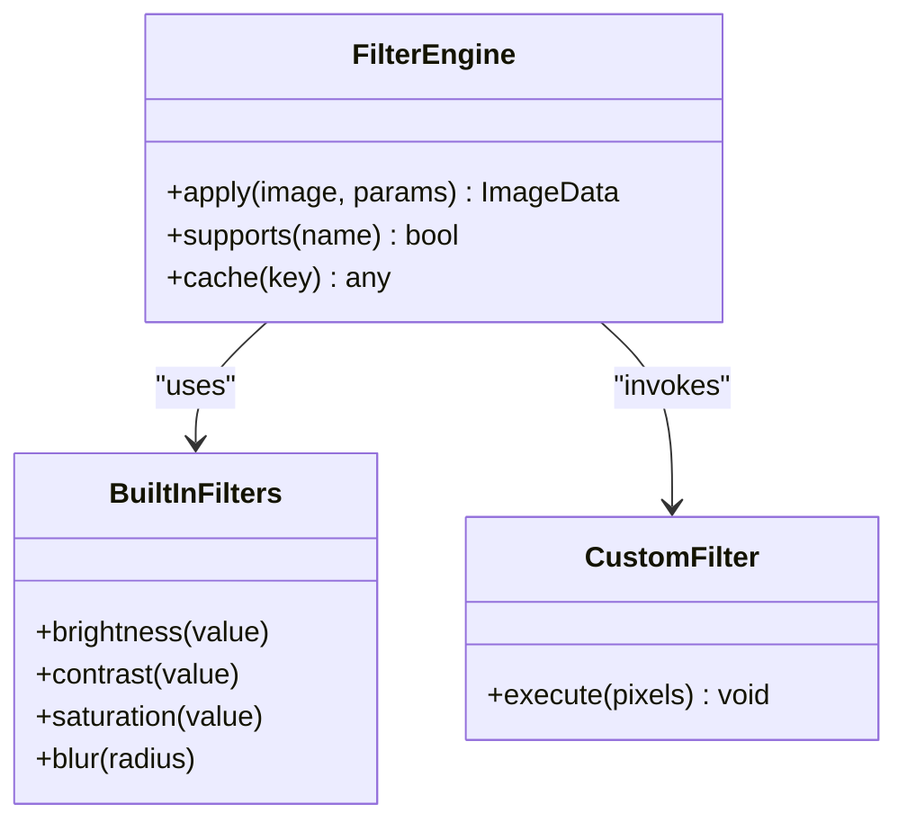
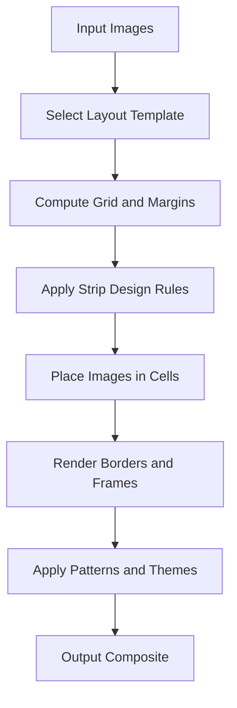
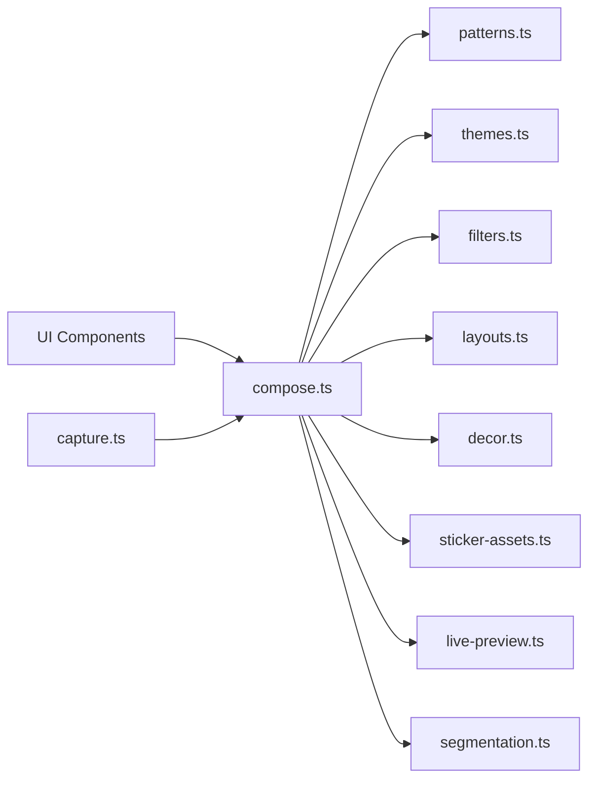

# Image Composition

<cite>
**Referenced Files in This Document**
- [compose.ts](file://lib/compose.ts)
- [patterns.ts](file://lib/patterns.ts)
- [themes.ts](file://lib/themes.ts)
- [filters.ts](file://lib/filters.ts)
- [layouts.ts](file://lib/layouts.ts)
- [decor.ts](file://lib/decor.ts)
- [sticker-assets.ts](file://lib/sticker-assets.ts)
- [capture.ts](file://lib/capture.ts)
- [live-preview.ts](file://lib/live-preview.ts)
- [segmentation.ts](file://lib/segmentation.ts)
- [CameraPreview.tsx](file://components/CameraPreview.tsx)
- [FilterBar.tsx](file://components/FilterBar.tsx)
- [StripMockup.tsx](file://components/StripMockup.tsx)
</cite>

## Update Summary
**Changes Made**
- Enhanced composition engine with new strip design capabilities
- Integrated pattern and theme systems for dynamic visual styling
- Refactored layer management for improved performance and flexibility
- Added support for complex strip layouts and themed compositions

## Table of Contents
1. [Introduction](#introduction)
2. [Project Structure](#project-structure)
3. [Core Components](#core-components)
4. [Architecture Overview](#architecture-overview)
5. [Detailed Component Analysis](#detailed-component-analysis)
6. [Dependency Analysis](#dependency-analysis)
7. [Performance Considerations](#performance-considerations)
8. [Troubleshooting Guide](#troubleshooting-guide)
9. [Conclusion](#conclusion)
10. [Appendices](#appendices)

## Introduction
This document explains the enhanced image composition engine that combines filters, stickers, patterns, themes, and layouts into final images using a canvas-based pipeline. The recent refactoring introduces sophisticated strip design capabilities and a comprehensive pattern/theme system, enabling dynamic visual styling and complex compositional workflows. It covers layer ordering, blending modes, alpha channel handling, the composition API for programmatic manipulation, batch operations, export formatting, complex compositions, custom drawing, performance optimization, memory management for large images, asynchronous processing, and browser-specific optimizations with fallbacks.

## Project Structure
The composition system is implemented primarily under lib/, with UI components integrating it at the edges:
- lib/compose.ts: Core composition orchestration, layering, blending, and export with enhanced strip design support
- lib/patterns.ts: Pattern definitions and texture generation for backgrounds and overlays
- lib/themes.ts: Theme management system for consistent visual styling across compositions
- lib/filters.ts: Filter definitions and pixel-level transformations
- lib/layouts.ts: Layout templates and grid arrangements with strip layout enhancements
- lib/decor.ts: Decorative overlays and frame rendering
- lib/sticker-assets.ts: Sticker asset registry and loading helpers
- lib/capture.ts: Capture workflow integration (camera to canvas)
- lib/live-preview.ts: Real-time preview updates during editing
- lib/segmentation.ts: Background segmentation for advanced compositing
- components/CameraPreview.tsx: Camera feed and capture triggers
- components/FilterBar.tsx: Filter selection UI
- components/StripMockup.tsx: Strip layout preview and export

**Diagram sources**
- [compose.ts](file://lib/compose.ts)
- [patterns.ts](file://lib/patterns.ts)
- [themes.ts](file://lib/themes.ts)
- [filters.ts](file://lib/filters.ts)
- [layouts.ts](file://lib/layouts.ts)
- [decor.ts](file://lib/decor.ts)
- [sticker-assets.ts](file://lib/sticker-assets.ts)
- [live-preview.ts](file://lib/live-preview.ts)
- [segmentation.ts](file://lib/segmentation.ts)
- [CameraPreview.tsx](file://components/CameraPreview.tsx)
- [FilterBar.tsx](file://components/FilterBar.tsx)
- [StripMockup.tsx](file://components/StripMockup.tsx)

**Section sources**
- [compose.ts](file://lib/compose.ts)
- [patterns.ts](file://lib/patterns.ts)
- [themes.ts](file://lib/themes.ts)
- [filters.ts](file://lib/filters.ts)
- [layouts.ts](file://lib/layouts.ts)
- [decor.ts](file://lib/decor.ts)
- [sticker-assets.ts](file://lib/sticker-assets.ts)
- [capture.ts](file://lib/capture.ts)
- [live-preview.ts](file://lib/live-preview.ts)
- [segmentation.ts](file://lib/segmentation.ts)
- [CameraPreview.tsx](file://components/CameraPreview.tsx)
- [FilterBar.tsx](file://components/FilterBar.tsx)
- [StripMockup.tsx](file://components/StripMockup.tsx)

## Core Components
- Composition orchestrator: Builds a layered scene from base image, filters, decorations, stickers, patterns, themes, and layout frames; manages draw order and blending; produces final raster output with enhanced strip design capabilities.
- Patterns system: Generates and applies repeating textures, gradients, and decorative patterns to backgrounds and overlays.
- Themes system: Manages consistent color schemes, typography, and visual styles across all composition elements.
- Filters: Pixel shaders or Canvas2D operations applied to layers or the composite; supports brightness, contrast, saturation, blur, colorize, and custom effects.
- Layouts: Grid and arrangement templates that position multiple inputs (e.g., photo strips, collages) with enhanced strip layout support.
- Decor: Overlays such as borders, frames, watermarks, and text elements.
- Stickers: PNG assets with alpha channels placed on top of the composition; supports scaling, rotation, and opacity.
- Live preview: Incremental redraws while editing to maintain responsiveness.
- Segmentation: Optional background removal or mask generation to enable cutouts and masking within the composition.

Key responsibilities:
- Layer ordering: Base image -> patterns -> themes -> filters -> decor -> stickers -> layout frames
- Blending modes: Normal, multiply, screen, overlay, soft-light, etc., per layer
- Alpha handling: Preserve transparency across stickers and masks; premultiplied alpha where appropriate
- Export formats: JPEG, PNG, WebP with configurable quality and metadata
- Strip design: Specialized layouts for photo strips with customizable spacing, borders, and decorative elements

**Section sources**
- [compose.ts](file://lib/compose.ts)
- [patterns.ts](file://lib/patterns.ts)
- [themes.ts](file://lib/themes.ts)
- [filters.ts](file://lib/filters.ts)
- [layouts.ts](file://lib/layouts.ts)
- [decor.ts](file://lib/decor.ts)
- [sticker-assets.ts](file://lib/sticker-assets.ts)
- [live-preview.ts](file://lib/live-preview.ts)
- [segmentation.ts](file://lib/segmentation.ts)

## Architecture Overview
The enhanced composition engine follows a modular pipeline architecture with integrated pattern and theme systems:
- Input acquisition: Captured images or user uploads
- Scene graph: Ordered list of layers with properties (image, filter, blend mode, transform, alpha, pattern, theme)
- Pattern application: Generate and apply textures and decorative patterns
- Theme integration: Apply consistent visual styling across all elements
- Rendering: Canvas2D draw calls per layer in order, applying filters, patterns, and blending
- Post-processing: Final adjustments, compression, and format conversion
- Output: Blob or data URL for download or upload

**Diagram sources**
- [compose.ts](file://lib/compose.ts)
- [patterns.ts](file://lib/patterns.ts)
- [themes.ts](file://lib/themes.ts)
- [filters.ts](file://lib/filters.ts)
- [layouts.ts](file://lib/layouts.ts)
- [decor.ts](file://lib/decor.ts)
- [sticker-assets.ts](file://lib/sticker-assets.ts)
- [live-preview.ts](file://lib/live-preview.ts)
- [segmentation.ts](file://lib/segmentation.ts)

## Detailed Component Analysis

### Enhanced Composition Orchestrator
Responsibilities:
- Accepts scene description: base image, filters, decorations, stickers, patterns, themes, and layout config
- Computes effective resolution and aspect ratio with strip design considerations
- Manages layer stack and draw order with pattern and theme integration
- Applies blending modes and alpha compositing
- Exports to requested format with quality settings

Key behaviors:
- Batch operations: Compose multiple scenes concurrently using async tasks
- Memory management: Reuse canvases, offscreen buffers, and release intermediate images
- Error handling: Graceful fallbacks when features are unavailable
- Strip design support: Specialized handling for photo strip layouts with customizable spacing and decoration

**Updated** Enhanced with pattern and theme system integration for dynamic visual styling

**Diagram sources**
- [compose.ts](file://lib/compose.ts)

**Section sources**
- [compose.ts](file://lib/compose.ts)

### Patterns System
Capabilities:
- Pattern generation: Create repeating textures, gradients, and decorative patterns
- Texture application: Apply patterns to backgrounds, borders, and overlays
- Custom patterns: Support for user-defined pattern definitions
- Performance optimization: Cache generated patterns and reuse across compositions

Implementation notes:
- Use Canvas2D for pattern generation with efficient tiling
- Support various pattern types: geometric, organic, gradient-based
- Integrate with theme system for consistent color schemes

**Diagram sources**
- [patterns.ts](file://lib/patterns.ts)

**Section sources**
- [patterns.ts](file://lib/patterns.ts)

### Themes System
Capabilities:
- Theme management: Define and apply consistent visual styles across compositions
- Color schemes: Manage palettes for backgrounds, text, borders, and accents
- Typography: Handle font families, sizes, and styling
- Style inheritance: Support theme hierarchies and overrides

Usage patterns:
- Predefined themes for common use cases (minimal, vibrant, vintage, etc.)
- Dynamic theme switching during composition
- Theme-aware pattern and filter applications

**Diagram sources**
- [themes.ts](file://lib/themes.ts)

**Section sources**
- [themes.ts](file://lib/themes.ts)

### Filters System
Capabilities:
- Built-in filters: Brightness, contrast, saturation, hue, blur, sepia, grayscale
- Custom filters: User-defined functions operating on pixel data
- Performance: GPU-accelerated via CSS filters when possible; otherwise Canvas2D pixel manipulation

Implementation notes:
- Prefer non-destructive filter application by creating temporary canvases
- Cache filter results when parameters do not change
- Provide fallbacks for unsupported filter combinations

**Diagram sources**
- [filters.ts](file://lib/filters.ts)

**Section sources**
- [filters.ts](file://lib/filters.ts)

### Enhanced Layouts System
Capabilities:
- Predefined templates: Photo strip, collage grids, polaroid frames with enhanced strip layouts
- Dynamic sizing: Responsive to input dimensions and target aspect ratios
- Position computation: Calculates bounding boxes and margins with strip-specific spacing
- Strip design: Specialized layouts for sequential photo arrangements with customizable borders and spacing

Usage patterns:
- Provide layout config with spacing, padding, alignment, and strip-specific options
- Combine with stickers, decorations, patterns, and themes for themed outputs

**Diagram sources**
- [layouts.ts](file://lib/layouts.ts)

**Section sources**
- [layouts.ts](file://lib/layouts.ts)

### Decor System
Capabilities:
- Overlays: Borders, frames, watermarks, text labels
- Vector and raster support: SVG paths and PNG assets
- Transformations: Scale, rotate, align relative to canvas bounds
- Theme integration: Decorative elements respond to theme changes

Best practices:
- Use pre-rendered assets for performance
- Avoid heavy vector operations on large canvases
- Support theme-aware decorative elements

**Section sources**
- [decor.ts](file://lib/decor.ts)

### Sticker Assets
Capabilities:
- Asset registry: Metadata for sticker files (paths, sizes, categories)
- Loading: Lazy load stickers on demand
- Drawing: Alpha-aware placement with transforms
- Theme integration: Stickers adapt to theme color schemes when applicable

Optimization:
- Decode images once and reuse decoded instances
- Downscale for previews; upscale only for final export

**Section sources**
- [sticker-assets.ts](file://lib/sticker-assets.ts)

### Live Preview
Capabilities:
- Incremental redraws: Update only changed layers
- Throttling: Debounce rapid edits to maintain FPS
- Low-res previews: Render smaller canvases for real-time feedback
- Pattern and theme preview: Show real-time effects of pattern and theme changes

Integration:
- Connects UI interactions to composition updates
- Provides snapshot APIs for final render

**Section sources**
- [live-preview.ts](file://lib/live-preview.ts)

### Segmentation
Capabilities:
- Background removal: Generate masks for foreground isolation
- Mask application: Use masks to composite subjects onto new backgrounds
- Fallback: If segmentation fails, continue without masking

Notes:
- May use WebAssembly models for performance
- Asynchronous processing to avoid blocking UI

**Section sources**
- [segmentation.ts](file://lib/segmentation.ts)

### Capture Integration
Capabilities:
- Camera access: Stream video and capture frames
- Conversion: Convert MediaStream frames to ImageBitmap or CanvasImageSource
- Pipeline trigger: Kick off composition after capture

**Section sources**
- [capture.ts](file://lib/capture.ts)
- [CameraPreview.tsx](file://components/CameraPreview.tsx)

### UI Components
- CameraPreview.tsx: Initializes camera, captures frames, and triggers composition
- FilterBar.tsx: Presents filter options and applies them to current scene
- StripMockup.tsx: Shows strip layout preview and export actions with pattern and theme controls

**Section sources**
- [CameraPreview.tsx](file://components/CameraPreview.tsx)
- [FilterBar.tsx](file://components/FilterBar.tsx)
- [StripMockup.tsx](file://components/StripMockup.tsx)

## Dependency Analysis
The enhanced composition engine has clear separation of concerns with integrated pattern and theme systems:
- compose.ts depends on patterns.ts, themes.ts, filters.ts, layouts.ts, decor.ts, sticker-assets.ts, live-preview.ts, segmentation.ts
- UI components depend on compose.ts for building and exporting scenes
- capture.ts bridges media streams into the composition pipeline

**Diagram sources**
- [compose.ts](file://lib/compose.ts)
- [patterns.ts](file://lib/patterns.ts)
- [themes.ts](file://lib/themes.ts)
- [filters.ts](file://lib/filters.ts)
- [layouts.ts](file://lib/layouts.ts)
- [decor.ts](file://lib/decor.ts)
- [sticker-assets.ts](file://lib/sticker-assets.ts)
- [live-preview.ts](file://lib/live-preview.ts)
- [segmentation.ts](file://lib/segmentation.ts)
- [capture.ts](file://lib/capture.ts)
- [CameraPreview.tsx](file://components/CameraPreview.tsx)
- [FilterBar.tsx](file://components/FilterBar.tsx)
- [StripMockup.tsx](file://components/StripMockup.tsx)

**Section sources**
- [compose.ts](file://lib/compose.ts)
- [patterns.ts](file://lib/patterns.ts)
- [themes.ts](file://lib/themes.ts)
- [filters.ts](file://lib/filters.ts)
- [layouts.ts](file://lib/layouts.ts)
- [decor.ts](file://lib/decor.ts)
- [sticker-assets.ts](file://lib/sticker-assets.ts)
- [live-preview.ts](file://lib/live-preview.ts)
- [segmentation.ts](file://lib/segmentation.ts)
- [capture.ts](file://lib/capture.ts)
- [CameraPreview.tsx](file://components/CameraPreview.tsx)
- [FilterBar.tsx](file://components/FilterBar.tsx)
- [StripMockup.tsx](file://components/StripMockup.tsx)

## Performance Considerations
- Canvas reuse: Allocate one or few offscreen canvases and clear/redraw instead of creating new ones per frame
- Image decoding: Decode images once and cache decoded instances; avoid re-decoding on each composition
- Pattern caching: Cache generated patterns and textures to avoid regeneration
- Theme optimization: Minimize theme switching overhead through efficient style propagation
- Batch operations: Process multiple images asynchronously using requestIdleCallback or Web Workers if available
- Memory management: Release intermediate ImageData and bitmaps promptly; prefer ImageBitmap for fast transfers
- Filtering strategy: Use CSS filters for simple effects; fall back to pixel manipulation only when necessary
- Resolution scaling: Render previews at lower resolution; scale up only for final export
- Browser capabilities: Detect supported features (e.g., createImageBitmap, OffscreenCanvas) and adapt accordingly

**Updated** Added pattern and theme optimization strategies for better performance

## Troubleshooting Guide
Common issues and resolutions:
- Blank or black output: Ensure all images are fully loaded before drawing; check cross-origin restrictions
- Incorrect blending: Verify blend mode names and alpha values; ensure premultiplied alpha where required
- Slow performance: Reduce canvas size for previews; disable heavy filters; use cached assets and patterns
- Memory leaks: Confirm that intermediate canvases and ImageData are released; avoid retaining references
- Segmentation failures: Provide fallback behavior when mask generation fails; log errors and continue composition
- Pattern rendering issues: Check pattern dimensions and tiling parameters; verify canvas compatibility
- Theme conflicts: Ensure theme color schemes don't conflict with existing element styles

**Updated** Added troubleshooting guidance for pattern and theme-related issues

**Section sources**
- [compose.ts](file://lib/compose.ts)
- [patterns.ts](file://lib/patterns.ts)
- [themes.ts](file://lib/themes.ts)
- [filters.ts](file://lib/filters.ts)
- [live-preview.ts](file://lib/live-preview.ts)
- [segmentation.ts](file://lib/segmentation.ts)

## Conclusion
The enhanced image composition engine provides a robust, modular pipeline for combining filters, patterns, themes, stickers, and layouts into high-quality images. The recent refactoring introduces sophisticated strip design capabilities and a comprehensive pattern/theme system, enabling dynamic visual styling and complex compositional workflows. By leveraging canvas-based rendering, careful layer management, and performance optimizations, it delivers responsive editing experiences and reliable exports across browsers. The documented API and best practices enable both simple and complex compositions while maintaining memory efficiency and asynchronous processing.

**Updated** Enhanced with pattern and theme system capabilities for more sophisticated visual compositions

## Appendices

### Enhanced Composition API Summary
- buildScene(inputs, options): Construct a scene with base images, filters, decorations, stickers, patterns, themes, and layout configuration
- applyFilters(layer, filterParams): Apply filter parameters to a layer
- setBlendingMode(layerIndex, mode): Configure blending mode for a layer
- addSticker(assetId, transform, alpha): Place a sticker with positioning and opacity
- generatePattern(type, params): Create and apply pattern textures
- applyTheme(themeConfig): Apply consistent visual styling across composition
- computeLayout(template, dimensions): Calculate positions for layout cells with strip design support
- export(format, quality): Encode the final composition to JPEG, PNG, or WebP

**Updated** Added pattern and theme API methods

[No sources needed since this section provides general guidance]

### Example Workflows
- Photo strip creation: Capture image -> select strip layout -> add patterns and themes -> add stickers -> export PNG
- Collage with filters: Upload multiple images -> apply filters -> arrange in grid -> add decorative frame -> apply theme -> export WebP
- Advanced compositing: Segment subject -> remove background -> place on new background -> apply color filters -> add patterns -> export JPEG
- Themed compositions: Select theme -> apply consistent styling -> add patterns -> arrange layouts -> export with brand consistency

**Updated** Added examples demonstrating pattern and theme usage

[No sources needed since this section provides general guidance]

### Strip Design Examples
- Classic photo strip: Sequential vertical layout with equal spacing and decorative borders
- Modern collage strip: Asymmetric layout with varying cell sizes and overlapping elements
- Themed strip: Brand-consistent strip with custom colors, fonts, and decorative patterns
- Interactive strip: Dynamic strip that responds to user selections and theme changes

**New Section** Added specific guidance for strip design implementations

[No sources needed since this section provides general guidance]