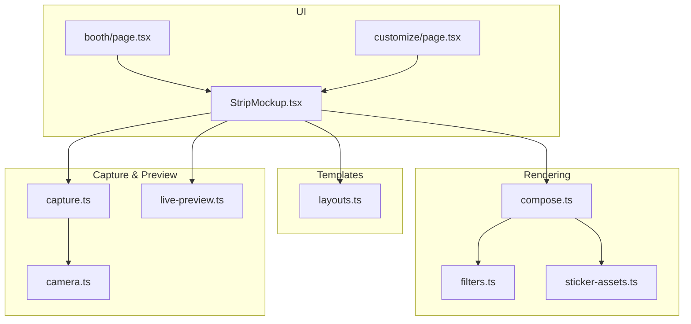
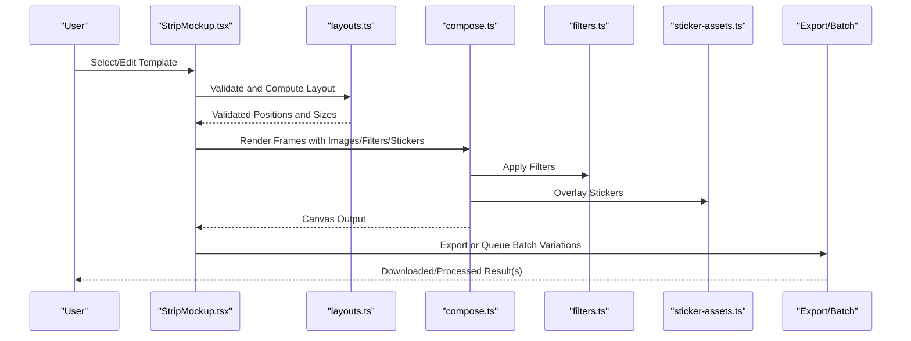
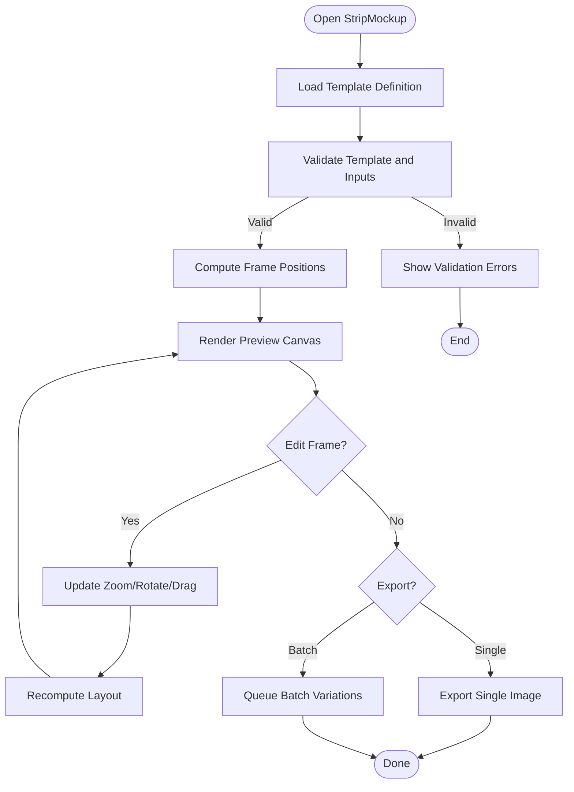
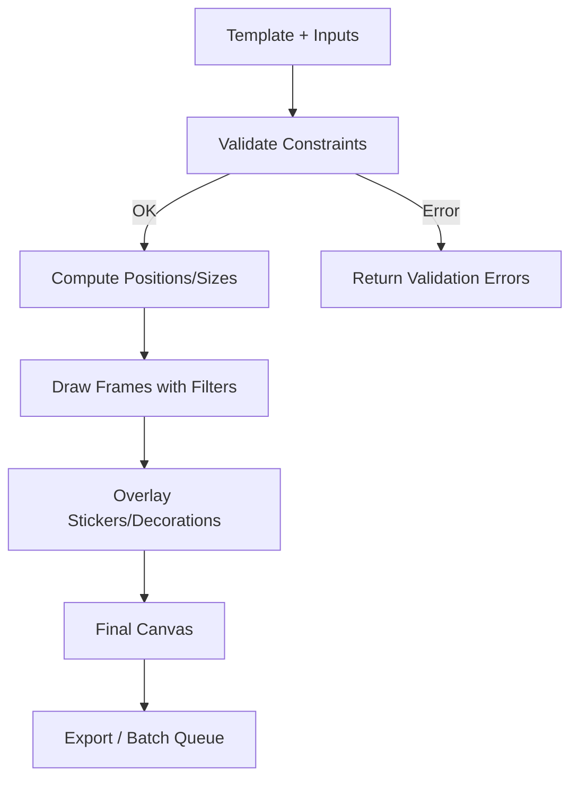
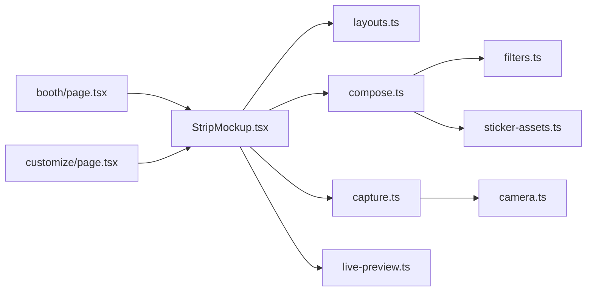

# Layout Templates

<cite>
**Referenced Files in This Document**
- [StripMockup.tsx](file://components/StripMockup.tsx)
- [layouts.ts](file://lib/layouts.ts)
- [compose.ts](file://lib/compose.ts)
- [filters.ts](file://lib/filters.ts)
- [capture.ts](file://lib/capture.ts)
- [camera.ts](file://lib/camera.ts)
- [live-preview.ts](file://lib/live-preview.ts)
- [sticker-assets.ts](file://lib/sticker-assets.ts)
- [page.tsx](file://app/booth/page.tsx)
- [page.tsx](file://app/customize/page.tsx)
</cite>

## Table of Contents
1. [Introduction](#introduction)
2. [Project Structure](#project-structure)
3. [Core Components](#core-components)
4. [Architecture Overview](#architecture-overview)
5. [Detailed Component Analysis](#detailed-component-analysis)
6. [Dependency Analysis](#dependency-analysis)
7. [Performance Considerations](#performance-considerations)
8. [Troubleshooting Guide](#troubleshooting-guide)
9. [Conclusion](#conclusion)
10. [Appendices](#appendices)

## Introduction
This document explains the layout templates system used to define, render, and export photobooth layouts such as grids and strips. It covers template definition structure (grid layouts, strip configurations, custom positioning), the StripMockup component for previewing and editing strip-style photos, the rendering pipeline from template definitions to canvas output, examples for creating custom layouts and grid patterns, responsive design considerations, validation and error handling, performance optimization for complex layouts, and integration with the export system and batch processing capabilities.

## Project Structure
The layout templates system spans UI components and library modules:
- UI layer: StripMockup component provides interactive preview and editing for strip-style photos.
- Template definitions: layouts.ts defines grid and strip templates and helper utilities.
- Rendering pipeline: compose.ts orchestrates drawing images, filters, stickers, and decorations onto a canvas.
- Capture and camera: capture.ts and camera.ts provide image sources and metadata.
- Live preview: live-preview.ts supports real-time updates during editing.
- Stickers and assets: sticker-assets.ts manages sticker resources.
- Pages: booth and customize pages integrate the template system into the user flow.

**Diagram sources**
- [StripMockup.tsx](file://components/StripMockup.tsx)
- [layouts.ts](file://lib/layouts.ts)
- [compose.ts](file://lib/compose.ts)
- [filters.ts](file://lib/filters.ts)
- [sticker-assets.ts](file://lib/sticker-assets.ts)
- [capture.ts](file://lib/capture.ts)
- [camera.ts](file://lib/camera.ts)
- [live-preview.ts](file://lib/live-preview.ts)
- [page.tsx](file://app/booth/page.tsx)
- [page.tsx](file://app/customize/page.tsx)

**Section sources**
- [StripMockup.tsx](file://components/StripMockup.tsx)
- [layouts.ts](file://lib/layouts.ts)
- [compose.ts](file://lib/compose.ts)
- [filters.ts](file://lib/filters.ts)
- [capture.ts](file://lib/capture.ts)
- [camera.ts](file://lib/camera.ts)
- [live-preview.ts](file://lib/live-preview.ts)
- [sticker-assets.ts](file://lib/sticker-assets.ts)
- [page.tsx](file://app/booth/page.tsx)
- [page.tsx](file://app/customize/page.tsx)

## Core Components
- StripMockup component: Renders a strip-style photo composition with multiple frames, supports drag-to-reorder, zoom, rotate, and filter application per frame. It integrates with the template system to validate and apply layouts.
- layouts module: Defines grid and strip templates, computes cell positions, handles aspect ratios, and exposes helpers for generating variations.
- compose module: Draws images, applies filters, overlays stickers/decorations, and writes final canvas output.
- capture and camera modules: Provide image data and metadata for frames.
- live-preview module: Enables real-time updates while editing.
- sticker-assets module: Supplies sticker resources and metadata.

Key responsibilities:
- Template parsing and validation
- Responsive layout computation
- Canvas rendering pipeline
- Interactive editing features
- Export and batch generation

**Section sources**
- [StripMockup.tsx](file://components/StripMockup.tsx)
- [layouts.ts](file://lib/layouts.ts)
- [compose.ts](file://lib/compose.ts)
- [capture.ts](file://lib/capture.ts)
- [camera.ts](file://lib/camera.ts)
- [live-preview.ts](file://lib/live-preview.ts)
- [sticker-assets.ts](file://lib/sticker-assets.ts)

## Architecture Overview
The rendering pipeline transforms template definitions into a canvas image:
1. User selects or edits a template via StripMockup.
2. layouts.ts validates and computes positions for each frame based on grid/strip configuration.
3. compose.ts draws images, applies filters, and overlays stickers.
4. Final canvas is exported or queued for batch processing.

**Diagram sources**
- [StripMockup.tsx](file://components/StripMockup.tsx)
- [layouts.ts](file://lib/layouts.ts)
- [compose.ts](file://lib/compose.ts)
- [filters.ts](file://lib/filters.ts)
- [sticker-assets.ts](file://lib/sticker-assets.ts)

## Detailed Component Analysis

### StripMockup Component
Responsibilities:
- Displays a strip-style composition with multiple frames.
- Supports interactive editing: drag to reorder frames, zoom, rotate, and apply per-frame filters.
- Integrates with layouts.ts to ensure frame positions conform to the selected template.
- Provides real-time preview updates via live-preview.ts.
- Exposes actions to export single results or queue batch variations.

Editing workflow:
- Frame selection and manipulation update internal state.
- On change, layouts.ts recomputes positions and validates constraints.
- compose.ts re-renders the canvas with updated transformations.
- Export triggers either immediate download or batch job creation.

**Diagram sources**
- [StripMockup.tsx](file://components/StripMockup.tsx)
- [layouts.ts](file://lib/layouts.ts)
- [compose.ts](file://lib/compose.ts)
- [live-preview.ts](file://lib/live-preview.ts)

**Section sources**
- [StripMockup.tsx](file://components/StripMockup.tsx)
- [layouts.ts](file://lib/layouts.ts)
- [compose.ts](file://lib/compose.ts)
- [live-preview.ts](file://lib/live-preview.ts)

### Template Definition Structure
The template system supports:
- Grid layouts: rows x columns with configurable spacing, margins, and aspect ratio rules.
- Strip configurations: vertical or horizontal sequences of frames with consistent sizing and optional header/footer areas.
- Custom positioning systems: absolute or relative coordinates, anchors, and scaling factors for precise control.

Key aspects:
- Validation ensures all frames fit within the canvas bounds and respect minimum sizes.
- Responsive behavior adapts to different screen sizes while preserving proportions.
- Helpers generate variations by swapping images, applying filters, or adjusting spacing.

Examples:
- Creating a custom grid: define rows, columns, spacing, and margin; assign images to cells; compute positions using aspect ratio rules.
- Defining a strip pattern: specify orientation, frame count, padding, and alignment; optionally add decorative elements.

**Section sources**
- [layouts.ts](file://lib/layouts.ts)

### Rendering Pipeline
Steps from definition to canvas output:
1. Parse template and inputs (images, filters, stickers).
2. Validate template constraints and input dimensions.
3. Compute frame positions and sizes based on grid/strip rules.
4. Draw each frame onto the canvas, applying transformations and filters.
5. Overlay stickers and decorations.
6. Produce final canvas for export or further processing.

**Diagram sources**
- [layouts.ts](file://lib/layouts.ts)
- [compose.ts](file://lib/compose.ts)
- [filters.ts](file://lib/filters.ts)
- [sticker-assets.ts](file://lib/sticker-assets.ts)

**Section sources**
- [compose.ts](file://lib/compose.ts)
- [filters.ts](file://lib/filters.ts)
- [sticker-assets.ts](file://lib/sticker-assets.ts)
- [layouts.ts](file://lib/layouts.ts)

### Integration with Export and Batch Processing
- Single export: renders the current composition and triggers a download.
- Batch processing: queues multiple variations by iterating over permutations of images, filters, and layout tweaks; processes asynchronously and returns results.
- Error handling: captures failures per variation and aggregates errors for reporting.

**Section sources**
- [compose.ts](file://lib/compose.ts)
- [StripMockup.tsx](file://components/StripMockup.tsx)

## Dependency Analysis
Component relationships and coupling:
- StripMockup depends on layouts.ts for validation and position computation.
- compose.ts depends on filters.ts and sticker-assets.ts for rendering effects.
- capture.ts and camera.ts supply image data and metadata to StripMockup.
- live-preview.ts enables real-time updates during editing.
- Pages integrate these modules into the user flow.

**Diagram sources**
- [StripMockup.tsx](file://components/StripMockup.tsx)
- [layouts.ts](file://lib/layouts.ts)
- [compose.ts](file://lib/compose.ts)
- [filters.ts](file://lib/filters.ts)
- [sticker-assets.ts](file://lib/sticker-assets.ts)
- [capture.ts](file://lib/capture.ts)
- [camera.ts](file://lib/camera.ts)
- [live-preview.ts](file://lib/live-preview.ts)
- [page.tsx](file://app/booth/page.tsx)
- [page.tsx](file://app/customize/page.tsx)

**Section sources**
- [StripMockup.tsx](file://components/StripMockup.tsx)
- [layouts.ts](file://lib/layouts.ts)
- [compose.ts](file://lib/compose.ts)
- [filters.ts](file://lib/filters.ts)
- [sticker-assets.ts](file://lib/sticker-assets.ts)
- [capture.ts](file://lib/capture.ts)
- [camera.ts](file://lib/camera.ts)
- [live-preview.ts](file://lib/live-preview.ts)
- [page.tsx](file://app/booth/page.tsx)
- [page.tsx](file://app/customize/page.tsx)

## Performance Considerations
- Canvas batching: group draw operations to minimize context switches.
- Image resizing: pre-scale images to target dimensions before drawing.
- Filter caching: cache computed filter results when possible.
- Lazy loading: load stickers and assets on demand.
- Throttling: debounce live-preview updates during heavy edits.
- Memory management: release intermediate canvases and large buffers after use.

[No sources needed since this section provides general guidance]

## Troubleshooting Guide
Common issues and resolutions:
- Invalid template: check grid/strip constraints, ensure frame counts match expectations, verify aspect ratios.
- Missing images: validate that all required frames have valid image sources.
- Rendering artifacts: confirm correct coordinate calculations and clipping regions.
- Export failures: inspect error logs per variation and retry failed jobs.
- Slow previews: reduce filter complexity, enable throttling, and optimize asset loading.

**Section sources**
- [layouts.ts](file://lib/layouts.ts)
- [compose.ts](file://lib/compose.ts)
- [StripMockup.tsx](file://components/StripMockup.tsx)

## Conclusion
The layout templates system provides a robust framework for defining and rendering photobooth layouts, including grids and strips, with interactive editing and export capabilities. By leveraging validated template definitions, efficient rendering pipelines, and responsive design principles, it supports both simple and complex compositions. Proper error handling and performance optimizations ensure reliable operation even with intricate layouts and batch processing scenarios.

[No sources needed since this section summarizes without analyzing specific files]

## Appendices
- Example: Creating a custom grid layout
  - Define rows, columns, spacing, and margins.
  - Assign images to cells and compute positions.
  - Validate constraints and render preview.
- Example: Defining a strip pattern
  - Specify orientation, frame count, padding, and alignment.
  - Add header/footer if needed.
  - Apply filters and stickers per frame.
- Responsive design tips
  - Use relative units and aspect ratio rules.
  - Adapt spacing and margins for smaller screens.
  - Ensure minimum frame sizes for readability.

[No sources needed since this section provides general guidance]