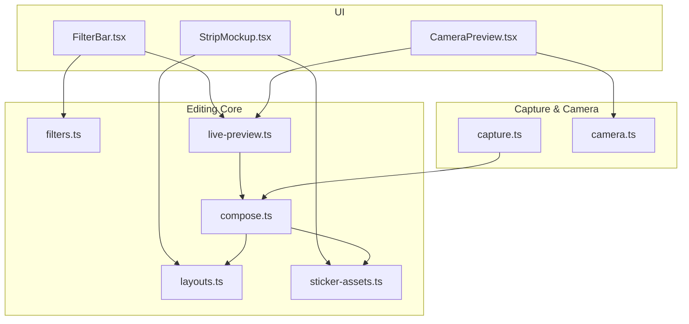
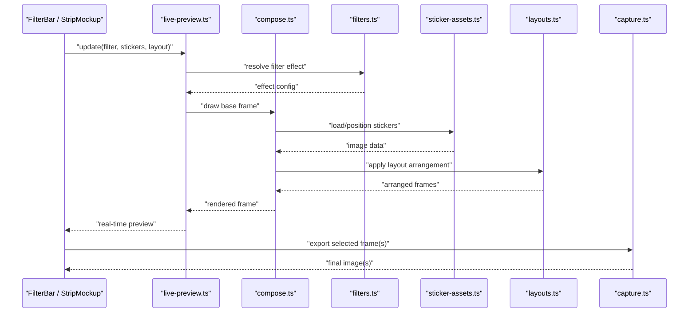
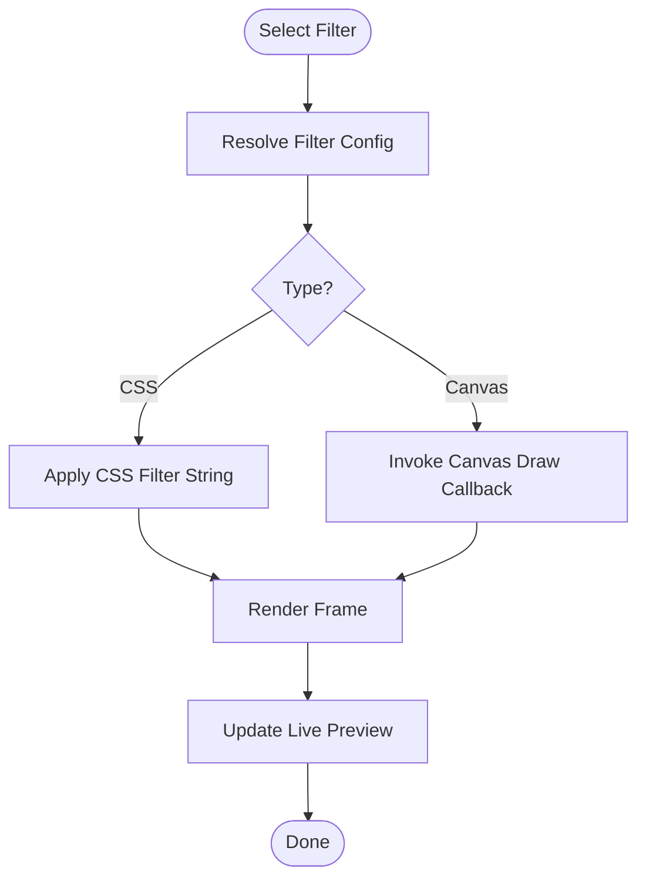
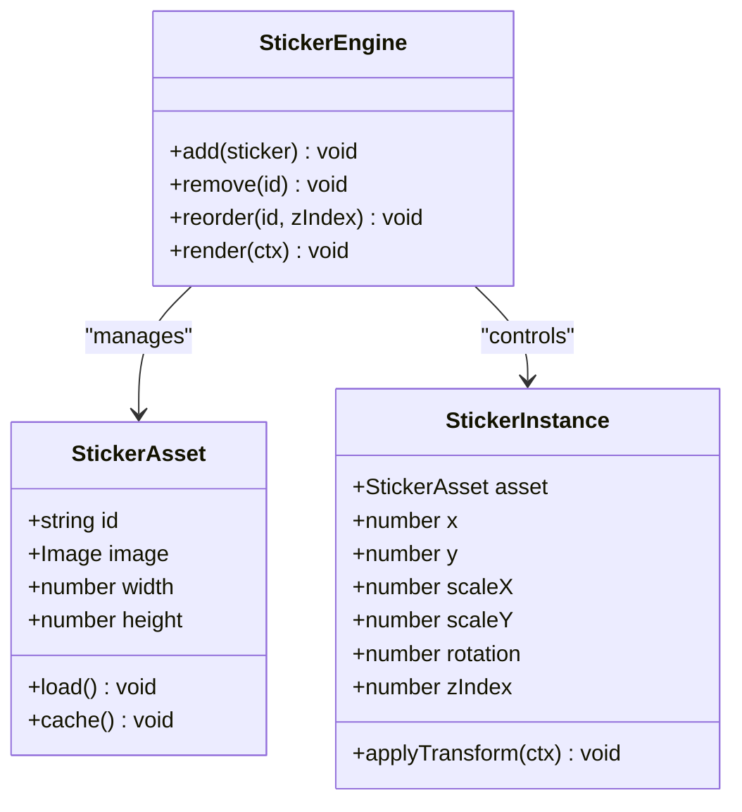
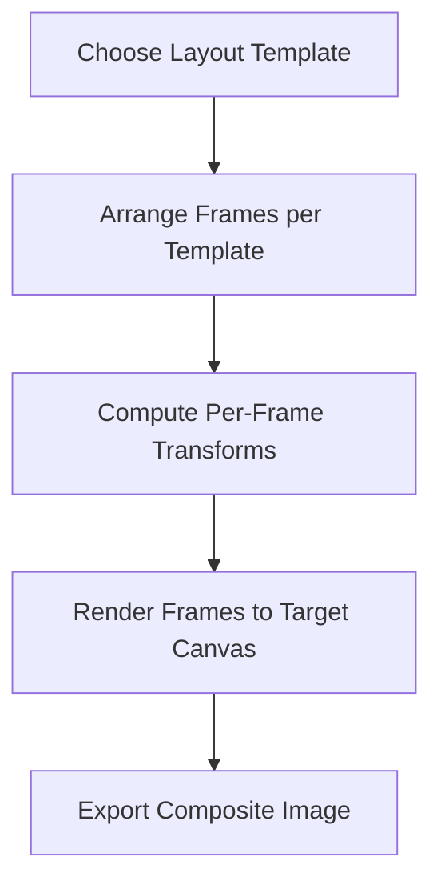
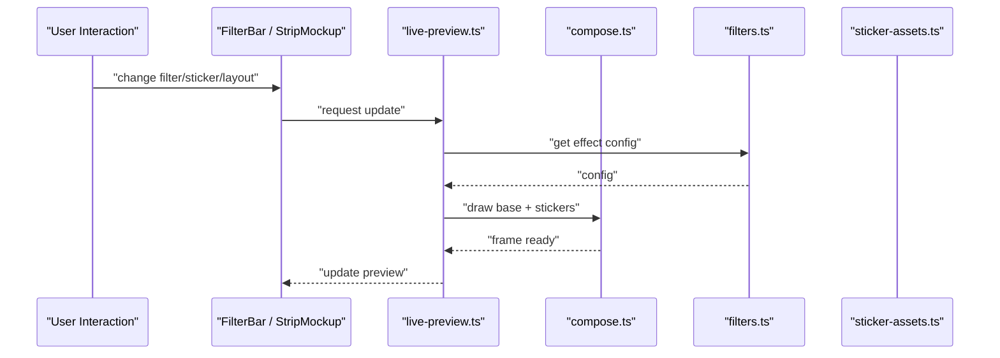
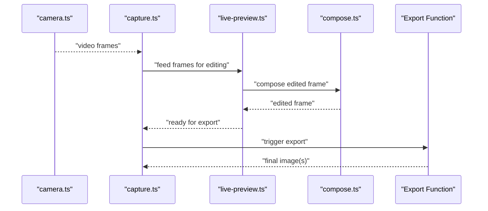
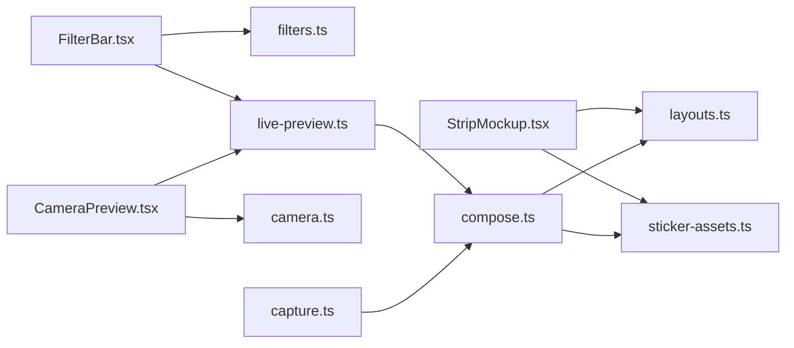

# Photo Editing Pipeline

<cite>
**Referenced Files in This Document**
- [filters.ts](file://lib/filters.ts)
- [compose.ts](file://lib/compose.ts)
- [layouts.ts](file://lib/layouts.ts)
- [sticker-assets.ts](file://lib/sticker-assets.ts)
- [live-preview.ts](file://lib/live-preview.ts)
- [capture.ts](file://lib/capture.ts)
- [camera.ts](file://lib/camera.ts)
- [FilterBar.tsx](file://components/FilterBar.tsx)
- [StripMockup.tsx](file://components/StripMockup.tsx)
- [CameraPreview.tsx](file://components/CameraPreview.tsx)
</cite>

## Table of Contents
1. [Introduction](#introduction)
2. [Project Structure](#project-structure)
3. [Core Components](#core-components)
4. [Architecture Overview](#architecture-overview)
5. [Detailed Component Analysis](#detailed-component-analysis)
6. [Dependency Analysis](#dependency-analysis)
7. [Performance Considerations](#performance-considerations)
8. [Troubleshooting Guide](#troubleshooting-guide)
9. [Conclusion](#conclusion)

## Introduction
This document explains the photo editing pipeline subsystem, focusing on:
- Filter system architecture (CSS filters and canvas-based effects) with real-time preview
- Sticker overlay engine supporting positioning, scaling, and rotation
- Layout templates for strip photos and batch processing
- Integration with capture and export flows
- Configuration options for custom filters, sticker libraries, and layout definitions
- Performance considerations for real-time editing and memory optimization for large images

The goal is to provide both a high-level understanding and code-level insights so that developers can extend or optimize the pipeline effectively.

## Project Structure
The editing pipeline spans library modules and UI components:
- lib/filters.ts: filter definitions and application logic
- lib/compose.ts: canvas composition operations
- lib/layouts.ts: layout templates and batch processing helpers
- lib/sticker-assets.ts: sticker asset management
- lib/live-preview.ts: real-time preview rendering
- lib/capture.ts and lib/camera.ts: integration with capture and camera streams
- components/FilterBar.tsx: UI for selecting and applying filters
- components/StripMockup.tsx: UI for layout template selection and preview
- components/CameraPreview.tsx: live camera feed used by preview and capture

**Diagram sources**
- [filters.ts](file://lib/filters.ts)
- [compose.ts](file://lib/compose.ts)
- [layouts.ts](file://lib/layouts.ts)
- [sticker-assets.ts](file://lib/sticker-assets.ts)
- [live-preview.ts](file://lib/live-preview.ts)
- [capture.ts](file://lib/capture.ts)
- [camera.ts](file://lib/camera.ts)
- [FilterBar.tsx](file://components/FilterBar.tsx)
- [StripMockup.tsx](file://components/StripMockup.tsx)
- [CameraPreview.tsx](file://components/CameraPreview.tsx)

**Section sources**
- [filters.ts](file://lib/filters.ts)
- [compose.ts](file://lib/compose.ts)
- [layouts.ts](file://lib/layouts.ts)
- [sticker-assets.ts](file://lib/sticker-assets.ts)
- [live-preview.ts](file://lib/live-preview.ts)
- [capture.ts](file://lib/capture.ts)
- [camera.ts](file://lib/camera.ts)
- [FilterBar.tsx](file://components/FilterBar.tsx)
- [StripMockup.tsx](file://components/StripMockup.tsx)
- [CameraPreview.tsx](file://components/CameraPreview.tsx)

## Core Components
- Filter System: Defines CSS-based presets and canvas-based effects; applies them to frames for preview and final output.
- Composition Engine: Manages canvas drawing order, blending, and transformations for stickers and overlays.
- Layout Templates: Provides predefined arrangements for strip photos and batch generation.
- Sticker Assets: Loads, caches, and manages sticker resources for efficient rendering.
- Live Preview: Renders real-time updates as users adjust filters, stickers, and layouts.
- Capture Integration: Bridges camera stream and editing pipeline to produce edited frames.

Key responsibilities and interactions are detailed in subsequent sections with diagrams and references to source files.

**Section sources**
- [filters.ts](file://lib/filters.ts)
- [compose.ts](file://lib/compose.ts)
- [layouts.ts](file://lib/layouts.ts)
- [sticker-assets.ts](file://lib/sticker-assets.ts)
- [live-preview.ts](file://lib/live-preview.ts)
- [capture.ts](file://lib/capture.ts)

## Architecture Overview
The editing pipeline follows a layered approach:
- UI layer selects filters, stickers, and layouts
- Live preview composes frames using canvas operations
- Capture integrates with camera stream to feed editable frames
- Export uses the same composition logic to generate final outputs

**Diagram sources**
- [filters.ts](file://lib/filters.ts)
- [compose.ts](file://lib/compose.ts)
- [layouts.ts](file://lib/layouts.ts)
- [sticker-assets.ts](file://lib/sticker-assets.ts)
- [live-preview.ts](file://lib/live-preview.ts)
- [capture.ts](file://lib/capture.ts)

## Detailed Component Analysis

### Filter System Architecture
- CSS Filters: Presets defined as CSS filter strings applied to video or canvas elements for fast preview.
- Canvas-Based Effects: Pixel-level manipulations via ImageData for advanced effects not achievable with CSS alone.
- Real-Time Preview: Uses requestAnimationFrame or throttled updates to maintain smooth interaction while applying filters.

Implementation highlights:
- Filter registry maps user-facing names to effect configurations
- Effect resolution returns either CSS filter string or canvas draw callback
- Preview pipeline composes base frame, applies filter, then overlays stickers/layout

**Diagram sources**
- [filters.ts](file://lib/filters.ts)
- [live-preview.ts](file://lib/live-preview.ts)

**Section sources**
- [filters.ts](file://lib/filters.ts)
- [live-preview.ts](file://lib/live-preview.ts)

### Sticker Overlay Engine
Capabilities:
- Positioning: x/y coordinates relative to canvas bounds
- Scaling: uniform or non-uniform scale factors
- Rotation: angle in radians around center or custom pivot
- Z-order: stacking order for multiple stickers
- Asset Management: lazy loading and caching of sticker images

Rendering flow:
- Load sticker asset if not cached
- Compute transform matrix from position, scale, rotation
- Draw sticker onto canvas with proper blending
- Respect layout constraints and safe zones

**Diagram sources**
- [sticker-assets.ts](file://lib/sticker-assets.ts)
- [compose.ts](file://lib/compose.ts)

**Section sources**
- [sticker-assets.ts](file://lib/sticker-assets.ts)
- [compose.ts](file://lib/compose.ts)

### Layout Templates and Batch Processing
Features:
- Predefined templates for strip photos (e.g., vertical strips, grids)
- Template configuration defines frame count, spacing, margins, and orientation
- Batch processing generates composite images from captured frames according to template rules

Processing steps:
- Select template and arrange frames
- Compute per-frame transforms (scale, crop, align)
- Render each frame into target canvas
- Export composite image

**Diagram sources**
- [layouts.ts](file://lib/layouts.ts)
- [compose.ts](file://lib/compose.ts)

**Section sources**
- [layouts.ts](file://lib/layouts.ts)
- [compose.ts](file://lib/compose.ts)

### Real-Time Preview Pipeline
Responsibilities:
- Maintain low-latency updates when filters or stickers change
- Throttle expensive operations and reuse canvases
- Sync preview state with user interactions

Pipeline overview:
- On input change, schedule preview update
- Compose base frame with current filter
- Overlay stickers and layout markers
- Update DOM or canvas efficiently

**Diagram sources**
- [live-preview.ts](file://lib/live-preview.ts)
- [compose.ts](file://lib/compose.ts)
- [filters.ts](file://lib/filters.ts)
- [sticker-assets.ts](file://lib/sticker-assets.ts)

**Section sources**
- [live-preview.ts](file://lib/live-preview.ts)
- [compose.ts](file://lib/compose.ts)
- [filters.ts](file://lib/filters.ts)
- [sticker-assets.ts](file://lib/sticker-assets.ts)

### Integration with Capture and Export
Capture flow:
- Camera stream provides frames to editing pipeline
- Editing pipeline applies filters, stickers, and layouts
- Export renders final composite and triggers download or upload

Export considerations:
- Use offscreen canvases for high-resolution output
- Preserve aspect ratios and safe zones
- Support batch exports for strip templates

**Diagram sources**
- [camera.ts](file://lib/camera.ts)
- [capture.ts](file://lib/capture.ts)
- [live-preview.ts](file://lib/live-preview.ts)
- [compose.ts](file://lib/compose.ts)

**Section sources**
- [camera.ts](file://lib/camera.ts)
- [capture.ts](file://lib/capture.ts)
- [live-preview.ts](file://lib/live-preview.ts)
- [compose.ts](file://lib/compose.ts)

## Dependency Analysis
The editing pipeline has clear separation between UI, core logic, and capture:
- UI components depend on editing modules for state and rendering
- Editing modules depend on asset loaders and layout definitions
- Capture depends on camera stream and editing output

**Diagram sources**
- [FilterBar.tsx](file://components/FilterBar.tsx)
- [StripMockup.tsx](file://components/StripMockup.tsx)
- [CameraPreview.tsx](file://components/CameraPreview.tsx)
- [filters.ts](file://lib/filters.ts)
- [live-preview.ts](file://lib/live-preview.ts)
- [layouts.ts](file://lib/layouts.ts)
- [sticker-assets.ts](file://lib/sticker-assets.ts)
- [camera.ts](file://lib/camera.ts)
- [compose.ts](file://lib/compose.ts)
- [capture.ts](file://lib/capture.ts)

**Section sources**
- [FilterBar.tsx](file://components/FilterBar.tsx)
- [StripMockup.tsx](file://components/StripMockup.tsx)
- [CameraPreview.tsx](file://components/CameraPreview.tsx)
- [filters.ts](file://lib/filters.ts)
- [live-preview.ts](file://lib/live-preview.ts)
- [layouts.ts](file://lib/layouts.ts)
- [sticker-assets.ts](file://lib/sticker-assets.ts)
- [camera.ts](file://lib/camera.ts)
- [compose.ts](file://lib/compose.ts)
- [capture.ts](file://lib/capture.ts)

## Performance Considerations
- Prefer CSS filters for simple effects to reduce CPU usage during preview
- Defer heavy canvas operations until export or when user pauses interaction
- Reuse canvases and avoid frequent allocation/deallocation
- Cache sticker assets and precompute transforms where possible
- Limit preview resolution; upscale only for final export
- Use requestAnimationFrame or throttling to prevent jank
- Monitor memory usage for large images; release intermediate buffers promptly

[No sources needed since this section provides general guidance]

## Troubleshooting Guide
Common issues and resolutions:
- Blurry or pixelated previews: ensure preview canvas matches source resolution or apply appropriate scaling
- Stickers not appearing: verify asset loading and z-index ordering
- Slow filter switching: switch to CSS-only filters for complex effects or reduce canvas operations
- Memory spikes: check for leaked ImageData or uncached large assets
- Export artifacts: validate layout calculations and safe zone constraints

**Section sources**
- [filters.ts](file://lib/filters.ts)
- [compose.ts](file://lib/compose.ts)
- [sticker-assets.ts](file://lib/sticker-assets.ts)
- [layouts.ts](file://lib/layouts.ts)
- [live-preview.ts](file://lib/live-preview.ts)

## Conclusion
The photo editing pipeline combines CSS and canvas-based filters, a robust sticker overlay engine, and flexible layout templates to deliver real-time editing experiences. By separating concerns across UI, core editing logic, and capture/export flows, the system remains extensible and performant. Following the performance guidelines and troubleshooting tips ensures smooth interactions even with large images and complex compositions.

[No sources needed since this section summarizes without analyzing specific files]