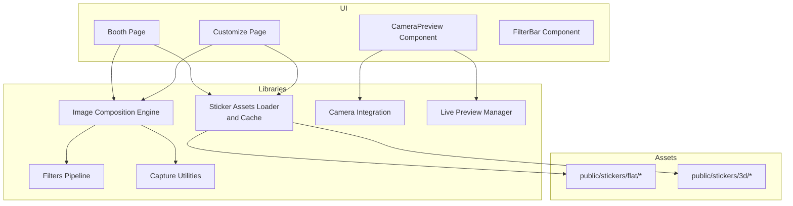
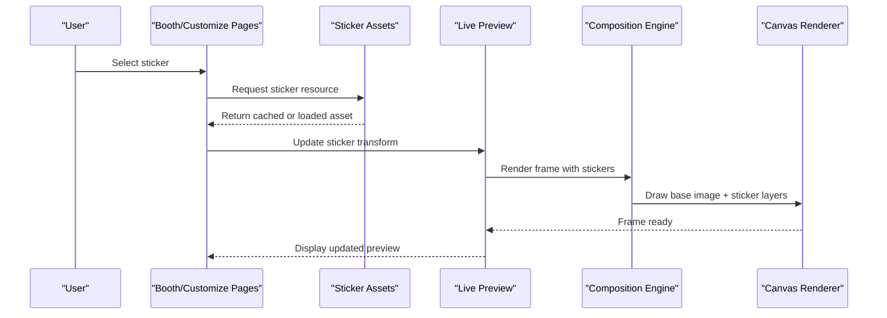
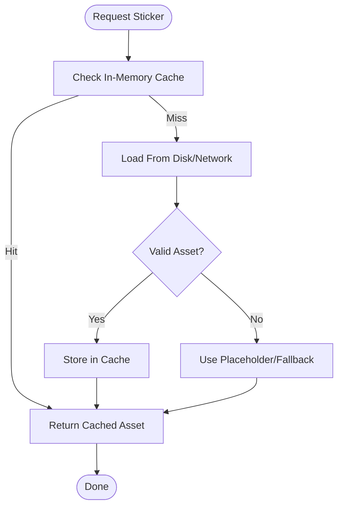
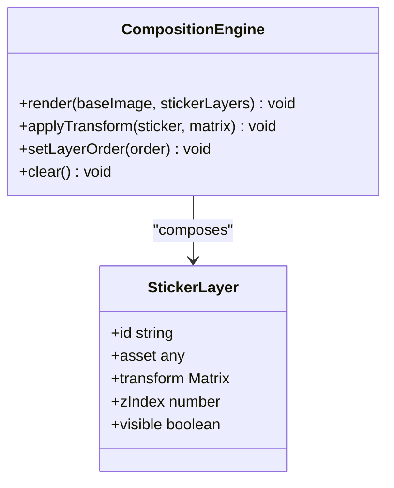
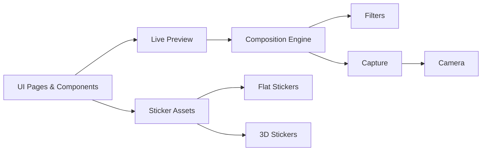

# Sticker Engine

<cite>
**Referenced Files in This Document**
- [sticker-assets.ts](file://lib/sticker-assets.ts)
- [compose.ts](file://lib/compose.ts)
- [filters.ts](file://lib/filters.ts)
- [capture.ts](file://lib/capture.ts)
- [camera.ts](file://lib/camera.ts)
- [live-preview.ts](file://lib/live-preview.ts)
- [page.tsx](file://app/booth/page.tsx)
- [page.tsx](file://app/customize/page.tsx)
- [CameraPreview.tsx](file://components/CameraPreview.tsx)
- [FilterBar.tsx](file://components/FilterBar.tsx)
</cite>

## Table of Contents
1. [Introduction](#introduction)
2. [Project Structure](#project-structure)
3. [Core Components](#core-components)
4. [Architecture Overview](#architecture-overview)
5. [Detailed Component Analysis](#detailed-component-analysis)
6. [Dependency Analysis](#dependency-analysis)
7. [Performance Considerations](#performance-considerations)
8. [Troubleshooting Guide](#troubleshooting-guide)
9. [Conclusion](#conclusion)

## Introduction
This document describes the sticker overlay engine used to add 3D and flat stickers onto photos and live camera previews. It explains how sticker assets are loaded, cached, and organized; how stickers are positioned, scaled, rotated, and layered; and how user interactions (touch/mouse) drive real-time editing. It also covers configuration for the sticker library, creating custom stickers, dynamic asset loading, transformation matrices, collision detection strategies, and performance optimization for large collections and memory-constrained environments.

## Project Structure
The sticker engine is implemented as a set of libraries and UI components:
- Asset management and composition utilities under lib
- Camera capture and live preview integration
- Booth and customization pages that orchestrate the editing flow
- Reusable UI components for camera and filters

**Diagram sources**
- [page.tsx](file://app/booth/page.tsx)
- [page.tsx](file://app/customize/page.tsx)
- [CameraPreview.tsx](file://components/CameraPreview.tsx)
- [FilterBar.tsx](file://components/FilterBar.tsx)
- [sticker-assets.ts](file://lib/sticker-assets.ts)
- [compose.ts](file://lib/compose.ts)
- [filters.ts](file://lib/filters.ts)
- [capture.ts](file://lib/capture.ts)
- [camera.ts](file://lib/camera.ts)
- [live-preview.ts](file://lib/live-preview.ts)

**Section sources**
- [page.tsx](file://app/booth/page.tsx)
- [page.tsx](file://app/customize/page.tsx)
- [CameraPreview.tsx](file://components/CameraPreview.tsx)
- [FilterBar.tsx](file://components/FilterBar.tsx)
- [sticker-assets.ts](file://lib/sticker-assets.ts)
- [compose.ts](file://lib/compose.ts)
- [filters.ts](file://lib/filters.ts)
- [capture.ts](file://lib/capture.ts)
- [camera.ts](file://lib/camera.ts)
- [live-preview.ts](file://lib/live-preview.ts)

## Core Components
- Sticker Asset Management: Loads and caches sticker resources from public directories, supports both flat images and 3D model references, and exposes an API to query available stickers by category or type.
- Composition Engine: Renders base images with sticker overlays using canvas operations, applies transformations, and composes layers deterministically.
- Filters Pipeline: Applies visual effects to the base image and optionally to sticker layers before final composition.
- Capture and Camera Integration: Captures frames from the camera stream and provides high-resolution images for offline editing.
- Live Preview Manager: Drives efficient per-frame updates for interactive sticker placement on the camera feed.

Key responsibilities:
- Asset lifecycle: discovery, loading, caching, invalidation
- Transformation pipeline: position, scale, rotation, layering order
- Interaction handling: touch/mouse events mapped to sticker transforms
- Rendering: efficient draw calls, offscreen canvases, and batching

**Section sources**
- [sticker-assets.ts](file://lib/sticker-assets.ts)
- [compose.ts](file://lib/compose.ts)
- [filters.ts](file://lib/filters.ts)
- [capture.ts](file://lib/capture.ts)
- [camera.ts](file://lib/camera.ts)
- [live-preview.ts](file://lib/live-preview.ts)

## Architecture Overview
The sticker engine follows a modular architecture where UI orchestrates asset loading and composition, while low-level modules handle rendering and input.

**Diagram sources**
- [page.tsx](file://app/booth/page.tsx)
- [page.tsx](file://app/customize/page.tsx)
- [sticker-assets.ts](file://lib/sticker-assets.ts)
- [live-preview.ts](file://lib/live-preview.ts)
- [compose.ts](file://lib/compose.ts)

## Detailed Component Analysis

### Sticker Asset Management
Responsibilities:
- Discover sticker entries from static directories (flat and 3D)
- Load assets into memory with caching to avoid repeated network requests
- Provide typed metadata (type, category, dimensions, aspect ratio)
- Support dynamic loading for new stickers without restart

Implementation highlights:
- Centralized registry of sticker IDs and paths
- In-memory cache keyed by asset ID
- Lazy loading triggered on first access
- Fallbacks for missing or corrupted assets

**Diagram sources**
- [sticker-assets.ts](file://lib/sticker-assets.ts)

API usage patterns:
- Query available stickers by type (flat vs 3D) and category
- Retrieve asset URL or buffer for rendering
- Subscribe to asset load events for progress feedback

**Section sources**
- [sticker-assets.ts](file://lib/sticker-assets.ts)

### Composition Engine
Responsibilities:
- Composite base image with multiple sticker layers
- Apply transformation matrices for each sticker
- Manage layer ordering and clipping
- Integrate filters and effects

Transformation model:
- Each sticker has a local coordinate system
- Transform matrix combines translation, scaling, and rotation
- Final screen coordinates computed via matrix multiplication

Layering rules:
- Base image drawn first
- Stickers drawn in defined order
- Optional depth sorting based on z-index or timestamp

**Diagram sources**
- [compose.ts](file://lib/compose.ts)

Rendering pipeline:
- Prepare offscreen canvas for base image
- For each sticker layer: compute transformed bounds, clip if needed, draw
- Apply post-processing filters to final composite

**Section sources**
- [compose.ts](file://lib/compose.ts)

### Filters Pipeline
Responsibilities:
- Apply color adjustments, blur, contrast, and other effects
- Optionally apply per-layer filters to stickers
- Batch filter operations for performance

Integration points:
- Pre-composition filters on base image
- Post-composition global effects
- Per-sticker overlays for stylistic consistency

**Section sources**
- [filters.ts](file://lib/filters.ts)

### Capture and Camera Integration
Responsibilities:
- Access camera stream and capture frames
- Convert frames to image data suitable for composition
- Handle resolution and orientation metadata

Interaction with sticker engine:
- Use captured frames as base images for sticker overlays
- Maintain consistent coordinate systems across devices

**Section sources**
- [capture.ts](file://lib/capture.ts)
- [camera.ts](file://lib/camera.ts)

### Live Preview Manager
Responsibilities:
- Drive per-frame updates for interactive editing
- Throttle expensive operations during drag/rotate gestures
- Sync UI state with rendered output

Optimization techniques:
- Debounce heavy computations
- Use requestAnimationFrame for smooth updates
- Limit redraw regions to affected areas when possible

**Section sources**
- [live-preview.ts](file://lib/live-preview.ts)

### UI Orchestration
Booth and Customize pages:
- Initialize sticker library and asset cache
- Bind touch/mouse events to sticker transforms
- Trigger composition and capture actions

Components:
- CameraPreview renders live feed and overlays
- FilterBar manages filter selection and application

**Section sources**
- [page.tsx](file://app/booth/page.tsx)
- [page.tsx](file://app/customize/page.tsx)
- [CameraPreview.tsx](file://components/CameraPreview.tsx)
- [FilterBar.tsx](file://components/FilterBar.tsx)

## Dependency Analysis
The sticker engine relies on clear separation between UI, asset management, composition, and rendering. Dependencies are unidirectional to maintain testability and performance.

**Diagram sources**
- [page.tsx](file://app/booth/page.tsx)
- [page.tsx](file://app/customize/page.tsx)
- [sticker-assets.ts](file://lib/sticker-assets.ts)
- [live-preview.ts](file://lib/live-preview.ts)
- [compose.ts](file://lib/compose.ts)
- [filters.ts](file://lib/filters.ts)
- [capture.ts](file://lib/capture.ts)
- [camera.ts](file://lib/camera.ts)

Potential circular dependencies:
- Avoid importing UI modules from asset or composition layers
- Keep event handlers in UI, logic in libraries

Coupling and cohesion:
- High cohesion within each module
- Low coupling through well-defined interfaces

**Section sources**
- [sticker-assets.ts](file://lib/sticker-assets.ts)
- [compose.ts](file://lib/compose.ts)
- [filters.ts](file://lib/filters.ts)
- [capture.ts](file://lib/capture.ts)
- [camera.ts](file://lib/camera.ts)
- [live-preview.ts](file://lib/live-preview.ts)

## Performance Considerations
- Caching strategy:
  - In-memory cache for frequently accessed stickers
  - Eviction policies for large collections (LRU or size-based)
- Rendering optimizations:
  - Offscreen canvases to avoid re-drawing unchanged layers
  - Batching draw calls and minimizing state changes
  - Clipping regions to reduce overdraw
- Memory management:
  - Release textures and buffers when stickers are removed
  - Avoid holding references to large images longer than necessary
- Real-time editing:
  - Debounce heavy operations during interaction
  - Use requestAnimationFrame for smooth updates
  - Prioritize responsive input over perfect accuracy during drag
- Large collections:
  - Lazy-load sticker thumbnails and full-res assets on demand
  - Precompute bounding boxes and transform bounds
  - Segment sticker library into categories to reduce initial load

[No sources needed since this section provides general guidance]

## Troubleshooting Guide
Common issues and resolutions:
- Missing sticker assets:
  - Verify asset paths and availability in public directories
  - Implement fallback placeholders for missing assets
- Incorrect positioning or scaling:
  - Check transformation matrices and coordinate system alignment
  - Ensure aspect ratios match between asset and display
- Performance drops during drag:
  - Reduce filter complexity or disable heavy effects temporarily
  - Limit redraw frequency and use region-based updates
- Memory leaks:
  - Ensure proper cleanup of event listeners and canvas contexts
  - Clear caches when switching scenes or exiting edit mode

**Section sources**
- [sticker-assets.ts](file://lib/sticker-assets.ts)
- [compose.ts](file://lib/compose.ts)
- [live-preview.ts](file://lib/live-preview.ts)

## Conclusion
The sticker overlay engine provides a robust, modular system for adding and manipulating stickers on images and live camera feeds. By separating asset management, composition, filtering, and UI orchestration, it achieves scalability and performance even with large sticker collections. Proper caching, transformation modeling, and interaction handling ensure a smooth editing experience. Future enhancements can include advanced collision detection, physics-based interactions, and richer 3D sticker support.

[No sources needed since this section summarizes without analyzing specific files]