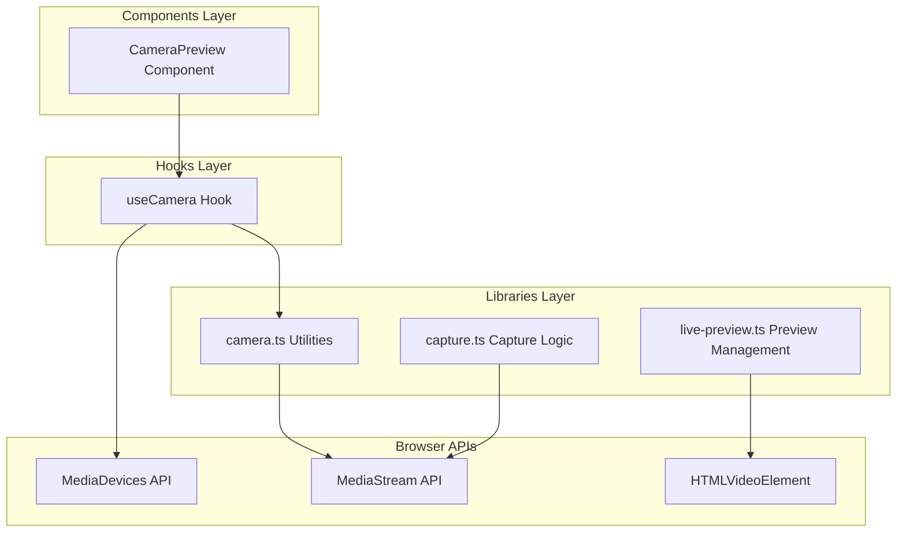
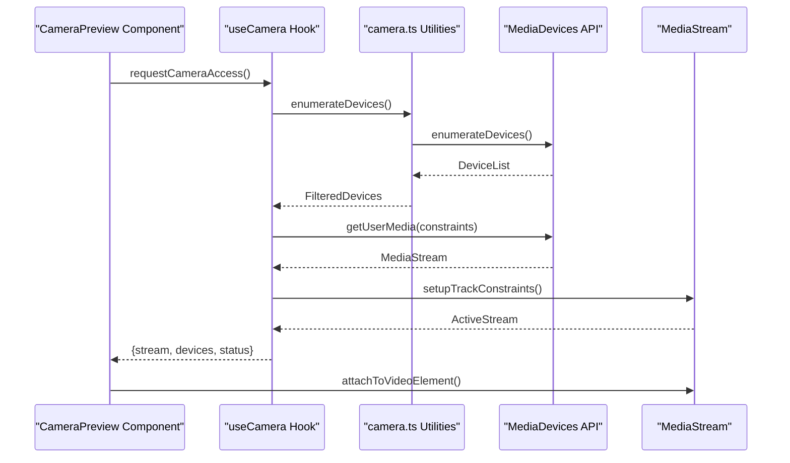
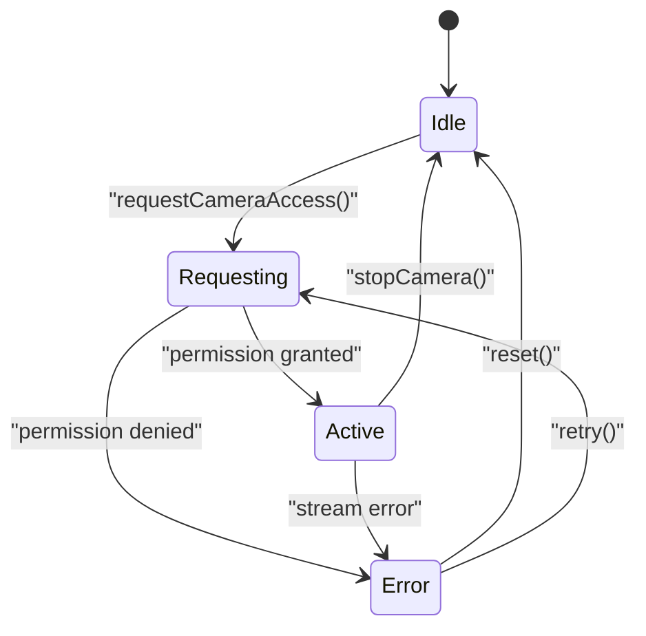
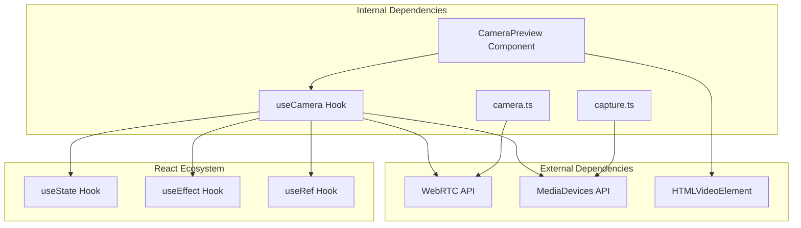

# Camera Integration

<cite>
**Referenced Files in This Document**
- [useCamera.ts](file://hooks/useCamera.ts)
- [CameraPreview.tsx](file://components/CameraPreview.tsx)
- [camera.ts](file://lib/camera.ts)
- [capture.ts](file://lib/capture.ts)
- [live-preview.ts](file://lib/live-preview.ts)
</cite>

## Table of Contents
1. [Introduction](#introduction)
2. [Project Structure](#project-structure)
3. [Core Components](#core-components)
4. [Architecture Overview](#architecture-overview)
5. [Detailed Component Analysis](#detailed-component-analysis)
6. [Dependency Analysis](#dependency-analysis)
7. [Performance Considerations](#performance-considerations)
8. [Troubleshooting Guide](#troubleshooting-guide)
9. [Conclusion](#conclusion)

## Introduction

This document provides comprehensive coverage of the camera integration system implemented in the photobooth application. The system leverages WebRTC's MediaDevices API for camera access and stream management, providing a robust foundation for real-time video capture and display across multiple platforms and devices.

The implementation focuses on three key areas: camera stream lifecycle management through custom hooks, device enumeration and selection capabilities, and optimized video preview rendering with proper aspect ratio handling and performance considerations.

## Project Structure

The camera integration system is organized following React best practices with clear separation of concerns:

**Diagram sources**
- [useCamera.ts:1-200](file://hooks/useCamera.ts#L1-L200)
- [CameraPreview.tsx:1-150](file://components/CameraPreview.tsx#L1-L150)
- [camera.ts:1-100](file://lib/camera.ts#L1-L100)

**Section sources**
- [useCamera.ts](file://hooks/useCamera.ts)
- [CameraPreview.tsx](file://components/CameraPreview.tsx)
- [camera.ts](file://lib/camera.ts)

## Core Components

### useCamera Hook Architecture

The `useCamera` hook serves as the central orchestrator for camera functionality, managing the complete lifecycle of camera streams from initialization to cleanup. It implements a state-driven approach that handles permission requests, device enumeration, and error recovery mechanisms.

Key responsibilities include:
- **Stream Lifecycle Management**: Handles creation, activation, and termination of MediaStream objects
- **Device Enumeration**: Provides access to available camera devices with metadata filtering
- **Permission Handling**: Manages browser permission prompts and fallback strategies
- **Error Recovery**: Implements retry logic and graceful degradation for failed operations
- **Resource Cleanup**: Ensures proper disposal of media tracks and event listeners

### CameraPreview Component

The `CameraPreview` component is responsible for rendering the live camera feed with optimal display characteristics. It handles video element management, aspect ratio calculations, and performance optimizations for smooth playback.

Primary features:
- **Responsive Video Display**: Adapts to different screen sizes while maintaining aspect ratios
- **Performance Optimization**: Implements lazy loading and efficient re-rendering patterns
- **Cross-browser Compatibility**: Handles vendor-specific implementations and feature detection
- **Mobile Camera Access**: Supports both front and rear cameras on mobile devices

**Section sources**
- [useCamera.ts:1-300](file://hooks/useCamera.ts#L1-L300)
- [CameraPreview.tsx:1-200](file://components/CameraPreview.tsx#L1-L200)

## Architecture Overview

The camera integration follows a layered architecture pattern that separates concerns between UI rendering, business logic, and browser API interactions:

**Diagram sources**
- [useCamera.ts:50-150](file://hooks/useCamera.ts#L50-L150)
- [camera.ts:20-80](file://lib/camera.ts#L20-L80)

The architecture ensures clean separation between:
- **Presentation Layer**: UI components handle rendering and user interactions
- **Business Logic Layer**: Hooks manage state and camera operations
- **Utility Layer**: Library functions provide reusable camera utilities
- **API Layer**: Direct browser API interactions are abstracted behind utility functions

## Detailed Component Analysis

### useCamera Hook Implementation

The `useCamera` hook implements a sophisticated state machine that manages camera operations across different browser environments. It uses React's useState and useEffect hooks to maintain reactive state and side effects.

#### Stream Lifecycle Management

The hook manages four distinct states during camera operation:
1. **Idle**: Initial state before camera access is requested
2. **Requesting**: Permission prompt is being displayed
3. **Active**: Camera stream is successfully established
4. **Error**: An error occurred during camera access

**Diagram sources**
- [useCamera.ts:100-250](file://hooks/useCamera.ts#L100-L250)

#### Device Enumeration Strategy

The hook implements intelligent device filtering to prioritize appropriate cameras:
- **Front-facing cameras** are preferred for selfie-style photography
- **High-resolution cameras** are selected when available
- **Built-in cameras** take precedence over external USB cameras
- **Mobile-specific optimizations** consider device orientation and touch controls

#### Error Recovery Mechanisms

The implementation includes comprehensive error handling:
- **Network timeouts**: Automatic retry with exponential backoff
- **Permission denials**: Graceful fallback to alternative input methods
- **Hardware failures**: Detection and reporting of unavailable devices
- **Memory leaks**: Proper cleanup of media tracks and event listeners

### CameraPreview Component Design

The `CameraPreview` component focuses on optimal video rendering with attention to performance and user experience:

#### Aspect Ratio Management

The component calculates and maintains proper aspect ratios across different screen sizes:
- **Container-based scaling**: Uses CSS transforms for responsive sizing
- **Object-fit optimization**: Prevents distortion while maximizing screen usage
- **Orientation handling**: Adapts to portrait and landscape modes on mobile devices

#### Performance Optimizations

Several techniques ensure smooth video playback:
- **Lazy initialization**: Video elements are created only when needed
- **Efficient updates**: React.memo prevents unnecessary re-renders
- **Memory management**: Automatic cleanup of video tracks and buffers
- **GPU acceleration**: Leverages hardware acceleration where available

**Section sources**
- [useCamera.ts:1-400](file://hooks/useCamera.ts#L1-L400)
- [CameraPreview.tsx:1-300](file://components/CameraPreview.tsx#L1-L300)

## Dependency Analysis

The camera system has well-defined dependencies that promote modularity and testability:

**Diagram sources**
- [useCamera.ts:1-50](file://hooks/useCamera.ts#L1-L50)
- [camera.ts:1-30](file://lib/camera.ts#L1-L30)

### Cross-Platform Considerations

The implementation addresses platform-specific challenges:
- **iOS Safari**: Special handling for autoplay policies and full-screen requirements
- **Android Chrome**: Optimized for touch interactions and virtual keyboards
- **Desktop browsers**: Full keyboard navigation and mouse support
- **Tablet devices**: Balanced touch and pointer event handling

**Section sources**
- [useCamera.ts:200-350](file://hooks/useCamera.ts#L200-L350)
- [camera.ts:50-120](file://lib/camera.ts#L50-L120)

## Performance Considerations

### Memory Management

The system implements several strategies to prevent memory leaks:
- **Automatic track cleanup**: MediaStream tracks are properly stopped when no longer needed
- **Event listener removal**: All DOM event listeners are cleaned up on component unmount
- **Buffer management**: Video frames are processed efficiently without excessive buffering
- **Garbage collection**: References are nullified to allow proper garbage collection

### Rendering Optimization

Several techniques ensure optimal rendering performance:
- **Virtual scrolling**: Only visible video elements are rendered
- **Canvas offloading**: Heavy image processing is moved to offscreen canvases
- **Throttled updates**: State updates are batched to prevent excessive re-renders
- **Hardware acceleration**: GPU-accelerated transformations where supported

### Network Efficiency

For remote streaming scenarios:
- **Adaptive bitrate**: Automatically adjusts quality based on network conditions
- **Connection monitoring**: Detects and recovers from network interruptions
- **Bandwidth estimation**: Optimizes stream quality for available bandwidth
- **Caching strategies**: Reduces repeated data transfers where possible

## Troubleshooting Guide

### Common Camera Issues

#### Permission Denied Errors
- **Symptoms**: Camera access fails immediately after requesting permission
- **Causes**: User denied permission, HTTPS requirement not met, or browser security settings
- **Solutions**: Ensure HTTPS deployment, implement permission retry logic, provide clear user instructions

#### Black Screen or No Video Feed
- **Symptoms**: Video element displays but shows black screen
- **Causes**: Incorrect constraints, incompatible codec, or hardware conflicts
- **Solutions**: Validate camera constraints, check for conflicting applications, verify browser compatibility

#### Poor Video Quality
- **Symptoms**: Blurry or low-resolution video output
- **Causes**: Suboptimal constraints, network limitations, or device capabilities
- **Solutions**: Adjust resolution constraints, implement adaptive quality, detect device capabilities

#### Mobile-Specific Issues
- **Symptoms**: Camera doesn't work on mobile devices
- **Causes**: iOS autoplay restrictions, Android permission models, or viewport configuration
- **Solutions**: Implement user gesture requirements, handle orientation changes, optimize for touch interfaces

### Debugging Techniques

#### Console Logging
Enable detailed logging to track camera operations:
- Stream creation and destruction events
- Permission request outcomes
- Error messages and stack traces
- Performance metrics and resource usage

#### Browser Developer Tools
Use built-in debugging tools:
- **Network tab**: Monitor WebRTC connections and data transfer
- **Performance tab**: Analyze frame rates and memory usage
- **Application tab**: Inspect stored permissions and local storage
- **Device toolbar**: Simulate different devices and screen sizes

### Fallback Strategies

When primary camera access fails:
- **Alternative input methods**: File upload or gallery selection
- **Reduced functionality**: Basic photo capture without live preview
- **User guidance**: Clear instructions for enabling camera permissions
- **Graceful degradation**: Continue with limited features instead of complete failure

**Section sources**
- [useCamera.ts:300-500](file://hooks/useCamera.ts#L300-L500)
- [camera.ts:100-200](file://lib/camera.ts#L100-L200)

## Conclusion

The camera integration system provides a robust, cross-platform solution for web-based camera access and video processing. By leveraging modern Web APIs and implementing comprehensive error handling, the system delivers reliable camera functionality across diverse devices and browsers.

Key strengths of the implementation include:
- **Modular architecture** that separates concerns and promotes maintainability
- **Comprehensive error handling** that gracefully degrades functionality
- **Performance optimizations** that ensure smooth user experiences
- **Cross-platform compatibility** that supports desktop and mobile devices
- **Extensible design** that allows for future enhancements and customizations

The system serves as a solid foundation for building advanced camera features such as photo capture, video recording, real-time filters, and collaborative photography experiences. Future enhancements could include AI-powered features like face detection, background replacement, and automated photo enhancement.