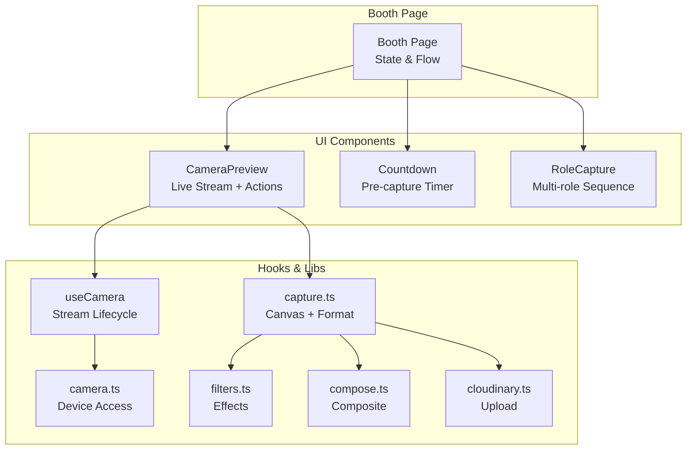
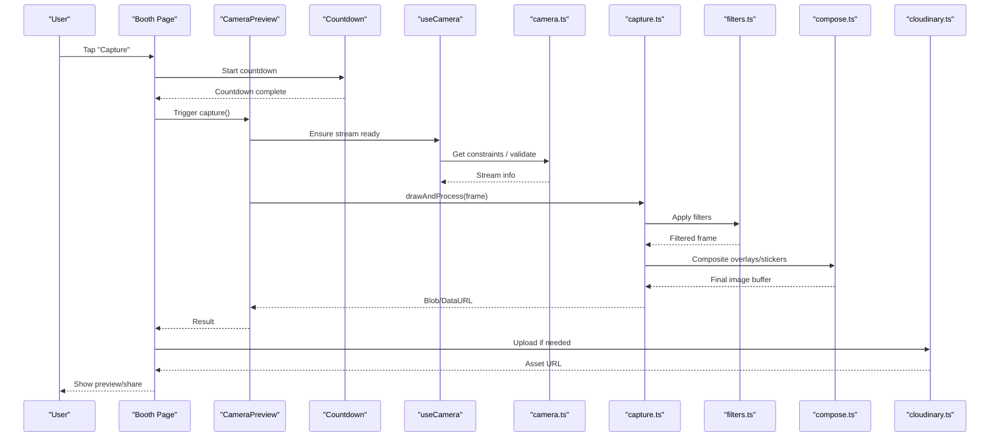
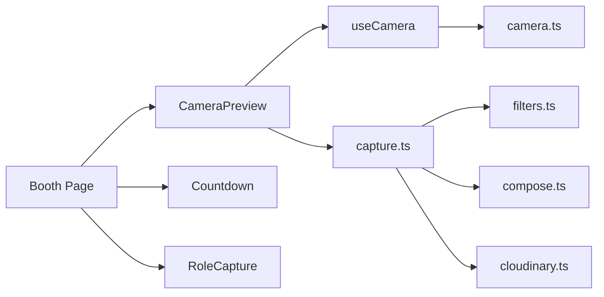

# Capture Workflow

<cite>
**Referenced Files in This Document**
- [page.tsx](file://app/booth/page.tsx)
- [CameraPreview.tsx](file://components/CameraPreview.tsx)
- [Countdown.tsx](file://components/Countdown.tsx)
- [RoleCapture.tsx](file://components/RoleCapture.tsx)
- [useCamera.ts](file://hooks/useCamera.ts)
- [camera.ts](file://lib/camera.ts)
- [capture.ts](file://lib/capture.ts)
- [filters.ts](file://lib/filters.ts)
- [compose.ts](file://lib/compose.ts)
- [cloudinary.ts](file://lib/cloudinary.ts)
</cite>

## Table of Contents
1. [Introduction](#introduction)
2. [Project Structure](#project-structure)
3. [Core Components](#core-components)
4. [Architecture Overview](#architecture-overview)
5. [Detailed Component Analysis](#detailed-component-analysis)
6. [Dependency Analysis](#dependency-analysis)
7. [Performance Considerations](#performance-considerations)
8. [Troubleshooting Guide](#troubleshooting-guide)
9. [Conclusion](#conclusion)
10. [Appendices](#appendices)

## Introduction
This document explains the complete photo capture workflow from user interaction to final image processing. It covers trigger mechanisms, canvas-based image extraction, post-processing steps, and how booth page state integrates with capture utilities. It also details image format handling, compression options, memory optimization during capture, error scenarios (failed captures, insufficient permissions, device limitations), and customization examples for editing pipelines.

## Project Structure
The capture pipeline spans UI components, hooks, and library modules:
- Booth page orchestrates scene state and triggers capture flows.
- Camera preview renders the live stream and exposes capture actions.
- Countdown provides a visual timer before capture.
- RoleCapture coordinates multi-role capture sequences.
- useCamera hook manages camera lifecycle and media streams.
- camera.ts encapsulates device access and constraints.
- capture.ts handles canvas drawing, format conversion, and compression.
- filters.ts applies visual effects prior to or after capture.
- compose.ts composites overlays, stickers, and frames.
- cloudinary.ts uploads processed images to the cloud.

**Diagram sources**
- [page.tsx](file://app/booth/page.tsx)
- [CameraPreview.tsx](file://components/CameraPreview.tsx)
- [Countdown.tsx](file://components/Countdown.tsx)
- [RoleCapture.tsx](file://components/RoleCapture.tsx)
- [useCamera.ts](file://hooks/useCamera.ts)
- [camera.ts](file://lib/camera.ts)
- [capture.ts](file://lib/capture.ts)
- [filters.ts](file://lib/filters.ts)
- [compose.ts](file://lib/compose.ts)
- [cloudinary.ts](file://lib/cloudinary.ts)

**Section sources**
- [page.tsx](file://app/booth/page.tsx)
- [CameraPreview.tsx](file://components/CameraPreview.tsx)
- [Countdown.tsx](file://components/Countdown.tsx)
- [RoleCapture.tsx](file://components/RoleCapture.tsx)
- [useCamera.ts](file://hooks/useCamera.ts)
- [camera.ts](file://lib/camera.ts)
- [capture.ts](file://lib/capture.ts)
- [filters.ts](file://lib/filters.ts)
- [compose.ts](file://lib/compose.ts)
- [cloudinary.ts](file://lib/cloudinary.ts)

## Core Components
- Booth page: Manages scenes, prompts, and transitions; initiates countdown and capture sequences; aggregates results for upload or further editing.
- CameraPreview: Renders the video element, binds capture triggers, and ensures the canvas is sized correctly for high-resolution output.
- Countdown: Displays a timed sequence to prepare subjects; signals when to capture.
- RoleCapture: Coordinates multiple roles (e.g., front/back cameras or multiple participants) and sequences their captures.
- useCamera: Initializes MediaDevices, requests permissions, sets constraints, and exposes stream controls.
- camera.ts: Encapsulates device enumeration, constraint selection, and error mapping for permission and hardware issues.
- capture.ts: Draws current frame to an offscreen canvas, applies filters/composition, converts to desired format, compresses, and returns a blob or data URL.
- filters.ts: Applies color adjustments, blur, vignette, etc., via Canvas API operations.
- compose.ts: Layers overlays, stickers, and frames onto the captured frame.
- cloudinary.ts: Uploads final assets with transformation parameters and returns URLs.

**Section sources**
- [page.tsx](file://app/booth/page.tsx)
- [CameraPreview.tsx](file://components/CameraPreview.tsx)
- [Countdown.tsx](file://components/Countdown.tsx)
- [RoleCapture.tsx](file://components/RoleCapture.tsx)
- [useCamera.ts](file://hooks/useCamera.ts)
- [camera.ts](file://lib/camera.ts)
- [capture.ts](file://lib/capture.ts)
- [filters.ts](file://lib/filters.ts)
- [compose.ts](file://lib/compose.ts)
- [cloudinary.ts](file://lib/cloudinary.ts)

## Architecture Overview
The capture flow is event-driven and layered:
- User action triggers a capture sequence on the booth page.
- Countdown animates and then calls into the capture utility.
- The camera hook ensures a valid stream is available.
- capture.ts draws the frame, applies filters and composition, and produces a compressed asset.
- The result can be uploaded immediately or queued for later processing.

**Diagram sources**
- [page.tsx](file://app/booth/page.tsx)
- [CameraPreview.tsx](file://components/CameraPreview.tsx)
- [Countdown.tsx](file://components/Countdown.tsx)
- [useCamera.ts](file://hooks/useCamera.ts)
- [camera.ts](file://lib/camera.ts)
- [capture.ts](file://lib/capture.ts)
- [filters.ts](file://lib/filters.ts)
- [compose.ts](file://lib/compose.ts)
- [cloudinary.ts](file://lib/cloudinary.ts)

## Detailed Component Analysis

### Booth Page State and Capture Orchestration
- Manages states such as idle, countdown, capturing, processing, and success/error.
- Initiates capture based on user input or automated sequences.
- Aggregates captured assets per role and decides whether to upload or continue editing.
- Integrates with RoleCapture to coordinate multi-role sessions.

Key responsibilities:
- Scene transitions and prompt display.
- Coordinating timing between countdown and capture.
- Handling success/error feedback to the user.

**Section sources**
- [page.tsx](file://app/booth/page.tsx)

### CameraPreview: Live Stream and Capture Trigger
- Renders the active MediaStream to a video element.
- Ensures canvas dimensions match the source resolution for quality.
- Exposes a capture method that delegates to capture utilities.
- Handles reflow and layout to avoid blurry outputs.

Important behaviors:
- Validates stream availability before capture.
- Prevents duplicate captures during processing.
- Provides callbacks for progress and completion.

**Section sources**
- [CameraPreview.tsx](file://components/CameraPreview.tsx)

### Countdown: Pre-capture Timing
- Animates a countdown to synchronize subjects.
- Emits a completion event to trigger capture.
- Supports configurable duration and visual cues.

**Section sources**
- [Countdown.tsx](file://components/Countdown.tsx)

### RoleCapture: Multi-role Sequencing
- Orchestrates captures across roles (e.g., different cameras or participants).
- Maintains per-role state and aggregates results.
- Can chain captures with delays and transitions.

**Section sources**
- [RoleCapture.tsx](file://components/RoleCapture.tsx)

### useCamera: Stream Lifecycle Management
- Requests camera permissions and enumerates devices.
- Selects optimal constraints (resolution, facing mode, frame rate).
- Starts/stops tracks and cleans up resources.
- Maps errors to user-friendly messages.

**Section sources**
- [useCamera.ts](file://hooks/useCamera.ts)

### camera.ts: Device Access and Constraints
- Abstracts MediaDevices.getUserMedia usage.
- Normalizes constraints across browsers.
- Returns structured device info and capabilities.

**Section sources**
- [camera.ts](file://lib/camera.ts)

### capture.ts: Canvas Drawing, Formats, and Compression
- Captures the current frame by drawing the video element onto an offscreen canvas.
- Applies filters and composites overlays/stickers.
- Converts to target format (JPEG/PNG/WebP) and compresses using quality settings.
- Returns a Blob or DataURL suitable for preview or upload.

Optimization techniques:
- Reuses canvases to reduce allocation overhead.
- Limits maximum pixel count for large screens.
- Chooses WebP when supported for better size/quality trade-offs.

Error handling:
- Catches canvas draw failures and stream interruptions.
- Falls back to lower resolutions or formats on constrained devices.

**Section sources**
- [capture.ts](file://lib/capture.ts)

### filters.ts: Visual Effects Pipeline
- Implements brightness, contrast, saturation, blur, and custom shaders via Canvas API.
- Allows chaining multiple effects efficiently.
- Provides presets and per-frame parameterization.

**Section sources**
- [filters.ts](file://lib/filters.ts)

### compose.ts: Overlays, Stickers, and Frames
- Layers transparent PNGs, SVGs, or textures over the captured frame.
- Supports positioning, scaling, rotation, and opacity.
- Optimizes composite operations to minimize redraws.

**Section sources**
- [compose.ts](file://lib/compose.ts)

### cloudinary.ts: Upload and Transformations
- Uploads processed images to Cloudinary with secure signatures.
- Applies transformations (resize, crop, format, quality) server-side.
- Returns CDN URLs and metadata for downstream use.

**Section sources**
- [cloudinary.ts](file://lib/cloudinary.ts)

## Dependency Analysis
The capture system exhibits clear separation of concerns:
- UI components depend on hooks and libraries but not on each other directly.
- capture.ts depends on filters.ts and compose.ts for post-processing.
- cloudinary.ts is optional and invoked after successful capture.

**Diagram sources**
- [page.tsx](file://app/booth/page.tsx)
- [CameraPreview.tsx](file://components/CameraPreview.tsx)
- [Countdown.tsx](file://components/Countdown.tsx)
- [RoleCapture.tsx](file://components/RoleCapture.tsx)
- [useCamera.ts](file://hooks/useCamera.ts)
- [camera.ts](file://lib/camera.ts)
- [capture.ts](file://lib/capture.ts)
- [filters.ts](file://lib/filters.ts)
- [compose.ts](file://lib/compose.ts)
- [cloudinary.ts](file://lib/cloudinary.ts)

**Section sources**
- [page.tsx](file://app/booth/page.tsx)
- [CameraPreview.tsx](file://components/CameraPreview.tsx)
- [Countdown.tsx](file://components/Countdown.tsx)
- [RoleCapture.tsx](file://components/RoleCapture.tsx)
- [useCamera.ts](file://hooks/useCamera.ts)
- [camera.ts](file://lib/camera.ts)
- [capture.ts](file://lib/capture.ts)
- [filters.ts](file://lib/filters.ts)
- [compose.ts](file://lib/compose.ts)
- [cloudinary.ts](file://lib/cloudinary.ts)

## Performance Considerations
- Canvas sizing: Match canvas dimensions to the source video resolution to avoid unnecessary scaling.
- Memory reuse: Recycle canvas instances and intermediate buffers to reduce GC pressure.
- Format selection: Prefer WebP for smaller sizes when supported; fallback to JPEG or PNG.
- Compression tuning: Adjust quality to balance file size and visual fidelity.
- Offscreen rendering: Perform heavy operations off the main thread where possible.
- Batch uploads: Queue multiple assets and upload concurrently with rate limiting.

[No sources needed since this section provides general guidance]

## Troubleshooting Guide
Common issues and resolutions:
- Permission denied:
  - Cause: User declined camera access or insecure context.
  - Resolution: Prompt user to allow camera; ensure HTTPS; retry initialization.
- No camera found:
  - Cause: Device lacks camera or all cameras are blocked.
  - Resolution: Fallback to rear/front camera; inform user of device limitations.
- Stream interrupted:
  - Cause: Another app took control or tab backgrounded.
  - Resolution: Restart stream gracefully; notify user to return to the app.
- Canvas draw failure:
  - Cause: Large resolution or unsupported feature.
  - Resolution: Reduce resolution; switch to JPEG; handle errors and retry.
- Upload failures:
  - Cause: Network issues or invalid credentials.
  - Resolution: Retry with exponential backoff; show user-friendly error.

**Section sources**
- [camera.ts](file://lib/camera.ts)
- [capture.ts](file://lib/capture.ts)
- [cloudinary.ts](file://lib/cloudinary.ts)

## Conclusion
The capture workflow combines robust UI orchestration, reliable camera management, efficient canvas-based processing, and flexible post-processing. By separating concerns and optimizing resource usage, it delivers consistent performance across devices while supporting customization and integration with external editing pipelines.

[No sources needed since this section summarizes without analyzing specific files]

## Appendices

### Customizing Capture Behavior
- Change output format: Configure capture to prefer WebP or JPEG based on device capability.
- Adjust compression: Tune quality parameters to meet storage or bandwidth constraints.
- Add effects: Extend filters pipeline with new effects like sharpening or color grading.
- Integrate editing: Return raw frames for client-side editors or send to a backend service for advanced processing.

[No sources needed since this section provides general guidance]

### Error Scenarios Summary
- Failed captures: Retry once with reduced resolution; otherwise show error message.
- Insufficient permissions: Guide users through OS-level permission dialogs.
- Device limitations: Detect low-end devices and adapt constraints automatically.

[No sources needed since this section provides general guidance]