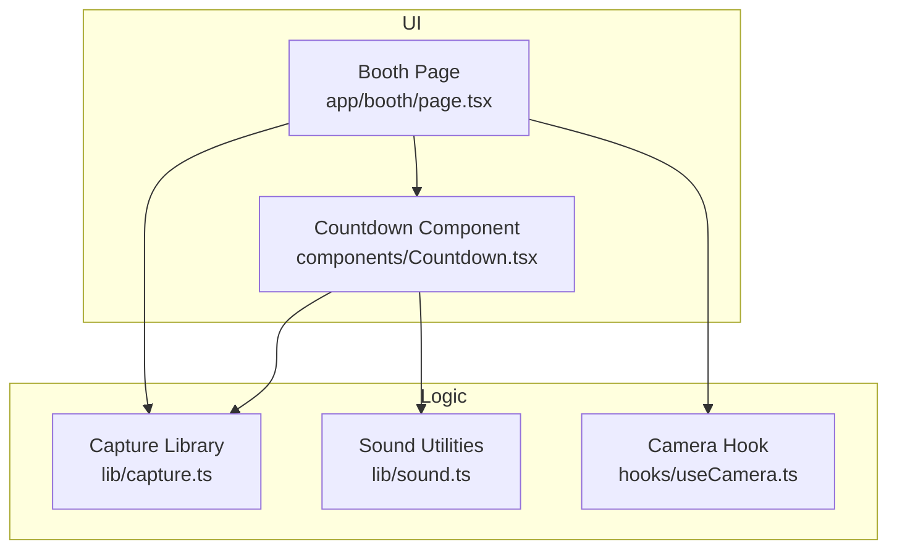
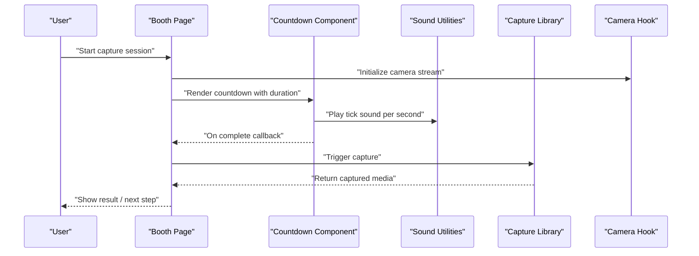
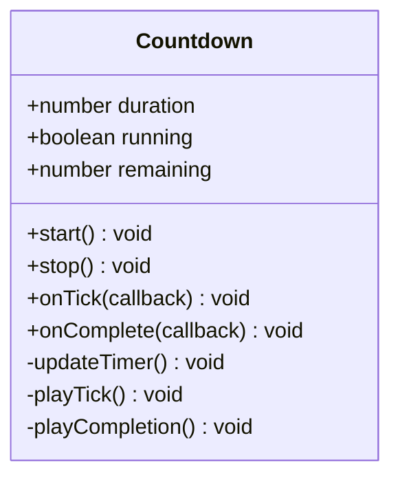
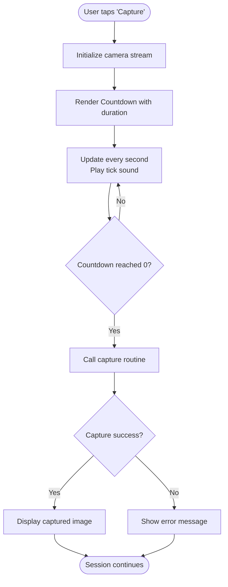
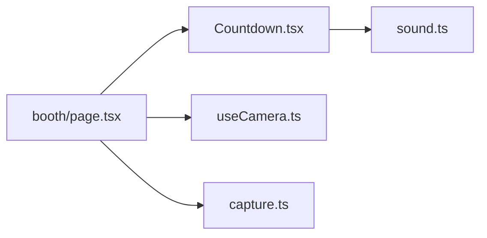

# Countdown System

<cite>
**Referenced Files in This Document**
- [Countdown.tsx](file://components/Countdown.tsx)
- [booth/page.tsx](file://app/booth/page.tsx)
- [capture.ts](file://lib/capture.ts)
- [sound.ts](file://lib/sound.ts)
- [useCamera.ts](file://hooks/useCamera.ts)
</cite>

## Table of Contents
1. [Introduction](#introduction)
2. [Project Structure](#project-structure)
3. [Core Components](#core-components)
4. [Architecture Overview](#architecture-overview)
5. [Detailed Component Analysis](#detailed-component-analysis)
6. [Dependency Analysis](#dependency-analysis)
7. [Performance Considerations](#performance-considerations)
8. [Troubleshooting Guide](#troubleshooting-guide)
9. [Conclusion](#conclusion)
10. [Appendices](#appendices)

## Introduction
This document explains the countdown timer system used during photo capture sessions in the photobooth application. It focuses on the Countdown component’s implementation, including timing logic, visual feedback, and audio cues. It also documents how the booth interface integrates with the countdown to trigger captures after completion, covering timing accuracy, animation performance, accessibility features, customization options, and extension patterns for different capture modes.

## Project Structure
The countdown functionality is primarily implemented in a dedicated UI component and integrated into the booth flow that orchestrates camera access and capture actions. Supporting libraries provide capture orchestration and sound utilities.

**Diagram sources**
- [booth/page.tsx](file://app/booth/page.tsx)
- [Countdown.tsx](file://components/Countdown.tsx)
- [capture.ts](file://lib/capture.ts)
- [sound.ts](file://lib/sound.ts)
- [useCamera.ts](file://hooks/useCamera.ts)

**Section sources**
- [booth/page.tsx](file://app/booth/page.tsx)
- [Countdown.tsx](file://components/Countdown.tsx)
- [capture.ts](file://lib/capture.ts)
- [sound.ts](file://lib/sound.ts)
- [useCamera.ts](file://hooks/useCamera.ts)

## Core Components
- Countdown component: Manages the visible countdown state (remaining seconds), renders visual indicators, and triggers callbacks when the countdown completes. It coordinates with audio cues and ensures smooth animations.
- Booth page: Orchestrates the user flow from preview to countdown to capture. It initializes the camera, displays the countdown overlay, and invokes capture routines upon completion.
- Capture library: Encapsulates device-specific capture logic, including triggering the shutter, handling permissions, and returning captured media.
- Sound utilities: Provide functions to play or stop sounds associated with countdown ticks and completion.
- Camera hook: Provides camera stream management, resolution settings, and lifecycle control for the live preview.

Key responsibilities:
- Timing accuracy: Use high-resolution timers and frame-aligned updates to minimize drift.
- Visual feedback: Render large numeric labels, progress rings, and subtle transitions.
- Audio cues: Play tick sounds at each second and a final cue on completion.
- Accessibility: Ensure keyboard operability, screen reader announcements, and sufficient contrast.

**Section sources**
- [Countdown.tsx](file://components/Countdown.tsx)
- [booth/page.tsx](file://app/booth/page.tsx)
- [capture.ts](file://lib/capture.ts)
- [sound.ts](file://lib/sound.ts)
- [useCamera.ts](file://hooks/useCamera.ts)

## Architecture Overview
The countdown system follows a clear separation between UI rendering, timing control, and capture execution. The booth page controls the session lifecycle, while the Countdown component focuses on presentation and timing. Capture logic is abstracted behind a library to support multiple devices and modes.

**Diagram sources**
- [booth/page.tsx](file://app/booth/page.tsx)
- [Countdown.tsx](file://components/Countdown.tsx)
- [sound.ts](file://lib/sound.ts)
- [capture.ts](file://lib/capture.ts)
- [useCamera.ts](file://hooks/useCamera.ts)

## Detailed Component Analysis

### Countdown Component
Responsibilities:
- Maintain remaining time state and update it accurately.
- Render visual feedback (numeric label, progress indicator).
- Emit completion events to the parent.
- Coordinate audio cues for ticks and completion.

Timing logic:
- Uses a high-resolution interval or requestAnimationFrame loop to ensure consistent updates.
- Accounts for potential drift by recalculating based on timestamps rather than relying solely on interval counts.

Visual feedback:
- Displays current count prominently.
- Animates transitions (e.g., scale or fade) to emphasize changes.
- Optionally shows a progress ring or bar indicating time elapsed.

Audio cues:
- Plays a short tick sound at each second.
- Plays a distinct completion sound when reaching zero.

Accessibility:
- Announces remaining seconds via aria-live regions.
- Supports keyboard activation if needed.
- Ensures color contrast and readable font sizes.

Customization:
- Duration prop for total countdown length.
- Theme props for colors, fonts, and animation styles.
- Sound toggles and volume controls.

Extension points:
- Callback hooks for start, tick, and completion phases.
- Pluggable audio providers to swap sound effects.
- Custom renderers for visual themes.

**Diagram sources**
- [Countdown.tsx](file://components/Countdown.tsx)

**Section sources**
- [Countdown.tsx](file://components/Countdown.tsx)

### Booth Integration
Responsibilities:
- Initialize camera preview using the camera hook.
- Display the Countdown component with appropriate duration and theme.
- Handle completion by invoking capture routines.
- Manage errors and user feedback throughout the flow.

Flow:
- On user action, set up camera and show countdown.
- When countdown completes, call capture function.
- Handle success or failure and proceed to next steps (e.g., show preview, apply filters, save).

**Diagram sources**
- [booth/page.tsx](file://app/booth/page.tsx)
- [capture.ts](file://lib/capture.ts)
- [useCamera.ts](file://hooks/useCamera.ts)

**Section sources**
- [booth/page.tsx](file://app/booth/page.tsx)
- [capture.ts](file://lib/capture.ts)
- [useCamera.ts](file://hooks/useCamera.ts)

### Capture Library
Responsibilities:
- Abstract device-specific capture behavior.
- Return captured media in a consistent format.
- Handle permissions and fallbacks gracefully.

Integration:
- Called by the booth page upon countdown completion.
- Can be extended to support different capture modes (single photo, burst, video snippet).

**Section sources**
- [capture.ts](file://lib/capture.ts)

### Sound Utilities
Responsibilities:
- Provide functions to play tick and completion sounds.
- Manage audio context and volume.
- Support muting and custom sound assets.

Integration:
- Used by the Countdown component for auditory feedback.

**Section sources**
- [sound.ts](file://lib/sound.ts)

### Camera Hook
Responsibilities:
- Manage camera stream lifecycle.
- Expose methods to start/stop streams and adjust settings.
- Provide error handling for permission issues.

Integration:
- Used by the booth page to initialize the preview before showing the countdown.

**Section sources**
- [useCamera.ts](file://hooks/useCamera.ts)

## Dependency Analysis
The countdown system has clear dependencies:
- Countdown depends on sound utilities for audio cues.
- Booth depends on the camera hook for preview and the capture library for taking photos.
- Capture library may depend on browser APIs or device capabilities.

**Diagram sources**
- [Countdown.tsx](file://components/Countdown.tsx)
- [booth/page.tsx](file://app/booth/page.tsx)
- [sound.ts](file://lib/sound.ts)
- [useCamera.ts](file://hooks/useCamera.ts)
- [capture.ts](file://lib/capture.ts)

**Section sources**
- [Countdown.tsx](file://components/Countdown.tsx)
- [booth/page.tsx](file://app/booth/page.tsx)
- [sound.ts](file://lib/sound.ts)
- [useCamera.ts](file://hooks/useCamera.ts)
- [capture.ts](file://lib/capture.ts)

## Performance Considerations
- Timing accuracy: Prefer timestamp-based updates over fixed intervals to reduce drift. Recalculate remaining time based on start time and current time.
- Animation performance: Use CSS transforms and opacity for smooth animations; avoid layout thrashing by minimizing reflows.
- Audio playback: Preload sounds and reuse audio contexts to reduce latency.
- Memory usage: Stop intervals and release resources when the countdown stops or unmounts.
- Accessibility: Keep DOM updates minimal and use aria-live regions sparingly to avoid excessive announcements.

[No sources needed since this section provides general guidance]

## Troubleshooting Guide
Common issues and resolutions:
- Countdown drifts or skips seconds: Verify timestamp-based recalculation and ensure no blocking operations occur during updates.
- No sound on tick/completion: Check audio context initialization, user gesture requirements, and volume settings.
- Camera not starting: Confirm permissions, HTTPS requirement, and device availability.
- Poor animation performance: Replace heavy animations with transform/opacity changes and avoid synchronous layout reads.
- Accessibility problems: Ensure aria-live regions announce changes, maintain contrast ratios, and test with screen readers.

**Section sources**
- [Countdown.tsx](file://components/Countdown.tsx)
- [booth/page.tsx](file://app/booth/page.tsx)
- [sound.ts](file://lib/sound.ts)
- [useCamera.ts](file://hooks/useCamera.ts)
- [capture.ts](file://lib/capture.ts)

## Conclusion
The countdown system combines precise timing, engaging visuals, and clear audio cues to enhance the photo capture experience. Its modular design allows easy customization and extension for different capture modes and themes. By following best practices for performance and accessibility, the system delivers a reliable and user-friendly countdown before capturing photos.

[No sources needed since this section summarizes without analyzing specific files]

## Appendices

### Customization Options
- Duration: Set total countdown seconds via props.
- Visual themes: Customize colors, fonts, and animation styles through theme props.
- Sound effects: Toggle sounds, adjust volume, and replace audio assets.
- Accessibility: Enable/disable aria announcements and keyboard navigation.

**Section sources**
- [Countdown.tsx](file://components/Countdown.tsx)
- [sound.ts](file://lib/sound.ts)

### Extending Functionality
- Add new capture modes: Extend the capture library to support burst mode or short video clips.
- Integrate with different UI flows: Wrap the Countdown component in different screens or overlays.
- Implement advanced animations: Add particle effects or dynamic backgrounds triggered by countdown phases.

**Section sources**
- [capture.ts](file://lib/capture.ts)
- [Countdown.tsx](file://components/Countdown.tsx)