# Customization System

<cite>
**Referenced Files in This Document**
- [page.tsx](file://app/customize/page.tsx)
- [layout.tsx](file://app/layout.tsx)
- [globals.css](file://app/globals.css)
- [themes.ts](file://lib/themes.ts)
- [layouts.ts](file://lib/layouts.ts)
- [patterns.ts](file://lib/patterns.ts)
- [filters.ts](file://lib/filters.ts)
- [sticker-assets.ts](file://lib/sticker-assets.ts)
- [compose.ts](file://lib/compose.ts)
- [capture.ts](file://lib/capture.ts)
- [camera.ts](file://lib/camera.ts)
- [live-preview.ts](file://lib/live-preview.ts)
- [segmentation.ts](file://lib/segmentation.ts)
- [sound.ts](file://lib/sound.ts)
- [room-code.ts](file://lib/room-code.ts)
- [session.tsx](file://lib/session.tsx)
- [AuthCookieMigration.tsx](file://components/AuthCookieMigration.tsx)
- [CameraPreview.tsx](file://components/CameraPreview.tsx)
- [Countdown.tsx](file://components/Countdown.tsx)
- [FilterBar.tsx](file://components/FilterBar.tsx)
- [InstallPrompt.tsx](file://components/InstallPrompt.tsx)
- [Logo.tsx](file://components/Logo.tsx)
- [PushToggle.tsx](file://components/PushToggle.tsx)
- [PwaRegister.tsx](file://components/PwaRegister.tsx)
- [RoleCapture.tsx](file://components/RoleCapture.tsx)
- [StripMockup.tsx](file://components/StripMockup.tsx)
</cite>

## Table of Contents
1. [Introduction](#introduction)
2. [Project Structure](#project-structure)
3. [Core Components](#core-components)
4. [Architecture Overview](#architecture-overview)
5. [Detailed Component Analysis](#detailed-component-analysis)
6. [Dependency Analysis](#dependency-analysis)
7. [Performance Considerations](#performance-considerations)
8. [Troubleshooting Guide](#troubleshooting-guide)
9. [Conclusion](#conclusion)

## Introduction
This document explains the Customization System that powers visual personalization and composition within the application. It covers how themes, layouts, patterns, filters, stickers, and audio are composed into a final capture result, and how the UI components orchestrate user interactions for customization. The goal is to provide both a high-level understanding and detailed technical insights for developers and contributors.

## Project Structure
The customization system spans several layers:
- UI pages and layout: entry points and global configuration
- Feature libraries: domain logic for themes, layouts, patterns, filters, stickers, composition, capture, camera, live preview, segmentation, sound, room codes, and session state
- Reusable components: UI building blocks for camera preview, countdown, filter selection, mockups, role capture, and more

```mermaid
graph TB
subgraph "App Layer"
A["app/customize/page.tsx"]
B["app/layout.tsx"]
C["app/globals.css"]
end
subgraph "Libraries"
L1["lib/themes.ts"]
L2["lib/layouts.ts"]
L3["lib/patterns.ts"]
L4["lib/filters.ts"]
L5["lib/sticker-assets.ts"]
L6["lib/compose.ts"]
L7["lib/capture.ts"]
L8["lib/camera.ts"]
L9["lib/live-preview.ts"]
L10["lib/segmentation.ts"]
L11["lib/sound.ts"]
L12["lib/room-code.ts"]
L13["lib/session.tsx"]
end
subgraph "Components"
U1["components/CameraPreview.tsx"]
U2["components/Countdown.tsx"]
U3["components/FilterBar.tsx"]
U4["components/StripMockup.tsx"]
U5["components/RoleCapture.tsx"]
U6["components/Logo.tsx"]
U7["components/AuthCookieMigration.tsx"]
U8["components/InstallPrompt.tsx"]
U9["components/PushToggle.tsx"]
U10["components/PwaRegister.tsx"]
end
A --> L1
A --> L2
A --> L3
A --> L4
A --> L5
A --> L6
A --> L7
A --> L8
A --> L9
A --> L10
A --> L11
A --> L12
A --> L13
A --> U1
A --> U2
A --> U3
A --> U4
A --> U5
A --> U6
B --> C
B --> U7
B --> U8
B --> U9
B --> U10
```

**Diagram sources**
- [page.tsx](file://app/customize/page.tsx)
- [layout.tsx](file://app/layout.tsx)
- [globals.css](file://app/globals.css)
- [themes.ts](file://lib/themes.ts)
- [layouts.ts](file://lib/layouts.ts)
- [patterns.ts](file://lib/patterns.ts)
- [filters.ts](file://lib/filters.ts)
- [sticker-assets.ts](file://lib/sticker-assets.ts)
- [compose.ts](file://lib/compose.ts)
- [capture.ts](file://lib/capture.ts)
- [camera.ts](file://lib/camera.ts)
- [live-preview.ts](file://lib/live-preview.ts)
- [segmentation.ts](file://lib/segmentation.ts)
- [sound.ts](file://lib/sound.ts)
- [room-code.ts](file://lib/room-code.ts)
- [session.tsx](file://lib/session.tsx)
- [CameraPreview.tsx](file://components/CameraPreview.tsx)
- [Countdown.tsx](file://components/Countdown.tsx)
- [FilterBar.tsx](file://components/FilterBar.tsx)
- [StripMockup.tsx](file://components/StripMockup.tsx)
- [RoleCapture.tsx](file://components/RoleCapture.tsx)
- [Logo.tsx](file://components/Logo.tsx)
- [AuthCookieMigration.tsx](file://components/AuthCookieMigration.tsx)
- [InstallPrompt.tsx](file://components/InstallPrompt.tsx)
- [PushToggle.tsx](file://components/PushToggle.tsx)
- [PwaRegister.tsx](file://components/PwaRegister.tsx)

**Section sources**
- [page.tsx](file://app/customize/page.tsx)
- [layout.tsx](file://app/layout.tsx)
- [globals.css](file://app/globals.css)

## Core Components
- Theme and style configuration: centralized theme definitions and CSS variables
- Layout engine: defines grid structures and positioning for multi-photo strips or frames
- Pattern overlays: decorative backgrounds and textures applied over captures
- Filters: image processing pipeline for color adjustments and effects
- Stickers: asset registry and placement utilities for overlay elements
- Composition engine: merges base images, patterns, stickers, and filters into a final output
- Capture pipeline: orchestrates camera access, frame capture, and post-processing
- Live preview: renders real-time previews with selected customizations
- Segmentation: optional background removal or subject isolation for advanced compositions
- Sound: playback cues for countdown and capture feedback
- Room code and session: contextual state for shared sessions and persistence

**Section sources**
- [themes.ts](file://lib/themes.ts)
- [layouts.ts](file://lib/layouts.ts)
- [patterns.ts](file://lib/patterns.ts)
- [filters.ts](file://lib/filters.ts)
- [sticker-assets.ts](file://lib/sticker-assets.ts)
- [compose.ts](file://lib/compose.ts)
- [capture.ts](file://lib/capture.ts)
- [camera.ts](file://lib/camera.ts)
- [live-preview.ts](file://lib/live-preview.ts)
- [segmentation.ts](file://lib/segmentation.ts)
- [sound.ts](file://lib/sound.ts)
- [room-code.ts](file://lib/room-code.ts)
- [session.tsx](file://lib/session.tsx)

## Architecture Overview
The customization system follows a layered architecture:
- Presentation layer (UI components) collects user choices such as theme, layout, filters, stickers, and timing
- Domain layer (libraries) transforms these choices into structured configuration objects
- Processing layer (composition and capture) applies transformations and renders the final media
- State layer (session and room code) persists and shares customization state across devices

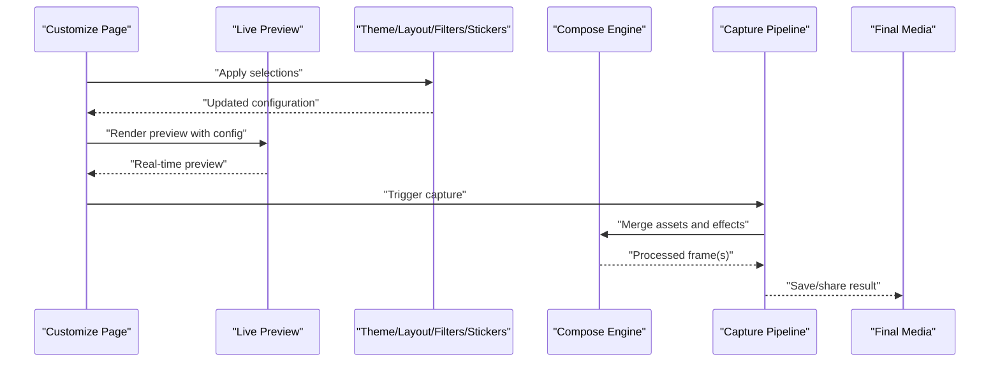

**Diagram sources**
- [page.tsx](file://app/customize/page.tsx)
- [live-preview.ts](file://lib/live-preview.ts)
- [compose.ts](file://lib/compose.ts)
- [capture.ts](file://lib/capture.ts)

## Detailed Component Analysis

### Customize Page
The customize page coordinates user interactions and delegates to libraries and components:
- Reads and updates customization state (theme, layout, filters, stickers, timing)
- Renders live preview using the preview library
- Triggers capture flow via the capture pipeline
- Integrates session and room context for shared experiences

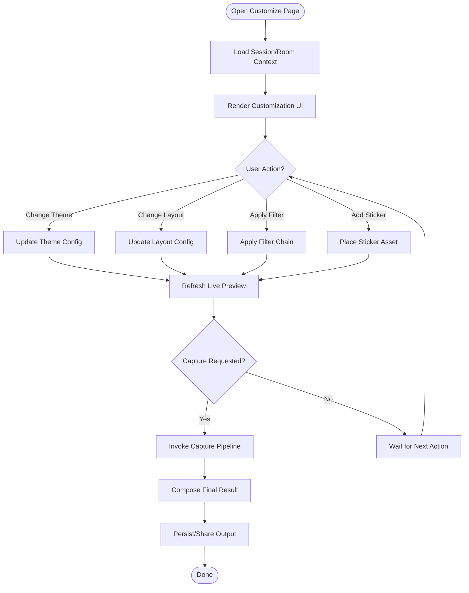

**Diagram sources**
- [page.tsx](file://app/customize/page.tsx)
- [live-preview.ts](file://lib/live-preview.ts)
- [compose.ts](file://lib/compose.ts)
- [capture.ts](file://lib/capture.ts)

**Section sources**
- [page.tsx](file://app/customize/page.tsx)

### Theme and Style Configuration
Centralized theme definitions control colors, typography, and visual accents. Global styles apply consistent design tokens across components.

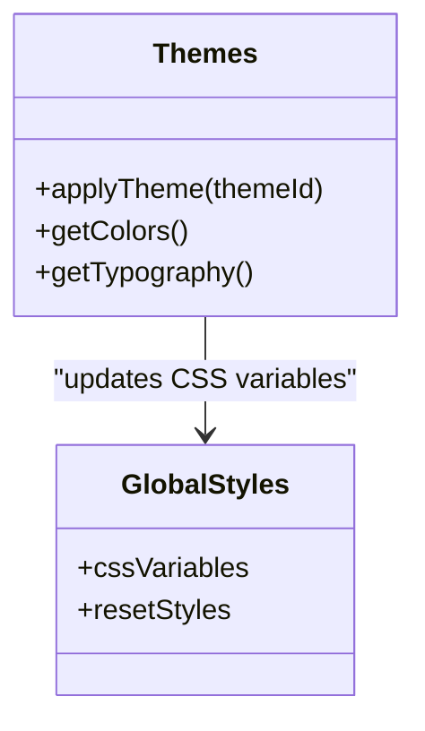

**Diagram sources**
- [themes.ts](file://lib/themes.ts)
- [globals.css](file://app/globals.css)

**Section sources**
- [themes.ts](file://lib/themes.ts)
- [globals.css](file://app/globals.css)

### Layout Engine
Defines grid structures and positioning rules for photo arrangements, ensuring consistent strip or frame layouts.

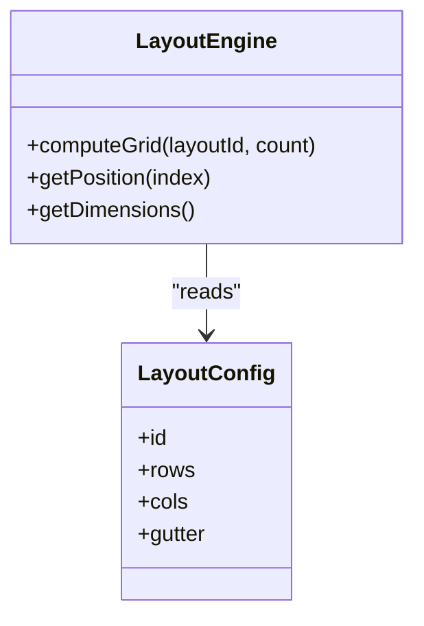

**Diagram sources**
- [layouts.ts](file://lib/layouts.ts)

**Section sources**
- [layouts.ts](file://lib/layouts.ts)

### Pattern Overlays
Provides decorative backgrounds and textures that can be composited over captures.

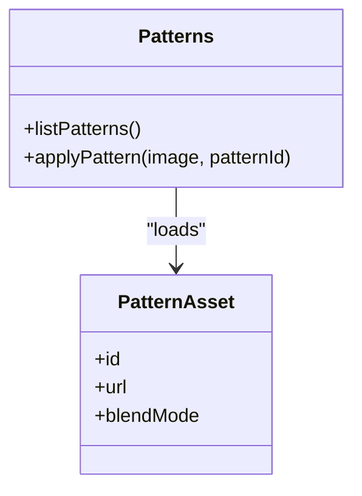

**Diagram sources**
- [patterns.ts](file://lib/patterns.ts)

**Section sources**
- [patterns.ts](file://lib/patterns.ts)

### Filters Pipeline
Implements image processing steps for color adjustments and effects.

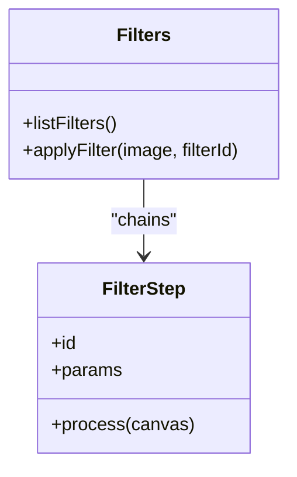

**Diagram sources**
- [filters.ts](file://lib/filters.ts)

**Section sources**
- [filters.ts](file://lib/filters.ts)

### Sticker Assets
Registry and placement utilities for sticker overlays.

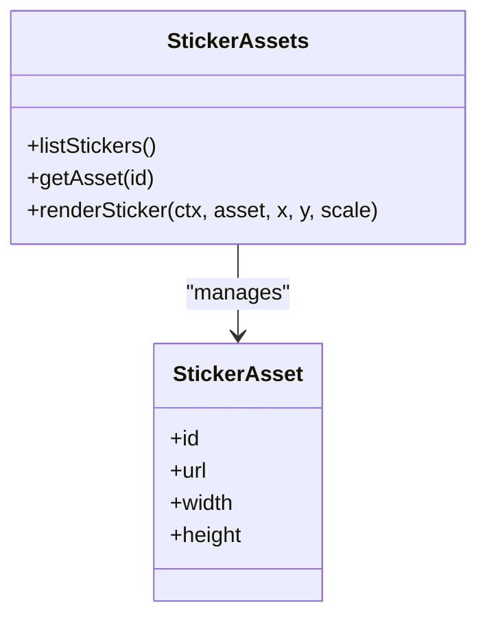

**Diagram sources**
- [sticker-assets.ts](file://lib/sticker-assets.ts)

**Section sources**
- [sticker-assets.ts](file://lib/sticker-assets.ts)

### Composition Engine
Merges base images, patterns, stickers, and filters into a final output.

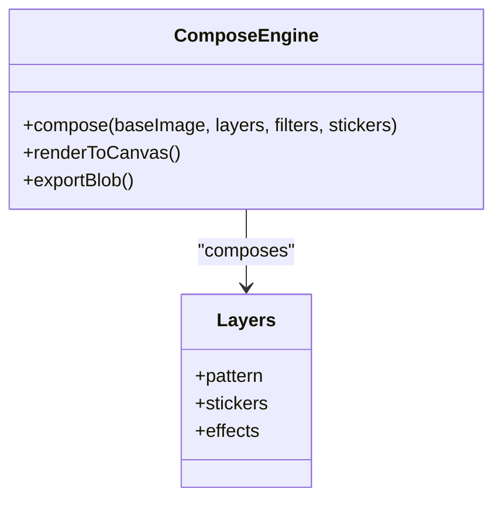

**Diagram sources**
- [compose.ts](file://lib/compose.ts)

**Section sources**
- [compose.ts](file://lib/compose.ts)

### Capture Pipeline
Orchestrates camera access, frame capture, and post-processing.

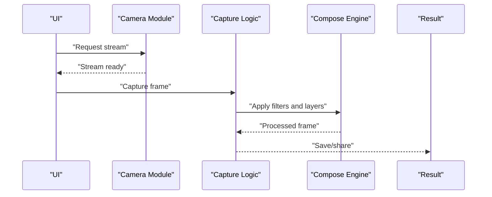

**Diagram sources**
- [camera.ts](file://lib/camera.ts)
- [capture.ts](file://lib/capture.ts)
- [compose.ts](file://lib/compose.ts)

**Section sources**
- [camera.ts](file://lib/camera.ts)
- [capture.ts](file://lib/capture.ts)

### Live Preview
Renders real-time previews with selected customizations.

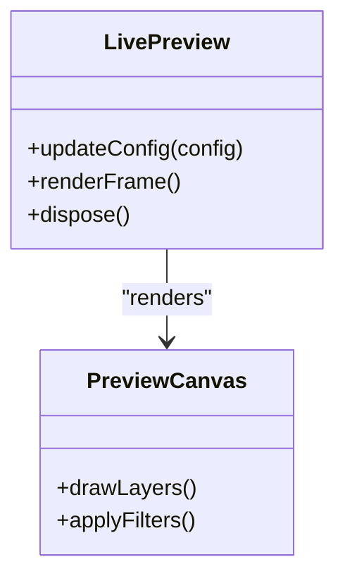

**Diagram sources**
- [live-preview.ts](file://lib/live-preview.ts)

**Section sources**
- [live-preview.ts](file://lib/live-preview.ts)

### Segmentation
Optional background removal or subject isolation for advanced compositions.

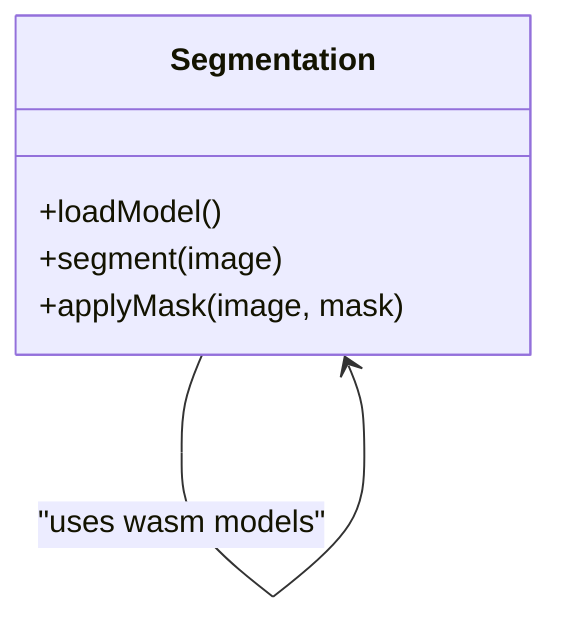

**Diagram sources**
- [segmentation.ts](file://lib/segmentation.ts)

**Section sources**
- [segmentation.ts](file://lib/segmentation.ts)

### Sound
Playback cues for countdown and capture feedback.

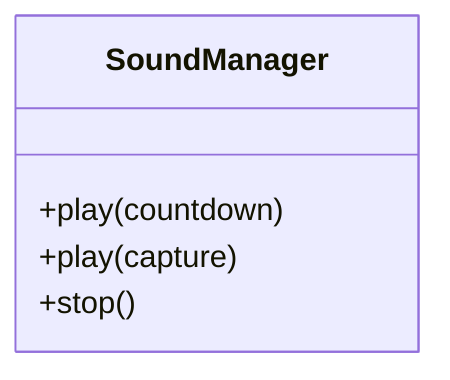

**Diagram sources**
- [sound.ts](file://lib/sound.ts)

**Section sources**
- [sound.ts](file://lib/sound.ts)

### Room Code and Session
Contextual state for shared sessions and persistence.

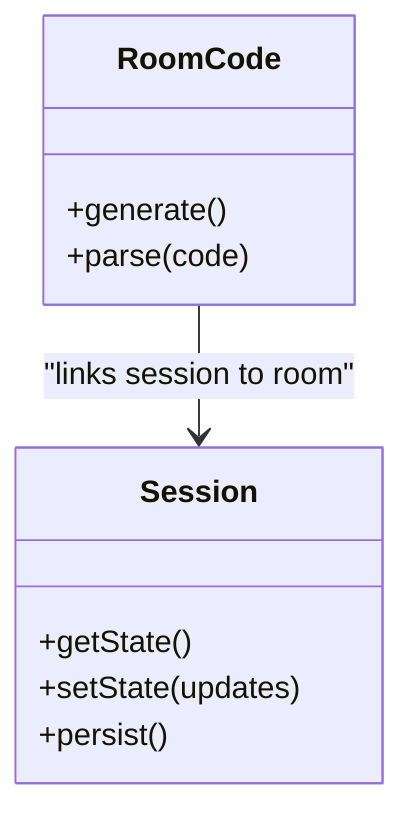

**Diagram sources**
- [room-code.ts](file://lib/room-code.ts)
- [session.tsx](file://lib/session.tsx)

**Section sources**
- [room-code.ts](file://lib/room-code.ts)
- [session.tsx](file://lib/session.tsx)

### UI Components
Reusable components that implement the customization experience:
- CameraPreview: displays live camera feed and overlays
- Countdown: shows countdown timers before capture
- FilterBar: allows users to select and preview filters
- StripMockup: visualizes final strip layout
- RoleCapture: manages roles for multi-person captures
- Logo: brand overlay component
- AuthCookieMigration: handles authentication cookie migration
- InstallPrompt: prompts PWA installation
- PushToggle: toggles push notifications
- PwaRegister: registers service worker for offline support

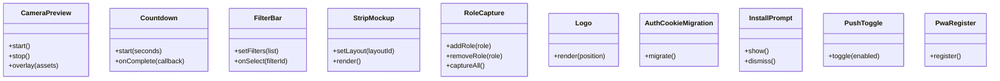

**Diagram sources**
- [CameraPreview.tsx](file://components/CameraPreview.tsx)
- [Countdown.tsx](file://components/Countdown.tsx)
- [FilterBar.tsx](file://components/FilterBar.tsx)
- [StripMockup.tsx](file://components/StripMockup.tsx)
- [RoleCapture.tsx](file://components/RoleCapture.tsx)
- [Logo.tsx](file://components/Logo.tsx)
- [AuthCookieMigration.tsx](file://components/AuthCookieMigration.tsx)
- [InstallPrompt.tsx](file://components/InstallPrompt.tsx)
- [PushToggle.tsx](file://components/PushToggle.tsx)
- [PwaRegister.tsx](file://components/PwaRegister.tsx)

**Section sources**
- [CameraPreview.tsx](file://components/CameraPreview.tsx)
- [Countdown.tsx](file://components/Countdown.tsx)
- [FilterBar.tsx](file://components/FilterBar.tsx)
- [StripMockup.tsx](file://components/StripMockup.tsx)
- [RoleCapture.tsx](file://components/RoleCapture.tsx)
- [Logo.tsx](file://components/Logo.tsx)
- [AuthCookieMigration.tsx](file://components/AuthCookieMigration.tsx)
- [InstallPrompt.tsx](file://components/InstallPrompt.tsx)
- [PushToggle.tsx](file://components/PushToggle.tsx)
- [PwaRegister.tsx](file://components/PwaRegister.tsx)

## Dependency Analysis
The customization system exhibits clear separation between UI, domain logic, and processing layers. Libraries encapsulate specific capabilities and are consumed by the customize page and components.

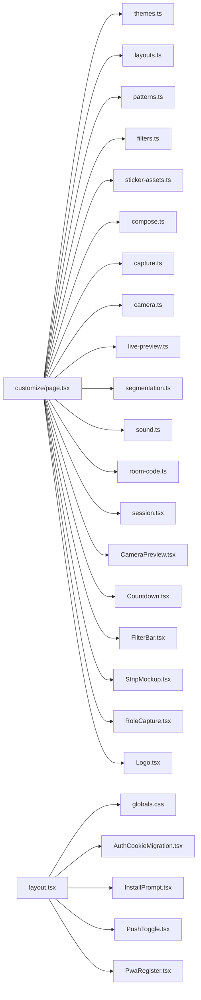

**Diagram sources**
- [page.tsx](file://app/customize/page.tsx)
- [layout.tsx](file://app/layout.tsx)
- [globals.css](file://app/globals.css)
- [themes.ts](file://lib/themes.ts)
- [layouts.ts](file://lib/layouts.ts)
- [patterns.ts](file://lib/patterns.ts)
- [filters.ts](file://lib/filters.ts)
- [sticker-assets.ts](file://lib/sticker-assets.ts)
- [compose.ts](file://lib/compose.ts)
- [capture.ts](file://lib/capture.ts)
- [camera.ts](file://lib/camera.ts)
- [live-preview.ts](file://lib/live-preview.ts)
- [segmentation.ts](file://lib/segmentation.ts)
- [sound.ts](file://lib/sound.ts)
- [room-code.ts](file://lib/room-code.ts)
- [session.tsx](file://lib/session.tsx)
- [CameraPreview.tsx](file://components/CameraPreview.tsx)
- [Countdown.tsx](file://components/Countdown.tsx)
- [FilterBar.tsx](file://components/FilterBar.tsx)
- [StripMockup.tsx](file://components/StripMockup.tsx)
- [RoleCapture.tsx](file://components/RoleCapture.tsx)
- [Logo.tsx](file://components/Logo.tsx)
- [AuthCookieMigration.tsx](file://components/AuthCookieMigration.tsx)
- [InstallPrompt.tsx](file://components/InstallPrompt.tsx)
- [PushToggle.tsx](file://components/PushToggle.tsx)
- [PwaRegister.tsx](file://components/PwaRegister.tsx)

**Section sources**
- [page.tsx](file://app/customize/page.tsx)
- [layout.tsx](file://app/layout.tsx)

## Performance Considerations
- Prefer lazy loading of heavy assets (models, stickers) to reduce initial bundle size
- Use offscreen canvases for compositing to avoid main-thread blocking
- Throttle live preview updates during rapid user input
- Cache computed layouts and filter chains where possible
- Optimize segmentation model loading and reuse instances across captures

[No sources needed since this section provides general guidance]

## Troubleshooting Guide
Common issues and resolutions:
- Camera access denied: verify permissions and HTTPS requirements
- Preview not updating: ensure live preview is disposed and reinitialized after config changes
- Capture fails: check stream availability and canvas dimensions
- Stickers not rendering: validate asset URLs and cross-origin settings
- Filters look incorrect: confirm filter order and parameter ranges
- Segmentation errors: ensure wasm models are loaded and compatible with browser

[No sources needed since this section provides general guidance]

## Conclusion
The Customization System integrates UI, domain logic, and processing layers to deliver a flexible and performant personalization experience. By separating concerns and leveraging modular libraries, it supports extensibility for new themes, layouts, filters, stickers, and effects while maintaining a smooth user experience through live preview and efficient capture pipelines.

[No sources needed since this section summarizes without analyzing specific files]