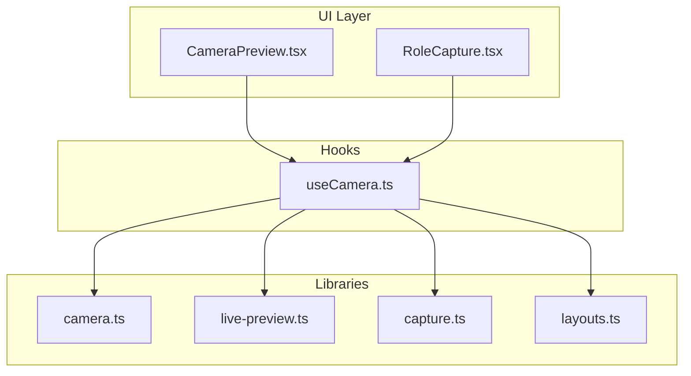
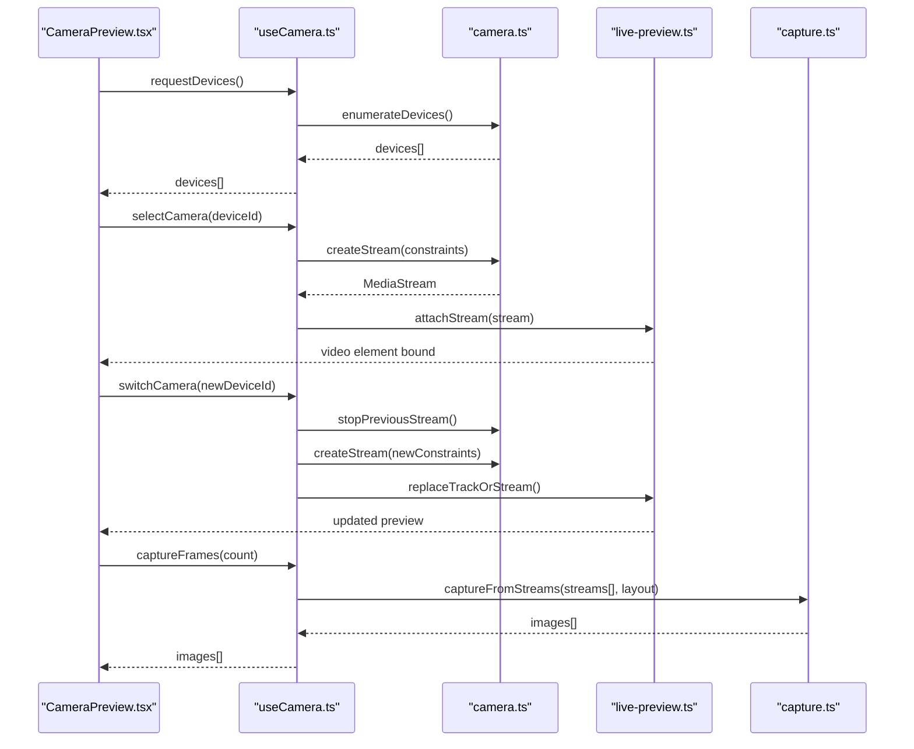
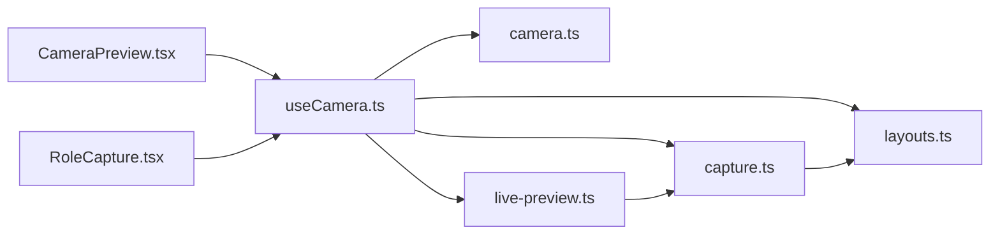

# Multi-Camera Support

<cite>
**Referenced Files in This Document**
- [useCamera.ts](file://hooks/useCamera.ts)
- [camera.ts](file://lib/camera.ts)
- [CameraPreview.tsx](file://components/CameraPreview.tsx)
- [live-preview.ts](file://lib/live-preview.ts)
- [capture.ts](file://lib/capture.ts)
- [layouts.ts](file://lib/layouts.ts)
- [RoleCapture.tsx](file://components/RoleCapture.tsx)
</cite>

## Table of Contents
1. [Introduction](#introduction)
2. [Project Structure](#project-structure)
3. [Core Components](#core-components)
4. [Architecture Overview](#architecture-overview)
5. [Detailed Component Analysis](#detailed-component-analysis)
6. [Dependency Analysis](#dependency-analysis)
7. [Performance Considerations](#performance-considerations)
8. [Troubleshooting Guide](#troubleshooting-guide)
9. [Conclusion](#conclusion)

## Introduction
This document explains how multi-camera functionality is implemented to enable group coordination and different camera angles. It covers device enumeration, selection mechanisms, simultaneous stream management, UI for switching cameras and per-camera configuration, stream prioritization, memory management across multiple streams, performance optimization, mobile-specific considerations (rear/front switching and hardware limits), examples of custom layouts, and dynamic handling of camera availability changes.

## Project Structure
The multi-camera feature spans hooks, libraries, and components:
- Hooks encapsulate camera lifecycle and state for React usage.
- Libraries implement core logic for device enumeration, stream management, capture, layout composition, and live preview.
- Components render previews, handle user interactions, and coordinate roles and captures.

**Diagram sources**
- [CameraPreview.tsx](file://components/CameraPreview.tsx)
- [RoleCapture.tsx](file://components/RoleCapture.tsx)
- [useCamera.ts](file://hooks/useCamera.ts)
- [camera.ts](file://lib/camera.ts)
- [live-preview.ts](file://lib/live-preview.ts)
- [capture.ts](file://lib/capture.ts)
- [layouts.ts](file://lib/layouts.ts)

**Section sources**
- [useCamera.ts](file://hooks/useCamera.ts)
- [camera.ts](file://lib/camera.ts)
- [CameraPreview.tsx](file://components/CameraPreview.tsx)
- [live-preview.ts](file://lib/live-preview.ts)
- [capture.ts](file://lib/capture.ts)
- [layouts.ts](file://lib/layouts.ts)
- [RoleCapture.tsx](file://components/RoleCapture.tsx)

## Core Components
- Camera device enumeration and selection: Discover available media devices, filter by kind, and select preferred rear/front or external cameras.
- Stream lifecycle: Create, start, pause, stop, and dispose MediaStream instances; manage constraints and track active tracks.
- Simultaneous streams: Manage multiple concurrent streams safely, ensuring proper resource cleanup and avoiding conflicts.
- UI integration: Render previews, switch cameras, apply per-camera settings, and reflect availability changes.
- Capture and composition: Capture frames from one or more streams and compose into layouts.

Key responsibilities:
- Enumerate devices and map them to user-friendly labels.
- Maintain a registry of active streams and their states.
- Provide APIs to add/remove streams, switch sources, and update constraints.
- Expose events for availability changes and errors.

**Section sources**
- [useCamera.ts](file://hooks/useCamera.ts)
- [camera.ts](file://lib/camera.ts)
- [CameraPreview.tsx](file://components/CameraPreview.tsx)
- [live-preview.ts](file://lib/live-preview.ts)
- [capture.ts](file://lib/capture.ts)
- [layouts.ts](file://lib/layouts.ts)

## Architecture Overview
The system follows a layered architecture:
- UI layer (components) renders previews and controls.
- Hook layer coordinates state and lifecycle for React components.
- Library layer implements device enumeration, stream management, capture, and layout composition.

**Diagram sources**
- [CameraPreview.tsx](file://components/CameraPreview.tsx)
- [useCamera.ts](file://hooks/useCamera.ts)
- [camera.ts](file://lib/camera.ts)
- [live-preview.ts](file://lib/live-preview.ts)
- [capture.ts](file://lib/capture.ts)

## Detailed Component Analysis

### Device Enumeration and Selection
- Enumerate all media devices and filter by kind (videoinput).
- Map each device to a label and optional facing mode (user/environment).
- Persist user preference for default camera.
- Handle permission prompts and errors gracefully.

Implementation highlights:
- Use navigator.mediaDevices.enumerateDevices to discover devices.
- Normalize labels and detect front/rear on mobile where possible.
- Cache results and re-enumerate on permission changes.

**Section sources**
- [camera.ts](file://lib/camera.ts)
- [useCamera.ts](file://hooks/useCamera.ts)

### Stream Management and Simultaneous Streams
- Create MediaStream instances per selected camera with appropriate constraints.
- Track active streams and their tracks; ensure only necessary tracks are running.
- Implement safe disposal to release hardware resources.
- Support adding/removing streams dynamically for multi-angle views.

Best practices:
- Limit concurrent streams to device capabilities.
- Reuse existing streams when possible to avoid churn.
- Pause unused tracks before stopping entire streams.

**Section sources**
- [camera.ts](file://lib/camera.ts)
- [useCamera.ts](file://hooks/useCamera.ts)
- [live-preview.ts](file://lib/live-preview.ts)

### User Interface for Switching Cameras and Per-Camera Config
- Render a preview grid with selectable thumbnails.
- Provide controls to switch active camera per slot.
- Allow per-camera settings such as resolution, frame rate, and facing mode.
- Reflect availability changes in real time (e.g., device unplugged).

Interaction flow:
- Click thumbnail to focus and show controls.
- Use dropdown or swipe to switch between enumerated devices.
- Apply constraints and restart stream if needed.

**Section sources**
- [CameraPreview.tsx](file://components/CameraPreview.tsx)
- [useCamera.ts](file://hooks/useCamera.ts)

### Stream Prioritization and Memory Management
- Prioritize streams by role (primary vs secondary) and display size.
- Downscale lower-priority streams to reduce memory and CPU usage.
- Stop non-visible tracks when offscreen or minimized.
- Monitor memory usage and warn or throttle when approaching limits.

Optimization strategies:
- Prefer hardware acceleration where available.
- Batch updates to avoid frequent constraint changes.
- Use requestAnimationFrame for smooth UI updates.

**Section sources**
- [useCamera.ts](file://hooks/useCamera.ts)
- [live-preview.ts](file://lib/live-preview.ts)

### Mobile-Specific Considerations
- Detect facing mode and prefer rear camera for group shots.
- Respect platform limitations on maximum concurrent streams.
- Handle orientation changes and screen scaling.
- Avoid excessive resolution on low-end devices.

Practical tips:
- Fall back to lower resolutions if initial constraints fail.
- Use devicePixelRatio to adjust canvas sizes.
- Test on both iOS Safari and Android Chrome.

**Section sources**
- [camera.ts](file://lib/camera.ts)
- [useCamera.ts](file://hooks/useCamera.ts)

### Custom Camera Layouts and Dynamic Availability
- Define layouts that map slots to streams (e.g., split-screen, picture-in-picture).
- Dynamically add/remove slots based on available cameras and user preferences.
- Update layout on device connect/disconnect events.

Example workflow:
- Load layout definition.
- Bind available streams to slots.
- Rebind when streams change.

**Section sources**
- [layouts.ts](file://lib/layouts.ts)
- [RoleCapture.tsx](file://components/RoleCapture.tsx)
- [useCamera.ts](file://hooks/useCamera.ts)

### Capture and Composition
- Capture frames from one or more streams.
- Compose frames into final output using defined layouts.
- Optimize capture pipeline for speed and quality.

Pipeline overview:
- Read frames from video elements or OffscreenCanvas.
- Scale and crop according to layout.
- Merge layers and export image or sequence.

**Section sources**
- [capture.ts](file://lib/capture.ts)
- [layouts.ts](file://lib/layouts.ts)

## Dependency Analysis
The following diagram shows how modules depend on each other:

**Diagram sources**
- [CameraPreview.tsx](file://components/CameraPreview.tsx)
- [RoleCapture.tsx](file://components/RoleCapture.tsx)
- [useCamera.ts](file://hooks/useCamera.ts)
- [camera.ts](file://lib/camera.ts)
- [live-preview.ts](file://lib/live-preview.ts)
- [capture.ts](file://lib/capture.ts)
- [layouts.ts](file://lib/layouts.ts)

**Section sources**
- [useCamera.ts](file://hooks/useCamera.ts)
- [camera.ts](file://lib/camera.ts)
- [CameraPreview.tsx](file://components/CameraPreview.tsx)
- [live-preview.ts](file://lib/live-preview.ts)
- [capture.ts](file://lib/capture.ts)
- [layouts.ts](file://lib/layouts.ts)
- [RoleCapture.tsx](file://components/RoleCapture.tsx)

## Performance Considerations
- Limit concurrent streams to what the device supports; prefer fewer high-quality streams over many low-quality ones.
- Downscale offscreen or secondary streams to reduce memory footprint.
- Pause or stop tracks not currently visible to save CPU and battery.
- Debounce rapid constraint changes to avoid stream restart storms.
- Use requestVideoFrameCallback or requestAnimationFrame for efficient rendering loops.
- Pre-warm common resolutions and frame rates to reduce startup latency.
- Monitor memory and frame rate; adaptively lower quality if thresholds are exceeded.

[No sources needed since this section provides general guidance]

## Troubleshooting Guide
Common issues and resolutions:
- Permission denied: Ensure HTTPS and prompt users to grant camera access; handle errors and retry gracefully.
- No devices found: Check permissions and browser support; re-enumerate after granting permissions.
- Stream fails to start: Relax constraints (lower resolution/frame rate); fall back to defaults.
- High memory usage: Reduce number of active streams, downscale offscreen streams, and stop unused tracks.
- Mobile orientation issues: Recalculate layout and canvas sizes on orientation change.
- Hardware limitations: Detect max concurrent streams and limit accordingly; prefer single-stream with cropping when necessary.

Operational checks:
- Verify device labels and facing modes.
- Confirm active tracks count matches expectations.
- Log errors from enumerateDevices, getUserMedia, and capture steps.

**Section sources**
- [camera.ts](file://lib/camera.ts)
- [useCamera.ts](file://hooks/useCamera.ts)
- [live-preview.ts](file://lib/live-preview.ts)
- [capture.ts](file://lib/capture.ts)

## Conclusion
Multi-camera support in this project is built around a clear separation of concerns: UI components for interaction, a hook for React integration, and libraries for device enumeration, stream lifecycle, capture, and layout composition. By carefully managing stream priorities, memory, and mobile constraints, the system delivers responsive, scalable multi-angle experiences. The modular design enables easy extension for custom layouts and dynamic availability handling.

[No sources needed since this section summarizes without analyzing specific files]